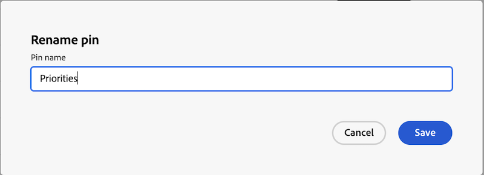

# Seiten anheften, um den Arbeitsbereich anzupassen

Sie können Ihre wichtigste Arbeit in [!DNL Adobe Workfront] anheften, um die Sichtbarkeit zu erhöhen, die Organisation zu verbessern und schneller darauf zuzugreifen. Angeheftete Seiten sind in Workfront immer oben auf jeder Seite verfügbar.

Möglicherweise wurden Sie einer Layout-Vorlage zugewiesen, an die bereits Seiten angeheftet wurden (siehe [Anpassen angehefteter Seiten mithilfe einer Layout-Vorlage](../../administration-and-setup/customize-workfront/use-layout-templates/customize-pinned-pages.md)). Diese vordefinierten Pins können nicht umbenannt oder entfernt werden. Alle angehefteten Seiten werden rechts neben den vordefinierten Anheftungen angezeigt.

## Zugriffsanforderungen

Sie müssen über folgenden Zugriff verfügen, um die Schritte in diesem Artikel ausführen zu können:

<table style="table-layout:auto"> 
 <col> 
 </col> 
 <col> 
 </col> 
 <tbody> 
  <tr> 
   <td role="rowheader"><strong>[!DNL Adobe Workfront] Plan*</strong></td> 
   <td> 
Beliebig
 </td> 
  </tr> 
  <tr> 
   <td role="rowheader"><strong>[!DNL Adobe Workfront] Lizenz*</strong></td> 
   <td> 
[!UICONTROL-Anfrage] oder höher
 </td> 
  </tr> 
 </tbody> 
</table>

&#42;Wenden Sie sich an Ihren [!DNL Workfront], um herauszufinden, welchen Plan oder Lizenztyp Sie besitzen.

## Eine Seite anheften

1. Navigieren Sie zu der Seite, die Sie anheften möchten.

   Dies kann ein beliebiges Arbeitselement sein, z. B. ein Projekt, eine Aufgabe, eine Anfrage-Warteschlange usw.

1. Klicken **[!UICONTROL oben auf der Seite]** Aktuelle Seite anheften“.

   Die angeheftete Seite kann jetzt von jeder Seite in [!DNL Workfront] aus aufgerufen werden.

## Zugriff auf eine fixierte Seite

1. Klicken Sie oben auf einer beliebigen Seite auf die angeheftete Seite, die Sie anzeigen möchten.

   >[!TIP]
   >
   >Bewegen Sie den Mauszeiger über eine angeheftete Seite, um den vollständigen Namen und die Beschreibung anzuzeigen.

   Oder

   Wenn Sie viele Seiten angeheftet haben, müssen Sie möglicherweise auf die  **[!UICONTROL Mehr] klicken** um weitere angeheftete Seiten anzuzeigen.

   Die angeheftete Seite wird angezeigt.

## Fixierte Seiten umbenennen

Sie können den Namen einer angehefteten Seite ändern, damit er für Sie aussagekräftiger ist.

1. Bewegen Sie den Mauszeiger über die angeheftete Seite im oberen Navigationsbereich oder **[!UICONTROL Mehr]**.
1. Klicken Sie auf das Symbol Mehr  neben dem Namen der Nadel und wählen Sie **[!UICONTROL Nadel umbenennen]**.

   

1. Geben Sie den neuen Pin-Namen ein und klicken Sie auf **Speichern**.

   

## Fixierte Seiten neu anordnen

Sie können die Reihenfolge der angehefteten Seiten neu anordnen.

1. Bewegen Sie den Mauszeiger über die angeheftete Seite, die Sie verschieben möchten, und klicken Sie dann auf das Symbol **Mehr**.
1. Wählen Sie **Nach links** oder **Nach rechts**, um Ihre Nadel zu verschieben.
1. (Optional) Wählen Sie **Nach vorne verschieben**, um Ihren Pin an die ganz rechte Position der Pin-Leiste zu verschieben.

   

   Ihre Änderungen werden automatisch gespeichert und gespeichert, wenn Sie das nächste Mal auf Workfront zugreifen.

## Entfernen angehefteter Seiten

1. Klicken Sie auf das Symbol Mehr  neben der Nadel, die Sie entfernen möchten.
1. Klicken Sie **Pin entfernen**.

   

   Auf die Seite kann von keiner Seite in [!DNL Workfront] aus mehr zugegriffen werden.
