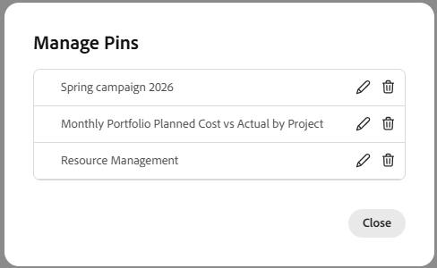
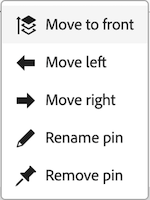
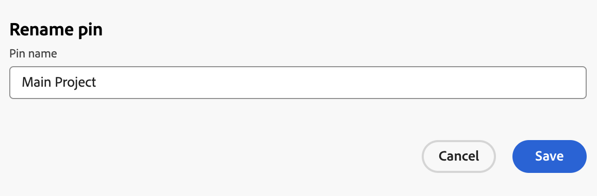

# Anheften von Seiten, um den Arbeitsbereich anzupassen

<!-- Audited: 4/2025 -->

Sie können Ihre wichtigste Arbeit in [!DNL Adobe Workfront] anheften, um die Sichtbarkeit zu erhöhen, die Organisation zu verbessern und schneller darauf zuzugreifen. Angeheftete Seiten sind in Workfront immer oben auf jeder Seite verfügbar.

Möglicherweise wurden Sie einer Layout-Vorlage zugewiesen, an die bereits Seiten angeheftet wurden (siehe [Anpassen angehefteter Seiten mithilfe einer Layout-Vorlage](../../administration-and-setup/customize-workfront/use-layout-templates/customize-pinned-pages.md)). Diese vordefinierten Pins können nicht umbenannt oder entfernt werden. Alle angehefteten Seiten werden rechts neben den vordefinierten Anheftungen angezeigt.

## Zugriffsanforderungen

+++ Erweitern, um die Zugriffsanforderungen für die in diesem Artikel beschriebene Funktionalität anzuzeigen.

<table style="table-layout:auto"> 
 <col> 
 </col> 
 <col> 
 </col> 
 <tbody> 
  <tr> 
   <td role="rowheader"><strong>[!DNL Adobe Workfront] Packstück</strong></td> 
   <td> 
Beliebig
 </td> 
  </tr> 
  <tr> 
   <td role="rowheader"><strong>[!DNL Adobe Workfront] Lizenz</strong></td> 
   <td> 
Mitwirkender oder Mitwirkende
 
     
Anfrage

   </td> 
  </tr> 
 </tbody> 
</table>

Weitere Informationen finden Sie unter [Zugriffsanforderungen](/help/quicksilver/administration-and-setup/add-users/access-levels-and-object-permissions/access-level-requirements-in-documentation.md) in der Dokumentation zu Workfront.

+++

## Eine Seite anheften

1. Navigieren Sie zu der Seite, die Sie anheften möchten. Dies kann ein beliebiges Arbeitselement sein, z. B. ein Projekt, eine Aufgabe, eine Anfrage-Warteschlange usw.

1. Klicken Sie oben links auf der Seite auf **[!UICONTROL Aktuelle Seite]**. Die angeheftete Seite kann jetzt von jeder Seite in [!DNL Workfront] aus aufgerufen werden.

   

## Zugriff auf eine fixierte Seite

1. Klicken Sie oben auf einer beliebigen Seite auf die angeheftete Seite, die Sie anzeigen möchten.

   >[!TIP]
   >
   >Bewegen Sie den Mauszeiger über eine angeheftete Seite, um den vollständigen Namen und die Beschreibung anzuzeigen.

   ODER

   Wenn Sie viele Seiten angeheftet haben, klicken Sie auf das Symbol **[!UICONTROL Mehr]** , um zusätzliche angeheftete Seiten anzuzeigen.

   

   Die angeheftete Seite wird angezeigt.

## Pins verwalten

Sie können fixierte Seiten an einer Stelle umbenennen, neu anordnen und entfernen.

1. Klicken Sie auf das **[!UICONTROL Mehr]**-Symbol  in der Reihe der Pins und wählen Sie **Pins verwalten**.
1. Führen **im Feld &quot;** verwalten“ einen oder mehrere der folgenden Schritte aus:

   * Klicken Sie auf **Bearbeiten**, um eine angeheftete Seite umzubenennen. Geben Sie den neuen Namen ein und klicken Sie zur Bestätigung auf das Häkchen.
   * Ziehen Sie die fixierten Seiten in die gewünschte Reihenfolge.
   * Klicken Sie auf das **Löschen**-Symbol, um eine angeheftete Seite aus der Liste zu entfernen.

   

1. Klicken Sie **Schließen** wenn Sie die Bearbeitung der Pins abgeschlossen haben.

<!--
## Rename a pinned page

1. Hover over the pinned page in the top navigation.
1. Click the **More** icon  that appears next to the pin name and select **[!UICONTROL Rename pin]**.

   

1. Type the new pin name, then click **Save**.

   

## Reorder pinned pages

You can rearrange the order that pinned pages appear.

1. Hover over the pinned page you want to move, then click the **More** icon .
1. Choose **Move left** or **Move right** to move your pin. 
1. (Optional) Choose **Move to front** to move your pin to the far-left position of the pin bar. 

   

   Your changes automatically save and are remembered the next time you access Workfront.

## Remove a pinned page

1. Click the **More** icon  next to the pin you want to remove.
1. Click **Remove pin**. The page is no longer accessible from the top of any page in [!DNL Workfront].

   
-->

