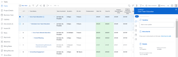

# [!UICONTROL Zusammenfassung] Übersicht

Sie können die [!UICONTROL Zusammenfassung] -Bedienfeld zum Überprüfen und Aktualisieren von Arbeitselementinformationen direkt aus einer Liste von Aufgabenproblemen, Dokumenten oder aus anderen Bereichen von [!DNL Adobe Workfront] die Aufgaben und Probleme anzeigen.

Die folgende Tabelle zeigt die Bereiche, in denen Sie die [!UICONTROL Zusammenfassung] Bereich:

<table style="table-layout:auto"> 
 <col data-mc-conditions=""> 
 <tbody> 
  <tr> 
   <td>Aufgaben</td> 
  </tr> 
  <tr> 
   <td> 
Aufgabenlisten innerhalb einer
 
    <ul> 
     <li>Projekt</li> 
     <li>Teilaufgabe</li> 
    </ul> </td> 
  </tr> 
  <tr> 
   <td>Aufgaben in den Arbeitsbereichen [!UICONTROL Nicht zugewiesen] und [!UICONTROL Zugewiesene] Arbeitsbereiche des [!UICONTROL Workload Balancer]</td> 
  </tr> 
  <tr data-mc-conditions=""> 
   <td>Probleme</td> 
  </tr> 
  <tr data-mc-conditions=""> 
   <td> 
Problemlisten in einer
 
    <ul> 
     <li>Projekt</li> 
     <li>Aufgabe</li> 
     <li>Teilaufgabe</li> 
    </ul> </td> 
  </tr> 
  <tr data-mc-conditions=""> 
   <td>Probleme im Bereich [!UICONTROL Zugewiesene Arbeit] des [!UICONTROL Workload Balancer]</td> 
  </tr> 
  <tr data-mc-conditions=""> 
   <td>Probleme im Abschnitt [!UICONTROL Gesendet] des Bereichs [!UICONTROL Anforderungen]</td> 
  </tr> 
  <tr data-mc-conditions=""> 
   <td>Dokumente</td> 
  </tr> 
  <tr data-mc-conditions=""> 
   <td>[!UICONTROL Dokumente] Bereich</td> 
  </tr> 
  <tr data-mc-conditions=""> 
   <td>[!UICONTROL Dokumente] Abschnitt jedes Objekts (Projekt, Aufgabe, Problem, Programm, Portfolio, Vorlage, Vorlagenaufgabe, Benutzer)</td> 
  </tr> 
 </tbody> 
</table>

<!--

Workfront administrators can customize the Summary in the Layout Template. For more information, see <a href="../../administration-and-setup/customize-workfront/use-layout-templates/create-and-manage-layout-templates.md" class="MCXref xref">Create and manage layout templates</a>.

-->

In diesem Artikel wird beschrieben, wie Sie auf die [!UICONTROL Zusammenfassung] Bedienfeld für Aufgaben und Probleme in Listen.

Informationen zum Zugriff auf die [!UICONTROL Zusammenfassung] im [!UICONTROL Lastenausgleich], siehe [Arbeitselemente in der [!UICONTROL Lastenausgleich] mithilfe der [!UICONTROL Zusammenfassung]](../../resource-mgmt/workload-balancer/update-items-in-summary-panel-in-workload-balancer.md).

Informationen zum Zugriff auf die [!UICONTROL Zusammenfassung] für Dokumente, siehe [[!UICONTROL Zusammenfassung] für Dokumentübersicht](../../documents/managing-documents/summary-for-documents.md).

## Zugriffsanforderungen

Sie müssen über folgenden Zugriff verfügen, um die Schritte in diesem Artikel ausführen zu können:

<table style="table-layout:auto"> 
 <col> 
 <col> 
 <tbody> 
  <tr> 
   <td role="rowheader"><strong>[!DNL Adobe Workfront] Plan*</strong></td> 
   <td> 
Beliebig
 </td> 
  </tr> 
  <tr> 
   <td role="rowheader"><strong>[!DNL Adobe Workfront] license*</strong></td> 
   <td> 
[!UICONTROL Anforderung] oder höher
 </td> 
  </tr> 
  <tr> 
   <td role="rowheader"><strong>Konfigurationen auf Zugriffsebene*</strong></td> 
   <td> 
[!UICONTROL Ansicht] oder höher Zugriff auf Aufgaben, Probleme, Dokumente
 
[!UICONTROL Ansicht] oder höher Zugriff auf alle Objekte, für die Sie Dokumente anzeigen möchten [!UICONTROL Zusammenfassung]
 
Hinweis: Wenn Sie noch keinen Zugriff haben, fragen Sie Ihren [!DNL Workfront] Administrator , wenn sie zusätzliche Einschränkungen für Ihre Zugriffsebene festlegen. Für Informationen zur [!DNL Workfront] Administrator kann Ihre Zugriffsebene ändern, siehe <a href="../../administration-and-setup/add-users/configure-and-grant-access/create-modify-access-levels.md" class="MCXref xref">Benutzerdefinierte Zugriffsebenen erstellen oder ändern</a>.
 </td> 
  </tr> 
  <tr> 
   <td role="rowheader"><strong>Objektberechtigungen</strong></td> 
   <td> 
[!UICONTROL Ansicht] oder höhere Berechtigungen für eine Aufgabe, ein Problem oder ein Dokument
 
Informationen zum Anfordern von zusätzlichem Zugriff finden Sie unter <a href="../../workfront-basics/grant-and-request-access-to-objects/request-access.md" class="MCXref xref">Zugriff auf Objekte anfordern </a>.
 </td> 
  </tr> 
 </tbody> 
</table>

&#42;Wenden Sie sich an Ihren [!DNL Workfront] Administrator.

## Anzeigen der [!UICONTROL Zusammenfassung] Bedienfeld in einer Liste von Aufgaben oder Problemen

1. Markieren Sie eine Aufgabe oder ein Problem und wählen Sie ein Element in der Liste aus.
1. Klicken Sie auf **[!UICONTROL Zusammenfassung]** icon 

   oder

   Klicken Sie auf **[!UICONTROL Zusammenfassung öffnen]** icon  im [!UICONTROL Gesendet] Abschnitt [!UICONTROL Anforderungen] Bereich.

   Nachdem Sie die Zusammenfassung geöffnet haben, bleibt sie beim Klicken oder Auswählen anderer Aufgaben oder Probleme geöffnet und bleibt geöffnet, bis Sie sie manuell schließen.

   >[!TIP]
   >
   >Sie können nur eine Aufgabe oder ein Problem gleichzeitig auswählen, um ihre Details im [!UICONTROL Zusammenfassung] Bereich.

   

1. (Optional) So schließen Sie die [!UICONTROL Zusammenfassung] einen der folgenden Schritte ausführen:

   * Klicken Sie in einer Aufgaben- oder Problemliste auf die **[!UICONTROL Zusammenfassung öffnen]** icon 

      Oder

      Klicken Sie auf **X** rechts oben im [!UICONTROL Zusammenfassung] Bereich.

   * Im [!UICONTROL Gesendet] Abschnitt [!UICONTROL Anforderungen] Bereich, klicken Sie auf **[!UICONTROL Zusammenfassung schließen]** icon 

      Oder

      Klicken Sie auf **X** in der oberen rechten Ecke des Bedienfelds &quot;Zusammenfassung&quot;angezeigt.

## [!UICONTROL Prozent abgeschlossen]

Verwenden Sie die Fortschrittsleiste oben im [!UICONTROL Zusammenfassung] , um den Prozentsatz zu aktualisieren, der für die ausgewählte Aufgabe oder das ausgewählte Problem abgeschlossen ist. Geben Sie eine Zahl ein oder ziehen Sie die Leiste auf den richtigen Prozentsatz.

## [!UICONTROL Updates]

Verwenden Sie die [!UICONTROL Updates] Abschnitt [!UICONTROL Zusammenfassung] , um aktuelle Aktualisierungen anzuzeigen und Aktualisierungen zu der von Ihnen ausgewählten Aufgabe oder Ausgabe vorzunehmen. Klicken **[!UICONTROL Alle anzeigen]** , um direkt zur [!UICONTROL Updates] Registerkarte der Aufgabe.

## [!UICONTROL Dokumente]

Verwenden Sie die [!UICONTROL Dokumente] Abschnitt [!UICONTROL Zusammenfassung] , um Dokumente anzuzeigen, die an die ausgewählte Aufgabe oder das ausgewählte Problem angehängt sind. Klicken Sie auf die Miniaturansicht, um eine Dokumentvorschau zu öffnen. So wechseln Sie direkt zum [!UICONTROL Dokumente] auf der Registerkarte der Aufgabe oder des Problems klicken Sie auf **[!UICONTROL Dokumente]** title.

## [!UICONTROL Details]

Verwenden Sie die [!UICONTROL Details] Abschnitt [!UICONTROL Zusammenfassung] , um allgemeine Details zu Arbeitselementen anzuzeigen, Zuweisungen vorzunehmen oder Startdaten hinzuzufügen. Klicken **[!UICONTROL Alle anzeigen]** , um direkt zur [!UICONTROL Details] auf die Aufgabe oder das Problem.

>[!NOTE]
>
>Die in diesem Abschnitt angezeigten Felder sind dieselben, die im rechten Bereich auf der Startseite angezeigt werden. Diese Felder können angepasst werden [Anpassen [!UICONTROL Startseite] und [!UICONTROL Zusammenfassung] Layout-Vorlage verwenden](../../administration-and-setup/customize-workfront/use-layout-templates/customize-home-summary-layout-template.md).

## [!UICONTROL Teilaufgaben]

Dieser Abschnitt ist nur für Aufgaben verfügbar. Verwenden Sie die [!UICONTROL Unteraufgaben] Abschnitt [!UICONTROL Zusammenfassung] in Ansicht [!UICONTROL Neu], [!UICONTROL In Bearbeitung]und [!UICONTROL Geschlossen] Unteraufgaben für die ausgewählte Aufgabe. Klicken Sie auf **[!UICONTROL Status]** Dropdown-Menü, um zwischen Status zu wechseln. So wechseln Sie direkt zum [!UICONTROL Unteraufgaben] auf der Registerkarte der Aufgabe klicken Sie auf **[!UICONTROL Unteraufgaben]**&#x200B; Titel.

Wenn Sie der Aufgabe keine Unteraufgaben hinzugefügt haben, klicken Sie auf **[!UICONTROL Einen hier hinzufügen]** , um direkt zur [!UICONTROL Unteraufgaben] Registerkarte der Aufgabe.

## [!UICONTROL Stunden]

Verwenden Sie die [!UICONTROL Stunden] Abschnitt [!UICONTROL Zusammenfassung] , um Stunden zur ausgewählten Aufgabe oder Ausgabe zu protokollieren. Klicken **[!UICONTROL Protokollzeit]** und geben Sie Ihre Stunden ein. Um direkt zur Registerkarte Stunden der Aufgabe oder des Problems zu wechseln, klicken Sie auf die Schaltfläche **[!UICONTROL Stunden]** title.

Die Stundenanzahl in der [!UICONTROL Zusammenfassung] zeigt die Stunden an, die Sie protokollieren. Andere Benutzer haben unterschiedliche Stundensummen in der [!UICONTROL Zusammenfassung] abhängig von der Zeit, zu der sie sich bei der Aufgabe anmelden.

Wenn es keine Planung gibt [!UICONTROL Stunden] bei der Aufgabe oder dem Problem angezeigt und Sie die Zeit protokolliert haben, wird die Stunden-Leiste rot angezeigt.

## Genehmigungen

Verwenden Sie die [!UICONTROL Genehmigungen] Abschnitt [!UICONTROL Zusammenfassung] , um die an die ausgewählte Aufgabe oder das ausgewählte Problem angehängten Genehmigungen anzuzeigen. Wenn Sie noch keine Validierungen hinzugefügt haben, wählen Sie eine vorhandene Validierung aus dem Dropdown-Menü aus oder klicken Sie auf **[!UICONTROL Erstellen eines einmaligen Genehmigungsprozesses]** , um direkt zur [!UICONTROL Genehmigungen] auf die Aufgabe oder das Problem.

So wechseln Sie direkt zum [!UICONTROL Genehmigungen] auf der Registerkarte der Aufgabe oder des Problems klicken Sie auf **[!UICONTROL Genehmigungen]** title.

