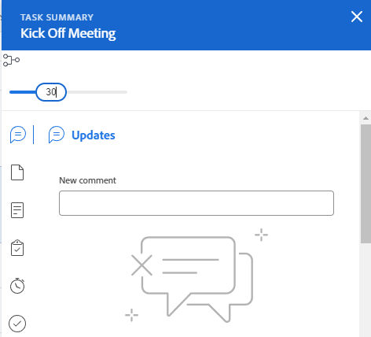

# [!UICONTROL Zusammenfassung] Übersicht

<!--The highlighted information on this page refers to functionality not yet generally available. It is available only in the Preview environment for all customers or in Production for customers who enabled fast releases. 

For information about fast releases, see [Enable or disable fast releases for your organization](/help/quicksilver/administration-and-setup/set-up-workfront/configure-system-defaults/enable-fast-release-process.md).

For information about the current release schedule, see [Second Quarter 2024 release overview](/help/quicksilver/product-announcements/product-releases/24-q2-release-activity/24-q2-release-overview.md). -->

Sie können das Bedienfeld [!UICONTROL Zusammenfassung] verwenden, um Arbeitselementinformationen direkt aus einer Liste von Aufgaben, Problemen, Dokumenten oder aus anderen [!DNL Adobe Workfront], die Aufgaben und Probleme anzeigen, zu überprüfen und zu aktualisieren.

Ihr Workfront- oder Gruppen-Administrator kann die Bereiche und Felder ändern, die im Zusammenfassungsbereich angezeigt werden. Sie können dem Bedienfeld Zusammenfassung bis zu 16 Felder hinzufügen.

>[!IMPORTANT]
>
>Es wird empfohlen, Felder, die häufig aktualisiert werden müssen, zum Bedienfeld Zusammenfassung hinzuzufügen, damit Sie leicht darauf zugreifen und sie aktualisieren können, ohne auf die Hauptseite des Objekts zugreifen zu müssen.
>
>Sie können beispielsweise die folgenden häufig aktualisierten Felder zu den Bedienfeldern „Aufgaben“ und „Problemenübersicht“ hinzufügen:
>
>* Status
>* Prozent abgeschlossen
>* Verpflichtungsdatum
>* Geplantes Abschlussdatum
>* Bedingung

In der folgenden Tabelle werden die Bereiche angezeigt, in denen Sie das Bedienfeld [!UICONTROL Zusammenfassung“ finden ] verwenden können:

<table style="table-layout:auto"> 
 <col data-mc-conditions=""> 
 <tbody> 
  <tr> 
   <td><b>Aufgaben</b></td> 
  </tr> 
  <tr> 
   <td> 
Aufgabenlisten in einer
 
    <ul> 
     <li>Projekt</li> 
     <li>Teilaufgabe</li> 
    </ul> </td> 
  </tr> 
  <tr> 
   <td>Aufgaben in den Arbeitsbereichen [!UICONTROL nicht zugewiesen] und [!UICONTROL zugewiesen] des [!UICONTROL Workload Balancer]</td> 
  </tr> 
   <tr> 
   <td>Aufgaben in einer [!UICONTROL Arbeitszeittabelle]</td> 
  </tr> 
  <tr data-mc-conditions=""> 
   <td><b>Probleme</b></td> 
  </tr> 
  <tr data-mc-conditions=""> 
   <td> 
Problemlisten in einem
 
    <ul> 
     <li>Projekt</li> 
     <li>Aufgabe</li> 
     <li>Teilaufgabe</li> 
    </ul> </td> 
  </tr> 
  <tr data-mc-conditions=""> 
   <td>Probleme im Bereich [!UICONTROL Zugewiesene Arbeit] des [!UICONTROL Workload Balancer]</td> 
  </tr> 
  <tr data-mc-conditions=""> 
   <td>Probleme im Abschnitt [!UICONTROL Submitted] im Bereich [!UICONTROL-Anforderungen]</td> 
  </tr> 
</tr> 
   <tr> 
   <td>Probleme in einer [!UICONTROL Arbeitszeittabelle]</td> 
  </tr>

<tr data-mc-conditions=""> 
   <td><b>Dokumente</b></td> 
  </tr> 
  <tr data-mc-conditions=""> 
   <td>Bereich [!UICONTROL-Dokumente]</td> 
  </tr> 
  <tr data-mc-conditions=""> 
   <td>[!UICONTROL-Dokumente]-Abschnitt eines beliebigen Objekts (Projekt, Aufgabe, Problem, Programm, Portfolio, Vorlage, Vorlagenaufgabe, Benutzer)</td> 
  </tr> 
 </tbody> 
</table>

<!--

Workfront administrators can customize the Summary in the Layout Template. For more information, see <a href="../../administration-and-setup/customize-workfront/use-layout-templates/create-and-manage-layout-templates.md" class="MCXref xref">Create and manage layout templates</a>.

-->

In diesem Artikel wird beschrieben, wie Sie auf das Bedienfeld [!UICONTROL Zusammenfassung] zugreifen und es für Aufgaben und Probleme in Listen verwenden können.

Weitere Informationen zum Zugriff auf [!UICONTROL Zusammenfassung] im [!UICONTROL Workload Balancer] finden Sie unter [Aktualisieren von Arbeitselementen im [!UICONTROL Workload Balancer] mithilfe der [!UICONTROL Zusammenfassung]](../../resource-mgmt/workload-balancer/update-items-in-summary-panel-in-workload-balancer.md).

Informationen zum Zugriff auf die [!UICONTROL Zusammenfassung] für Dokumente finden Sie unter [[!UICONTROL Zusammenfassung] für Dokumente - Übersicht](../../documents/managing-documents/summary-for-documents.md).

## Das Bedienfeld [!UICONTROL Zusammenfassung] in einer Liste von Aufgaben oder Problemen anzeigen

1. Navigieren Sie zu einer Aufgabe oder einem Problem und wählen Sie ein Element in der Liste aus.
1. Klicken Sie auf das **[!UICONTROL Zusammenfassung]**-Symbol 

   oder

   Klicken Sie auf das **[!UICONTROL Zusammenfassung öffnen]**-Symbol  im Abschnitt [!UICONTROL Gesendet] des Bereichs [!UICONTROL Anfragen].

   Nachdem Sie die Zusammenfassung geöffnet haben, bleibt sie beim Klicken oder Auswählen anderer Aufgaben oder Probleme geöffnet und bleibt geöffnet, bis Sie sie manuell schließen.

   >[!TIP]
   >
   >Sie können jeweils nur eine Aufgabe oder ein Problem auswählen, um deren Details im Bedienfeld [!UICONTROL Zusammenfassung] anzuzeigen.

   

1. (Optional) Führen Sie einen [!UICONTROL  folgenden Schritte aus] um das Bedienfeld „Zusammenfassung“ zu schließen:

   * Klicken Sie in einer Aufgaben- oder Problemliste auf das Symbol **[!UICONTROL Zusammenfassung öffnen]** 

     ODER

     Klicken Sie auf **X** in der oberen rechten Ecke des Bedienfelds [!UICONTROL Zusammenfassung].

   * Klicken Sie [!UICONTROL  Abschnitt ]Gesendet“ im Bereich [!UICONTROL Anfragen] auf das Symbol **[!UICONTROL Zusammenfassung schließen]** 

     ODER

     Klicken Sie auf **X**-Symbol in der rechten oberen Ecke des Bedienfelds Zusammenfassung.

## [!UICONTROL Prozent abgeschlossen]

Verwenden Sie das blaue Fortschrittsblase oben in der [!UICONTROL Zusammenfassung], um den abgeschlossenen Prozentsatz für die ausgewählte Aufgabe oder das ausgewählte Problem zu aktualisieren. Geben Sie eine Zahl ein, oder ziehen Sie die Blase auf den richtigen Prozentsatz.

Wenn Sie den Kreis in das Bedienfeld Zusammenfassung ziehen, wird der Bereich „Prozent abgeschlossen“ in Schritten von einem Punkt aktualisiert. Es ist nicht möglich, eine Dezimalzahl einzugeben.

## [!UICONTROL Updates]

Verwenden Sie den [!UICONTROL Updates] des Abschnitts [!UICONTROL Zusammenfassung], um die neuesten Aktualisierungen anzuzeigen und Aktualisierungen für die ausgewählte Aufgabe oder das ausgewählte Problem vorzunehmen. Klicken Sie **[!UICONTROL Alle anzeigen]**, um direkt zur Registerkarte [!UICONTROL Aktualisierungen] der Aufgabe zu wechseln.

## [!UICONTROL Dokumente]

Verwenden Sie den [!UICONTROL Dokumente] des Abschnitts [!UICONTROL Zusammenfassung], um Dokumente anzuzeigen, die an die ausgewählte Aufgabe oder das ausgewählte Problem angehängt sind. Klicken Sie auf die Miniaturansicht, um eine Dokumentvorschau zu öffnen. Um die Registerkarte [!UICONTROL Dokumente] für die Aufgabe oder das Problem direkt aufzurufen, klicken Sie auf den Titel **[!UICONTROL Dokumente]**.

## [!UICONTROL Details]

Verwenden Sie den [!UICONTROL Details] des [!UICONTROL Zusammenfassung], um allgemeine Details zu Arbeitselementen anzuzeigen, Zuweisungen vorzunehmen oder Startdaten hinzuzufügen. Klicken Sie **[!UICONTROL Alle anzeigen]**, um zur Registerkarte [!UICONTROL Details] der Aufgabe oder des Problems direkt zu wechseln.

## [!UICONTROL Teilaufgaben]

Dieser Abschnitt ist nur für Aufgaben verfügbar. Verwenden Sie den Abschnitt [!UICONTROL Teilaufgaben] der [!UICONTROL Zusammenfassung], um [!UICONTROL Neu], [!UICONTROL In Bearbeitung] und [!UICONTROL Geschlossen] Teilaufgaben für die ausgewählte Aufgabe anzuzeigen. Klicken Sie auf **[!UICONTROL Dropdown]** Menü „Status“, um zwischen Status zu wechseln. Um direkt zur Registerkarte [!UICONTROL Teilaufgaben] der Aufgabe zu wechseln, klicken Sie auf den **[!UICONTROL Teilaufgaben]**&#x200B;Titel.

Wenn Sie der Aufgabe keine Teilaufgaben hinzugefügt haben, klicken Sie auf **[!UICONTROL Hier hinzufügen]**, um direkt zur Registerkarte [!UICONTROL Teilaufgaben] der Aufgabe zu gelangen.

## [!UICONTROL Stunden]

Verwenden Sie den [!UICONTROL Stunden] des Abschnitts [!UICONTROL Zusammenfassung], um Stunden für die ausgewählte Aufgabe oder das ausgewählte Problem zu protokollieren. Klicken Sie **[!UICONTROL Zeit erfassen]** und geben Sie Ihre Stunden ein. Um direkt zur Registerkarte „Stunden“ für die Aufgabe oder das Problem zu wechseln, klicken Sie auf den **[!UICONTROL Stunden]** Titel.

Die Stundenanzahl in der [!UICONTROL Zusammenfassung] zeigt die protokollierten Stunden an. Andere Benutzende haben in der [!UICONTROL Zusammenfassung) je ] Zeit, in der sie sich bei der Aufgabe anmelden, unterschiedliche Stundensummen.

Wenn für die Aufgabe oder [!UICONTROL  keine geplanten ]Stunden“ vorhanden sind und Sie die Zeit protokolliert haben, wird die Stundenleiste rot angezeigt.

## Genehmigungen

Verwenden Sie den [!UICONTROL Genehmigungen] des Abschnitts [!UICONTROL Zusammenfassung], um Genehmigungen anzuzeigen, die an die von Ihnen ausgewählte Aufgabe oder das ausgewählte Problem angehängt sind. Wenn Sie keine Genehmigungen hinzugefügt haben, wählen Sie eine vorhandene Genehmigung aus dem Dropdown-Menü aus oder klicken Sie auf **[!UICONTROL Einmaligen Genehmigungsprozess erstellen]** um direkt zur Registerkarte [!UICONTROL Genehmigungen] für die Aufgabe oder das Problem zu wechseln.

Um die Registerkarte [!UICONTROL Genehmigungen] für die Aufgabe oder das Problem direkt aufzurufen, klicken Sie auf den Titel **[!UICONTROL Genehmigungen]**.

