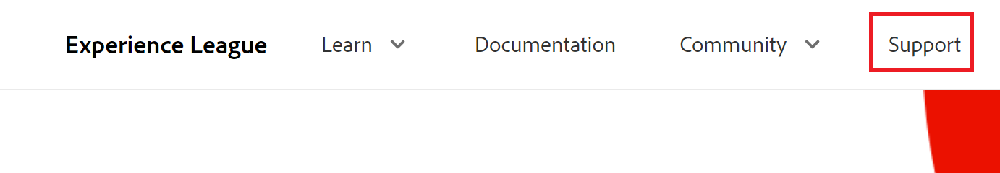

# Kunden-Support kontaktieren

<!--Audited: 12/2023-->

<!--

(We need to keep this as a standalone article. It is linked in multiple articles and FAQs.)

-->

Als [!DNL Adobe Workfront]-Kunde können Sie sich telefonisch oder per Online-Ticket an das [!DNL Workfront]-Support-Team wenden.

>[!NOTE]
>
>Wenden Sie sich bei kritischen Problemen telefonisch an [!DNL Workfront] Support.

## Zugriffsanforderungen

+++ Erweitern Sie , um die Zugriffsanforderungen für die -Funktion in diesem Artikel anzuzeigen.

Sie müssen über folgenden Zugriff verfügen, um die Schritte in diesem Artikel ausführen zu können:

<table style="table-layout:auto"> 
 <col> 
 <col> 
 <tbody> 
  <tr> 
   <td role="rowheader">Adobe Workfront-Plan</td> 
   <td>Beliebig</td> 
  </tr> 
  <tr> 
  <tr> 
   <td role="rowheader">Adobe Workfront-Lizenz</td> 
   <td>
Neu: Standard

       
Oder

       
Aktuell: Plan
</td>
  </tr> 
  </tr> 
  <tr> 
   <td role="rowheader">Konfigurationen der Zugriffsebene</td> 
   <td>Sie müssen Systemadministrator sein.</td>
  </tr> 
 </tbody> 
</table>

Weitere Informationen zu den Informationen in dieser Tabelle finden Sie unter [Zugriffsanforderungen in der Dokumentation zu Workfront](/help/quicksilver/administration-and-setup/add-users/access-levels-and-object-permissions/access-level-requirements-in-documentation.md).

+++

## Telefon

Sie können [!DNL Workfront Customer Support] 7 Tage die Woche, 24 Stunden am Tag, unter folgenden Nummern kontaktieren:

* USA: 866-329-5273
* EMEA: +44 800 169 0454
* Australien: +61 180 035 8683

<!--Old numbers - before 2/10/2025:

* US: 844-306-HELP(4357)
* EMEA: +44 1256 274200
* Australia: +61 1800 849259

-->

## Web

Sie können ein Support-Ticket über das Self-Service-[!DNL Experience League] einreichen.

>[!IMPORTANT]
>
>Nur autorisierte Support-Kontakte (oder Support-berechtigte Benutzer) können Online-Support-Tickets einreichen.

1. Klicken Sie auf der [[!DNL Experience League]](https://experienceleague.adobe.com)-Website **[!UICONTROL Support]** oben auf der Seite.

   

   Die Seite [!UICONTROL Support] wird geöffnet.

   Auf der [!UICONTROL Support]-Homepage können Sie zu Ihren offenen Support-Fällen navigieren, einen neuen Fall protokollieren, die wichtigsten [!UICONTROL Support]-Artikel anzeigen oder auf zusätzliche Lernquellen zugreifen.

<!--1. To submit a case, select the option **[!UICONTROL Open a support case]**, then click **[!UICONTROL Sign] In**.-->

1. Klicken Sie **[!UICONTROL Ticket öffnen]** in der linken Seitenleiste auf.
Die Seite [!UICONTROL Erstellung eines &#x200B;]) wird geöffnet. Dort können Sie Ihren Produktnamen ([!DNL Adobe Workfront], [!DNL Adobe Workfront Fusion] usw.), den Titel der Anfrage und die Fallbeschreibung eingeben.

   >[!TIP]
   >
   >Beschreiben Sie Ihr Problem so anschaulich wie möglich, damit wir die Fehlerbehebung beschleunigen können.

1. Füllen Sie die Informationen für die folgenden Felder aus, um genauere Details anzugeben:

   * **[!UICONTROL Vorgangspriorität]** ([!UICONTROL niedrig], [!UICONTROL Medium], [!UICONTROL hoch], [!UICONTROL kritisch])
   * **[!UICONTROL Produkt-]** ([!UICONTROL DAM], [!DNL Fusion], [!DNL Goals] usw.)
   * **[!UICONTROL Umgebung]** ([!UICONTROL Produktion], [!UICONTROL Vorschau], [!UICONTROL Sandbox] usw.)
   * **[!UICONTROL Kundenregion]** (Nord- und Südamerika, EMEA, APAC)

1. Laden Sie alle relevanten Dateien hoch und klicken Sie dann auf **[!UICONTROL Fall senden]**.

   Der Fall wird übermittelt und die Seite &quot;[!UICONTROL &#x200B; Fälle] wird angezeigt.

   <!--
   
   -->

Wenn Sie Fragen oder Probleme beim Einreichen einer Anfrage haben, wenden Sie sich an das Support-Team von .

## Support-Anfragen anzeigen und verwalten

1. Navigieren Sie zur Seite **[!UICONTROL Meine Fälle]** . Diese Seite wird geöffnet, wenn Sie eine Anfrage senden. Sie können sie aber auch öffnen, indem Sie im linken Navigationsbereich auf **[!UICONTROL Meine Anfragen]** klicken.

1. (Optional) Verwenden Sie die Optionen oben auf der Seite, um nach **Produkt ([!DNL Experience Cloud] Lösung)** oder Fall **[!UICONTROL Status]** ([!UICONTROL Offen] oder CLosed) zu filtern. Sie können auch das Feld [!UICONTROL Suche] verwenden, um nach Keywords zu suchen, die sich auf Ihre Support-Fälle beziehen.

1. (Optional) Um weitere Details zu einem Fall anzuzeigen, klicken Sie auf die **Fallnummer**, um darauf zuzugreifen.

   Die Fallansicht wird geöffnet.

1. (Optional) Überprüfen Sie in der Ansicht Fall die neuesten Kommentare mit dem zugewiesenen Fallbesitzer und fügen Sie zusätzliche Anhänge oder Antworten hinzu.

1. (Optional) Um den Fall zu eskalieren, klicken Sie **[!UICONTROL rechts auf der Seite unter]** Falldetails **[!UICONTROL auf „an das Management]**.

1. (Optional) Um das Gehäuse zu schließen, klicken Sie auf die Schaltfläche **[!UICONTROL Fall schließen]**.

<!--drafted: I took the information above from this blog post by Jon Chen (on September 13, 2022): https://experienceleaguecommunities.adobe.com/t5/workfront-blogs/how-to-submit-a-support-ticket-on-experience-league/ba-p/461737)

- this is the information that was there before - pointing to WorkfrontOne: 

If you are logged in as an Authorized Support Contact, you can contact Workfront Customer Support through the Workfront One site and create a case, formally called a ticket.

1. Log in to [**one.workfront.com**](https://one.workfront.com/) as an Authorized Support Contact.
1. On the **Home** page, click **Support**.

   

   The Customer Support page displays.

   >[!NOTE]
   >
   >If you don't see the Support option on the Home page, you are not an Authorized Support Contact. Your Workfront administrator can contact Workfront Customer Support and request you be added an Authorized Support Contact. If you are the only Workfront administrator for your organization, contact the Workfront Support team by phone.

1. Complete the fields in the **Create a Support Case** form. All fields are required.  

   <table style="table-layout:auto">
    <tr>
        <td><strong>Subject</strong></td>
        <td>Type a brief question or explanation of the issue you are experiencing.</td>
    </tr>
    <tr>
        <td><strong>Description</strong></td>
        <td>Type a detailed description of the issue. Include as much information as possible.</td>
    </tr>
    <tr>
        <td><strong>Priority</strong></td>
        <td> </td>
    </tr>
    <tr>
        <td><strong>Case Product</strong></td>
        <td>Select the product in which you are experiencing the issue. If the issue is not related to a specific product, select None.</td>
    </tr>
    <tr>
        <td><strong>Product Area</strong></td>
        <td>Select the area of the product that best relates to the issue. If the related area is not listed in the drop-down menu, select Not Listed.</td>
    </tr>
    <tr>
        <td><strong>Environment</strong></td>
        <td>Select the environment in which the issue occurs. If you are seeing the issue in both the Production and Sandbox environments, please select Production.</td>
    </tr>
    <tr>
        <td><strong>Customer Region</strong></td>
        <td> </td>
    </tr>
   </table>

1. (Optional) Attach a file, such as an image or video file.

   1. At the bottom of the form, click **Upload File**.
   1. Click **Upload File**, then browse for and select the desired file.

      

   1. Click **Done** to upload the file to the case.

1. Click **Submit** to submit the case to Workfront Customer Support.

-->

