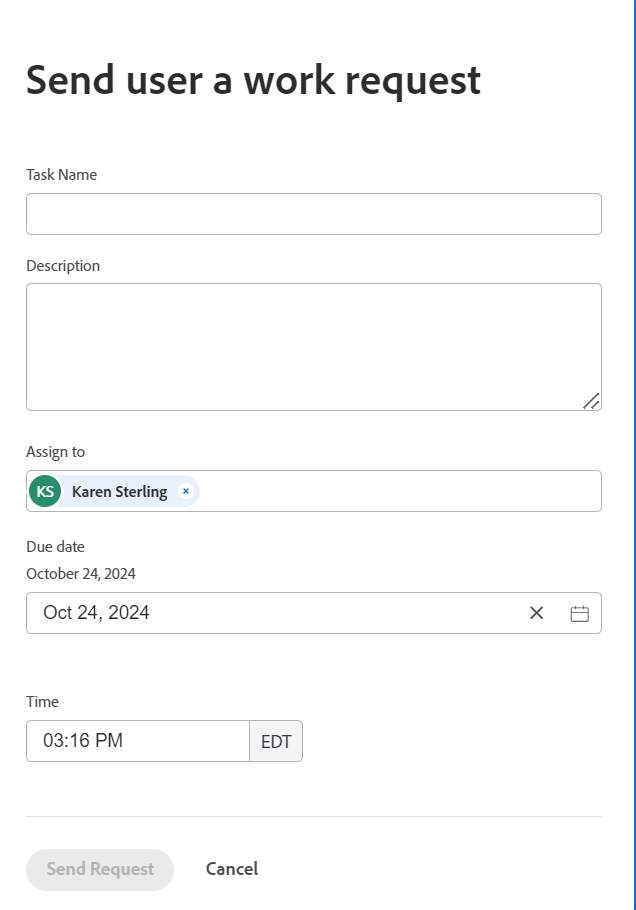

# Persönliche Aufgaben erstellen

<!--Audited: 10/2024-->

Persönliche Aufgaben sind Ad-hoc-Arbeitsanfragen, die Sie an einen Benutzer senden, oder Aufgaben, die Sie für sich selbst in Ihrem Home-Bereich erstellen.

Workfront speichert Ad-hoc-Arbeitsanfragen und führt Elemente als persönliche Aufgaben aus.

Standardmäßig verfügen alle Benutzer in Workfront über ein Projekt mit dem Namen &quot;&lt; Name (vollständig)&quot;> &quot;Aufgaben&quot;. Beispiel: &quot;Aufgaben von Rick Kuvec&quot;.

Dieses Projekt wird nicht in Suchvorgängen angezeigt und ist ausgeblendet. Alle persönlichen Aufgaben werden in diesem Projekt gespeichert.

Sie können bei Bedarf persönliche Aufgaben in ein Projekt verschieben.

Sie können persönliche Aufgaben wie folgt erstellen:

* Erstellen Sie ein zu bearbeitendes Element in Ihrem Startbereich

  Weitere Informationen finden Sie unter [Erstellen von Arbeitselementen und Projekten aus dem Startbereich](/help/quicksilver/workfront-basics/using-home/using-the-home-area/create-work-items-in-home.md).

* Erstellen einer persönlichen Arbeitserfordernis für einen anderen Benutzer
* Erstellen einer persönlichen Arbeitanfrage für Ihren Benutzer

In diesem Artikel wird beschrieben, wie Sie eine persönliche Arbeitsanfrage für einen Benutzer erstellen können.

## Zugriffsanforderungen

+++ Erweitern Sie , um die Zugriffsanforderungen für die Funktionalität in diesem Artikel anzuzeigen.

Sie müssen über folgenden Zugriff verfügen, um die Schritte in diesem Artikel ausführen zu können:

<table style="table-layout:auto"> 
 <col> 
 </col> 
 <col> 
 </col> 
 <tbody> 
  <tr> 
   <td role="rowheader"><strong>Adobe Workfront-Abo</strong></td> 
   <td> 
Alle
 </td> 
  </tr> 
  <tr> 
   <td role="rowheader"><strong>Adobe Workfront-Lizenz*</strong></td> 
   <td> 
   
Aktuell: Planen Sie den Versand von Anfragen an andere Benutzer. Alle Benutzer können für sich selbst eine Arbeitsanfrage erstellen.

   
Neu: Standard zum Senden von Anforderungen an andere Benutzer. Alle Benutzer können für sich selbst eine Arbeitsanfrage erstellen.
 
   </td> 
  </tr> 
  <tr> 
   <td role="rowheader"><strong>Konfigurationen auf Zugriffsebene</strong></td> 
   <td> 
Bearbeiten Sie den Zugriff auf Benutzer, um eine Arbeitserfordernis für sie zu erstellen. Zeigen Sie den Zugriff an, um eine persönliche Arbeitserfordernis für Sie zu erstellen. 

   </td> 
  </tr>

</tbody> 
</table>

*Weitere Informationen finden Sie unter [Zugriffsanforderungen in der Workfront-Dokumentation](/help/quicksilver/administration-and-setup/add-users/access-levels-and-object-permissions/access-level-requirements-in-documentation.md).

+++

## Persönliche Arbeitserfordernisse erstellen

1. Gehen Sie zur Profilseite Ihres Benutzers oder zur Profilseite eines anderen Benutzers, auf den Sie Zugriff haben.

   >[!TIP]
   >
   >Ihr Workfront-Administrator kann verhindern, dass bestimmte Benutzer angezeigt werden, wenn sie Ihre Zugriffsebene konfigurieren.

1. Klicken Sie auf das Menü **Mehr**  rechts neben dem Namen des Benutzers in der Kopfzeile.
1. Klicken Sie auf **Geschäftliche Anfrage senden** .
Das Feld **Senden einer Arbeitserforderung an einen Benutzer** wird angezeigt.

   
1. Aktualisieren Sie die folgenden Informationen:

   * **Aufgabenname**: Dies ist der Name der Ad-hoc-Arbeitanfrage oder der persönlichen Aufgabe.
   * **Beschreibung**: Fügen Sie eine Beschreibung für die Aufgabe hinzu.
   * **Zuweisen zu**: Der Name des ausgewählten Benutzers wird standardmäßig angezeigt. Sie können weitere Benutzer oder Teams hinzufügen.
   * **Fälligkeitsdatum**: Dies ist das Datum, bis zu dem diese Aufgabe abgeschlossen werden soll. Standardmäßig ist dies das heutige Datum. Ein Datum aus der Vergangenheit kann nicht ausgewählt werden
   * **Zeit**: Dies ist der Zeitpunkt, zu dem diese Aufgabe abgeschlossen werden soll. Standardmäßig ist dies die aktuelle Zeit.

1. Klicken Sie auf **Anfrage senden** , um die Arbeitserforderung zu speichern.

   Die Arbeitsanforderung wird als persönliche Aufgabe in Workfront gespeichert und Ihrem Aufgaben-Widget im Home-Bereich hinzugefügt.

   <!--this last step will need to be updated when they fix this functionality and the work requests you create for others actually go to their To do widget instead of yours-->

## Lokalisieren von persönlichen Aufgaben

Sie können persönliche Aufgaben in den folgenden Bereichen finden:

* Das Widget Aufgaben im Bereich Startseite . Weitere Informationen finden Sie unter [Erstellen von Arbeitselementen und Projekten aus dem Startbereich](/help/quicksilver/workfront-basics/using-home/using-the-home-area/create-work-items-in-home.md).

* Ein persönlicher Aufgabenbericht oder eine Liste. Sie können einen Filter für persönliche Aufgaben erstellen und auf einen Aufgabenbericht oder eine Aufgabenliste anwenden. Weitere Informationen finden Sie unter [Filtern: persönliche Aufgaben](/help/quicksilver/reports-and-dashboards/reports/custom-view-filter-grouping-samples/filter-personal-tasks.md).

