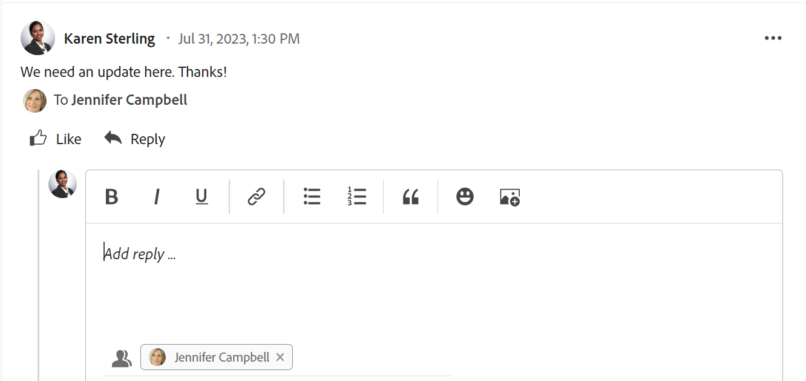

# Antworten auf Aktualisierungen

<!-- Audited: April 2024-->

<!--
>[!IMPORTANT]
>
>We are currently redesigning the commenting experience in Adobe Workfront.
>
>Depending on what objects you access the commenting experience for, you might see the following functionality for the Updates section:
>* The new experience
>* The legacy experience
>* The new and the legacy experience
>
>For more information about the new commenting experience and its availability, see [New commenting experience](../../product-announcements/betas/new-commenting-experience-beta/unified-commenting-experience.md). 
>
> The legacy commenting experience has been removed from projects, tasks, issues, and documents in the Preview environment. 
>
>The new commenting experience is available only for the Updates section of Workfront objects, and it is not available when you access updates from the following areas:
>
> * Home
> * Summary panel in lists
> * Summary panel in timesheets 
> * Summary panel in the Workload Balancer
>
>The new commenting experience is available in the Summary panel in lists, timesheets, and the Workload Balancer in the Preview environment and in the Production environment for customers who have opted for the fast release process.  
-->

Wenn jemand auf einen Kommentar oder eine Systemaktualisierung für ein Arbeitsobjekt antwortet, wird seine Antwort im Kommunikations-Thread auf den Registerkarten Kommentare und Alle im Abschnitt Aktualisierungen für das Objekt angezeigt.

>[!IMPORTANT]
>
>Es ist nicht möglich, auf Systemaktualisierungen in der Registerkarte Systemaktivität zu antworten. Antworten auf Systemaktualisierungen, die beim alten Kommentierungserlebnis vor dem 11. April 2024 vorgenommen wurden, werden als schreibgeschützt angezeigt.

In diesem Artikel wird beschrieben, wie Sie auf Kommentare von den meisten Objekten in Workfront antworten. Unterschiede zwischen den Abschnitten „Aktualisierungen“ verschiedener Objekte finden Sie unter [Übersicht über den Abschnitt „Aktualisierungen](/help/quicksilver/workfront-basics/updating-work-items-and-viewing-updates/updates-tab-overview.md).

## Zugriffsanforderungen

+++ Erweitern, um die Zugriffsanforderungen für die in diesem Artikel beschriebene Funktionalität anzuzeigen. 

<table style="table-layout:auto"> 
 <col> 
 <col> 
 <tbody> 
  <tr> 
   <td role="rowheader"><strong>Adobe Workfront-Paket</strong></td> 
   <td> 
Beliebig
 </td> 
  </tr> 
  <tr> 
   <td role="rowheader"><strong>Adobe Workfront-Lizenz</strong></td> 
   <td> 
Für Probleme und Dokumente:

<ul><li>
Mitwirkender oder höher
</li>
   <li>
Anfrage oder höher
</li></ul>

Für alle anderen Objekte:

   <ul><li>
Licht oder höher
</li>
   <li>
Überprüfen oder höher
</li></ul>

</td>  
  </tr> 
  <tr> 
   <td role="rowheader"><strong>Konfiguration der Zugriffsebene</strong></td> 
   <td> 
Anzeigen- oder Bearbeitungszugriff für das Objekt, auf dem die Aktualisierung ausgeführt wird
 </td> 
  </tr> 
  <tr> 
   <td role="rowheader"><strong>Objektberechtigungen</strong></td> 
   <td> 
Anzeigen der Berechtigungen für das Objekt
 </td> 
  </tr> 
 </tbody> 
   </table>

Weitere Informationen finden Sie in [ Dokumentation zu Zugriffsanforderungen für Workfront ](/help/quicksilver/administration-and-setup/add-users/access-levels-and-object-permissions/access-level-requirements-in-documentation.md).

+++

<!--Old:
<table style="table-layout:auto"> 
 <col> 
 <col> 
 <tbody> 
  <tr> 
   <td role="rowheader"><strong>Adobe Workfront plan</strong></td> 
   <td> 
Any
 </td> 
  </tr> 
  <tr> 
   <td role="rowheader"><strong>Adobe Workfront license*</strong></td> 
   <td> 
New: Contributor or higher for issues and documents; Light or higher for all other objects
 
   
Current: Request or higher for issues and documents; Review or higher for all other objects
 </td> 
  </tr> 
  <tr> 
   <td role="rowheader"><strong>Access level configuration</strong></td> 
   <td> 
View or Edit access for the object the update is on
 </td> 
  </tr> 
  <tr> 
   <td role="rowheader"><strong>Object permissions</strong></td> 
   <td> 
View access to the object
 </td> 
  </tr> 
 </tbody> 
</table>

*To find out what plan, license type, or access you have, contact your Workfront administrator. For more information, see [Access requirements for Workfront documentation](/help/quicksilver/administration-and-setup/add-users/access-levels-and-object-permissions/access-level-requirements-in-documentation.md). -->

## Auf eine Aktualisierung oder eine Antwort in Workfront antworten

Sie können auf einen Kommentar im Thread eines Objekts antworten, das Sie anzeigen können, oder Sie können sich als Workfront- oder Gruppenadministrator anmelden und im Namen eines anderen Benutzers auf einen Kommentar antworten. Weitere Informationen finden Sie unter [Als anderer Benutzer anmelden](../../administration-and-setup/add-users/create-and-manage-users/log-in-as-another-user.md).

### Auf einen Kommentar antworten

Die Antwort auf einen Kommentar im Abschnitt Aktualisierungen eines Objekts ist bei den meisten Objekten in Workfront ähnlich.

1. Navigieren Sie zu dem Objekt, dem Sie eine Antwort hinzufügen möchten.
1. Klicken Sie auf **Aktualisierungen** und anschließend auf die Registerkarte **Kommentare** für das Objekt und suchen Sie den Kommentar oder die Antwort, auf den bzw. die Sie antworten möchten

   ODER

   Klicken Sie auf **Alle** und dann auf **In Kommentaren antworten**, um den Kommentar auf der Registerkarte Kommentare zu öffnen und zu beantworten. Sie können nicht auf der Registerkarte Alle antworten.

1. (Optional) Um Text aus einer vorherigen Aktualisierung in Ihre Antwort einzubeziehen, klicken Sie auf das Menü **Mehr** in der oberen rechten Ecke des Kommentars, auf den Sie antworten möchten, und klicken Sie dann auf **Antwort zitieren**. Text aus der vorherigen Aktualisierung wird im Eingabebereich angezeigt, der mit einer vertikalen grauen Linie markiert ist.
1. Klicken Sie **Antworten**.

   

   Am unteren Rand des Feldes **Antwort hinzufügen…** können Sie die Benutzer sehen, die aktiv an der Konversation beteiligt sind, weitere hinzufügen oder diejenigen entfernen, die nicht mehr relevant sind. Diese Benutzenden erhalten zusammen mit allen Benutzenden, die das Objekt abonniert haben, eine Benachrichtigung, sobald eine Aktualisierung oder Antwort für das Objekt vorgenommen wird. Sie können auch weitere Benutzer taggen , um sie in Ihre Antwort aufzunehmen.  Informationen zum Tagging weiterer Benutzer finden Sie unter [Andere bei Aktualisierungen taggen](../../workfront-basics/updating-work-items-and-viewing-updates/tag-others-on-updates.md).

   >[!TIP]
   >
   >   Um einer vorhandenen Antwort weitere Antworten hinzuzufügen, können Sie mit der Eingabe in das Feld **Antwort hinzufügen…** beginnen oder auf **Antworten** klicken. Ihre Antwort wird am Ende des Threads hinzugefügt.

1. Beginnen Sie mit der Eingabe Ihrer Antwort und verwenden Sie alle zusätzlichen Optionen in der Rich-Text-Symbolleiste. Informationen zur Verwendung von Rich-Text oder anderen Aktualisierungsfunktionen finden Sie unter [Aktualisierungsarbeit](../updating-work-items-and-viewing-updates/update-work.md).

1. Klicken Sie **Senden**, um die Antwort zu speichern.

1. (Optional) Klicken Sie auf das **Mehr** Menü  in der oberen rechten Ecke des Kommentars, auf den Sie antworten möchten, um weitere Optionen zum Verwalten der Antwort zu erhalten. Weitere Informationen finden Sie unter [Arbeit aktualisieren](../updating-work-items-and-viewing-updates/update-work.md).

<!--
### Reply to an update or reply in the legacy Updates section

1. Go to the object to which you want to add a reply.
1. On the **Updates** tab for the object, find the update or reply to which you want to reply.

1. (Optional) To view an image in the existing update do one of the following:

   * Click the **Preview** icon  on the image thumbnail to open the full-size image in a new browser tab.
   * Click the **Download** icon  on the image thumbnail to download the image.

1. Click **Reply** on the update, then type a reply in the box that appears.

   You can see the users who are actively engaged in the conversation or tagged in each reply at the top of that update thread. These users, along with any users subscribed to the object, receive a notification whenever an update or reply is made on the object. You can also tag more users to include them in your reply.  To tag more users, see [Tag others on updates](../../workfront-basics/updating-work-items-and-viewing-updates/tag-others-on-updates.md).

   
   
1. (Optional) To include text from a previous update in your reply, click the **More** menu next to the update or reply you want to quote, then click **Quote Reply**. Text from the previous update appears in the input area, marked with a vertical gray line.
1. (Optional) Use formatting, emojis, include links, or images as explained in the section "Use Rich Text in a Workfront update" in the article [Update work](../../workfront-basics/updating-work-items-and-viewing-updates/update-work.md).
1. Click **Reply** to save the reply.

-->

## Auf eine Aktualisierung über eine E-Mail-Benachrichtigung antworten

Je nach Konfiguration Ihrer E-Mail-Benachrichtigungen erhalten Sie möglicherweise eine E-Mail-Benachrichtigung, wenn bestimmte Objekte, auf die Sie Zugriff haben, aktualisiert werden.

Sie können wie folgt auf eine Aktualisierung aus einer E-Mail-Benachrichtigung antworten:

* Beantworten Sie die E-Mail, die Sie erhalten. Ihre Antwort-E-Mail wird als Workfront-Antwort auf den ursprünglichen Kommentar hinzugefügt.
* Verwenden Sie die Schaltfläche Kommentar in der E-Mail, um zurück zu Workfront zu navigieren und im Bereich Updates auf die Aktualisierung zu antworten.

Im Folgenden finden Sie ein Beispiel für eine E-Mail-Benachrichtigung, die infolge einer Aktualisierung ausgelöst wurde, die auf der Registerkarte Aktualisierungen einer Aufgabe vorgenommen wurde:

Weitere Informationen finden Sie unter [Antworten auf E-Mail-Benachrichtigungen](../updating-work-items-and-viewing-updates/reply-to-email-notifications.md).

