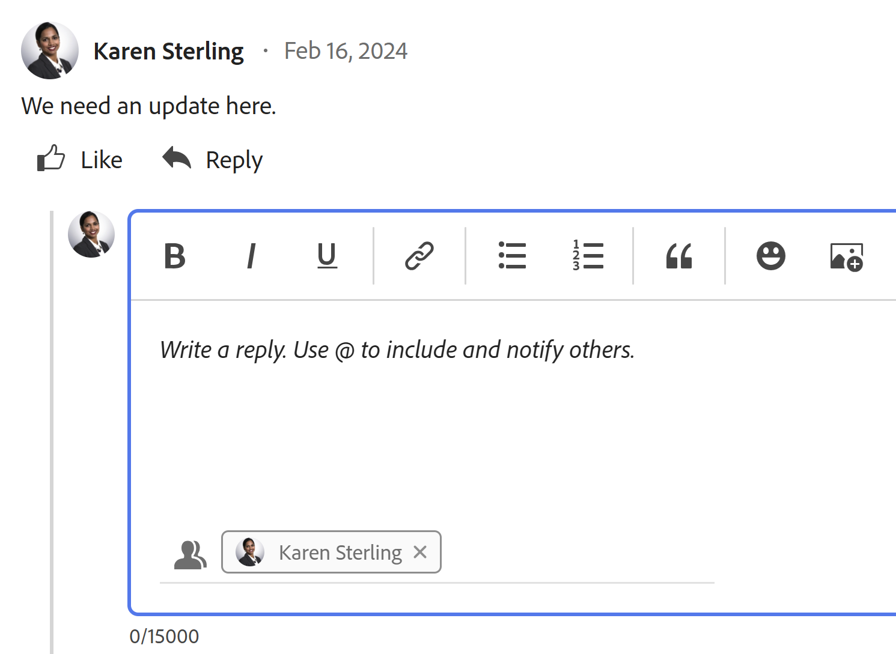

# Antworten auf Aktualisierungen

<!-- Audited: April 2024-->

<!--
>[!IMPORTANT]
>
>We are currently redesigning the commenting experience in Adobe Workfront.
>
>Depending on what objects you access the commenting experience for, you might see the following functionality for the Updates section:
>* The new experience
>* The legacy experience
>* The new and the legacy experience
>
>For more information about the new commenting experience and its availability, see [New commenting experience](../../product-announcements/betas/new-commenting-experience-beta/unified-commenting-experience.md). 
>
> The legacy commenting experience has been removed from projects, tasks, issues, and documents in the Preview environment. 
>
>The new commenting experience is available only for the Updates section of Workfront objects, and it is not available when you access updates from the following areas:
>
> * Home
> * Summary panel in lists
> * Summary panel in timesheets 
> * Summary panel in the Workload Balancer
>
>The new commenting experience is available in the Summary panel in lists, timesheets, and the Workload Balancer in the Preview environment and in the Production environment for customers who have opted for the fast release process.  
-->

Wenn ein Benutzer auf einen Kommentar oder ein Systemaktualisierung zu einem Arbeitsobjekt antwortet, wird seine Antwort im Kommunikations-Thread auf der Registerkarte Kommentare und Alle im Abschnitt Updates des Objekts angezeigt.

>[!IMPORTANT]
>
>Es ist nicht möglich, auf Systemaktualisierungen auf der Registerkarte Systemaktivität zu antworten. Alle Antworten auf Systemaktualisierungen, die vor dem 11. April 2024 in der bisherigen Kommentierungserfahrung vorgenommen wurden, werden als schreibgeschützt angezeigt.

<!--adjust the sentence before the second IMPORTANT and remove this important note when we remove legacy from the system-->

## Zugriffsanforderungen

Sie müssen über folgenden Zugriff verfügen, um die Schritte in diesem Artikel ausführen zu können:

<table style="table-layout:auto"> 
 <col> 
 <col> 
 <tbody> 
  <tr> 
   <td role="rowheader"><strong>Adobe Workfront-Abo</strong></td> 
   <td> 
Alle
 </td> 
  </tr> 
  <tr> 
   <td role="rowheader"><strong>Adobe Workfront-Lizenz*</strong></td> 
   <td> 
Neu: Mitarbeiter oder höher für Probleme und Dokumente; leicht oder höher für alle anderen Objekte
 
   
Aktuell: Anfrage oder höher für Probleme und Dokumente; Überprüfung oder höher für alle anderen Objekte
 </td> 
  </tr> 
  <tr> 
   <td role="rowheader"><strong>Konfiguration der Zugriffsebene</strong></td> 
   <td> 
Anzeigen oder Bearbeiten des Zugriffs für das Objekt, auf dem die Aktualisierung ausgeführt wird
 </td> 
  </tr> 
  <tr> 
   <td role="rowheader"><strong>Objektberechtigungen</strong></td> 
   <td> 
Zugriff auf das Objekt anzeigen
 </td> 
  </tr> 
 </tbody> 
</table>

*Wenden Sie sich an Ihren Workfront-Administrator, um zu erfahren, welchen Plan, welchen Lizenztyp oder welchen Zugriff Sie haben. Weitere Informationen finden Sie unter [Zugriffsanforderungen für die Dokumentation zu Workfront](/help/quicksilver/administration-and-setup/add-users/access-levels-and-object-permissions/access-level-requirements-in-documentation.md).

## Antworten auf ein Update oder eine Antwort in Workfront

Sie können auf einen Kommentar im Thread eines Objekts antworten, das Sie anzeigen können, oder sich als Workfront- oder Gruppenadministrator anmelden und im Namen eines anderen Benutzers auf einen Kommentar antworten. Weitere Informationen finden Sie unter [Melden Sie sich als anderer Benutzer an](../../administration-and-setup/add-users/create-and-manage-users/log-in-as-another-user.md).

Die Antwort auf einen Kommentar oder eine Antwort hängt davon ab, welches Erlebnis und welches Objekt Sie auswählen.

### Antworten auf Kommentare

1. Markieren Sie das Objekt, dem Sie eine Antwort hinzufügen möchten.
1. Klicks **Updates** und klicken Sie dann auf **Kommentare** Registerkarte für das Objekt und suchen Sie den Kommentar oder die Antwort, auf den/die Sie antworten möchten

   Oder

   Klicken Sie auf **Alle** Registerkarte und klicken Sie dann auf **In Kommentaren antworten** , um den Kommentar auf der Registerkarte Kommentare zu öffnen und darauf zu antworten. Sie können auf der Registerkarte &quot;Alle&quot;nicht antworten.

1. (Optional) Wenn Sie Text aus einer vorherigen Aktualisierung in Ihre Antwort aufnehmen möchten, klicken Sie auf die **Mehr** in der oberen rechten Ecke des Kommentars, auf den Sie antworten möchten, klicken Sie auf **Anführungsantwort**. Text aus der vorherigen Aktualisierung wird im Eingabefeld mit einer vertikalen grauen Linie markiert.
1. Klicks **Antwort**.

   

   Sie können die Benutzer sehen, die aktiv an der Unterhaltung beteiligt sind am unteren Rand der **Antwort hinzufügen...** und Sie können weitere hinzufügen oder die nicht mehr relevanten entfernen. Diese Benutzer erhalten zusammen mit allen Benutzern, die das Objekt abonniert haben, eine Benachrichtigung, sobald ein Objekt aktualisiert oder beantwortet wird. Sie können auch weitere Benutzer taggen, um sie in Ihre Antwort einzubeziehen.  Weitere Informationen zum Tagging von Benutzern finden Sie unter [Tagging anderer Benutzer auf Updates](../../workfront-basics/updating-work-items-and-viewing-updates/tag-others-on-updates.md).

   >[!TIP]
   >
   >   Um zusätzliche Antworten auf eine vorhandene Antwort hinzuzufügen, können Sie die Variable **Antwort hinzufügen ...** oder klicken Sie **Antwort** zum ursprünglichen Kommentar. Ihre Antwort wird am Ende des Threads hinzugefügt.

1. Beginnen Sie mit der Eingabe Ihrer Antwort und verwenden Sie zusätzliche Optionen aus der Rich-Text-Symbolleiste. Informationen zur Verwendung von Rich Text oder anderen Aktualisierungsfunktionen finden Sie unter [Update der Arbeit](../updating-work-items-and-viewing-updates/update-work.md).

1. Klicks **Einsenden** , um die Antwort zu speichern.

1. (Optional) Klicken Sie auf die **Mehr** Menü  in der oberen rechten Ecke des Kommentars, auf den Sie antworten möchten, finden Sie weitere Optionen zum Verwalten der Antwort. Weitere Informationen finden Sie unter [Update der Arbeit](../updating-work-items-and-viewing-updates/update-work.md).

<!--
### Reply to an update or reply in the legacy Updates section

1. Go to the object to which you want to add a reply.
1. On the **Updates** tab for the object, find the update or reply to which you want to reply.

1. (Optional) To view an image in the existing update do one of the following:

   * Click the **Preview** icon  on the image thumbnail to open the full-size image in a new browser tab.
   * Click the **Download** icon  on the image thumbnail to download the image.

1. Click **Reply** on the update, then type a reply in the box that appears.

   You can see the users who are actively engaged in the conversation or tagged in each reply at the top of that update thread. These users, along with any users subscribed to the object, receive a notification whenever an update or reply is made on the object. You can also tag more users to include them in your reply.  To tag more users, see [Tag others on updates](../../workfront-basics/updating-work-items-and-viewing-updates/tag-others-on-updates.md).

   
   
1. (Optional) To include text from a previous update in your reply, click the **More** menu next to the update or reply you want to quote, then click **Quote Reply**. Text from the previous update appears in the input area, marked with a vertical gray line.
1. (Optional) Use formatting, emojis, include links, or images as explained in the section "Use Rich Text in a Workfront update" in the article [Update work](../../workfront-basics/updating-work-items-and-viewing-updates/update-work.md).
1. Click **Reply** to save the reply.

-->

## Antwort auf eine Aktualisierung einer E-Mail-Benachrichtigung

Abhängig von der Konfiguration Ihrer E-Mail-Benachrichtigungen erhalten Sie möglicherweise eine E-Mail-Benachrichtigung, wenn eine Aktualisierung an bestimmten Objekten vorgenommen wird, auf die Sie Zugriff haben.

Sie haben folgende Möglichkeiten, auf eine Aktualisierung einer E-Mail-Benachrichtigung zu antworten:

* Antworten Sie auf die E-Mail, die Sie erhalten. Ihre Antwort-E-Mail wird als Workfront-Antwort auf den ursprünglichen Kommentar hinzugefügt.
* Verwenden Sie die Schaltfläche Kommentar in der E-Mail, um zurück zu Workfront zu navigieren und auf die Aktualisierung im Bereich Updates zu antworten.

Im Folgenden finden Sie ein Beispiel für eine E-Mail-Benachrichtigung, die durch eine Aktualisierung ausgelöst wird, die auf dem Tab Aktualisierungen einer Aufgabe vorgenommen wurde:

Weitere Informationen finden Sie unter [Antworten auf E-Mail-Benachrichtigungen](../updating-work-items-and-viewing-updates/reply-to-email-notifications.md).

