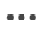

# Antworten auf Aktualisierungen

Die hervorgehobenen Informationen auf dieser Seite beziehen sich auf Funktionen, die noch nicht allgemein verfügbar sind. Sie ist nur in der Vorschau -Umgebung für alle Kunden verfügbar. Nach den monatlichen Versionen für die Produktion sind in der Produktionsumgebung dieselben Funktionen auch für Kunden verfügbar, die schnelle Versionen aktiviert haben. \
Informationen zu schnellen Versionen finden Sie unter [Schnelle Versionen für Ihre Organisation aktivieren oder deaktivieren](../../administration-and-setup/set-up-workfront/configure-system-defaults/enable-fast-release-process.md)

Weitere Informationen zum aktuellen Veröffentlichungsplan finden Sie unter [Übersicht über die Version 2023 im vierten Quartal](../../product-announcements/product-releases/23-q4-release-activity/23-q4-release-overview.md)

>[!IMPORTANT]
>
>Die Kommentarerfahrung in Adobe Workfront wird derzeit umgestaltet.
>Je nachdem, aus welcher Umgebung und welchen Objekten Sie auf das Kommentierungserlebnis zugreifen, werden im Abschnitt Updates möglicherweise unterschiedliche Funktionen angezeigt.
>
>Weitere Informationen über das neue Kommentierungserlebnis und dessen Verfügbarkeit finden Sie unter [Neues Kommentierungserlebnis](../../product-announcements/betas/new-commenting-experience-beta/unified-commenting-experience.md).
>
>Das neue Kommentarerlebnis ist nur für den Abschnitt Updates verfügbar und nicht für die folgenden Bereiche:
>
> * Startseite
> * Zusammenfassungsbereich in Listen
> * Zusammenfassungsbereich in Timesheets

Wenn ein Benutzer auf einen Kommentar oder ein Systemaktualisierung zu einem Arbeitsobjekt antwortet, wird seine Antwort im Kommunikations-Thread im Abschnitt Updates für das Objekt angezeigt.

>[!IMPORTANT]
>
>Es ist nicht möglich, auf Systemaktualisierungen in der neuen Kommentierungserfahrung zu antworten. Weitere Informationen finden Sie unter [Neues Kommentierungserlebnis](../../product-announcements/betas/new-commenting-experience-beta/unified-commenting-experience.md).

## Zugriffsanforderungen

Sie müssen über folgenden Zugriff verfügen, um die Schritte in diesem Artikel ausführen zu können:

<table style="table-layout:auto"> 
 <col> 
 <col> 
 <tbody> 
  <tr> 
   <td role="rowheader"><strong>Adobe Workfront-Plan*</strong></td> 
   <td> 
Beliebig
 </td> 
  </tr> 
  <tr> 
   <td role="rowheader"><strong>Adobe Workfront-Lizenz*</strong></td> 
   <td> 
Anfrage oder höher für Probleme und Dokumente; Überprüfung oder höher für alle anderen Objekte
 </td> 
  </tr> 
  <tr> 
   <td role="rowheader"><strong>Konfigurationen auf Zugriffsebene*</strong></td> 
   <td> 
Anforderer oder höher für Probleme und Dokumente; Überprüfer für alle anderen Objekte oder höher
 
<b>NOTIZ</b>

Wenn Sie immer noch keinen Zugriff haben, fragen Sie Ihren Workfront-Administrator, ob er zusätzliche Zugriffsbeschränkungen für Ihre Zugriffsebene festlegt. Informationen dazu, wie ein Workfront-Administrator Ihre Zugriffsebene ändern kann, finden Sie unter <a href="../../administration-and-setup/add-users/configure-and-grant-access/create-modify-access-levels.md" class="MCXref xref">Benutzerdefinierte Zugriffsebenen erstellen oder ändern</a>.
 </td>
</tr> 
  <tr> 
   <td role="rowheader"><strong>Objektberechtigungen</strong></td> 
   <td> 
Zugriff auf das Objekt anzeigen
 
Informationen zum Anfordern von zusätzlichem Zugriff finden Sie unter <a href="../../workfront-basics/grant-and-request-access-to-objects/request-access.md" class="MCXref xref">Zugriff auf Objekte anfordern </a>.
 </td> 
  </tr> 
 </tbody> 
</table>

&#42;Wenden Sie sich an Ihren Workfront-Administrator, um zu erfahren, welchen Plan, welchen Lizenztyp oder welchen Zugriff Sie haben.

## Antworten auf ein Update oder eine Antwort in Workfront

Sie können auf einen Kommentar im Thread eines Objekts antworten, das Sie anzeigen können, oder sich als Workfront- oder Gruppenadministrator anmelden und im Namen eines anderen Benutzers auf einen Kommentar antworten. Weitere Informationen finden Sie unter [Melden Sie sich als anderer Benutzer an](../../administration-and-setup/add-users/create-and-manage-users/log-in-as-another-user.md).

Die Antwort auf einen Kommentar oder eine Antwort hängt davon ab, welches Erlebnis und welches Objekt Sie auswählen.

### Antworten auf ein Update oder eine Antwort im Abschnitt &quot;Aktuelle Updates&quot;

1. Markieren Sie das Objekt, dem Sie eine Antwort hinzufügen möchten.
1. Im **Updates** -Registerkarte für das Objekt, suchen Sie nach der Aktualisierung oder Antwort, auf die Sie antworten möchten.

1. (Optional) Führen Sie einen der folgenden Schritte aus, um ein Bild in der vorhandenen Aktualisierung anzuzeigen:

   * Klicken Sie auf **Vorschau** icon  auf der Miniaturansicht des Bildes, um das Bild in voller Größe in einer neuen Browser-Registerkarte zu öffnen.
   * Klicken Sie auf **Herunterladen** icon  auf der Miniaturansicht, um das Bild herunterzuladen.

1. Klicks **Antwort** Geben Sie bei der Aktualisierung eine Antwort in das angezeigte Feld ein.

   Oben in diesem Aktualisierungs-Thread können Sie die Benutzer sehen, die aktiv an der Konversation beteiligt sind oder in jeder Antwort getaggt sind. Diese Benutzer erhalten zusammen mit allen Benutzern, die das Objekt abonniert haben, eine Benachrichtigung, sobald ein Objekt aktualisiert oder beantwortet wird. Sie können auch weitere Benutzer taggen, um sie in Ihre Antwort einzubeziehen.  Weitere Informationen zum Tagging von Benutzern finden Sie unter [Tagging anderer Benutzer auf Updates](../../workfront-basics/updating-work-items-and-viewing-updates/tag-others-on-updates.md).

   

1. (Optional) Wenn Sie Text aus einer vorherigen Aktualisierung in Ihre Antwort aufnehmen möchten, klicken Sie auf die **Mehr** neben der Aktualisierung oder Antwort, die Sie zitieren möchten, klicken Sie auf **Antwort zitieren**. Text aus der vorherigen Aktualisierung wird im Eingabefeld mit einer vertikalen grauen Linie markiert.
1. (Optional) Verwenden Sie Formatierungen, Emojis, Include-Links oder Bilder, wie im Artikel &quot;Verwenden von Rich Text in einem Workfront-Update&quot;beschrieben. [Update der Arbeit](../../workfront-basics/updating-work-items-and-viewing-updates/update-work.md).
1. Klicks **Antwort** , um die Antwort zu speichern.

### Antworten auf einen Kommentar bei Verwendung des neuen Kommentar-Erlebnisses

Informationen darüber, welche Funktionen im neuen Kommentierungserlebnis verfügbar sind und welche Objekte verwendet werden, finden Sie unter [Neues Kommentierungserlebnis](../../product-announcements/betas/new-commenting-experience-beta/unified-commenting-experience.md).

1. Markieren Sie das Objekt, dem Sie eine Antwort hinzufügen möchten.
1. Klicks **Updates** und klicken Sie dann auf **Kommentare** für das Objekt ein und suchen Sie nach dem Kommentar oder der Antwort, auf den/die Sie antworten möchten.
1. (Optional) Wenn Sie Text aus einer vorherigen Aktualisierung in Ihre Antwort aufnehmen möchten, klicken Sie auf die **Mehr** Menü in der oberen rechten Ecke des Kommentars, auf den Sie antworten möchtenKlicken Sie auf **Anführungsantwort**. Text aus der vorherigen Aktualisierung wird im Eingabefeld mit einer vertikalen grauen Linie markiert.
1. Klicks **Antwort**.

   

   Sie können die Benutzer sehen, die aktiv an der Unterhaltung beteiligt sind am unteren Rand der **Antwort hinzufügen...** und Sie können weitere hinzufügen oder die nicht mehr relevanten entfernen. Diese Benutzer erhalten zusammen mit allen Benutzern, die das Objekt abonniert haben, eine Benachrichtigung, sobald ein Objekt aktualisiert oder beantwortet wird. Sie können auch weitere Benutzer taggen, um sie in Ihre Antwort einzubeziehen.  Weitere Informationen zum Tagging von Benutzern finden Sie unter [Tagging anderer Benutzer auf Updates](../../workfront-basics/updating-work-items-and-viewing-updates/tag-others-on-updates.md).

   >[!TIP]
   >
   >   Um zusätzliche Antworten auf eine vorhandene Antwort hinzuzufügen, können Sie die Variable **Antwort hinzufügen ...** oder klicken Sie **Antwort** zum ursprünglichen Kommentar. Ihre Antwort wird am Ende des Threads hinzugefügt. 

1. Beginnen Sie mit der Eingabe Ihrer Antwort und verwenden Sie zusätzliche Optionen aus der Rich-Text-Symbolleiste. Informationen zur Verwendung von Rich Text oder anderen Aktualisierungsfunktionen finden Sie unter [Update der Arbeit](../updating-work-items-and-viewing-updates/update-work.md).

1. Klicks **Einsenden** , um die Antwort zu speichern.

1. (Optional) Klicken Sie auf die **Mehr** Menü  in der oberen rechten Ecke des Kommentars, auf den Sie antworten möchten für weitere Optionen zur Verwaltung der Antwort. Weitere Informationen finden Sie unter [Update der Arbeit](../updating-work-items-and-viewing-updates/update-work.md).

## Antwort auf eine Aktualisierung einer E-Mail-Benachrichtigung

Abhängig von der Konfiguration Ihrer E-Mail-Benachrichtigungen erhalten Sie möglicherweise eine E-Mail-Benachrichtigung, wenn eine Aktualisierung an bestimmten Objekten vorgenommen wird, auf die Sie Zugriff haben.

Sie haben folgende Möglichkeiten, auf eine Aktualisierung einer E-Mail-Benachrichtigung zu antworten:

* Antworten Sie auf die E-Mail, die Sie erhalten. Ihre Antwort-E-Mail wird als Workfront-Antwort auf den ursprünglichen Kommentar hinzugefügt.
* Verwenden Sie die Schaltfläche Kommentar in der E-Mail, um zurück zu Workfront zu navigieren und auf die Aktualisierung im Bereich Updates zu antworten.

Im Folgenden finden Sie ein Beispiel für eine E-Mail-Benachrichtigung, die durch eine Aktualisierung ausgelöst wird, die auf dem Tab Aktualisierungen einer Aufgabe vorgenommen wurde:

Weitere Informationen finden Sie unter [Antworten auf E-Mail-Benachrichtigungen](../updating-work-items-and-viewing-updates/reply-to-email-notifications.md).

