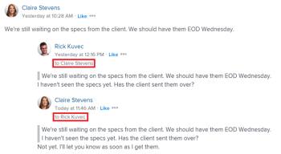

# Andere bei Aktualisierungen taggen

<!--Audited: April, 2024-->

<!--
>[!IMPORTANT]
>
>We are currently redesigning the commenting experience in Adobe Workfront.
>
>Depending on what objects you access the commenting experience for, you might see the following functionality for the Updates section:
>* The new experience
>* The legacy experience
>* The new and the legacy experience
>
>For more information about the new commenting experience and its availability, see [New commenting experience](../../product-announcements/betas/new-commenting-experience-beta/unified-commenting-experience.md). 
>
> The legacy commenting experience has been removed from projects, tasks, issues, and documents in the Preview environment. 
>
>The new commenting experience is available only for the Updates section of Workfront objects, and it is not available when you access updates from the following areas:
>
> * Home
> * Summary panel in lists
> * Summary panel in timesheets 
> * Summary panel in the Workload Balancer
>
>The new commenting experience is available in the Summary panel in lists, timesheets, and the Workload Balancer in the Preview environment and in the Production environment for customers who have opted for the fast release process.  
-->

Sie können Benutzer beim Aktualisieren eines Objekts taggen, wenn Sie ihre Aufmerksamkeit auf ein Objekt lenken möchten, dem sie andernfalls möglicherweise nicht folgen würden.

Anstatt diese Benutzer in das Objekt aufzunehmen, indem Sie sie ihm zuweisen oder zum Abonnieren auffordern, können Sie sie bei der Aktualisierung taggen , um sie für sie freizugeben. Getaggte Benutzende erhalten eine Workfront-Benachrichtigung über das von Ihnen eingegebene Update. Abhängig von ihren Benachrichtigungseinstellungen erhalten sie außerdem eine E-Mail über die Aktualisierung, die Sie eingeben.

## Überlegungen zum Tagging von Benutzenden in Aktualisierungen

* Benutzer, die in Updates getaggt sind, müssen in ihrem Profil eine persönliche Benachrichtigung aktivieren, damit sie die E-Mail-Benachrichtigung erhalten. Weitere Informationen finden Sie unter [Eigene E-Mail-Benachrichtigungen ändern](../../workfront-basics/using-notifications/activate-or-deactivate-your-own-event-notifications.md).

  Informationen zum Hinzufügen von Aktualisierungen zu Workfront-Objekten finden Sie unter [Arbeit aktualisieren](../../workfront-basics/updating-work-items-and-viewing-updates/update-work.md).

* Wenn ein Problem in ein Projekt oder eine Aufgabe konvertiert wird, werden die Aktualisierungen in das neue Projekt oder die neue Aufgabe kopiert, die getaggten Benutzenden jedoch nicht. Um das Gespräch fortzusetzen, müssen Sie die Teilnehmer erneut taggen.

## Zugriffsanforderungen

+++ Erweitern, um die Zugriffsanforderungen für die in diesem Artikel beschriebene Funktionalität anzuzeigen. 

<table style="table-layout:auto">
 <col> 
 <col> 
 <tbody> 
  <tr> 
   <td role="rowheader"><strong>Adobe Workfront-Paket</strong></td> 
   <td> 
Beliebig
 </td> 
  </tr> 
  <tr> 
   <td role="rowheader"><strong>Adobe Workfront-Lizenz</strong></td> 
   <td> 
Für Probleme und Dokumente:

<ul><li>
Mitwirkender oder höher
</li>
   <li>
Anfrage oder höher
</li></ul>

Für alle anderen Objekte:

   <ul><li>
Licht oder höher
</li>
   <li>
Überprüfen oder höher
</li></ul>

</td>  
  </tr>
   <td role="rowheader"><strong>Konfiguration der Zugriffsebene</strong></td> 
   <td> 
Anzeigen von oder höherem Zugriff auf die Objekte, an denen Sie Benutzende taggen möchten
 </td> 
  </tr> 
  <tr> 
   <td role="rowheader"><strong>Objektberechtigung</strong></td> 
   <td> 
Zeigen Sie oder höhere Berechtigungen für die Objekte an, für die Sie Benutzende taggen möchten
 </td> 
  </tr> 
 </tbody> 
</table>

Weitere Informationen finden Sie in [&#x200B; Dokumentation zu Zugriffsanforderungen für Workfront &#x200B;](/help/quicksilver/administration-and-setup/add-users/access-levels-and-object-permissions/access-level-requirements-in-documentation.md).

+++

<!--Old:
<table style="table-layout:auto">
 <col> 
 <col> 
 <tbody> 
  <tr> 
   <td role="rowheader"><strong>Adobe Workfront plan</strong></td> 
   <td> 
Any
 </td> 
  </tr> 
  <tr> 
   <td role="rowheader"><strong>Adobe Workfront license*</strong></td> 
   <td> 
New: Contributor or higher for issues and documents; Light or higher for all other objects

   
Current: Request or higher for issues and documents; Review or higher for all other objects
 </td> 
  </tr> 
  <tr> 
   <td role="rowheader"><strong>Access level configuration</strong></td> 
   <td> 
View or higher access to the objects where you want to post the reply
 </td> 
  </tr> 
  <tr> 
   <td role="rowheader"><strong>Object permission</strong></td> 
   <td> 
View or higher permissions to the objects where you want to post the reply
 </td> 
  </tr> 
 </tbody> 
</table>-->

## Andere bei Aktualisierungen taggen

Sie können andere wie folgt mit Tags zu Aktualisierungen versehen:

* **Automatisch**: Wenn ein(e) Benutzende(r) einen Thread startet, einen Kommentar hinzufügt oder eine Antwort hinzufügt, wird er/sie automatisch mit Tags versehen und zum Bereich Personen oder Teams des Kommentarfelds hinzugefügt.
* **Manuell**: Wenn Sie dem Bereich Personen taggen im Kommentarfeld manuell einen Benutzer hinzufügen.

Sie können auch Benutzer entfernen, die versehentlich getaggt wurden, wenn Sie einen Kommentar bearbeiten oder darauf antworten.

1. Mit dem Aktualisieren eines Arbeitselements beginnen, wie in [Arbeit aktualisieren](../../workfront-basics/updating-work-items-and-viewing-updates/update-work.md) beschrieben. Als Kommentar-Verantwortlicher werden Sie automatisch mit Tags versehen und dem Bereich Personen oder Teams des Kommentarfelds hinzugefügt.

   >[!TIP]
   >
   >Der/die Kommentar-Verantwortliche kann seinen/ihren eigenen Namen nicht im Bereich Personen oder Teams taggen des Kommentarfelds sehen.

1. Beginnen Sie im Feld **Personen oder Teams taggen** mit der Eingabe des Namens des Benutzers oder Teams, den Sie einbeziehen möchten, und klicken Sie dann auf den Namen, wenn er in der Dropdown-Liste angezeigt wird.

   ODER

   Geben Sie das @-Symbol im Bereich **Kommentar schreiben** ein, beginnen Sie mit der Eingabe des Namens des Benutzers oder Teams, den Sie in die Aktualisierung aufnehmen möchten, und klicken Sie dann auf den Namen, wenn er in der Dropdown-Liste angezeigt wird.

   >[!TIP]
   > 
   >Um den richtigen Benutzer zu identifizieren, wenn Benutzer mit ähnlichen oder identischen Namen vorhanden sind, beachten Sie den Avatar, die Primäre Rolle des Benutzers oder seine E-Mail-Adresse.
   > 
   >Benutzende müssen mindestens einem Aufgabengebiet zugeordnet sein, damit sie es während des Tags in einer Aktualisierung sehen können.
   > 
   >Die Einstellung Kontaktinformationen anzeigen muss in Ihrer Zugriffsebene aktiviert sein, damit Benutzer die E-Mails von Benutzern anzeigen können. Weitere Informationen finden Sie unter [Gewähren des Benutzerzugriffs](../../administration-and-setup/add-users/configure-and-grant-access/grant-access-other-users.md).

   

1. (Optional) Um die Aktualisierung als privat festzulegen, aktivieren Sie **Privat für mein**) in der rechten unteren Ecke des Aktualisierungsfelds. Dadurch wird die Aktualisierung nur für Benutzende in Ihrem Unternehmen sichtbar.

   Die Option **Privat für meine Firma** ist nur verfügbar, wenn in Ihrem Workfront-Profil eine Firma angegeben ist.

   >[!NOTE]
   >
   >Getaggte Benutzende außerhalb des Unternehmens können weiterhin eine In-App-Benachrichtigung oder E-Mail erhalten, auch wenn sie die privaten Kommentare auf der Registerkarte Aktualisierungen nicht sehen. Wir empfehlen, externe Benutzer nicht mit Tags zu versehen, wenn Sie die Informationen nicht mit ihnen teilen möchten.

1. (Optional) Um mehrere Benutzer und Teams hinzuzufügen, wiederholen Sie Schritt 2. <!--insure this stays accurate-->

   >[!NOTE]
   >
   >Alle Benutzer und Team-Mitglieder, die im Feld „Personen oder Teams taggen“ aufgeführt sind, erhalten eine In-App-Benachrichtigung für das Update und je nach Konfiguration ihrer E-Mail-Benachrichtigungseinstellungen möglicherweise eine E-Mail. Benutzer, die sich in einem Kommentar oder einer Antwort selbst taggen, erhalten eine Benachrichtigung für diesen Kommentar oder diese Antwort und können ihren Namen für den Rest des Threads in als Mitglied des Threads aufgeführt sehen. Sie erhalten jedoch keine weitere Benachrichtigung, es sei denn, sie taggen sich erneut. Weitere Informationen finden Sie unter [Eigene E-Mail-Benachrichtigungen ändern](../../workfront-basics/using-notifications/activate-or-deactivate-your-own-event-notifications.md) und [Ereignisbenachrichtigungen für alle Personen im System konfigurieren](../../administration-and-setup/manage-workfront/emails/configure-event-notifications-for-everyone-in-the-system.md).

1. Klicken Sie auf **Senden**.\
   Benutzern, die an der Aktualisierung beteiligt sind, wird automatisch die Berechtigung Anzeigen für das Objekt gewährt; sie können Aktualisierungen am Objekt anzeigen und darauf reagieren.

   Die Namen der getaggten Entitäten werden neben ihren Avataren angezeigt, bis zu zwei Entitäten. Wenn mehr als zwei Entitäten mit Tags versehen sind, wird der Name des ersten Elements sowie die Anzahl der zusätzlichen mit Tags versehenen Entitäten angezeigt.

   

   Wenn Sie im Kommentartext getaggt sind, wird Ihr Name in diesen Kommentaren hervorgehoben.

   Informationen zu den zusätzlichen Funktionen, die beim Aktualisieren eines Arbeitselements verfügbar sind, finden Sie unter [Arbeit aktualisieren](../../workfront-basics/updating-work-items-and-viewing-updates/update-work.md).

1. (Optional) Klicken Sie auf das **Mehr** Menü  in der oberen rechten Ecke des Kommentars und dann auf **Bearbeiten**. Entfernen Sie alle getaggten Benutzer und klicken Sie dann auf **Senden**.

   >[!IMPORTANT]
   >
   >Sie können einen Kommentar nur innerhalb von 15 Minuten nach seiner Eingabe bearbeiten. Sie können nur die hinzugefügten Kommentare bearbeiten.

<!--
   >[!TIP]
   >
   >When using the legacy commenting experience to add comments and replies, comment owners that were not specifically tagged cannot be manually removed by people who use the new commenting experience.
-->

<!--
### Tag others on updates in the legacy Updates section

You can manually tag users in the legacy Updates section. 

1. Begin updating a work item, as described in [Update work](../../workfront-basics/updating-work-items-and-viewing-updates/update-work.md).
1. In the **Notify** field, begin typing the name of the user or team you want to include, then click the name when it appears in the drop-down list.

   Or

   Type the @ symbol in the **Start a new update** area, begin typing the name of the user or team you want to include on the update, then click the name when it appears in the drop-down list.

   >[!TIP]
   >
   >To identify the correct user when there are users with similar or identical names, notice the avatar, the user's Primary Role, or their email address. 
   >
   >Users must be associated with at least one job role to view it as you tag them in an update. 
   >
   >You must have the View Contact Info setting enabled in your access level for Users to view users' emails. For information, see [Grant access to users](../../administration-and-setup/add-users/configure-and-grant-access/grant-access-other-users.md).

   

1. (Optional) To make the update private, enable **Private to my company** in the lower-right corner of the update box. This makes the update visible just to users in your company. The **Private to my company** option is available only when a Company is specified in your Workfront profile. 

   >[!NOTE]
   >
   >Tagged users outside the company could still receive an in-app notification or email, even though they will not see the private comments on the Updates tab. We recommend not to tag external users on an update if you do not want to share the information with them.  

1. (Optional) To add multiple users and teams, repeat step 2.

   >[!NOTE]
   >
   >All users and team members listed in the Notify field receive an in-app notification for the update and might receive an email, depending on the configuration of their email notification settings. Users who tag themselves in a comment or reply receive a notification for that comment or reply and can see their name in the Notify field for the remainder of the thread, but they do not receive another notification unless they tag themselves again. For more information, see [Modify your own email notifications](../../workfront-basics/using-notifications/activate-or-deactivate-your-own-event-notifications.md) and [Configure event notifications for everyone in the system](../../administration-and-setup/manage-workfront/emails/configure-event-notifications-for-everyone-in-the-system.md).

1. Click **Update**.  
   Users included in the update are automatically granted View permission to the object and can view and respond to updates made to the object.

   You can see who has been tagged in each reply at the top of the update thread. These users, along with any users subscribed to the object, receive a notification whenever an update or reply is made on the object.

   
-->

Informationen zu den zusätzlichen Funktionen, die beim Aktualisieren eines Arbeitselements verfügbar sind, finden Sie unter [Arbeit aktualisieren](../../workfront-basics/updating-work-items-and-viewing-updates/update-work.md).

