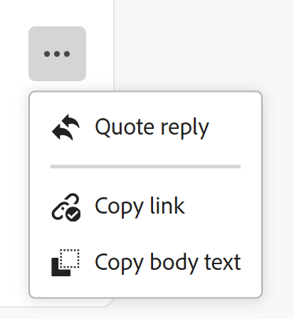

# Arbeit aktualisieren

<!-- Audited: 4/2025 -->

<!--The highlighted information on this page refers to functionality not yet generally available. It is available only in the Preview environment for all customers. After the monthly releases to Production, the same features are also available in the Production environment for customers who enabled fast releases.    

For information about fast releases, see [Enable or disable fast releases for your organization](/help/quicksilver/administration-and-setup/set-up-workfront/configure-system-defaults/enable-fast-release-process.md). -->

<!--info for April 11: hide the "Important" box below-->

<!--
>[!IMPORTANT]
>
>We are currently redesigning the commenting experience in Adobe Workfront.
>
>Depending on what objects you access the commenting experience for, you might see the following functionality for the Updates section:
>* The new experience
>* The legacy experience
>* The new and the legacy experience
>
>For more information about the new commenting experience and its availability, see [New commenting experience](../../product-announcements/betas/new-commenting-experience-beta/unified-commenting-experience.md). 
>
>The legacy commenting experience has been removed from projects, tasks, issues, and documents in the Preview environment. 
>
>The new commenting experience is available only for the Updates section of Workfront objects, and it is not available when you access updates from the following areas:
>
> * Home
> * Summary panel in lists
> * Summary panel in timesheets 
> * Summary panel in the Workload Balancer
>
>The new commenting experience is available in the Summary panel in lists, timesheets, and the Workload Balancer in the Preview environment and in the Production environment for customers who have opted for the fast release process. 
-->

Sie können einem Adobe Workfront-Objekt eine Aktualisierung hinzufügen, indem Sie ihm einen Kommentar hinzufügen, um andere über den Status oder den Fortschritt des Objekts zu informieren oder um weitere Informationen oder zusätzliche Ressourcen anzufordern.

Weitere Informationen dazu, welchen Objekten Sie in Workfront Aktualisierungen hinzufügen können, finden Sie unter [Aktualisierungsabschnitt - Übersicht](/help/quicksilver/workfront-basics/updating-work-items-and-viewing-updates/updates-tab-overview.md).

In diesem Artikel wird beschrieben, wie Sie Projekte, Aufgaben und Probleme kommentieren können. Benutzer, die dem Objekt zugewiesen oder dieses abonniert haben, können sich Ihr Update anzeigen lassen. Sie können auch Benutzer taggen, um sie auf das Update aufmerksam zu machen.

Das Hinzufügen von Kommentaren zu anderen Workfront-Objekten ähnelt dem Aktualisieren von Projekten, Aufgaben und Problemen.

Weitere Informationen zum Kommentieren von Karten, Zielen und Datensätzen in Workfront Planning finden Sie in den folgenden Artikeln:

* [Verwalten von Zielkommentaren in Adobe Workfront-](../../workfront-goals/goal-management/manage-goal-comments.md).

* [Hinzufügen einer Ad-hoc-Karte zu einer Pinnwand](/help/quicksilver/agile/get-started-with-boards/add-card-to-board.md)

* [Verwenden von verbundenen Karten auf Pinnwänden](/help/quicksilver/agile/get-started-with-boards/connected-cards.md)

* [Verwalten von Datensatzkommentaren](/help/quicksilver/planning/records/manage-record-comments.md)

## Zugriffsanforderungen

+++ Erweitern, um die Zugriffsanforderungen für die in diesem Artikel beschriebene Funktionalität anzuzeigen.

<table style="table-layout:auto"> 
 <col> 
 </col> 
 <col> 
 </col> 
 <tbody> 
  <tr> 
   <td role="rowheader"><strong>Adobe Workfront-Paket</strong></td> 
   <td> 
Beliebig
 </td> 
  </tr> 
  <tr> 
   <td role="rowheader"><strong>Adobe Workfront-Lizenz</strong></td> 
   <td> 
Für Probleme und Dokumente:

<ul><li>
Mitwirkender oder höher
</li>
   <li>
Anfrage oder höher
</li></ul>

Für alle anderen Objekte:

   <ul><li>
Licht oder höher
</li>
   <li>
Überprüfen oder höher
</li></ul>

</td> 
  </tr> 
  <tr> 
   <td role="rowheader"><strong>Konfigurationen der Zugriffsebene</strong></td> 
   <td> 
Anzeigen- oder Bearbeitungszugriff für das Objekt, auf dem die Aktualisierung ausgeführt wird
</td> 
  </tr> 
  <tr> 
   <td role="rowheader"><strong>Objektberechtigungen</strong></td> 
   <td> 
Anzeigen des Zugriffs auf das Objekt
</td> 
  </tr> 
 </tbody> 
</table>

Weitere Informationen finden Sie unter [Zugriffsanforderungen in der Dokumentation zu Workfront](/help/quicksilver/administration-and-setup/add-users/access-levels-and-object-permissions/access-level-requirements-in-documentation.md).

+++

<!--Old:
<table style="table-layout:auto"> 
 <col> 
 </col> 
 <col> 
 </col> 
 <tbody> 
  <tr> 
   <td role="rowheader"><strong>Adobe Workfront plan</strong></td> 
   <td> 
Any
 </td> 
  </tr> 
  <tr> 
   <td role="rowheader"><strong>Adobe Workfront license*</strong></td> 
   <td> 
   
New: Contributor or higher for issues and documents: Light or higher for all other objects

   
Current: Request or higher for issues and documents; Review or higher for all other objects

   </td> 
  </tr> 
  <tr> 
   <td role="rowheader"><strong>Access level configurations</strong></td> 
   <td> 
View or Edit access for the object the update is on
</td> 
  </tr> 
  <tr> 
   <td role="rowheader"><strong>Object permissions</strong></td> 
   <td> 
View access to the object
</td> 
  </tr> 
 </tbody> 
</table>
-->

## Überlegungen zum Kommentieren von Objekten

* Sie können den meisten Objekten in Adobe Workfront im Abschnitt „Aktualisierungen“ Kommentare hinzufügen. Weitere Informationen dazu, für welche Objekte der Abschnitt „Aktualisierungen“ angezeigt wird, finden Sie unter [Übersicht über Aktualisierungen](../updating-work-items-and-viewing-updates/updates-tab-overview.md).

* Sie können zu Workfront-Objekten Kommentare aus anderen Anwendungen hinzufügen, die in Workfront integriert sind, oder aus der Workfront-Mobile-App.

  Nicht alle Anwendungen, die mit Workfront integriert sind, können Workfront-Objekten Kommentare hinzufügen.

  Nicht alle Funktionen, die im Abschnitt Aktualisierungen eines Objekts in Workfront verfügbar sind, sind in anderen Programmen verfügbar, wenn über das Programm auf Workfront-Objekte zugegriffen wird. Rich-Text-Funktionen oder die Möglichkeit, einen Kommentar privat für das Unternehmen einer Person zu machen, sind möglicherweise nicht verfügbar, wenn Kommentare zu einem Workfront-Objekt über eine Drittanbieteranwendung hinzugefügt werden.

* Sie können den Fortschritt eines Workfront-Objekts (Projekt, Aufgabe oder Problem) kommunizieren, während Sie das Objekt kommentieren. Benutzer, die dem Objekt zugewiesen oder abonniert sind, können eine Benachrichtigung über Ihr Update erhalten. Jeder, der Ansichtszugriff auf das Objekt hat, kann Ihre Aktualisierung anzeigen.

* Sie können Benutzende taggen, um ihre Aufmerksamkeit auf das Update zu lenken. Getaggte Benutzende erhalten eine In-App-Benachrichtigung und eine E-Mail zu Ihrem Update.

  >[!TIP]
  >
  >Besitzer von Kommentaren werden automatisch mit Tags versehen. Weitere Informationen finden Sie unter [Andere bei Updates taggen](../../workfront-basics/updating-work-items-and-viewing-updates/tag-others-on-updates.md).

* Sie können einen Kommentar zu einem Objekt hinzufügen, das Sie anzeigen können, oder Sie können sich als Workfront- oder Gruppenadministrator anmelden und einen Kommentar im Namen eines anderen Benutzers hinzufügen. Weitere Informationen finden Sie unter [Als anderer Benutzer anmelden](../../administration-and-setup/add-users/create-and-manage-users/log-in-as-another-user.md).

* Sie können Projekten, Aufgaben und Problemen aus den folgenden Bereichen von Workfront eine Aktualisierung hinzufügen:

   * Über ein Workfront-Objekt im Abschnitt Aktualisierungen (für Projekte, Aufgaben und Probleme)
   * Im Bereich Startseite (für Aufgaben und Probleme)

     Weitere Informationen finden Sie unter [Verwalten Ihrer Arbeit mit dem Widget „Meine Arbeit“](/help/quicksilver/workfront-basics/using-home/using-the-home-area/my-work-widget.md).
   * Im Bedienfeld Zusammenfassung in den folgenden Bereichen (für Aufgaben, Probleme und Dokumente):

      * Eine Liste von Objekten
      * Eine Arbeitszeittabelle
      * Startseite
      * Der Workload Balancer

     Weitere Informationen finden Sie in den folgenden Artikeln:

      * [Übersicht](/help/quicksilver/workfront-basics/the-new-workfront-experience/summary-overview.md)
      * [Aktualisieren von Arbeitselementen im Workload Balancer mithilfe der Zusammenfassung](/help/quicksilver/resource-mgmt/workload-balancer/update-items-in-summary-panel-in-workload-balancer.md)

<!--info for April 11: hide the section below: add an update to a work item-->

<!--
## Add an update to a work item

Adding an update to a work item differs depending on what version of the Updates section you use.

You can add updates to the following objects: 

* Projects
* Tasks
* Issues
* Programs
* Portfolios
* Templates
* Template tasks
* Users
* Timesheets
* Teams
* Goals
* Cards in the Boards area
* Iterations
-->

<!--info for April 11: hide the section below completely:-->

<!--
### Add an update to a work item in the legacy Updates section

>[!IMPORTANT]
>
>The information on this page describes how you update projects, tasks, and issues.

1. Go to the work item for which you want to provide an update (such as a project, task, or issue).
1. Click the **Updates** section.
1. (Conditional) If it is enabled, click the **New commenting** option in the upper-right corner of the Updates section to disable it and enable the legacy commenting experience.
1. Click **Start a new update,** then type your update.  
1. (Optional) Use the options in the Rich Text toolbar to format your text, add emojis, links, or images to your update, to enhance your content. For more information, see the [Use Rich Text in a Workfront update](#use-rich-text-in-a-workfront-update) section in this article.
1. (Optional) Update any of the following information about the work item:

   <table style="table-layout:auto"> 
    <col> 
    <col> 
    <tbody> 
     <tr> 
      <td role="rowheader"><strong>Notify</strong></td> 
      <td>Identify users who must be notified of the update. Users assigned or subscribed to the object automatically receive notification when an update is made. 
For information about how to include others on an update, see <a href="../../workfront-basics/updating-work-items-and-viewing-updates/tag-others-on-updates.md" class="MCXref xref">Tag others on updates</a>.
</td> 
     </tr> 
     <tr> 
      <td role="rowheader"><strong>Commit Date</strong></td> 
      <td>In the date picker, select the date that you commit to complete the work item. For information about Commit Date, see <a href="../../manage-work/projects/updating-work-in-a-project/overview-of-commit-dates.md" class="MCXref xref">Commit Date overview</a>.</td> 
     </tr> 
     <tr> 
      <td role="rowheader"><strong>Condition</strong></td> 
      <td>Select a new condition for the task or issue. For information about selecting a condition, see <a href="../../manage-work/projects/updating-work-in-a-project/update-condition-for-tasks-and-issues.md" class="MCXref xref">Update Condition for tasks and issues</a>.</td> 
     </tr> 
     <tr> 
      <td role="rowheader"><strong>Status</strong></td> 
      <td>Click the arrow beside the current status, then select the desired status from the drop-down menu. For information about setting a Status, see <a href="../../manage-work/projects/updating-work-in-a-project/update-task-status.md" class="MCXref xref">Update task status</a>.
Updating the status of a work item does not automatically change the status of a project. Depending on how your project is set up, you might make updates to the project status separately. For more information on the various project update types, see <a href="../../manage-work/projects/manage-projects/select-project-update-type.md" class="MCXref xref">Select the project Update Type </a>.

<b>NOTE</b>
      
      You cannot change the status of a work item while it is in a Pending Approval status.
</td> 
     </tr> 
     <tr> 
      <td role="rowheader"><strong>Completion Bar</strong></td> 
      <td>(Only available on tasks) Indicate the percentage of work completed by sliding the progress bar to the desired percentage. You can also double-click the completion bar and enter the percent complete.</td> 
     </tr> 
     <tr> 
      <td role="rowheader"><strong>Private to my company</strong></td> 
      <td> 
Disable this option to prevent users outside your company from having access to view this update.
 
      
<b>NOTE</b>

      
This option displays only when the user is associated with a Company.

      
This option is not available in all areas where you can add updates from. For example, this is not available in third-party applications where you can add updates from. 

      </td> 
     </tr> 
    </tbody> 
   </table>

1. Click **Update** to add the update to the Workfront object.

   >[!NOTE]
   >
   >A small pop-up window will appear for seven seconds after clicking **Update**, allowing you to undo the update and return to the editing pane before the update is posted. The update is posted if you dismiss the undo pop-up, wait for it to disappear, or navigate away from the page. 
   >
   >If your Workfront administrator selects the "Never allow users to delete comments" setting in your access level, you cannot undo a comment. For more information, see [Create and modify custom access levels](../../administration-and-setup/add-users/configure-and-grant-access/create-modify-access-levels.md).

1. To reply to an update, see [Reply to updates](../../workfront-basics/updating-work-items-and-viewing-updates/reply-to-updates.md).
-->

<!--info for April 11: reword the title of this section to: "Add an update to a work item"; take out the step that says you need to enable the "New commenting" toggle (I think it is step 3??)-->

## Hinzufügen eines Kommentars zu einem Arbeitselement

Dieser Artikel beschreibt, wie Sie Projekte, Aufgaben oder Probleme aktualisieren können. Die Aktualisierung der meisten anderen Objekte ist ähnlich.

1. Suchen Sie das Objekt, dem Sie einen Kommentar hinzufügen möchten, und klicken Sie dann auf seinen Namen, um die Seite des Objekts zu öffnen.
1. Klicken Sie **linken** auf „Updates“.
Die **Kommentare** ist standardmäßig ausgewählt.

1. Beginnen Sie mit der Eingabe eines Kommentars in das Feld **Neuer Kommentar**.

   

   >[!TIP]
   >
   >Wenn Sie den Abschnitt Aktualisierungen verlassen, bevor Sie mit dem Eingeben und Senden eines Kommentars fertig sind, befindet sich der Kommentar auf der Seite im Entwurfsmodus, auch wenn Sie sich ab- und wieder anmelden. Alle Bilder, die dem Kommentar hinzugefügt werden, werden ebenfalls im Entwurf gespeichert. Entwürfe werden 7 Tage lang gespeichert, danach werden sie verworfen und können nicht wiederhergestellt werden. Kommentare in Entwürfen sind nur für Benutzende sichtbar, die sie eingeben.

1. (Optional) Um eine Änderung rückgängig zu machen oder wiederherzustellen, verwenden Sie die folgenden Tastenkombinationen:
   * Strg+Z (⌘+Z für Mac), um eine Änderung rückgängig zu machen
   * Strg+Y (⌘+Y für Mac), um eine Änderung wiederherzustellen

1. (Optional) Geben Sie im Bereich **Personen oder Teams** den Namen oder die E-Mail-Adresse eines Benutzers oder eines Teams ein, das Sie in diesen Kommentar einbeziehen möchten, oder wählen Sie es aus, wenn es in der Liste angezeigt wird.
1. (Optional) Verwenden Sie die Optionen in der Rich-Text-Symbolleiste, um Ihren Text zu formatieren, Ihrer Aktualisierung Emojis, Links oder Bilder hinzuzufügen, um Ihren Inhalt zu verbessern. Weitere Informationen finden Sie im Abschnitt [Verwenden von Rich-Text in einer Workfront](#use-rich-text-in-a-workfront-update)Aktualisierung in diesem Artikel.

   >[!TIP]
   >
   >Wenn ein(e) andere(r) Benutzende(r) einen Kommentar zu demselben Element sendet, das Sie aktualisieren, wird eine rote Linie mit einem „Neu“-Indikator angezeigt, um Sie über die neueren Kommentare zu informieren.
   >
   >Die Anzeige wird erst angezeigt, nachdem der Kommentar für das Element gesendet wurde, und nicht, wenn der Kommentar noch zusammengestellt wird.
   >
   >Die Anzeige „Neu“ wird nur angezeigt, wenn sowohl der Benutzer, der eine neue Aktualisierung eingegeben hat, als auch der Benutzer, der derzeit eine Aktualisierung eingibt, die neue Kommentarfunktion verwenden.
   >

1. Klicken Sie **Senden**, um die Aktualisierung zum Workfront-Objekt hinzuzufügen.
1. (Optional) Um einen Kommentar zu bearbeiten, klicken Sie auf das **Mehr** Menü  in der oberen rechten Ecke des Kommentars und dann auf **Bearbeiten**.

   >[!IMPORTANT]
   >
   >Sie können Ihren Kommentar nur innerhalb von 15 Minuten nach seiner Übermittlung bearbeiten.

1. Bearbeiten Sie die Informationen im Kommentar, fügen Sie Bilder hinzu oder entfernen Sie Bilder von den getaggten Benutzern. Links neben dem Datumsstempel, der bei der Eingabe des Kommentars angezeigt wird, wird die Anzeige „Bearbeitet“ hinzugefügt.

   >[!TIP]
   >
   >Kommentare aus dem aktuellen Jahr zeigen das Jahr nicht im Datumsstempel an. Wenn Sie den Mauszeiger über einen Zeitstempel bewegen, wird das vollständige Datum angezeigt, einschließlich des Jahres.

   

   >[!TIP]
   >
   >* Es wird eine E-Mail generiert, um Benutzende nur dann über Ihr Update zu informieren, wenn Sie das ursprüngliche Update übermitteln. Nach der Bearbeitung des Updates wird keine E-Mail generiert.
   >* Der Datumsstempel neben dem Kommentar ist das Datum des ursprünglichen Kommentars, nicht das Datum der letzten Bearbeitung.
   >* Wenn Sie einen Kommentar im Namen eines anderen Benutzers hinzufügen (wenn Sie sich als ein anderer Benutzer oder als Workfront- oder Gruppenadministrator anmelden), können Sie den Kommentar nicht bearbeiten, wenn Sie als der andere Benutzer angemeldet sind. Sie können den Kommentar erst bearbeiten, nachdem Sie sich als Benutzer abgemeldet und sich wieder als sich selbst angemeldet haben.

1. (Optional) Klicken Sie auf **Antworten** oder geben Sie einen Kommentar im Bereich **Antwort hinzufügen…** ein, um auf einen vorhandenen Kommentar zu antworten, und führen Sie dann die oben beschriebenen Schritte 3-7 aus. <!--(**************insure this stays accurate***********)--> Informationen zum Antworten auf eine Aktualisierung finden Sie unter [Antworten auf Aktualisierungen](../../workfront-basics/updating-work-items-and-viewing-updates/reply-to-updates.md).

1. (Bedingt und optional) Wenn andere Benutzer Kommentare hinzugefügt haben, die außerhalb des sichtbaren Bereichs im Abschnitt Aktualisierungen angezeigt werden, während Sie Ihre Kommentare hinzugefügt haben, klicken Sie auf **Anzeigen** im blauen **Banner Neue Kommentare** am unteren Bildschirmrand, um diese Kommentare anzuzeigen.

   

   Weitere Kommentare werden unten auf dem Bildschirm angezeigt.

1. (Optional) Klicken Sie auf das Symbol **Like** icon. Das Symbol wird mit der Anzahl der „Likes“ aktualisiert.
1. (Bedingt und optional) Wenn Sie zusätzliche Personen in Ihren Kommentar aufgenommen haben, klicken Sie auf die Anzahl der Mitglieder, die in der Aktualisierung enthalten sind, um eine Liste der Entitäten anzuzeigen, für die der eingegebene Kommentar freigegeben ist.

   

   >[!TIP]
   >
   >Die Namen der ersten beiden getaggten Entitäten werden neben ihren Avataren angezeigt. Wenn mehr als zwei Entitäten mit Tags versehen sind, werden nur der Name des ersten Elements und die Anzahl der zusätzlichen Entitäten angezeigt.

1. (Optional) Klicken Sie auf den Namen eines Kommentators, um dessen Namen, Rolle und E-Mail-Adresse in einem Informationsfeld anzuzeigen. Klicken Sie erneut auf den Namen des Kommentators im Informationsfeld, um sein Benutzerprofil zu öffnen.
1. (Optional) Klicken Sie auf die **Systemaktivität**, um die vom System protokollierten Aktualisierungen anzuzeigen. Wenn das Objekt oder eines seiner untergeordneten Elemente aktualisiert wird, generiert Workfront einen Hinweis zu dieser Aktualisierung und zeigt ihn auf der Registerkarte Systemaktivität an.

   Weitere Informationen finden Sie unter [Übersicht über Aktualisierungen](../updating-work-items-and-viewing-updates/updates-tab-overview.md).

   >[!TIP]
   >
   >Sie können keinen Kommentar zu einer Systemaktualisierung hinzufügen. Alle Antworten, die im alten Kommentarerlebnis an Systemaktivitätsdatensätze gesendet wurden, wurden jedoch als schreibgeschützt zur Registerkarte Systemaktivität hinzugefügt. Das alte Kommentierungserlebnis wurde am 11. April 2024 aus Workfront entfernt.

1. (Optional) Klicken Sie auf die Registerkarte **Alle**, um sowohl Benutzerkommentare als auch Systemaktivitätskommentare an einer Stelle anzuzeigen. Dies ist eine schreibgeschützte Registerkarte.

   >[!TIP]
   >
   >Sie können in vorhandenen Kommentaren auf der Registerkarte Alle nicht auf Kommentare antworten oder andere Benutzer taggen. Um auf einen Kommentar auf der Registerkarte Alle zu antworten, klicken Sie auf **In Kommentaren antworten**, um den Kommentar auf der Registerkarte Kommentare zu öffnen.

## Verwenden von Rich Text in einem Workfront-Kommentar{#use-rich-text-in-a-workfront-comment}

Sie können Ihre Kommentare verbessern, indem Sie Rich-Text verwenden oder verschiedene Elemente wie Emojis, Links oder Bilder hinzufügen.

1. Wechseln Sie zum Bereich **Aktualisierungen** eines Workfront-Objekts, öffnen Sie die Registerkarte **Kommentare** und beginnen Sie, einen Kommentar einzugeben.
1. (Optional) Um Ihrem Kommentar eine Rich-Text-Formatierung hinzuzufügen, verwenden Sie bei der Eingabe beliebige Attribute in **Rich-Text**-Symbolleiste.

   

   | **Attribut** | **Symbolleisten-Schaltfläche** | **Tastaturbefehle für Mac** | **Windows-Tastaturbefehle** |
   |---|---|---|---|
   | Fett |  | ⌘+B | Strg+B |
   | Kursiv |  | ⌘+I | Strg+I |
   | Unterstreichen |  | ⌘+U | Strg+U |
   | Hyperlink |  |  So öffnen Sie das Feld „Links hinzufügen“: ⌘+K   So fügen Sie einen Link über dem ausgewählten Text ein: ⌘+V  |  So öffnen Sie das Feld Links hinzufügen: Strg+K   So fügen Sie einen Link über dem ausgewählten Text ein: Strg+V  |
   | Aufzählung |  | ⌘+Umsch+8 | Strg+Umschalt+8 |
   | Nummerierte Liste |  | ⌘+Umsch+7 | Strg+Umschalt+7 |

   <!--| Block Quote | |⌘+Shift+9 | Ctrl+Shift+9   This is not available in the new commenting experience.   |-->

   <!--remove the last row when we remove legacy from the system-->

   Um die Textformatierung zu stoppen, heben Sie die Auswahl des Attributs in der **Rich-Text**-Symbolleiste auf.

   <!-- in the table above: take "Create Links" verbiage from the hyperlink when the old commenting is removed and the commenting beta is the only way to comment - with October 2023-->

   >[!NOTE]
   >
   >* Die Formatierung wird auch in allen E-Mail-Benachrichtigungen angezeigt, die Benutzer mit Ihrem Update erhalten.
   >* Rich-Text-Formatierung, die auf eine Aktualisierung in einer E-Mail angewendet wird, wird bei der Anzeige auf der Registerkarte Aktualisierungen nicht in der Aktualisierung angezeigt.
   >* Wenn Ihr Unternehmen Workfront mit Internet Explorer verwendet, verliert jeder formatierte Text, der in eine Aktualisierung eingefügt wird, seine Rich-Text-Formatierung und wird als reiner Text angezeigt. Sie können den Text mithilfe der Attribute in der Rich-Text-Symbolleiste neu formatieren.
   >* Rich-Text-Formatierung ist nicht für Aktualisierungen verfügbar, die im Arbeitszeittabellenbereich vorgenommen wurden, oder für Notiz- und letzte Bedingungsobjekte, die in einem Bericht angezeigt werden.

   <!--1. (Optional and conditional) If you want to include text from previous updates or from other sources and distinguish it from your own update, you can mark it as a Block Quote. Click the **Block Quote** icon  and type the text you want to quote. The quoted text displays marked with a vertical gray line. Click the **Block Quote** icon again to return to normal formatting. This is not available in the new commenting experience.-->

   <!--remove this picture below and the bullet above when we remove legacy-->

   <!---->

1. (Optional) Klicken Sie auf das **Emoji**-Symbol , um Ihrer Aktualisierung Emojis hinzuzufügen.

   >[!NOTE]
   >
   >* Workfront ersetzt Interpunktions-Emoticons wie :) nicht durch Emojis.
   >* Emojis sind für die in einem Bericht angezeigten Objekte Notiz und Letzte Bedingung nicht verfügbar.
   >* Die Emoji-Funktion in Workfront verwendet Unicode-Zeichen und wird daher nur in Browsern und Betriebssystemen angezeigt, die Unicode-Codepunkte unterstützen. Benutzer, die eine andere Plattform-, Browser- oder Betriebssystemversion als Ihre verwenden, haben möglicherweise keinen Zugriff auf dieselben Emojis.
   >* Ein nicht unterstütztes Emoji wird durch eine schwarze oder weiße Box dargestellt.
   >* Windows 7 unterstützt nur schwarzweiße Emojis.
   >* Emojis, die auf eine per E-Mail durchgeführte Aktualisierung angewendet werden, werden bei der Anzeige der Aktualisierung im Bereich Aktualisierungen nicht angezeigt.

1. (Optional) So fügen Sie einen URL-Link zu zusätzlichen Informationsquellen hinzu:

   1. Klicken Sie in Ihrem Update auf die Stelle, an der Sie einen Link einfügen möchten.
   1. Klicken Sie in der **Rich-**-Symbolleiste auf das **Hyperlink**-Symbol .

   1. Geben **in das Feld** Link erstellen“ unter **URL** die URL der Quelle ein, zu der Sie eine Verknüpfung herstellen möchten, oder fügen Sie sie ein.

   1. Geben **unter „Anzuzeigender Text** den Link-Text ein oder fügen Sie ihn ein.
   1. Klicken Sie auf **Speichern**.

1. (Optional) Fügen Sie ein Bild an eine Aktualisierung an.

   >[!WARNING]
   >
   >Es ist nicht möglich, ein Bild an den Bereich Aktualisierungen der folgenden Objekte anzuhängen:
   >
   >* Ziele
   >* Ad-hoc-Karten auf Pinnwänden
   >* Datensätze in Workfront Planning. Weitere Informationen finden Sie unter [Erste Schritte mit Adobe Workfront Planning](/help/quicksilver/planning/general/planning-overview.md)
   >

   Führen Sie einen der folgenden Schritte aus, um ein Bild an Ihr Update anzuhängen:

   * Speichern Sie das Bild auf Ihrem Computer und ziehen Sie es dann per Drag-and-Drop in den Bereich Neuer Kommentar .
   * Kopieren Sie einen Screenshot von Ihrem Computer und fügen Sie ihn dann in den Kommentar ein.
   * Klicken Sie auf das **Bild hinzufügen**-Symbol  und navigieren Sie zum Bild auf Ihrem Computer.

   >[!IMPORTANT]
   >
   >
   >* Bilder können nicht zu Zielen oder Ad-hoc-Karten auf Pinnwänden hinzugefügt werden.
   >
   >* Ihr Workfront-Administrator muss das Hinzufügen von Bildern im Abschnitt „Voreinstellungen für Aktualisierungs-Feeds“ der Workfront-Benutzeroberfläche aktivieren, bevor Sie das Bild oder die Symbole zum Hinzufügen von Anhängen sehen können. Weitere Informationen finden Sie [Konfigurieren von Voreinstellungen für Benutzeraktualisierungen](../../administration-and-setup/set-up-workfront/system-tracked-update-feeds/configure-preferences-user-updates.md).
   >* Die maximale Größe der Bilddatei beträgt 7 MB. Unterstützte Bilddateitypen sind .jpg, .gif und .png.
   >* Auf Bilder kann über den Abschnitt Aktualisierungen eines Objekts zugegriffen werden, und sie sind auch im Bereich Dokumente im Hauptmenü verfügbar.
   >Sie können einen Screenshot mithilfe einer Tastaturkombination von Ihrem Computer kopieren, oder z. B. die Funktion Bildschirm drucken (auf Windows-Computern).
   >* Sie können das Bild einfügen, indem Sie mit der rechten Maustaste in den neuen Kommentar klicken und dann auf **Einfügen** klicken, oder indem Sie Strg+V für Windows (oder ⌘+V für Mac) auf der Tastatur drücken.
   >* Sie können eine Aktualisierung ohne Text und mit einem Bild senden.
   >* Wenn Sie einen Kommentar löschen, der ein Bild enthält, wird das Bild sowohl aus dem Abschnitt Aktualisierungen als auch aus dem Bereich Dokumente entfernt. Das Bild wird auch aus dem Bereich Dokumente gelöscht, wenn Sie einen Kommentar bearbeiten und das Bild löschen.
   >* Wenn jemand ein Bild, das an einen Kommentar angehängt ist, aus dem Bereich Dokumente löscht, wird es auch aus dem Kommentar entfernt.

   <!--remove the statement above about legacy, when we remove the legacy environment.-->

1. (Optional) Führen Sie einen der folgenden Schritte aus, um ein Bild in der vorhandenen Aktualisierung anzuzeigen:

   * Klicken Sie auf **Vorschau**-Symbol  auf der Miniaturansicht des Bildes, um das Bild in voller Größe in einer neuen Browser-Registerkarte zu öffnen.
   * Klicken Sie auf **Herunterladen**-Symbol  auf der Miniaturansicht des Bildes, um das Bild herunterzuladen.

1. Klicken Sie **Senden**, um Ihren Kommentar hinzuzufügen.

## Nach einer Aktualisierung suchen

Sie können im Abschnitt Aktualisierungen eines Objekts nach einem Kommentar oder einer Antwort suchen.

1. Gehen Sie zum **Updates** eines Objekts.
1. Geben Sie oben rechts auf der Registerkarte <!--or a user's name -->Kommentare **ein Keyword-** in das Feld **Suche** ein.

   <!--Add this tip or note instead of the note below - when it'll be possible: You can search for users who have been tagged or for comment owners.-->

   >[!NOTE]
   >
   >Sie können nur nach Wörtern suchen, die zum Text eines Kommentars oder einer Antwort gehören. Sie können nicht nach Namen von Benutzern oder Teams suchen, die in einem Update getaggt sind.

   

   Das gesuchte <!--or user--> wird hervorgehoben, und die darin enthaltenen Kommentare werden oben im Abschnitt Aktualisierungen angezeigt.

   Workfront durchsucht den gesamten Aktualisierungsstrom des Objekts, abgesehen von den Kommentaren, die auf dem Bildschirm sichtbar sind.

1. Klicken Sie auf **x** im Suchfeld, um die Suchergebnisse zu löschen und zu allen Kommentaren zurückzukehren.

<!-- when we release search to production, check above and make sure you don't have to add that the users tagged/ owners are also searchable-->

## Kommentare kopieren

Es gibt mehrere Möglichkeiten, einen Kommentar zu kopieren.

Sie können einen Link zum Kommentar kopieren oder den Inhalt des Kommentars kopieren, um ihn in einer neuen Aktualisierung zu verwenden.

<!--Copying an update differs depending on which commenting experience you use.-->

<!--info for April 11: take the sentence above out and reword the section title below to: Copy an update-->

### Kommentar kopieren

Sie können Informationen aus einem vorhandenen Kommentar kopieren, indem Sie einen der folgenden Schritte ausführen:

* [Antwort zitieren](#quote-reply)
* [Link kopieren](#copy-link)
* [Fließtext kopieren](#copy-body-text)

#### Antwort zitieren

Mit der Option Antwort zitieren wird der ursprüngliche Kommentar als Blockzitat in eine neue Antwort kopiert.

1. Navigieren Sie zu dem Kommentar oder der Antwort, den/die Sie kopieren möchten.
1. Klicken Sie auf das **Mehr**-Menü und dann auf **Antwort zitieren**.

   Es öffnet sich ein neues Kommentarfeld, in dem die zitierte Antwort in dem neuen Kommentar enthalten und als Blockzitat markiert ist.

   

1. Fügen Sie Ihre Aktualisierung hinzu und klicken Sie auf **Senden** um den Kommentar hinzuzufügen.

#### Link in Kommentar kopieren

Mit der Option Link kopieren wird der Kommentar oder der Thread-Link in die Zwischenablage kopiert, damit Sie den Kommentar oder den gesamten Thread für andere Benutzer freigeben können.

1. Wechseln Sie zum Kommentar, dessen Link Sie kopieren möchten.

1. Klicken Sie auf das **Mehr**-Menü und dann auf **Link kopieren**.

1. Fügen Sie den im vorherigen Schritt kopierten Link in eine E-Mail oder ein anderes Programm ein, um ihn für andere freizugeben. Der freigegebene Link öffnet den Kommentar, für den Sie den Link freigegeben haben.

   >[!TIP]
   >
   >Wenn Sie den Link einer Konversation für ein untergeordnetes Objekt von einem Objekt mit höherem Rang freigeben, öffnet der Link den Thread im Bereich Aktualisierungen des höherrangigen Objekts.
   >
   >Wenn Sie z. B. den Link eines Aufgabenkommentars aus dem Bereich Aktualisierungen des Projekts kopieren, wird durch den Kommentar die Projektseite geöffnet.

#### Fließtext kopieren

Mit der Option Textkörper kopieren wird der Text aus einem bestimmten Kommentar in die Zwischenablage kopiert.

1. Navigieren Sie zu dem Kommentar oder der Antwort, den/die Sie kopieren möchten.
1. Klicken Sie auf das **Mehr**-Menü und dann auf **Text kopieren**.

<!--info for April 11: hide the entire section below - notice that there are several sub-sub sections below this main section - hide them all, all the way up to "Delete an update"-->

<!--
### Copy an update in the legacy commenting experience

* [Copy the update](#copy-the-update) 
* [Copy the thread link](#copy-the-thread-link) 
* [Copy the update link](#copy-the-update-link)
* [Quote Reply](#quote-reply)

   >[!TIP]
   >
   >When you copy and share the link of a conversation on a child object from a higher-ranking object, the link opens the thread in the child object's Updates area. 
   >
   >For example, if you copy the link of a task comment from the project's Updates area, the comment opens the task page.

#### Copy the update {#copy-the-update}

This option copies the text from a specific update to the clipboard.

1. Go to the update or reply you want to copy.
1. Click the **More** menu, then click **Copy body text**.

   

#### Copy the thread link {#copy-the-thread-link}

This option copies the full thread link to the clipboard so you can share the thread with other users.

1. Go to the update thread you want to copy.

1. Click the **More** menu, then click **Copy thread link**.

    

1. Paste the link you copied in the previous step in an email or another application to share it with others. The shared link opens the comment you shared the link from. 

#### Copy the update link {#copy-the-update-link}

This option copies a specific update link to the clipboard. When you share the update link, the user who follows it sees a border around the update.

1. Go to the update or reply you want to copy.
1. Click the **More** menu next to the individual update, then click **Copy update link**.

   

1. Paste the link you copied in the previous step in an email or another application to share it with others. The shared link opens the comment you shared the link from. 

#### Quote Reply  

The Quote Reply option copies the original comment to a new reply as a block quote. 

1. Go to the update or reply you want to copy.
1. Click the **More** menu, then click **Quote Reply**.

   A new comment box opens and the quoted reply is included in the new comment and marked as a block quote.

1. Continue adding your update and click **Reply** to add the comment.
-->

## Löschen eines Kommentars oder einer Antwort

Je nach dem Zugriff, den Ihnen Ihr Workfront-Administrator gewährt, können Sie möglicherweise Kommentare löschen, die Sie im Abschnitt Aktualisierungen eines Objekts hinzugefügt haben.

Weitere Informationen finden Sie unter [Erstellen oder Ändern benutzerdefinierter Zugriffsebenen](../../administration-and-setup/add-users/configure-and-grant-access/create-modify-access-levels.md#creating-a-new-access-from-scratch) im Artikel [Erstellen oder Ändern benutzerdefinierter Zugriffsebenen](../../administration-and-setup/add-users/configure-and-grant-access/create-modify-access-levels.md).

Kein Workfront-Benutzer (einschließlich der Workfront-Administratorin bzw. -Administrator) kann Aktualisierungen löschen, die von einem anderen Benutzer bzw. einer anderen Benutzerin vorgenommen wurden. Wenn die Zugriffsebene einer Benutzerin oder eines Benutzers es ihr bzw. ihm erlaubt, ihre/ihre eigenen Aktualisierungen zu löschen, kann sich der Workfront-Administrator bzw. die Benutzerin als diese Person anmelden und von ihr bzw. ihr vorgenommene Aktualisierungen löschen. Weitere Informationen finden Sie unter [Erstellen oder Ändern benutzerdefinierter Zugriffsebenen](../../administration-and-setup/add-users/configure-and-grant-access/create-modify-access-levels.md#creating-a-new-access-from-scratch) und [Als ein anderer Benutzer anmelden](../../administration-and-setup/add-users/create-and-manage-users/log-in-as-another-user.md).

1. Navigieren Sie zu dem Kommentar oder der Antwort, den/die Sie löschen möchten.
1. Klicken Sie auf das **Mehr** neben dem Kommentar oder der Antwort, den/die Sie löschen möchten, und klicken Sie dann auf **Löschen**.

   

1. Klicken Sie in der angezeigten Meldung auf **Löschen**.

   >[!NOTE]
   >
   >Wenn Sie eine Aktualisierung mit angehängtem Bild löschen, werden sowohl der Kommentar als auch das Bild gelöscht. Weitere Informationen finden Sie im Abschnitt [Verwenden von Rich-Text in einer Workfront](#use-rich-text-in-a-workfront-update)Aktualisierung in diesem Artikel.

   Wenn dem Kommentar, den Sie löschen, Antworten zugeordnet sind, gibt es einen Hinweis darauf, dass der Kommentar mit dem Namen des Benutzers entfernt wurde, der ihn entfernt hat.

   

   Gelöschte Kommentare werden sofort aus Workfront entfernt. Wenn ein(e) Benutzende(r) den Abschnitt Aktualisierungen verwendet, wird ein Kommentar von einem/r anderen Benutzenden in Echtzeit gelöscht.

## Überprüfen von Systemaktualisierungen

Im Abschnitt Aktualisierungen für ein Workfront-Objekt werden zwei Arten von Informationen angezeigt:

* **Benutzeraktualisierungen:** Benutzeraktualisierungen sind Kommentare, die Sie und andere Benutzer in Ihrem System eingeben. Die Benutzeraktualisierungen werden auf den Registerkarten Kommentare und Alle des Abschnitts Aktualisierungen angezeigt.

  

* **Systemaktualisierungen:** Systemaktualisierungen zeichnen auf, dass Aufgaben oder Probleme entfernt, Dokumentversionen hinzugefügt oder gelöscht, Genehmigungsanfragen angehängt oder entfernt werden sowie Änderungen am Objekt vorgenommen wurden. Systemaktualisierungen werden auf den Registerkarten Systemaktivität und Alle des Abschnitts Aktualisierungen angezeigt.

  

  Workfront-Admins können bestimmen, was in Systemaktualisierungen verfolgt wird, wie unter [Vom System verfolgte Aktualisierungen](../../administration-and-setup/set-up-workfront/system-tracked-update-feeds/system-tracked-update-feeds.md) beschrieben. Sie können auch Systemaktualisierungen oder Aktivitäten so filtern, dass nur Benutzeraktualisierungen für alle Objekte angezeigt werden.

  Für die folgenden Objekte sind keine systemgenerierten Aktualisierungen vorhanden:

   * Team
   * Vorlage
   * Vorlagenaufgabe
   * Ad-hoc-Karte auf einer Pinnwand

Weitere Informationen zu Benutzer- und Systemaktualisierungen und deren Anzeige im Abschnitt „Aktualisierungen“ von Workfront-Objekten finden Sie [Übersicht über Aktualisierungen](../updating-work-items-and-viewing-updates/updates-tab-overview.md).

<!--
After the monthly releases to Production, the same features are also available in the Production environment for customers who enabled fast releases.   
For information about fast releases, see [Enable or disable fast releases for your organization](../../administration-and-setup/set-up-workfront/configure-system-defaults/enable-fast-release-process.md)  
-->

<!-- with October 26 release: add somewhere this, and decide where we need to keep information about the legacy commenting. Should we create an article about iterations comments like we have for goals and cards?!:

>[!NOTE]
>
>Iterations display the legacy commenting experience.-->

<!--old message, before Auhust 17: 

>[!NOTE]
>
>We are currently redesigning the commenting experience in Adobe Workfront.
>
>For more information about the new commenting experience, see [New commenting experience](../../product-announcements/betas/new-commenting-experience-beta/unified-commenting-experience.md). 
>
>You can access the new experience for the following objects:
> * Issues, projects, tasks, and documents.
>
>     This is available when you enable the commenting Beta experience.
>
>     This functionality is available only for the Updates section, and it is not available for the following areas:
>
>     * Home
>     * Summary panel in lists
>     * Summary panel in timesheets
>
> * Goals, cards in the Boards area
>
>   The new commenting experience is the only experience for goals and cards. You must have an additional license to access Workfront Goals. For more information, see [Requirements to use Workfront Goals](../../workfront-goals/goal-management/access-needed-for-wf-goals.md). 
>
>     You can add and view updates to cards in the Boards area when you enable the Comments and System Activity sections on a card. For more information, see [Add an ad hoc card to a board](../../agile/get-started-with-boards/add-card-to-board.md).
-->
