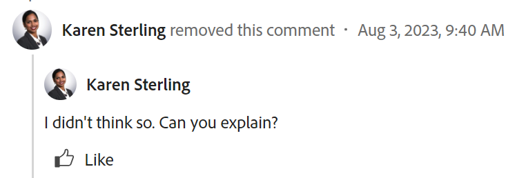

# Update der Arbeit

<!--take "Beta" references out when we remove the beta and change "current" to "legacy" after October 26-->

Die hervorgehobenen Informationen auf dieser Seite beziehen sich auf Funktionen, die noch nicht allgemein verfügbar sind. Sie ist nur in der Vorschau -Umgebung für alle Kunden verfügbar. Nach den monatlichen Versionen für die Produktion sind in der Produktionsumgebung dieselben Funktionen auch für Kunden verfügbar, die schnelle Versionen aktiviert haben. \
Informationen zu schnellen Versionen finden Sie unter [Schnelle Versionen für Ihre Organisation aktivieren oder deaktivieren](../../administration-and-setup/set-up-workfront/configure-system-defaults/enable-fast-release-process.md)

Weitere Informationen zum aktuellen Veröffentlichungsplan finden Sie unter [Übersicht über die Version 2023 im vierten Quartal](../../product-announcements/product-releases/23-q4-release-activity/23-q4-release-overview.md)

>[!IMPORTANT]
>
>Die Kommentarerfahrung in Adobe Workfront wird derzeit umgestaltet.
>Je nachdem, aus welcher Umgebung und welchen Objekten Sie auf das Kommentierungserlebnis zugreifen, werden im Abschnitt Updates möglicherweise unterschiedliche Funktionen angezeigt.
>
>Weitere Informationen über das neue Kommentierungserlebnis und dessen Verfügbarkeit finden Sie unter [Neues Kommentierungserlebnis](../../product-announcements/betas/new-commenting-experience-beta/unified-commenting-experience.md).
>
>Das neue Kommentarerlebnis ist nur für den Abschnitt Updates verfügbar und nicht für die folgenden Bereiche:
>
> * Startseite
> * Zusammenfassungsbereich in Listen
> * Zusammenfassungsbereich in Timesheets

<!-- with October 26 release: add somewhere this, and decide where we need to keep information about the legacy commenting. Should we create an article about iterations comments like we have for goals and cards?!:

>[!NOTE]
>
>Iterations display the legacy commenting experience.-->

<!--old message, before Auhust 17: 

>[!NOTE]
>
>We are currently redesigning the commenting experience in Adobe Workfront.
>
>For more information about the new commenting experience, see [New commenting experience](../../product-announcements/betas/new-commenting-experience-beta/unified-commenting-experience.md). 
>
>You can access the new experience for the following objects:
> * Issues, projects, tasks, and documents.
>
>     This is available when you enable the commenting Beta experience.
>
>     This functionality is available only for the Updates section, and it is not available for the following areas:
>
>     * Home
>     * Summary panel in lists
>     * Summary panel in timesheets
>
> * Goals, cards in the Boards area
>
>   The new commenting experience is the only experience for goals and cards. You must have an additional license to access Workfront Goals. For more information, see [Requirements to use Workfront Goals](../../workfront-goals/goal-management/access-needed-for-wf-goals.md). 
>
>     You can add and view updates to cards in the Boards area when you enable the Comments and System Activity sections on a card. For more information, see [Add an ad hoc card to a board](../../agile/get-started-with-boards/add-card-to-board.md).
-->

## Überlegungen zum Aktualisieren der Arbeit

* Sie können den meisten Objekten in Adobe Workfront im Abschnitt Updates Kommentare hinzufügen. Weitere Informationen dazu, welche Objekte den Abschnitt Aktualisierungen anzeigen, finden Sie unter [Übersicht über den Aktualisierungsabschnitt](../updating-work-items-and-viewing-updates/updates-tab-overview.md).

* Sie können Workfront-Objekten Kommentare aus anderen in Workfront integrierten Anwendungen oder aus der mobilen App Workfront hinzufügen.

  Nicht alle in Workfront integrierten Anwendungen können Workfront-Objekten Kommentare hinzufügen.

  Nicht alle Funktionen, die im Abschnitt &quot;Updates&quot;eines Objekts in Workfront verfügbar sind, sind in anderen Anwendungen verfügbar, wenn über die Anwendung auf Workfront-Objekte zugegriffen wird. Beispielsweise sind Rich-Text-Funktionen oder das private Einfügen eines Kommentars für ein Unternehmen möglicherweise nicht verfügbar, wenn einem Workfront-Objekt von einer Drittanbieteranwendung Kommentare hinzugefügt werden.

* Sie können während des Kommentars zum Objekt über den Fortschritt an einem Workfront-Objekt (Projekt, Aufgabe oder Problem) kommunizieren. Benutzer, die dem Objekt zugewiesen sind oder es abonniert haben, können eine Benachrichtigung über Ihre Aktualisierung erhalten. Jeder, der Zugriff auf das Objekt hat, kann Ihre Aktualisierung anzeigen.

* Sie können Benutzer taggen, um sie auf die Aktualisierung aufmerksam zu machen. Mit Tags versehene Benutzer erhalten eine In-App-Benachrichtigung und eine E-Mail über Ihre Aktualisierung.

  >[!TIP]
  >
  >   In der neuen Kommentarerfahrung werden die Eigentümer von Kommentaren automatisch mit Tags versehen. Weitere Informationen finden Sie unter [Tagging anderer Benutzer auf Updates](../../workfront-basics/updating-work-items-and-viewing-updates/tag-others-on-updates.md).
  <!--take the "in the new commenting experience" out when this is the only experience-->

* Sie können einem Objekt einen Kommentar hinzufügen, den Sie anzeigen können, oder Sie können sich als Workfront- oder Gruppenadministrator anmelden und einen Kommentar für einen anderen Benutzer hinzufügen. Weitere Informationen finden Sie unter [Melden Sie sich als anderer Benutzer an](../../administration-and-setup/add-users/create-and-manage-users/log-in-as-another-user.md).

* Sie können Projekte, Aufgaben und Probleme in den folgenden Bereichen von Workfront aktualisieren:

   * Von einem Workfront-Objekt im Abschnitt Updates
   * Im Startbereich (für Aufgaben und Probleme)
   * Über das Bedienfeld &quot;Zusammenfassung&quot;in einer Liste von Objekten oder aus einem Timesheet (für Aufgaben und Probleme)

Die Informationen auf dieser Seite beschreiben, wie Sie Kommentare zu Workfront-Objekten erstellen können und wie Sie Projekte, Aufgaben und Probleme aktualisieren.

Informationen zur Kommentarkommentierung zu Zielen finden Sie unter [Verwalten von Zielkommentaren in Adobe Workfront-Zielen](../../workfront-goals/goal-management/manage-goal-comments.md). Sie benötigen eine zusätzliche Lizenz für den Zugriff auf Workfront Goals.

Weitere Informationen zur Kommentierung von Karten im Bereich &quot;Pinnwände&quot;finden Sie unter [Hinzufügen einer Ad-hoc-Karte zu einer Pinnwand](../../agile/get-started-with-boards/add-card-to-board.md).

## Zugriffsanforderungen

<!--
drafted for P&P release:
<table style="table-layout:auto"> 
 <col> 
 </col> 
 <col> 
 </col> 
 <tbody> 
  <tr> 
   <td role="rowheader"><strong>Adobe Workfront plan*</strong></td> 
   <td> 
Any
 </td> 
  </tr> 
  <tr> 
   <td role="rowheader"><strong>Adobe Workfront license*</strong></td> 
   <td> 
Current license: Contributor or higher for issues and documents: Light or higher for all other objects
 
   Or
   
Legacy  license: Request or higher for issues and documents; Review or higher for all other objects

   </td> 
  </tr> 
  <tr> 
   <td role="rowheader"><strong>Access level configurations*</strong></td> 
   <td> 
View or Edit access for the object the update is on
 
<b>NOTE</b>
   
   If you still don't have access, ask your Workfront administrator if they set additional restrictions in your access level. For information on how a Workfront administrator can modify your access level, see <a href="../../administration-and-setup/add-users/configure-and-grant-access/create-modify-access-levels.md" class="MCXref xref">Create or modify custom access levels</a>.
 </td> 
  </tr> 
  <tr> 
   <td role="rowheader"><strong>Object permissions</strong></td> 
   <td> 
View access to the object
 
For information on requesting additional access, see <a href="../../workfront-basics/grant-and-request-access-to-objects/request-access.md" class="MCXref xref">Request access to objects </a>.
 </td> 
  </tr> 
 </tbody> 
</table>
-->
Sie müssen über folgenden Zugriff verfügen, um die Schritte in diesem Artikel ausführen zu können:

<table style="table-layout:auto"> 
 <col> 
 </col> 
 <col> 
 </col> 
 <tbody> 
  <tr> 
   <td role="rowheader"><strong>Adobe Workfront-Plan*</strong></td> 
   <td> 
Beliebig
 </td> 
  </tr> 
  <tr> 
   <td role="rowheader"><strong>Adobe Workfront-Lizenz*</strong></td> 
   <td> 
Anfrage oder höher für Probleme und Dokumente; Überprüfung oder höher für alle anderen Objekte
 </td> 
  </tr> 
  <tr> 
   <td role="rowheader"><strong>Konfigurationen auf Zugriffsebene*</strong></td> 
   <td> 
Anzeigen oder Bearbeiten des Zugriffs für das Objekt, auf dem die Aktualisierung ausgeführt wird
 
<b>NOTIZ</b>

Wenn Sie immer noch keinen Zugriff haben, fragen Sie Ihren Workfront-Administrator, ob er zusätzliche Zugriffsbeschränkungen für Ihre Zugriffsebene festlegt. Informationen dazu, wie ein Workfront-Administrator Ihre Zugriffsebene ändern kann, finden Sie unter <a href="../../administration-and-setup/add-users/configure-and-grant-access/create-modify-access-levels.md" class="MCXref xref">Benutzerdefinierte Zugriffsebenen erstellen oder ändern</a>.
 </td>
</tr> 
  <tr> 
   <td role="rowheader"><strong>Objektberechtigungen</strong></td> 
   <td> 
Zugriff auf das Objekt anzeigen
 
Informationen zum Anfordern von zusätzlichem Zugriff finden Sie unter <a href="../../workfront-basics/grant-and-request-access-to-objects/request-access.md" class="MCXref xref">Zugriff auf Objekte anfordern </a>.
 </td> 
  </tr> 
 </tbody> 
</table>

&#42;Wenden Sie sich an Ihren Workfront-Administrator, um zu erfahren, welchen Plan, welchen Lizenztyp oder welchen Zugriff Sie haben.

## Hinzufügen einer Aktualisierung zu einem Arbeitselement

Das Hinzufügen eines Updates zu einem Arbeitselement hängt von der Version des Abschnitts Updates und dem ausgewählten Objekt ab.

### Hinzufügen eines Updates zu einem Arbeitselement im Abschnitt &quot;Aktuelle Updates&quot;

<!--on October 26, replace "current" with "legacy"-->

>[!NOTE]
>
>Die folgende Funktion ist für alle Objekte mit Ausnahme von Zielen und Karten verfügbar. Sie benötigen eine zusätzliche Lizenz für den Zugriff auf Workfront Goals. Informationen zur Kommentarkommentierung zu Zielen finden Sie unter [Verwalten von Zielkommentaren in Adobe Workfront-Zielen](../../workfront-goals/goal-management/manage-goal-comments.md).
>
>Sie können Karten im Bereich &quot;Pinnwände&quot;um Aktualisierungen ergänzen und anzeigen, wenn Sie die Abschnitte &quot;Kommentare&quot;und &quot;Systemaktivität&quot;auf einer Karte aktivieren. Weitere Informationen finden Sie unter [Hinzufügen einer Ad-hoc-Karte zu einer Pinnwand](../../agile/get-started-with-boards/add-card-to-board.md).

1. Gehen Sie zu dem Arbeitselement, für das Sie eine Aktualisierung bereitstellen möchten (z. B. ein Projekt, eine Aufgabe oder ein Problem).
1. Klicken Sie auf **Updates** Abschnitt.
1. Klicks **Neue Aktualisierung starten,** Geben Sie dann Ihr Update ein.
1. (Optional) Verwenden Sie Rich Text oder fügen Sie Emojis, Links oder Bilder zu Ihrer Aktualisierung hinzu, um Ihre Inhalte zu verbessern. Weitere Informationen finden Sie unter [Verwenden von Rich Text in einem Workfront-Update](#use-rich-text-in-a-workfront-update) in diesem Artikel beschrieben.
1. (Optional) Aktualisieren Sie eine der folgenden Informationen zum Arbeitselement:

   <table style="table-layout:auto"> 
    <col> 
    <col> 
    <tbody> 
     <tr> 
      <td role="rowheader"><strong>Benachrichtigen</strong></td> 
      <td>Identifizieren Sie Benutzer, die über die Aktualisierung benachrichtigt werden müssen. Benutzer, die dem Objekt zugewiesen sind oder es abonniert haben, erhalten bei einer Aktualisierung automatisch eine Benachrichtigung. 
Informationen dazu, wie Sie andere in eine Aktualisierung einbeziehen, finden Sie unter <a href="../../workfront-basics/updating-work-items-and-viewing-updates/tag-others-on-updates.md" class="MCXref xref">Tagging anderer Benutzer auf Updates</a>.
</td> 
     </tr> 
     <tr> 
      <td role="rowheader"><strong>Verpflichtungsdatum</strong></td> 
      <td>Wählen Sie in der Datumsauswahl das Datum aus, an dem Sie das Arbeitselement abschließen möchten. Weitere Informationen zum Übermittlungsdatum finden Sie unter <a href="../../manage-work/projects/updating-work-in-a-project/overview-of-commit-dates.md" class="MCXref xref">Datum bestätigen - Übersicht</a>.</td> 
     </tr> 
     <tr> 
      <td role="rowheader"><strong>Bedingung</strong></td> 
      <td>Wählen Sie eine neue Bedingung für die Aufgabe oder das Problem aus. Informationen zum Auswählen einer Bedingung finden Sie unter <a href="../../manage-work/projects/updating-work-in-a-project/update-condition-for-tasks-and-issues.md" class="MCXref xref">Aktualisierungsbedingung für Aufgaben und Probleme</a>.</td> 
     </tr> 
     <tr> 
      <td role="rowheader"><strong>Status</strong></td> 
      <td>Klicken Sie auf den Pfeil neben dem aktuellen Status und wählen Sie dann im Dropdown-Menü den gewünschten Status aus. Weitere Informationen zum Festlegen eines Status finden Sie unter <a href="../../manage-work/projects/updating-work-in-a-project/update-task-status.md" class="MCXref xref">Aktualisierung des Aufgabenstatus</a>.
Beim Aktualisieren des Status eines Arbeitselements wird der Status eines Projekts nicht automatisch geändert. Je nachdem, wie Ihr Projekt eingerichtet ist, können Sie den Projektstatus separat aktualisieren. Weitere Informationen zu den verschiedenen Aktualisierungstypen finden Sie unter <a href="../../manage-work/projects/manage-projects/select-project-update-type.md" class="MCXref xref">Wählen Sie den Projektaktualisierungstyp aus </a>.

<b>NOTIZ</b>

   Sie können den Status eines Arbeitselements nicht ändern, während es sich im Status Ausstehende Genehmigung befindet.
</td>
   </tr> 
     <tr> 
      <td role="rowheader"><strong>Abschlussleiste</strong></td> 
      <td>(Nur für Aufgaben verfügbar) Geben Sie den Prozentsatz der abgeschlossenen Arbeiten an, indem Sie den Fortschrittsbalken auf den gewünschten Prozentsatz verschieben. Sie können auch auf die Abschlussleiste doppelklicken und den Prozentsatz eingeben, der abgeschlossen ist.</td> 
     </tr> 
     <tr> 
      <td role="rowheader"><strong>Vertraulich für meine Firma</strong></td> 
      <td> 
Deaktivieren Sie diese Option, um zu verhindern, dass Benutzer außerhalb Ihres Unternehmens Zugriff auf diese Aktualisierung haben.
 
      
<b>NOTIZ</b>

      
Diese Option wird nur angezeigt, wenn der Benutzer mit einem Unternehmen verknüpft ist.

      
Diese Option ist nicht in allen Bereichen verfügbar, aus denen Sie Aktualisierungen hinzufügen können. Dies ist beispielsweise nicht in Drittanbieteranwendungen verfügbar, aus denen Sie Aktualisierungen hinzufügen können. 

      </td> 
     </tr> 
    </tbody> 
   </table>

1. Klicks **Aktualisieren** , um die Aktualisierung zum Workfront-Objekt hinzuzufügen.

   >[!NOTE]
   >
   >Nach dem Klicken auf wird ein kleines Popup-Fenster für sieben Sekunden angezeigt **Aktualisieren**, sodass Sie die Aktualisierung rückgängig machen und zum Bearbeitungsbereich zurückkehren können, bevor die Aktualisierung veröffentlicht wird. Das Update wird veröffentlicht, wenn Sie das Popup &quot;Rückgängig&quot;schließen, warten, bis es ausgeblendet wird, oder von der Seite weg navigieren.
   >
   >Wenn Ihr Workfront-Administrator in Ihrer Zugriffsebene die Einstellung &quot;Benutzer dürfen Kommentare nie löschen&quot;auswählt, können Sie einen Kommentar nicht rückgängig machen. Weitere Informationen finden Sie unter [Benutzerdefinierte Zugriffsebenen erstellen und ändern](../../administration-and-setup/add-users/configure-and-grant-access/create-modify-access-levels.md).

1. Informationen zum Antworten auf eine Aktualisierung finden Sie unter [Antworten auf Aktualisierungen](../../workfront-basics/updating-work-items-and-viewing-updates/reply-to-updates.md).

### Hinzufügen einer Aktualisierung zu einem Arbeitselement mithilfe des neuen Kommentierungserlebnisses

Informationen darüber, welche Funktionen für das neue Kommentierungserlebnis verfügbar sind und welche Objekte verfügbar sind, finden Sie unter [Neues Kommentierungserlebnis](../../product-announcements/betas/new-commenting-experience-beta/unified-commenting-experience.md).

1. Suchen Sie das Objekt, das Sie aktualisieren möchten, und klicken Sie dann auf seinen Namen, um die Seite des Objekts zu öffnen.
1. Klicks  **Updates** im linken Bereich.

   Die **Kommentare** ist standardmäßig ausgewählt.
1. Beginnen Sie mit der Eingabe eines Kommentars im **Neuer Kommentar** ankreuzen.

   

   >[!TIP]
   >
   >Wenn Sie den Abschnitt Updates verlassen, bevor Sie mit der Eingabe und dem Senden eines Kommentars fertig sind, bleibt der Kommentar auf der Seite im Entwurfsmodus, auch wenn Sie sich abmelden und wieder anmelden. Bilder, die dem Kommentar hinzugefügt werden, werden ebenfalls im Entwurf gespeichert. Entwürfe werden sieben Tage lang gespeichert und können nicht wiederhergestellt werden. Entworfene Kommentare sind nur für den Benutzer sichtbar, der sie eingibt.

1. (Optional) Verwenden Sie die folgenden Tastaturbefehle, um eine Änderung rückgängig zu machen oder wiederherzustellen:
   * STRG + Z ( ⌘ + z für Mac) zum Rückgängigmachen einer Änderung
   * STRG + Y ( ⌘ + y für Mac) zum Wiederholen einer Änderung
1. (Optional) Im **Personen oder Teams taggen** eingeben, den Namen oder die E-Mail-Adresse eines Benutzers oder eines Teams eingeben, das Sie in diesen Kommentar aufnehmen möchten, und ihn dann auswählen, wenn er in der Liste angezeigt wird.
1. (Optional) Verwenden Sie Rich Text oder fügen Sie Emojis, Links oder Bilder zu Ihrer Aktualisierung hinzu, um Ihre Inhalte zu verbessern. Weitere Informationen finden Sie unter [Verwenden von Rich Text in einem Workfront-Update](#use-rich-text-in-a-workfront-update) in diesem Artikel beschrieben.

   >[!TIP]
   >
   >Wenn ein anderer Benutzer einen Kommentar für dasselbe Element sendet, das Sie aktualisieren, wird eine rote Zeile mit der Anzeige &quot;Neu&quot;angezeigt, die Sie über die neueren Kommentare informiert.
   >
   >Der Indikator wird erst angezeigt, nachdem der Kommentar zum Element gesendet wurde, und nicht, wenn der Kommentar noch erstellt wurde.
   >
   >Der Indikator &quot;Neu&quot;wird nur angezeigt, wenn sowohl der Benutzer, der ein neues Update eingegeben hat, als auch der Benutzer, der derzeit ein Update aufruft, das neue Kommentarerlebnis verwenden.
   >

1. Klicks **Einsenden** , um die Aktualisierung zum Workfront-Objekt hinzuzufügen.
1. (Optional) Um einen Kommentar zu bearbeiten, klicken Sie auf die **Mehr** Menü   in der oberen rechten Ecke des KommentarsKlicken Sie auf **Bearbeiten**.
1. Bearbeiten Sie die Informationen im Kommentar, fügen Sie Bilder hinzu oder entfernen Sie sie oder einen der getaggten Benutzer.
Sie können Ihren Kommentar innerhalb von 15 Jahren nach seiner Übermittlung bearbeiten. Links neben dem Datumsstempel, der bei der Eingabe des Kommentars angezeigt wird, wird die Anzeige &quot;Bearbeitet&quot;hinzugefügt.

   

   >[!TIP]
   >
   >* Es wird eine E-Mail erzeugt, um die Benutzer nur dann über Ihre Aktualisierung zu informieren, wenn Sie die ursprüngliche Aktualisierung übermitteln. Nach Bearbeitung des Updates wird keine E-Mail erzeugt.
   >* Der Datumsstempel neben dem Kommentar ist das Datum des ursprünglichen Kommentars und nicht das Datum der letzten Bearbeitung.
   >* Kommentare aus dem aktuellen Jahr zeigen das Jahr nicht im Datumsstempel an. Wenn Sie den Mauszeiger über einen Zeitstempel bewegen, wird das vollständige Datum einschließlich des Jahres angezeigt.

1. (Optional) Klicken Sie auf **Antwort** um auf einen vorhandenen Kommentar zu antworten, folgen Sie dann den Schritten 4 bis 8 oben. <!--(**************insure this stays accurate***********)--> Informationen zur Beantwortung einer Aktualisierung finden Sie unter [Antworten auf Aktualisierungen](../../workfront-basics/updating-work-items-and-viewing-updates/reply-to-updates.md).

   >[!TIP]
   >
   >   Um weitere Antworten auf eine vorhandene Antwort hinzuzufügen, können Sie die Variable **Antwort hinzufügen...** oder klicken Sie **Antwort** zum ursprünglichen Kommentar. Ihre Antwort wird am Ende des Threads hinzugefügt.

1. (Bedingt und optional) Wenn andere Benutzer Kommentare hinzugefügt haben, die außerhalb des sichtbaren Bereichs im Abschnitt Updates angezeigt werden, klicken Sie auf **Ansicht** in Blau **neues Kommentarbanner** unten auf dem Bildschirm, um diese Kommentare anzuzeigen.

   

   Weitere Kommentare werden unten auf dem Bildschirm angezeigt.

   >[!NOTE]
   >
   >   Die Anzeige &quot;neue Kommentare&quot;und die Schaltfläche &quot;Anzeigen&quot;werden nur dann angezeigt, wenn sowohl die Benutzer, die die neuen Updates eingegeben haben, als auch der Benutzer, der sich derzeit den Abschnitt Updates ansieht, das neue Kommentierungserlebnis verwenden.

1. (Optional) Klicken Sie auf die **liken** icon. Das Symbol wird mit der Anzahl der &quot;Gefällt mir&quot;-Klicks aktualisiert.
1. (Bedingt und Optional) Wenn Sie Ihrem Kommentar weitere Personen hinzugefügt haben, klicken Sie auf die Anzahl der Mitglieder, die in der Aktualisierung enthalten sind, um eine Liste der Entitäten anzuzeigen, für die der Kommentar, den Sie eingegeben haben, freigegeben ist.

   

   >[!TIP]
   >
   >   Neben den Avataren werden die Namen der ersten beiden getaggten Entitäten angezeigt. Wenn mehr als zwei Entitäten mit Tags versehen sind, werden nur der Name des ersten und die Anzahl der zusätzlichen Entitäten angezeigt.

1. (Optional) Klicken Sie auf die **Systemaktivität** -Tab, um vom System protokollierte Aktualisierungen anzuzeigen. Wenn das Objekt oder seine untergeordneten Elemente aktualisiert werden, generiert Workfront einen Hinweis zu dieser Aktualisierung und zeigt sie auf der Registerkarte Systemaktivität an.

   Weitere Informationen finden Sie unter [Übersicht über den Aktualisierungsabschnitt](../updating-work-items-and-viewing-updates/updates-tab-overview.md)

   >[!TIP]
   >
   >Sie können einem Systemupdate keinen Kommentar hinzufügen.

## Verwenden von Rich Text in einem Workfront-Update{#use-rich-text-in-a-workfront-update}

<!--October 2023: remove this top note when we get to parity with the current version, OR change the note to mention that some options are ONLY available in the Beta version and not the current one.-->

>[!NOTE]
>
>Einige der Optionen in der Rich-Text-Symbolleiste stehen für das neue Kommentierungserlebnis möglicherweise nicht zur Verfügung.

Sie können Ihre Aktualisierungen durch Verwendung von Rich Text oder durch Hinzufügen verschiedener Elemente wie Emojis, Links oder Bilder verbessern.

1. Navigieren Sie zu **Updates** Bereich eines Workfront-Objekts erstellen und mit der Eingabe eines Kommentars beginnen.
1. (Optional) Um Ihrer Aktualisierung Rich-Text-Formatierung hinzuzufügen, verwenden Sie beliebige Attribute für die **Rich-Text** Symbolleiste bei der Eingabe.

   

   <!--October 2023: the individual icons in the toolbar will need replacing-->

   | **Attribut** | **Symbolleiste** | **Tastaturbefehle für Mac** | **Windows-Tastaturbefehle** |
   |---|---|---|---|
   | Fett |  | η+b | Strg+B |
   | kursiv |  | Befehl+i | Strg+I |
   | Unterstreichen |  | η+u | Strg+U |
   | Hyperlink |  |  So öffnen Sie das Feld Verknüpfungen erstellen oder Links hinzufügen: SUMME+K   So fügen Sie in der Beta-Version mit Kommentaren einen Link über den ausgewählten Text ein: Slovenské+V  |  So öffnen Sie das Feld Links erstellen oder Links hinzufügen: Strg+K   So fügen Sie in der Beta-Version mit Kommentaren einen Link über den ausgewählten Text ein: Strg+V  |
   | Aufzählung |  | η+Shift+8 | Strg+Umschalt+8 |
   | Nummerierte Liste |  | η+Shift+7 | Strg+Umschalt+7 |
   | Blockzitat |  | η+Shift+9 | Strg+Umschalt+9 |

   Um die Textformatierung zu beenden, deaktivieren Sie das -Attribut auf der **Rich-Text** Symbolleiste.

   <!-- in the table above: take "Create Links" verbiage from the hyperlink when the old commenting is removed and the commenting beta is the only way to comment - with October 2023-->

   >[!NOTE]
   >
   >* Die Formatierung wird auch in allen E-Mail-Benachrichtigungen angezeigt, die Benutzer mit Ihrer Aktualisierung erhalten.
   >* Die Rich-Text-Formatierung, die auf eine Aktualisierung in einer E-Mail angewendet wird, wird in der Aktualisierung nicht angezeigt, wenn sie auf der Registerkarte Aktualisierungen angezeigt wird.
   >* Wenn Ihr Unternehmen Workfront mit Internet Explorer verwendet, verliert jeder formatierte Text, der in eine Aktualisierung eingefügt wird, seine Rich-Text-Formatierung und wird als Nur-Text angezeigt. Sie können den Text mithilfe der Attribute in der Rich-Text-Symbolleiste neu formatieren.
   >* Die Rich-Text-Formatierung ist nicht für Aktualisierungen verfügbar, die im Bereich &quot;Timesheets&quot;vorgenommen werden, oder für die Objekte &quot;Hinweis&quot;und &quot;Letzte Bedingung&quot;in einem Bericht.

1. (Optional) Wenn Sie Text aus früheren Aktualisierungen oder aus anderen Quellen einbeziehen und von Ihrer eigenen Aktualisierung unterscheiden möchten, können Sie ihn als Blockzitat markieren. Klicken Sie auf **Blockierungsangebot** icon  und geben Sie den Text ein, den Sie zitieren möchten. Der zitierte Text wird mit einer vertikalen grauen Linie markiert. Klicken Sie auf **Blockierungsangebot** erneut ein, um zur normalen Formatierung zurückzukehren.

   

1. (Optional) Fügen Sie Ihrem Update Emojis hinzu.

   >[!NOTE]
   >
   >* Workfront ersetzt keine Interpunktions-Emoticons wie :) durch Emojis.
   >* Für die in einem Bericht angezeigten Objekte &quot;Notiz&quot;und &quot;Letzte Bedingung&quot;sind keine Emojis verfügbar.
   >* Die Emoji-Funktion in Workfront verwendet Unicode-Zeichen und wird daher nur auf Browsern und Betriebssystemen angezeigt, die Unicode-Codepunkte unterstützen. Benutzer auf einer Plattform, einem Browser oder einer Betriebssystemversion, die nicht Ihre ist, haben möglicherweise keinen Zugriff auf dieselben Emojis.
   >* Ein nicht unterstütztes Emoji wird durch eine schwarze oder weiße Box dargestellt.
   >* Windows 7 unterstützt nur Schwarzweiß-Emojis.
   >* Emojis, die auf eine per E-Mail vorgenommene Aktualisierung angewendet werden, werden nicht in der Aktualisierung angezeigt, wenn sie im Bereich Updates angezeigt werden.

1. (Optional) So fügen Sie einen URL-Link zu zusätzlichen Informationsquellen hinzu:

   1. Klicken Sie in der Aktualisierung auf die Stelle, an der Sie einen Link einfügen möchten.
   1. Im **Rich-Text** Symbolleiste, klicken Sie auf **Hyperlink** icon .

   1. Im **Link erstellen** Feld, das unter **URL**, geben Sie die URL der Quelle ein oder fügen Sie sie ein.

   1. under **Anzuzeigender Text**, geben Sie den Link-Text ein oder fügen Sie ihn ein.
   1. Klicken Sie auf **Speichern**.

1. (Optional) Um ein Bild an Ihre Aktualisierung anzuhängen, führen Sie je nach verwendeter Umgebung einen der folgenden Schritte aus:

   * Klicken Sie auf **Bild** icon  und navigieren Sie zum Bild auf Ihrem Computer oder ziehen Sie das Bild in den Aktualisierungsbereich, wenn Sie das aktuelle Aktualisierungserlebnis verwenden.

   Oder

   Klicken Sie auf **Anlage hinzufügen** icon  und suchen Sie nach dem Bild auf Ihrem Computer, wenn Sie die neue Kommentarfunktion verwenden. <!--**************** the tooltip of this icon might be renamed to "Add image")--> <!--in October 26 - leave this as the only icon instead of the OR option-->

   >[!NOTE]
   >
   >* Der Workfront-Administrator muss das Hinzufügen von Bildern im Abschnitt &quot;Voreinstellungen für Feeds aktualisieren&quot;der Workfront-Benutzeroberfläche aktivieren, bevor die Symbole Bild oder Anhang hinzufügen angezeigt werden. Weitere Informationen finden Sie unter [Voreinstellungen für Benutzeraktualisierungen konfigurieren](../../administration-and-setup/set-up-workfront/system-tracked-update-feeds/configure-preferences-user-updates.md).
   >* Die maximale Bilddateigröße beträgt 7 MB. Unterstützte Bilddateitypen sind .jpg, .gif und .png.
   >* Auf Bilder kann über den Abschnitt Aktualisierungen eines Objekts zugegriffen werden. Sie sind auch im Bereich Dokumente verfügbar.
   >* Sie können ein Update mit einem Bild und ohne Text senden.
   >* Wenn Sie einen Kommentar löschen, der ein Bild enthält, gibt es je nach ausgewähltem Erlebnis die folgenden Szenarien:
   >
   >     * Im aktuellen Kommentar-Erlebnis bleibt das Bild im Bereich Dokumente , ist jedoch nicht mehr im Abschnitt Aktualisierungen sichtbar.
   >     * Im neuen Kommentarerlebnis wird das Bild sowohl aus dem Abschnitt Updates als auch aus dem Bereich Dokumente entfernt. Das Bild wird auch aus dem Bereich &quot;Dokumente&quot;gelöscht, wenn Sie einen Kommentar bearbeiten und das Bild löschen.
   >* Wenn jemand ein Bild löscht, das mit einem Kommentar verknüpft ist, wird es auch aus dem Kommentar entfernt.

1. Klicks **Aktualisieren**  oder **Einsenden**, wenn Sie das Beta-Kommentarerlebnis verwenden.

## Aktualisierte Informationen kopieren

Es gibt mehrere Möglichkeiten, ein Update zu kopieren. Nachdem Sie einen Link kopiert haben, können Sie ihn für andere freigeben, um ihn zur Aktualisierung weiterzuleiten.

Das Kopieren eines Updates hängt davon ab, welches Kommentierungserlebnis Sie verwenden.

### Kopieren einer Aktualisierung im aktuellen Kommentierungserlebnis

<!--October 26 - replace current with legacy-->

* [Aktualisieren kopieren](#copy-the-update)
* [Den Thread-Link kopieren](#copy-the-thread-link)
* [Aktualisierungslink kopieren](#copy-the-update-link)

#### Aktualisieren kopieren {#copy-the-update}

Mit dieser Option wird der Text von einem bestimmten Update in die Zwischenablage kopiert.

1. Gehen Sie zu der Aktualisierung oder Antwort, die Sie kopieren möchten.
1. Klicken Sie auf **Mehr** Menü und klicken Sie auf **Textkörper kopieren**.

   

#### Den Thread-Link kopieren {#copy-the-thread-link}

Mit dieser Option wird der vollständige Thread-Link in die Zwischenablage kopiert, damit Sie den Thread für andere Benutzer freigeben können.

1. Gehen Sie zum Aktualisierungs-Thread, den Sie kopieren möchten.

1. Klicken Sie auf **Mehr** Menü und klicken Sie auf **Link zum Kopieren des Threads**.

   

#### Aktualisierungslink kopieren {#copy-the-update-link}

Mit dieser Option wird ein bestimmter Aktualisierungslink in die Zwischenablage kopiert. Wenn Sie den Aktualisierungslink freigeben, sieht der Benutzer, der darauf folgt, einen Rahmen um die Aktualisierung.

1. Gehen Sie zu der Aktualisierung oder Antwort, die Sie kopieren möchten.
1. Klicken Sie auf **Mehr** Menü neben der einzelnen Aktualisierung und klicken Sie auf **Link zum Aktualisieren kopieren**.

   

### Kopieren von Aktualisierungen im neuen Kommentierungserlebnis

Informationen darüber, welche Funktionen für das neue Kommentierungserlebnis verfügbar sind und welche Objekte verfügbar sind, finden Sie unter [Neues Kommentierungserlebnis](../../product-announcements/betas/new-commenting-experience-beta/unified-commenting-experience.md).

<!--when we remove and deprecate the legacy stream, add screen shots in the sections below- October 2023-->

* [Link kopieren](#copy-link)
* [Fließtext kopieren](#copy-body-text)

#### Link kopieren

Diese Option kopiert den Kommentar- oder Thread-Link in die Zwischenablage, damit Sie den Kommentar oder den gesamten Thread für andere Benutzer freigeben können.

1. Gehen Sie zu der Aktualisierung, deren Link Sie kopieren möchten.

1. Klicken Sie auf **Mehr** Menü und klicken Sie auf **Link kopieren**.

#### Fließtext kopieren

Mit dieser Option wird der Text von einem bestimmten Update in die Zwischenablage kopiert.

1. Gehen Sie zu der Aktualisierung oder Antwort, die Sie kopieren möchten.
1. Klicken Sie auf **Mehr** Menü und klicken Sie auf **Textkörper kopieren**.

## Aktualisieren oder Antworten löschen

Je nachdem, welchen Zugriff Ihr Workfront-Administrator Ihnen gewährt, können Sie möglicherweise Aktualisierungen löschen, die Sie auf der Registerkarte Updates eines Objekts hinzugefügt haben. Weitere Informationen finden Sie unter [Benutzerdefinierte Zugriffsebenen erstellen oder ändern](../../administration-and-setup/add-users/configure-and-grant-access/create-modify-access-levels.md#creating-a-new-access-from-scratch) im Artikel [Benutzerdefinierte Zugriffsebenen erstellen oder ändern](../../administration-and-setup/add-users/configure-and-grant-access/create-modify-access-levels.md).

Kein Workfront-Benutzer (einschließlich Workfront-Administrator) kann Aktualisierungen löschen, die von einem anderen Benutzer vorgenommen wurden. Wenn die Zugriffsebene eines Benutzers es ihm jedoch ermöglicht, eigene Aktualisierungen zu löschen, kann sich der Workfront-Administrator als dieser Benutzer anmelden und die vorgenommenen Aktualisierungen löschen. Weitere Informationen finden Sie unter [Benutzerdefinierte Zugriffsebenen erstellen oder ändern](../../administration-and-setup/add-users/configure-and-grant-access/create-modify-access-levels.md#creating-a-new-access-from-scratch) und [Melden Sie sich als anderer Benutzer an](../../administration-and-setup/add-users/create-and-manage-users/log-in-as-another-user.md).

1. Gehen Sie zu dem Update oder der Antwort, das/die Sie löschen möchten.
1. Klicken Sie auf **Mehr** neben der Aktualisierung oder Antwort, die Sie löschen möchten, klicken Sie auf **Löschen**. <!--October 2023 - replace screen shot here-->

   

1. Klicken Sie in der angezeigten Nachricht auf **Bestätigen** oder klicken Sie **Löschen**, wenn Sie das Beta-Kommentarerlebnis verwenden.

   >[!NOTE]
   >
   >Wenn Sie eine Aktualisierung mit einem angehängten Bild löschen, werden sowohl der Kommentar als auch das Bild gelöscht. Weitere Informationen finden Sie unter [Verwenden von Rich Text in einem Workfront-Update](#use-rich-text-in-a-workfront-update) in diesem Artikel beschrieben.

   Wenn dem Kommentar, den Sie löschen, Antworten zugeordnet sind, gibt es einen Hinweis darauf, dass der Kommentar mit dem Namen des Benutzers entfernt wurde, der ihn entfernt hat.

   

   Bei Verwendung des Beta-Kommentarerlebnisses werden gelöschte Kommentare sofort aus Workfront entfernt. Ein Benutzer, der den Abschnitt Updates verwendet, sieht, dass ein Kommentar von einem anderen Benutzer in Echtzeit gelöscht wird.

   <!--when we remove the beta, take out the first part of the sentence above about only when commenting in beta experience. Leave the rest though-->

<!--this is no longer needed - adding timesheet comments is just like adding comments to any other object now

## Add an update on a Timesheet

1. Go to a Timesheet on which you want to make an update.
1. Click the Timesheet to open it.
1. At the bottom of the Timesheet, click **Include a comment**.
1. In the box that displays at the bottom of the Timesheet, type an update.

   

1. (Conditional) To save your update without submitting the Timesheet for approval, click **Save for Later**.

   Or

   To save your update and submit the Timesheet for approval, click **Submit for Approval**.

   Or

   If your Timesheet is not set up with an approver, click **Save and Close Timesheet** to save your update.

-->

## Systemaktualisierungen aktivieren oder deaktivieren

<!--October 2023: remove the whole section because this is no longer possible -->

<!--October 2023: when the new stream goes to all objects production, consider updating this article also, to say there is no System Activity tab to be disabled for objects anymore: help\quicksilver\administration-and-setup\set-up-workfront\system-tracked-update-feeds\system-tracked-update-feeds.md-->

>[!NOTE]
>
>Es ist nicht möglich, Systemaktualisierungen zu deaktivieren, wenn die neue Kommentarfunktion verwendet wird.
>Die Informationen in diesem Abschnitt beziehen sich nur auf die im Abschnitt &quot;Aktuelle Updates&quot;verfügbaren Funktionen. <!--October 26: replace current with legacy-->
>Weitere Informationen zu Systemaktualisierungen in der Beta-Version finden Sie unter [Übersicht über den Aktualisierungsabschnitt](../updating-work-items-and-viewing-updates/updates-tab-overview.md).

Im Abschnitt Updates für ein Workfront-Objekt werden zwei Arten von Informationen angezeigt:

* **Benutzeraktualisierungen:** Benutzeraktualisierungen sind Kommentare, die Sie und andere Benutzer in Ihrem System eingeben. <!--October 2023 - new screen shot -->

  

* **Systemaktualisierungen:** Das System aktualisiert den Datensatz zum Entfernen von Assets, zum Hinzufügen oder Löschen von Versionen, zum Anhängen oder Entfernen einer Genehmigungsanfrage sowie alle Änderungen oder Änderungen, die an den Dokumenten am Objekt vorgenommen wurden. <!--October 2023 - new screen shot -->

  

  Abhängig von Ihrer Workfront-Lizenz sind Systemaktualisierungen möglicherweise standardmäßig aktiviert. Workfront-Administratoren können bestimmen, was in Systemaktualisierungen verfolgt wird, wie unter [Vom System getrackte Aktualisierungen](../../administration-and-setup/set-up-workfront/system-tracked-update-feeds/system-tracked-update-feeds.md). Sie können auch Systemaktualisierungen oder Aktivitäten herausfiltern, sodass nur Benutzeraktualisierungen für alle Objekte angezeigt werden.

  Die folgenden Objekte verfügen nicht über systemgenerierte Aktualisierungen:

   * Team
   * Vorlage
   * Vorlagenaufgabe

So aktivieren oder deaktivieren Sie Systemaktualisierungen:

1. Klicken Sie auf **Updates** -Registerkarte auf einem Objekt.
1. Klicks **Systemaktualisierungen anzeigen** zum Schieben des Switches nach links (deaktiviert) oder rechts (aktiviert).

   

   Diese Option ist für alle Objekte in Workfront persistent und bleibt an der von Ihnen ausgewählten Position, auch wenn Sie sich von Workfront abmelden.

   >[!TIP]
   >
   >   Objekte, die keine Systemaktualisierungen aufzeichnen, haben nicht die Option Systemaktualisierungen anzeigen in ihrem Aktualisierungsbereich.

   <!--when Anna adds the new updates stream to ALL objects, she will remove the System Activity tab from the objects that don't record system updates - add another line to the TIP above to say: The System Activity tab is not available for objects that don't record system-generated updates.*************** OR: maybe make this part of the statement where we list which objects these are, above???  -->

