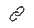

# Update der Arbeit

Sie können ein Update für ein Adobe Workfront-Objekt (Projekt, Aufgabe oder Problem) hinzufügen, um über den Fortschritt des Objekts zu kommunizieren. Benutzer, die dem Objekt zugewiesen sind oder es abonniert haben, können Ihre Aktualisierung anzeigen. Sie können Benutzer auch mit Tags versehen, um sie auf die Aktualisierung aufmerksam zu machen.

Sie können einem Objekt aus den folgenden Bereichen von Workfront Aktualisierungen hinzufügen:

* Von einem Workfront-Objekt im Abschnitt Updates
* Im Startbereich (für Aufgaben und Probleme)
* Im Bereich &quot;Zusammenfassung&quot;in einer Liste von Objekten (für Aufgaben und Probleme)
* Aus dem Timesheet (für Aufgaben und Probleme)

## Zugriffsanforderungen

Sie müssen über folgenden Zugriff verfügen, um die Schritte in diesem Artikel ausführen zu können:

<table style="table-layout:auto"> 
 <col> 
 </col> 
 <col> 
 </col> 
 <tbody> 
  <tr> 
   <td role="rowheader"><strong>Adobe Workfront-Plan*</strong></td> 
   <td> 
Beliebig
 </td> 
  </tr> 
  <tr> 
   <td role="rowheader"><strong>Adobe Workfront-Lizenz*</strong></td> 
   <td> 
Anfrage oder höher für Probleme und Dokumente; Überprüfen oder höher für alle anderen Objekte
 </td> 
  </tr> 
  <tr> 
   <td role="rowheader"><strong>Konfigurationen auf Zugriffsebene*</strong></td> 
   <td> 
Anzeigen oder Bearbeiten des Zugriffs für das Objekt, auf dem die Aktualisierung ausgeführt wird
 
<b>NOTIZ</b>

Wenn Sie immer noch keinen Zugriff haben, fragen Sie Ihren Workfront-Administrator, ob er zusätzliche Zugriffsbeschränkungen für Ihre Zugriffsebene festlegt. Informationen dazu, wie ein Workfront-Administrator Ihre Zugriffsebene ändern kann, finden Sie unter <a href="../../administration-and-setup/add-users/configure-and-grant-access/create-modify-access-levels.md" class="MCXref xref">Benutzerdefinierte Zugriffsebenen erstellen oder ändern</a>.
 </td>
</tr> 
  <tr> 
   <td role="rowheader"><strong>Objektberechtigungen</strong></td> 
   <td> 
Zugriff auf das Objekt anzeigen
 
Informationen zum Anfordern von zusätzlichem Zugriff finden Sie unter <a href="../../workfront-basics/grant-and-request-access-to-objects/request-access.md" class="MCXref xref">Zugriff auf Objekte anfordern </a>.
 </td> 
  </tr> 
 </tbody> 
</table>

&#42;Wenden Sie sich an Ihren Workfront-Administrator, um zu erfahren, welchen Plan, welchen Lizenztyp oder welchen Zugriff Sie haben.

## Hinzufügen einer Aktualisierung zu einem Arbeitselement

1. Gehen Sie zu dem Arbeitselement, für das Sie eine Aktualisierung bereitstellen möchten (z. B. ein Projekt, eine Aufgabe oder ein Problem).
1. Klicken Sie auf **Updates** Abschnitt.
1. Klicken **Neue Aktualisierung starten,** Geben Sie dann Ihr Update ein.

1. (Optional) Um Ihrer Aktualisierung Rich-Text-Formatierung hinzuzufügen, verwenden Sie beliebige Attribute im **Rich-Text** Symbolleiste bei der Eingabe.

   | **Attribut** | **Schaltfläche &quot;Symbolleiste&quot;** | **Mac-Tastaturbefehle** | **PC-Tastaturbefehle** |
   |---|---|---|---|
   | Fett |  | η+b | Strg+B |
   | kursiv |  | Befehl+i | Strg+I |
   | Unterstreichen |  | η+u | Strg+U |
   | Hyperlink |  | ⌘+K | Strg+K |
   | Aufzählung |  | η+Shift+8 | Strg+Umschalt+8 |
   | Nummerierte Liste |  | η+Shift+7 | Strg+Umschalt+7 |
   | Blockzitat |  | η+Shift+9 | Strg+Umschalt+9 |

   Um die Textformatierung zu beenden, deaktivieren Sie das -Attribut auf der **Rich-Text** Symbolleiste.

   >[!NOTE]
   >
   >* Die Formatierung wird auch in allen E-Mail-Benachrichtigungen angezeigt, die Benutzer mit Ihrer Aktualisierung erhalten.
   >* Die Rich-Text-Formatierung, die auf eine Aktualisierung in einer E-Mail angewendet wird, wird in der Aktualisierung nicht angezeigt, wenn sie auf der Registerkarte Aktualisierungen angezeigt wird.
   >* Wenn Ihr Unternehmen Workfront mit Internet Explorer verwendet, verliert jeder formatierte Text, der in eine Aktualisierung eingefügt wird, seine Rich-Text-Formatierung und wird als Nur-Text angezeigt. Sie können den Text mithilfe der Attribute in der Rich-Text-Symbolleiste neu formatieren.
   >* Die Rich-Text-Formatierung ist nicht für Aktualisierungen verfügbar, die im Bereich &quot;Timesheets&quot;vorgenommen werden, oder für die Objekte &quot;Hinweis&quot;und &quot;Letzte Bedingung&quot;in einem Bericht.

1. (Optional) Wenn Sie Text aus früheren Aktualisierungen oder aus anderen Quellen einbeziehen und von Ihrer eigenen Aktualisierung unterscheiden möchten, können Sie ihn als Blockzitat markieren. Klicken Sie auf **Blockierungsangebot** icon  und geben Sie den Text ein, den Sie zitieren möchten. Der zitierte Text wird mit einer vertikalen grauen Linie markiert. Klicken Sie auf **Blockierungsangebot** erneut ein, um zur normalen Formatierung zurückzukehren.

   

1. (Optional) Fügen Sie Ihrem Update Emojis hinzu.

   >[!NOTE]
   >
   >* Workfront ersetzt keine Interpunktions-Emoticons wie :) durch Emojis.
   >* Emojis ist nicht für Aktualisierungen verfügbar, die im Bereich &quot;Timesheets&quot;vorgenommen werden, oder für die Objekte &quot;Hinweis&quot;und &quot;Letzte Bedingung&quot;in einem Bericht.
   >* Die Emoji-Funktion in Workfront verwendet Unicode-Zeichen und wird daher nur auf Browsern und Betriebssystemen angezeigt, die Unicode-Codepunkte unterstützen. Benutzer auf einer Plattform, einem Browser oder einer Betriebssystemversion, die nicht Ihre ist, haben möglicherweise keinen Zugriff auf dieselben Emojis.
   >* Ein nicht unterstütztes Emoji wird durch eine schwarze oder weiße Box dargestellt.
   >* Windows 7 unterstützt nur Schwarzweiß-Emojis.
   >* Emojis, die auf eine per E-Mail vorgenommene Aktualisierung angewendet werden, werden nicht in der Aktualisierung angezeigt, wenn sie im Bereich Updates angezeigt werden.

1. (Optional) So fügen Sie einen URL-Link zu zusätzlichen Informationsquellen hinzu:

   1. Klicken Sie in der Aktualisierung auf die Stelle, an der Sie einen Link einfügen möchten.
   1. Im **Rich-Text** Symbolleiste, klicken Sie auf **Hyperlink** Symbol. 

   1. Im **Link erstellen** Feld, das angezeigt wird, unter **URL**, geben Sie die URL der Quelle ein oder fügen Sie sie ein.

   1. under **Anzuzeigender Text**, geben Sie den Link-Text ein oder fügen Sie ihn ein.
   1. Klicken Sie auf **Speichern**.

1. (Optional) Klicken Sie auf die Schaltfläche **Bild** icon  und navigieren Sie zum Bild auf Ihrem Computer.\
   Oder\
   Ziehen Sie das Bild in den Aktualisierungsbereich.

   >[!NOTE]
   >
   >* Ihr Workfront-Administrator muss das Hinzufügen von Bildern aktivieren, bevor das Bildsymbol angezeigt wird.
   >* Die maximale Bilddateigröße beträgt 7 MB. Unterstützte Bilddateitypen sind .jpg, .gif und .png.
   >* Auf Bilder kann nur über die Registerkarte Aktualisierungen eines Objekts zugegriffen werden. Sie sind nicht auf der Registerkarte Dokumente verfügbar.
   >* Sie können ein Update mit einem Bild und ohne Text senden.

1. (Optional) Geben Sie eines der folgenden Elemente an:

   <table style="table-layout:auto"> 
    <col> 
    <col> 
    <tbody> 
     <tr> 
      <td role="rowheader"><strong>Benachrichtigen</strong></td> 
      <td>Identifizieren Sie Benutzer, die über die Aktualisierung benachrichtigt werden müssen. Benutzer, die dem Objekt zugewiesen sind oder es abonniert haben, erhalten bei einer Aktualisierung automatisch eine Benachrichtigung. 
Informationen dazu, wie Sie andere in eine Aktualisierung einbeziehen, finden Sie unter <a href="../../workfront-basics/updating-work-items-and-viewing-updates/tag-others-on-updates.md" class="MCXref xref">Tagging anderer Benutzer auf Updates</a>.
</td> 
     </tr> 
     <tr> 
      <td role="rowheader"><strong>Verpflichtungsdatum</strong></td> 
      <td>Wählen Sie in der Datumsauswahl das Datum aus, an dem Sie das Arbeitselement abschließen möchten. Weitere Informationen zum Übermittlungsdatum finden Sie unter <a href="../../manage-work/projects/updating-work-in-a-project/overview-of-commit-dates.md" class="MCXref xref">Datum bestätigen - Übersicht</a>.</td> 
     </tr> 
     <tr> 
      <td role="rowheader"><strong>Bedingung</strong></td> 
      <td>Wählen Sie eine neue Bedingung für die Aufgabe oder das Problem aus. Informationen zum Auswählen einer Bedingung finden Sie unter <a href="../../manage-work/projects/updating-work-in-a-project/update-condition-for-tasks-and-issues.md" class="MCXref xref">Aktualisierungsbedingung für Aufgaben und Probleme</a>.</td> 
     </tr> 
     <tr> 
      <td role="rowheader"><strong>Status</strong></td> 
      <td>Klicken Sie auf den Pfeil neben dem aktuellen Status und wählen Sie dann im Dropdown-Menü den gewünschten Status aus. Informationen zum Festlegen eines Status finden Sie unter <a href="../../manage-work/projects/updating-work-in-a-project/update-task-status.md" class="MCXref xref">Aktualisierung des Aufgabenstatus</a>.
Beim Aktualisieren des Status eines Arbeitselements wird der Status eines Projekts nicht automatisch geändert. Je nachdem, wie Ihr Projekt eingerichtet ist, müssen Sie möglicherweise den Projektstatus separat aktualisieren. Weitere Informationen zu den verschiedenen Aktualisierungstypen finden Sie unter <a href="../../manage-work/projects/manage-projects/select-project-update-type.md" class="MCXref xref">Wählen Sie den Projektaktualisierungstyp aus </a>.

<b>NOTIZ</b>

   Sie können den Status eines Arbeitselements nicht ändern, während es sich im Status Ausstehende Genehmigung befindet.
</td>
   </tr> 
     <tr> 
      <td role="rowheader"><strong>Abschlussleiste</strong></td> 
      <td>(Nur für Aufgaben verfügbar) Geben Sie den Prozentsatz der abgeschlossenen Arbeiten an, indem Sie den Fortschrittsbalken auf den gewünschten Prozentsatz verschieben. Sie können auch auf die Abschlussleiste doppelklicken und die Prozentangabe eingeben.</td> 
     </tr> 
     <tr> 
      <td role="rowheader"><strong>Vertraulich für meine Firma</strong></td> 
      <td> 
Deaktivieren Sie diese Option, um zu verhindern, dass Benutzer außerhalb Ihres Unternehmens Zugriff auf diese Aktualisierung haben.
 </td> 
     </tr> 
    </tbody> 
   </table>

1. Klicken **Aktualisieren** , um die Aktualisierung zum Workfront-Objekt hinzuzufügen.

   >[!NOTE]
   >
   >Nach dem Klicken auf wird ein kleines Popup-Fenster für sieben Sekunden angezeigt **Aktualisieren**, sodass Sie die Aktualisierung rückgängig machen und zum Bearbeitungsbereich zurückkehren können, bevor die Aktualisierung veröffentlicht wird. Das Update wird veröffentlicht, wenn Sie das Popup &quot;Rückgängig&quot;schließen, warten, bis es ausgeblendet wird, oder von der Seite weg navigieren.
   >
   >Wenn Ihr Workfront-Administrator in Ihrer Zugriffsebene die Einstellung &quot;Benutzer dürfen Kommentare nie löschen&quot;auswählt, können Sie einen Kommentar nicht rückgängig machen. Weitere Informationen finden Sie unter [Benutzerdefinierte Zugriffsebenen erstellen und ändern](../../administration-and-setup/add-users/configure-and-grant-access/create-modify-access-levels.md).

1. Informationen zum Antworten auf eine Aktualisierung finden Sie unter [Antworten auf Aktualisierungen](../../workfront-basics/updating-work-items-and-viewing-updates/reply-to-updates.md).

## Aktualisierte Informationen kopieren

Es gibt mehrere Möglichkeiten, ein Update zu kopieren. Nachdem Sie einen Link kopiert haben, können Sie ihn für andere freigeben, um ihn zur Aktualisierung weiterzuleiten.

* [Aktualisieren kopieren](#copy-the-update)
* [Den Thread-Link kopieren](#copy-the-thread-link)
* [Aktualisierungslink kopieren](#copy-the-update-link)

### Aktualisieren kopieren {#copy-the-update}

Mit dieser Option wird der Text von einem bestimmten Update in die Zwischenablage kopiert.

1. Gehen Sie zu der Aktualisierung oder Antwort, die Sie kopieren möchten.
1. Klicken Sie auf **Mehr** Menü und klicken Sie auf **Textkörper kopieren**.

   

### Den Thread-Link kopieren {#copy-the-thread-link}

Mit dieser Option wird der vollständige Thread-Link in die Zwischenablage kopiert, damit Sie den Thread für andere Benutzer freigeben können.

1. Gehen Sie zum Aktualisierungs-Thread, den Sie kopieren möchten.
1. Klicken Sie auf **Mehr** Menü und klicken Sie auf **Link zum Kopieren des Threads**.

   

### Aktualisierungslink kopieren {#copy-the-update-link}

Mit dieser Option wird ein bestimmter Aktualisierungslink in die Zwischenablage kopiert. Wenn Sie den Aktualisierungslink freigeben, sieht der Benutzer, der darauf folgt, einen Rahmen um die Aktualisierung.

1. Gehen Sie zu der Aktualisierung oder Antwort, die Sie kopieren möchten.
1. Klicken Sie auf **Mehr** Menü neben der einzelnen Aktualisierung und klicken Sie auf **Link zum Aktualisieren kopieren**.

   

## Aktualisieren oder Antworten löschen

Je nachdem, welchen Zugriff Ihr Workfront-Administrator Ihnen gewährt, können Sie möglicherweise Aktualisierungen löschen, die Sie auf der Registerkarte Updates eines Objekts hinzugefügt haben. Weitere Informationen finden Sie unter [Benutzerdefinierte Zugriffsebenen erstellen oder ändern](../../administration-and-setup/add-users/configure-and-grant-access/create-modify-access-levels.md#creating-a-new-access-from-scratch) im Artikel [Benutzerdefinierte Zugriffsebenen erstellen oder ändern](../../administration-and-setup/add-users/configure-and-grant-access/create-modify-access-levels.md).

Kein Workfront-Benutzer (einschließlich Workfront-Administrator) kann Aktualisierungen löschen, die von einem anderen Benutzer vorgenommen wurden. Wenn die Zugriffsebene eines Benutzers es ihm jedoch ermöglicht, eigene Aktualisierungen zu löschen, kann sich der Workfront-Administrator als dieser Benutzer anmelden und die vorgenommenen Aktualisierungen löschen. Weitere Informationen finden Sie unter [Benutzerdefinierte Zugriffsebenen erstellen oder ändern](../../administration-and-setup/add-users/configure-and-grant-access/create-modify-access-levels.md#creating-a-new-access-from-scratch) und [Anmelden als anderer Benutzer](../../administration-and-setup/add-users/create-and-manage-users/log-in-as-another-user.md).

1. Gehen Sie zu dem Update oder der Antwort, das/die Sie löschen möchten.
1. Klicken Sie auf **Mehr** neben der Aktualisierung oder Antwort, die Sie löschen möchten, klicken Sie auf **Löschen**.

   

1. Klicken Sie in der angezeigten Nachricht auf **Bestätigen**.

>[!NOTE]
>
>Wenn Sie eine Aktualisierung mit einem angehängten Bild löschen, werden sowohl der Kommentar als auch das Bild gelöscht.

## Hinzufügen eines Updates zu einem Timesheet

1. Gehen Sie zu einem Timesheet, auf dem Sie eine Aktualisierung vornehmen möchten.
1. Klicken Sie auf das Datenblatt, um es zu öffnen.
1. Klicken Sie unten im Timesheet auf **Kommentar einschließen**.
1. Geben Sie in das Feld am unteren Rand des Datenblatts ein Update ein.

   

1. (Bedingt) Um Ihre Aktualisierung zu speichern, ohne das Datenblatt zur Genehmigung zu senden, klicken Sie auf **Später speichern**.

   Oder

   Klicken Sie auf , um die Aktualisierung zu speichern und das Datenblatt zur Validierung zu senden. **Zur Genehmigung einreichen**.

   Oder

   Wenn Ihr Timesheet nicht mit einem Genehmiger eingerichtet ist, klicken Sie auf **Datenblatt speichern und schließen** , um Ihre Aktualisierung zu speichern.

## Systemaktualisierungen aktivieren oder deaktivieren

Auf der Registerkarte Updates für ein Workfront-Objekt werden zwei Arten von Informationen angezeigt:

* **Benutzeraktualisierungen:** Benutzeraktualisierungen sind Kommentare, die Sie und andere Benutzer in Ihrem System eingeben.

   

* **Systemaktualisierungen:** Das System aktualisiert den Datensatz zum Entfernen von Assets, zum Hinzufügen oder Löschen von Versionen, zum Anhängen oder Entfernen einer Genehmigungsanfrage sowie alle Änderungen oder Änderungen, die an den Dokumenten am Objekt vorgenommen wurden.

   

Abhängig von Ihrer Workfront-Lizenz sind Systemaktualisierungen möglicherweise standardmäßig aktiviert. Workfront-Administratoren können bestimmen, was in Systemaktualisierungen verfolgt wird, wie unter [Vom System verfolgte Aktualisierungen](../../administration-and-setup/set-up-workfront/system-tracked-update-feeds/system-tracked-update-feeds.md). Sie können auch Systemaktualisierungen oder Aktivitäten herausfiltern, sodass nur Benutzeraktualisierungen für alle Objekte angezeigt werden.

Weitere Informationen zum Unterschied zwischen Benutzer- und Systemaktualisierungen finden Sie unter [Vom System verfolgte Aktualisierungen](../../administration-and-setup/set-up-workfront/system-tracked-update-feeds/system-tracked-update-feeds.md).

So aktivieren oder deaktivieren Sie Systemaktualisierungen:

1. Klicken Sie auf **Updates** auf einem Objekt.
1. Klicken **Systemaktualisierungen anzeigen** um den Switch nach links (deaktiviert) oder rechts (aktiviert) zu schieben.

   

   Diese Option ist für alle Objekte in Workfront persistent und bleibt an der von Ihnen ausgewählten Position, auch wenn Sie sich von Workfront abmelden.
