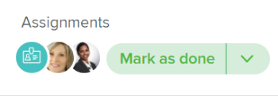

# Bearbeiten und Übersicht über die Schaltfläche „Fertig“

Wenn Sie einer Aufgabe oder einem Problem zugewiesen sind, können Sie eine kontextuelle Schaltfläche verwenden, die den Namen und die Funktion je nach Ihrer Beteiligung am Arbeitselement ändert.

Mithilfe der kontextuellen Schaltfläche zum Akzeptieren oder Abschließen von Arbeitselementen können Sie Adobe Workfront mehrere Felder für die Elemente aktualisieren lassen, ohne sie manuell selbst aktualisieren zu müssen.

Die Schaltflächen „Bearbeiten“ und „Fertig“ sind für Benutzende sichtbar, die:

* Eine Standardlizenz (neu) oder eine Plan- oder Arbeitslizenz (aktuell)
* Eingeschränkter Bearbeitungszugriff oder höher für die Aufgabe oder das Problem

>[!NOTE]
>
>Die Schaltfläche Fertig wird in allen Bereichen von Workfront als Erledigt markiert angezeigt.

## Bearbeiten und Namen der Schaltflächen „Fertig“

Je nachdem, über welchen Bereich von Workfront Sie auf Ihre Aufgabe oder Ihr Problem zugreifen, kann die Schaltfläche Bearbeiten oder Fertig den Namen ändern, wie in den folgenden Szenarien beschrieben:

* Wenn Ihnen die Aufgabe oder das Problem zum ersten Mal zugewiesen wird und der Status „Neu“ lautet, wird die Schaltfläche „Bearbeiten“ angezeigt.

  

  >[!TIP]
  >
  >Sie können die Schaltfläche Bearbeiten durch eine Schaltfläche Starten ersetzen. Informationen zum Ersetzen der Schaltfläche „Bearbeiten“ durch eine Schaltfläche „Starten“ [ Sie unter „Ersetzen der Schaltfläche „Bearbeiten“ durch eine Schaltfläche „Starten](../../people-teams-and-groups/create-and-manage-teams/work-on-it-button-to-start-button.md) .

* Nachdem Sie auf „Bearbeiten“ geklickt haben, wird die Schaltfläche als „Fertig stellen“ markiert. Informationen dazu, wo Sie auf die Schaltfläche „Bearbeiten“ zugreifen können, finden Sie im Abschnitt [Suchen der Schaltfläche „Bearbeiten“ und „Fertig](#locate-the-work-on-it-and-done-button) in diesem Artikel.

  

<!--If you are not the only one assigned to the task or issue and you are accessing your work item from the My Work widget in the Home area, the button changes to Done with my part.

  -->

## Suchen Sie die Schaltfläche „Bearbeiten“ und „Fertig“ {#locate-the-work-on-it-and-done-button}

Die Schaltflächen Bearbeiten und Fertig finden Sie in den folgenden Bereichen von Workfront:

* Der Bereich „Startseite“ im Widget „Meine Arbeit“

  Informationen zum Markieren eines Elements als „Erledigt“ im Bereich „Startseite“ finden Sie unter [Markieren eines Elements als „Erledigt“ im Bereich „Startseite“](../../workfront-basics/using-home/using-the-home-area/mark-item-done-in-home.md).

* In der Kopfzeile der Aufgabe oder des Problems

  Weitere Informationen zu den Objektkopfzeilen finden Sie unter [Neue Objektkopfzeilen](../../workfront-basics/the-new-workfront-experience/new-object-headers.md).

* Im Bedienfeld Aufgaben- oder Problemzusammenfassung :

  Informationen zur Verwendung des Bedienfelds Zusammenfassung finden Sie unter [Übersicht](../../workfront-basics/the-new-workfront-experience/summary-overview.md).

## Übersicht über Felder, die beim Klicken auf die Schaltflächen „Bearbeiten“ oder „Fertig“ automatisch aktualisiert werden

Der Vorteil der Verwendung der Schaltflächen „Bearbeiten“ und „Fertig“ besteht darin, dass Sie Workfront erlauben können, Informationen zu dem Ihnen zugewiesenen Arbeitselement automatisch zu aktualisieren.

* [Schaltfläche „Bearbeiten“](#work-on-it-button)
* [Start-Schaltfläche](#start-button)
* [Die Schaltfläche „Fertig“](#the-done-button)

### Schaltfläche „Bearbeiten“ {#work-on-it-button}

Wenn Sie auf „Bearbeiten“ klicken, werden auch die folgenden Elemente aktualisiert:

* Zuweisungsstatus-Aktualisierungen von Angefordert in Arbeit

  >[!TIP]
  >
  >Das Feld Zuweisungsstatus ist nur in Berichten und Listen sichtbar. Informationen zum Feld „Zuweisungsstatus“ finden Sie im [Glossar der Adobe Workfront-Terminologie](../../workfront-basics/navigate-workfront/workfront-navigation/workfront-terminology-glossary.md).

* Übertragungsdatum

  Weitere Informationen zum Commit-Datum finden Sie unter [Commit-Datum - Übersicht](../../manage-work/projects/updating-work-in-a-project/overview-of-commit-dates.md).

### Start-Schaltfläche {#start-button}

Wenn Sie Zugriff auf die Bearbeitung von Teams haben, können Sie die Schaltfläche Bearbeiten durch eine Schaltfläche Starten für ein Team ersetzen. Wenn Benutzer mit diesem Team als Home-Team auf die Schaltfläche Start für Elemente klicken, denen sie zugewiesen sind, werden zusätzliche Felder in ihren Arbeitselementen automatisch aktualisiert. Informationen zum Ersetzen der Schaltfläche „Bearbeiten“ durch eine Schaltfläche „Starten“ finden [ unter „Ersetzen der Schaltfläche „Bearbeiten“ durch eine Schaltfläche „Starten](../../people-teams-and-groups/create-and-manage-teams/work-on-it-button-to-start-button.md).

Zusätzlich zu den Feldern, die beim Klicken auf die Schaltfläche „Bearbeiten“ aktualisiert werden, werden beim Klicken auf die Schaltfläche „Starten“ automatisch die folgenden Felder zu einer Aufgabe oder einem Problem aktualisiert:

* Status
* Tatsächliches Startdatum

  Informationen zum tatsächlichen Startdatum finden Sie unter [Übersicht über das tatsächliche Startdatum des Projekts](../../manage-work/projects/planning-a-project/project-actual-start-date.md).

* Tatsächliches Abschlussdatum, wenn die Schaltfläche Start mit einem Status verknüpft ist, der Abgeschlossen oder Geschlossen entspricht.

  Informationen zum tatsächlichen Abschlussdatum finden Sie unter [Übersicht über das tatsächliche Abschlussdatum des Projekts](../../manage-work/projects/planning-a-project/project-actual-completion-date.md).

>[!NOTE]
>
>Durch Klicken auf die Schaltfläche Rückgängig wird das Arbeitselement auf den ursprünglichen Status zurückgesetzt und das tatsächliche Startdatum gelöscht.
>
>Die Schaltfläche Rückgängig ist in den folgenden Bereichen nicht verfügbar:
>
>* Teamanfragen
>* Aufgabenkopfzeile
>

### Die Schaltfläche „Fertig“ {#the-done-button}

Wenn Sie Zugriff auf die Bearbeitung von Teams haben, können Sie die Schaltfläche Fertig für ein Team konfigurieren, um den Aufgaben- oder Problemstatus zu aktualisieren, wenn Sie ein Element als abgeschlossen markieren. Wenn Benutzer mit diesem Team als Haupt-Team auf die Schaltfläche Als erledigt markieren für ihre Elemente klicken, werden die folgenden Felder bei einer Aufgabe oder einem Problem automatisch aktualisiert:

* Status
* Zuweisungsstatus-Aktualisierungen von „Arbeiten“ in „Fertig“
* Tatsächliches Abschlussdatum

Informationen zum Konfigurieren der Schaltfläche Fertig für ein Team finden Sie in den folgenden Artikeln:

* [Konfigurieren der Schaltfläche „Fertig“ für Aufgaben](../../people-teams-and-groups/create-and-manage-teams/configure-the-done-button-for-tasks.md)
* [Konfigurieren der Schaltfläche „Fertig“ für Probleme](../../people-teams-and-groups/create-and-manage-teams/configure-the-done-button-for-issues.md)
