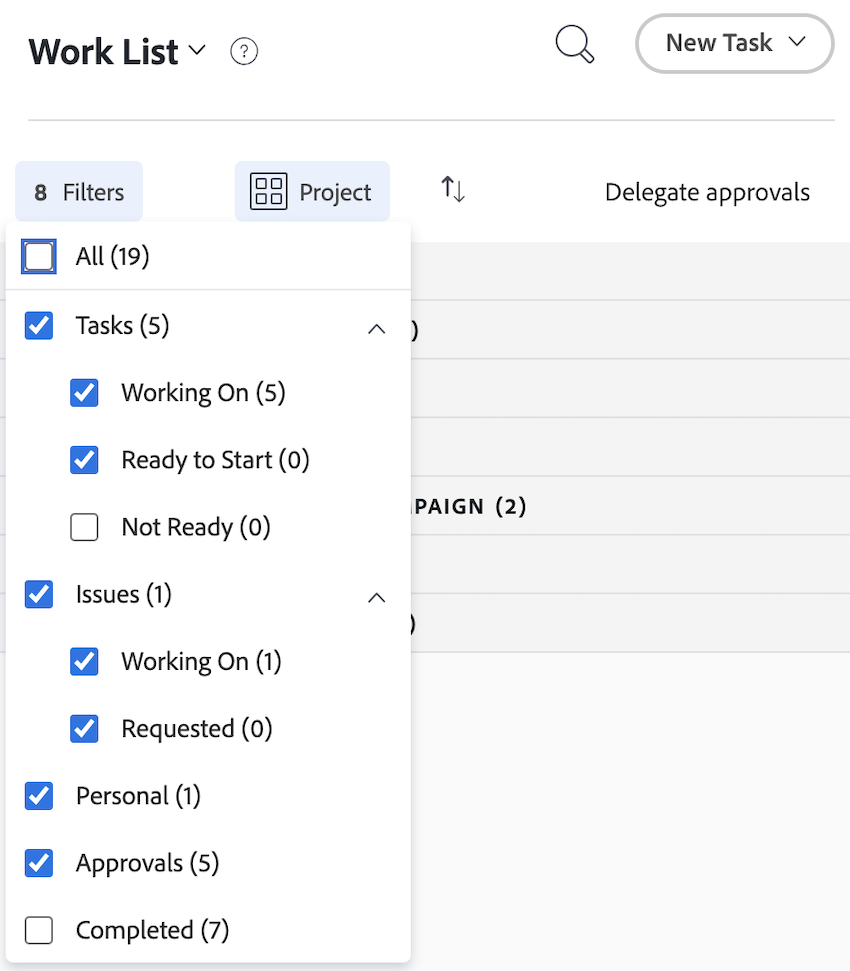
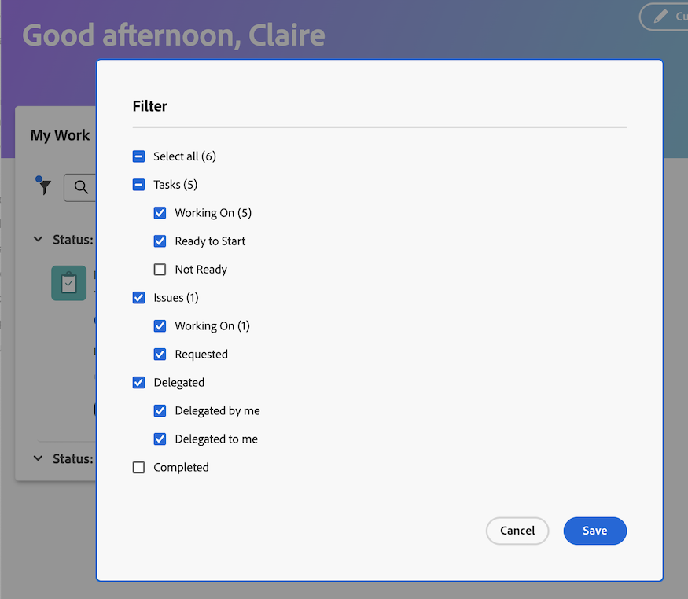
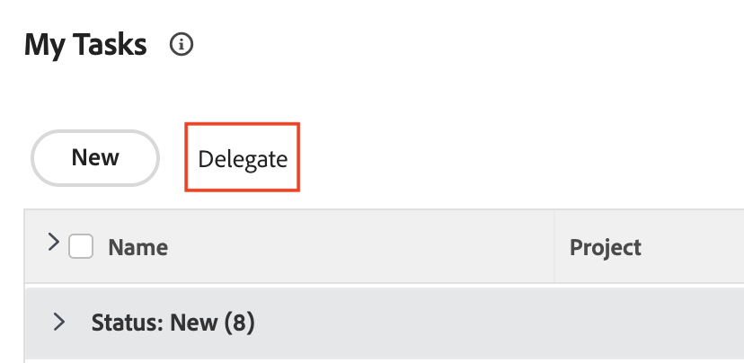

# Wechsel von der alten Startseite zur neuen Startseite

Die alte Startseite wird am 17.10.17 mit der Version Q4 aus Workfront entfernt. Dieser Artikel enthält Informationen dazu, welche Funktionen in der neuen Startseite verfügbar sein werden, sowie Empfehlungen für Workfront-Administratoren, die Benutzer zur neuen Startseite verschieben.

Weitere Informationen zur veralteten Home-Einstellung finden Sie im [Handbuch zur veralteten Home Deprecation](/help/quicksilver/product-announcements/announcements/legacy-home-deprecation.md).

## Erfahren Sie, was sich von &quot;Legacy Home&quot;zu &quot;New Home&quot;ändert

### Auftragsliste

#### Organisieren der Arbeit mit dem Widget &quot;Meine Arbeit&quot;

Das Widget Meine Arbeit wurde im Widget-Formular erstellt, um die Arbeitsliste der alten Startseite so gut wie möglich zu spiegeln. Benutzer können ihre Arbeitsliste im Widget Meine Arbeit mit ähnlichen Filtern und Gruppierungen gruppieren und filtern:

| **Filter** | **Grouping** |
|------------|-----------|
| - Arbeiten an   - Bereit zum Starten   - Nicht bereit   - Angefordert   - Delegierter   - Abgeschlossen | - Projekt   - Status   - Fälligkeitsdatum   - Nichts |

**Ältere Home-Gruppierungen sind in der neuen Startseite nicht verfügbar**

* Geplantes Abschlussdatum - umbenannt in Fälligkeitsdatum in neuer Startseite
* Geplanter Start
* Verpflichtungsdatum
* Meine Priorität

| **Legacy Home** | **Neue Startseite** |
|------------|-----------|
|  |  |

#### Delegieren von Arbeiten

Benutzer können die Arbeit weiterhin über die neue Startseite in den folgenden Widgets delegieren:

* Meine Arbeit
* Meine Aufgaben
* Meine Probleme
* Warten auf meine Genehmigungen

Benutzer können die ihnen zugewiesenen Aufgaben in den folgenden Widgets finden:

* Mein Widget &quot;Arbeit&quot;mit dem Filter &quot;An mich delegiert&quot;
* Warten auf meine Genehmigungen mithilfe des Filters &quot;Delegierte Genehmigungen&quot;

| **Legacy Home** | **Neue Startseite** |
|------------|-----------|
|  |  |

#### Kalenderansicht verwenden

Die Kalenderansicht ist in der neuen Startseite nicht mehr verfügbar, jedoch befindet sich eine Kalenderersetzung auf der Roadmap für Prioritäten.

#### Persönliche Aufgabe erstellen

Benutzer können eine persönliche Aufgabe nicht mehr genau so erstellen wie im alten Home, sondern Benutzer können Aufgabenelemente erstellen.

#### Anzeigen der von mir eingereichten Genehmigungen

Benutzer können keine Genehmigungen anzeigen, die sie in der neuen Startseite eingereicht haben. Wenn Benutzer in Ihrer Organisation diese Funktion benötigen, können Sie einen Validierungsbericht als Workaround erstellen oder einen Kommentar hier in den folgenden Community-Beiträgen posten:

* [Hinzufügen des Widgets &quot;Genehmigungen, die ich gesendet habe&quot; zu &quot;Neue Startseite&quot;](https://experienceleaguecommunities.adobe.com/t5/workfront-ideas/add-quot-approvals-i-submitted-quot-widget-to-new-home/idc-p/704664#M25269)
* [Hinzufügen von &quot;Validierungen, die ich gesendet habe&quot;zur neuen Startseite](https://experienceleaguecommunities.adobe.com/t5/workfront-ideas/add-quot-approvals-i-submitted-quot-widget-to-new-home/idc-p/704664#M25269)

#### Elemente zu meiner Priorität hinzufügen

Benutzer haben in der neuen Startseite keinen Zugriff mehr auf die Funktion &quot;Meine Priorität&quot;. Wir führen eine neue Spalte My Focus mit Prioritätensetzung ein, die diese Spalte ersetzen wird.

Benutzer können das Widget &quot;Foren&quot;verwenden, um bei Bedarf Elemente mit hoher Priorität zu verfolgen.

### Arbeitselemente aktualisieren

In der alten Startseite können Benutzer das richtige Bedienfeld verwenden, um ihre Arbeit zu aktualisieren. In der neuen Startseite verwenden Benutzer jetzt das Bedienfeld Zusammenfassung , um die Arbeit zu aktualisieren. Dies ist dasselbe Bedienfeld für die Zusammenfassung, das in Projekten, Aufgaben, Problemen und Dokumenten verfügbar ist.

#### Verwenden des Bedienfelds &quot;Zusammenfassung&quot;

In der Zusammenfassung können Benutzer

* Prozentualen Fertigstellungsgrad aktualisieren
* Aktualisieren hinzufügen
* Navigieren Sie zum Bereich Dokumente , um ein Dokument hochzuladen.
* Anzeigen von Arbeitselementdetails und Aktualisieren benutzerdefinierter Felder
Workfront-Administratoren können anpassen, welche Felder in der Zusammenfassung in der Vorlage Layout angezeigt werden. Weitere Informationen finden Sie unter [Anpassen von Startseite und Zusammenfassung mithilfe einer Layoutvorlage](/help/quicksilver/administration-and-setup/customize-workfront/use-layout-templates/customize-home-summary-layout-template.md).
* Status des Arbeitselements ändern
* Unteraufgaben anzeigen
* Zeit erfassen
* Angehängte Genehmigungsprozesse anzeigen
* Dateien hochladen - Diese Funktion ist neu

| **Legacy Home** | **Neue Startseite** |
|------------|-----------|
|  |  |

#### Öffnen Sie das Übersichtsbedienfeld

Benutzer können das Bedienfeld &quot;Zusammenfassung&quot;öffnen, indem sie den Mauszeiger über das Arbeitselement bewegen und dann auf das Symbol **Zusammenfassung**  klicken.

Weitere Informationen zur Verwendung des Bedienfelds &quot;Zusammenfassung&quot;finden Sie unter [Übersicht &quot;Zusammenfassung&quot;](/help/quicksilver/workfront-basics/the-new-workfront-experience/summary-overview.md).

#### Verwenden von Schnellaktionen

Zusätzlich zum Bedienfeld &quot;Zusammenfassung&quot;können Benutzer auch Schnellaktionen für

* Zeit erfassen
* Aktualisieren hinzufügen
* Benutzerdefiniertes Formular aktualisieren
* Datei hochladen

Um das Schnellaktionsmenü zu finden, halten Sie den Mauszeiger über das Arbeitselement. Die Liste der Schnellaktionen wird neben der Schaltfläche **Bearbeiten** oder **Fertig** angezeigt.

### Anzeigen von Genehmigungen und Teamanfragen

Benutzer können weiterhin Genehmigungen und Team-Anforderungen in der neuen Startseite mit den folgenden Widgets verwalten:

* Warten auf Genehmigung
* Alle Genehmigungen
* Team-Anforderungen

Weitere Informationen zum Hinzufügen von Widgets zur neuen Startseite finden Sie unter [Hinzufügen, Bearbeiten oder Entfernen von Widgets in der neuen Startseite](/help/quicksilver/workfront-basics/using-home/new-home/add-edit-remove-widgets-in-new-home.md).

## Informationen zu verfügbaren Widgets

Widgets sind die Grundlage des neuen Hauses. Durch Hinzufügen von Widgets zur Startseite können Benutzer den Typ der Informationen auswählen, die angezeigt werden, um ihren Arbeitsanforderungen am besten zu entsprechen. Einige Widgets sind nur für bestimmte Lizenztypen verfügbar, da die von ihnen verfolgten Objekte nur für diese Lizenzen verfügbar sind.

Workfront-Administratoren können mithilfe einer Layoutvorlage anpassen, welche Widgets im neuen Startseiten verfügbar sind. Weitere Informationen finden Sie unter [Anpassen der neuen Startseite mit einer Layoutvorlage](/help/quicksilver/administration-and-setup/customize-workfront/use-layout-templates/customize-new-home-layout-template.md).

+++ Erweitern, um eine detaillierte Liste der verfügbaren Widgets anzuzeigen
Im Folgenden finden Sie die 11 Widgets, aus denen Sie derzeit auswählen können, sowie eine Zusammenfassung der angezeigten Informationen:

* **Meine Arbeit**\
   Zeigt alle von Ihnen zugewiesenen Aufgaben, Probleme und Anforderungen an einem Ort an. Sie können auf die Schaltfläche Bearbeiten klicken, um mit der Arbeit an einem Element zu beginnen, oder auf die Schaltfläche Fertig , um es als vollständig zu markieren. Sie können auch Informationen (Status, Bedingung, Prozent abgeschlossen) zu Aufgaben und Problemen, zur Protokollzeit und zum Hinzufügen von Aktualisierungen über das Widget &quot;Meine Arbeit&quot;aktualisieren.

* **Pinnwände**\
    Zeigt alle Pinnwände an, die Sie erstellt haben oder zur Verwendung eingeladen wurden. Sie können auch eine neue Pinnwand erstellen, die auf folgenden Vorlagen basiert: Standard-Pinnwand, Kanban-Pinnwand, Retrospektive-Pinnwand, Dynamisches Pinnwand.

* **Meine Projekte**\
    Zeigt _Projekte an, deren Inhaber Sie_ oder _sind, die Sie in einer Liste haben, und_ an. Sie können vorhandene Filter, Ansichten oder Gruppierungen verwenden, um die Liste anzupassen, oder Sie können ein Projekt direkt über das Widget erstellen.

* **Meine Aufgaben**\
    Zeigt Aufgaben an, die Ihnen in einer Liste zugewiesen sind. Sie können vorhandene Filter, Ansichten oder Gruppierungen verwenden, um die Liste anzupassen, oder Sie können eine Aufgabe direkt über das Widget erstellen. Sie können Ihre Aufgaben auch außerhalb des Büros delegieren.

* **Meine Probleme**\
    Zeigt Probleme an, die Ihnen in einer Liste zugewiesen sind. Sie können vorhandene Filter, Ansichten oder Gruppierungen verwenden, um die Liste anzupassen, oder Sie können ein Problem direkt über das Widget erstellen. Dieses Widget enthält nur Probleme, deren verknüpfte Projekte auf &quot;Aktuell&quot;eingestellt sind, nicht aber abgeschlossene Projekte. Sie können Ihre Probleme auch delegieren, während Sie nicht im Büro sind.

* **Meine Anforderungen**\
    Zeigt alle von Ihnen gesendeten Anfragen, einen Filter zur ausschließlichen Anzeige offener Anforderungen und eine Schaltfläche an, mit der der Zusammenfassungsbereich für eine Anforderung geöffnet wird.

* **Team-Anforderungen**\
    Zeigt alle ausstehenden Anfragen für Teams an, in denen Sie Mitglied sind, sortiert nach Team. Außerdem gibt es Schaltflächen, um eine Anfrage direkt einer Benutzerin oder einem Benutzer zuzuweisen oder sie selbst zu bearbeiten.

* **Warten auf meine Genehmigung**\
    Zeigt alle ausstehenden zugewiesenen oder delegierten Genehmigungen an, sowie eine Schaltfläche zum Delegieren von Genehmigungen und eine Schaltfläche zum Treffen von Genehmigungsentscheidungen direkt im Widget.

* **Alle Genehmigungen**\
        Zeigt zwei Diagramme mit Informationen über die durchschnittliche Genehmigungszeit und -entscheidungen sowie Listenansichten ausstehender und überfälliger Genehmigungen an. Diese Funktion ist Teil einer schrittweisen Veröffentlichung und steht derzeit nur bestimmten Kunden zur Verfügung.

* **Erwähnungen**\
    Zeigt aktuelle Kommentar-Threads aus Workfront an, ähnlich wie auf der Seite My Updates . Sie können die Antwortschaltfläche verwenden, um eine Antwort im Widget zu erstellen. Dieses Widget zeigt auch Kommentare zu Aufgaben und Problemen, die Ihnen zugewiesen sind, die Sie einem anderen Benutzer zugewiesen haben, die Ihnen gehören, die Sie als primärer Ansprechpartner fungieren oder die Sie erstellt haben, sofern die Aufgabe oder das Problem in den letzten 30 Tagen aktualisiert wurde.

* **To-dos**\
    Mit diesem einzigartigen Widget können Sie Elemente zu einer persönlichen Checkliste hinzufügen, die Sie frei bearbeiten können. Aufgaben werden als Aufgaben in Ihrem persönlichen Projekt nachverfolgt und bleiben bis zu zwei Wochen nach der Fertigstellung erhalten.

  >[!NOTE]
  >
  >Sie müssen über die Berechtigung zum Erstellen von Aufgaben verfügen, um Aufgaben im To-dos-Widget zu erstellen. Im Widget werden nur persönliche Aufgaben angezeigt, die vom aktuellen Benutzer eingegeben werden.

+++

  

### Für jeden Lizenztyp verfügbare Widgets anzeigen

Standardmäßig werden auf der Startseite je nach Lizenztyp einige spezifische Widgets angezeigt. In den folgenden Tabellen wird beschrieben, welche Widgets die Benutzer der einzelnen Lizenztypen sehen, wenn sie zum ersten Mal zur neuen Startseite navigieren.

<table border="1" class="inlineTable">
    <tr>
        <td><b>Neuer Lizenztyp</b></td>
        <td><b>Standard-Widgets</b></td>
    </tr>
    <tr>
        <td>Standard</td>
        <td>Meine Projekte, meine Arbeit, Erwähnungen, Aufgaben</td>
    </tr>
    <tr>
        <td>Leicht</td>
        <td>Meine Arbeit, die auf meine Genehmigung wartet</td>
    </tr>
    <tr>
        <td>Mitwirkender oder Mitwirkende</td>
        <td>Meine Anforderungen, Erwähnungen, auf meine Genehmigung warten, Foren</td>
    </tr>
    <tr>
        <td>Extern</td>
        <td>Warten auf meine Genehmigung</td>
    </tr>
</table>

<table border="1" class="inlineTable">
    <tr>
        <td><b>Aktueller Lizenztyp</b></td>
        <td><b>Standard-Widgets</b></td>
    </tr>
    <tr>
        <td>Plan</td>
        <td>Meine Projekte, Erwähnungen, Aufgaben</td>
    </tr>
    <tr>
        <td>Arbeit</td>
        <td>Meine Arbeit, Erwähnungen, Aufgaben</td>
    </tr>
    <tr>
        <td>Überprüfung</td>
        <td>Meine Arbeit, Erwähnungen</td>
    </tr>
    <tr>
        <td>Anfrage</td>
        <td>Meine Projekte warten auf meine Genehmigung</td>
    </tr>
    <tr>
        <td>Mitwirken</td>
        <td>Meine Arbeit, Erwähnungen</td>
    </tr>
    <tr>
        <td>Extern</td>
        <td>Warten auf meine Genehmigung</td>
    </tr>
</table>

## Vorbereitung auf die Einstellung

Um Störungen für Sie und Ihre Organisation zu minimieren, unten finden Sie einige Empfehlungen, die den Übergang erleichtern.

### Starten Sie den Übergang zur neuen Startseite.

Unsere wichtigste Empfehlung ist, so bald wie möglich mit der Umstellung auf das neue Zuhause zu beginnen. Organisatorisch bedeutet dies, dass Ihr Administrator die Erlebnisse der Benutzer mithilfe von Layoutvorlagen - ähnlich der alten Startseite - anpasst, um sicherzustellen, dass jeder Benutzer über das verfügt, was er benötigt.

Wir empfehlen Administratoren:

1. Erstellen Sie ein standardmäßiges Layout für die neue Startseite mit Layoutvorlagen (oder erstellen Sie optional eine für jeden Benutzer, jede Gruppe oder jede Auftragsrolle, für die ein eindeutiges Layout erforderlich ist). Weitere Informationen finden Sie unter [Anpassen der neuen Startseite mit einer Layoutvorlage](/help/quicksilver/administration-and-setup/customize-workfront/use-layout-templates/customize-new-home-layout-template.md) .

1. Weisen Sie Ihre neuen Layoutvorlagen einer kleinen Anzahl von Testbenutzern zu, die überprüfen können, ob ihre Widgets und allgemeinen Einstellungen ihren Anforderungen entsprechen.

1. Weisen Sie den Rest Ihrer Benutzer erneut dem Layout Neue Startseite zu.

Dadurch erhalten Ihre Benutzer so bald wie möglich Zeit, sich an das neue Erlebnis anzupassen und ihre neuen Startseiten entsprechend ihren individuellen Anforderungen anzupassen. Unter [Entfernen, Hinzufügen und Neuanordnen von Widgets auf der neuen Startseite](/help/quicksilver/workfront-basics/using-home/new-home/add-edit-remove-widgets-in-new-home.md) finden Sie Informationen dazu, wie Benutzer die Widgets auf ihrer eigenen neuen Startseite anpassen können.