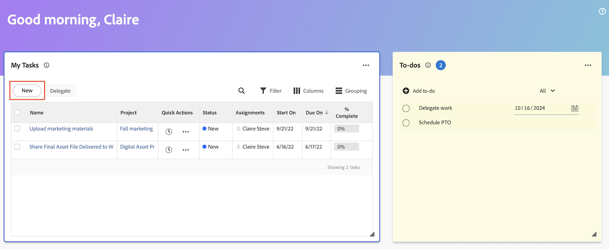

# Erstellen von Arbeitselementen und Projekten im Bereich Startseite

Sie können Arbeitselemente und Projekte über den Bereich &quot;[!UICONTROL &quot; ].

Von zu Hause aus haben Sie folgende Möglichkeiten

* Erstellen Sie persönliche Aufgaben für sich selbst
* Anfragen senden
* Hinzufügen von Aufgaben und Problemen zu bestimmten Projekten
* Erstellen Sie Projekte aus einer Vorlage, einem leeren Projekt oder importieren Sie ein MS Project.

## Zugriffsanforderungen

+++ Erweitern Sie , um die Zugriffsanforderungen für die -Funktion in diesem Artikel anzuzeigen.

Sie müssen über folgenden Zugriff verfügen, um die Schritte in diesem Artikel ausführen zu können:

<table style="table-layout:auto"> 
 <col> 
 <col> 
 <tbody> 
  <tr> 
   <td role="rowheader"><strong>[!DNL Adobe Workfront plan*]</strong></td> 
   <td> 
Beliebig
 </td> 
  </tr> 
  <tr> 
   <td role="rowheader"><strong>[!DNL Adobe Workfront] Lizenz*</strong></td> 
   <td> 
[!UICONTROL Arbeit] oder höher
 </td> 
  </tr> 
  <tr> 
   <td role="rowheader"><strong>Konfigurationen der Zugriffsebene*</strong></td> 
   <td> 
[!UICONTROL Worker]
 
<b>NOTIZ</b>
 
   
Wenn Sie immer noch keinen Zugriff haben, fragen Sie Ihren [!DNL Workfront], ob er zusätzliche Einschränkungen in Ihrer Zugriffsebene festlegt. Informationen dazu, wie [!DNL Workfront]-Admins Ihre Zugriffsebene ändern können, finden Sie unter <a href="../../../administration-and-setup/add-users/configure-and-grant-access/create-modify-access-levels.md" class="MCXref xref">Erstellen oder Ändern benutzerdefinierter Zugriffsebenen</a>.
 </td> 
  </tr> 
  <tr> 
   <td role="rowheader"><strong>Objektberechtigungen</strong></td> 
   <td> 
Zugriff auf [!UICONTROL Bearbeiten] oder höher für Aufgaben
 
Informationen zum Anfordern zusätzlicher Zugriffsberechtigungen finden Sie unter <a href="../../../workfront-basics/grant-and-request-access-to-objects/request-access.md" class="MCXref xref">Anfordern von Zugriffsberechtigungen für Objekte </a>.
 </td> 
  </tr> 
 </tbody> 
</table>

&#42;Wenden Sie sich an Ihren [!DNL Workfront], um herauszufinden, über welchen Plan, welchen Lizenztyp oder welchen Zugriff Sie verfügen.

+++

## Persönliches Aufgabenelement erstellen

Sie können im Bereich „Startseite“ im Widget „Aufgaben[!UICONTROL  persönliche ] erstellen. Die Aufgaben sind persönliche Aufgaben, die Sie selbst erstellen.

Sie und andere Benutzer können Ihre persönlichen Aufgaben in einem persönlichen Aufgabenbericht anzeigen. Von dort aus können sie sie bei Bedarf zu Projekten hinzufügen.

>[!TIP]
>
>Arbeitselemente, die Sie über die Benutzerprofilseite an andere Benutzer oder an sich selbst senden, werden auch im Aufgabenwidget im Bereich Startseite des Benutzers angezeigt. Weitere Informationen finden Sie unter [Persönliche Aufgaben erstellen](/help/quicksilver/workfront-basics/updating-work-items-and-viewing-updates/create-personal-tasks.md).

So erstellen Sie ein Aufgabenelement:

1. Klicken Sie auf **[!UICONTROL Hauptmenü]**  in der oberen rechten Ecke oder auf das **Hauptmenü**  in der oberen linken Ecke, falls verfügbar, und klicken Sie dann auf **[!UICONTROL Startseite]**.
1. (Bedingt) Klicken Sie auf **Anpassen** und anschließend auf **Aufgaben**, um das Aufgaben-Widget zu Ihrem Startbildschirm hinzuzufügen.
1. Gehen Sie zum **Aufgaben**-Widget und klicken Sie dann auf **Aufgabe hinzufügen**.
1. Geben Sie den Namen für Ihr persönliches Aufgabenelement ein und klicken Sie dann auf die Eingabetaste.
1. (Optional) Klicken Sie auf das **Datum**-Symbol , um ein Fälligkeitsdatum für das Element hinzuzufügen.
   
1. (Optional) Erstellen Sie einen persönlichen Aufgabenbericht oder Filter. Informationen zum Erstellen eines Filters für eine persönliche Aufgabe finden Sie unter [Filter: persönliche Aufgabe](/help/quicksilver/reports-and-dashboards/reports/custom-view-filter-grouping-samples/filter-personal-tasks.md).
Sie können Ihre Aufgabenelemente sowie die Aufgabenelemente anderer Benutzer im persönlichen Aufgabenbericht anzeigen.

## Aufgabe zu einem Projekt hinzufügen

Sie können eine Aufgabe direkt aus dem Bereich Startseite zu einem vorhandenen Projekt hinzufügen:

1. Klicken Sie oben rechts auf **[!UICONTROL Hauptmenü]**  und dann auf **[!UICONTROL Home]**.
1. (Bedingt) Fügen Sie das Widget **Meine Aufgaben** zu Ihrem Startbildschirm hinzu. Klicken Sie **Anpassen** und suchen Sie nach **Meine Aufgaben**.
1. Gehen Sie zum Widget **Meine Aufgaben** und klicken Sie dann auf **Neu**.
   
1. Geben **im Dialogfeld** Neue Aufgabe“ den Aufgabennamen ein.
1. Geben Sie zunächst einen Projektnamen ein und wählen Sie dann den Namen aus der Liste aus.
1. (Optional) Geben Sie Informationen in die folgenden Felder ein:

   | Feld | Anleitung |
   |----------|----------|
   | **Beschreibung** | Beschreibung eingeben. |
   | **Arbeitsaufträge** | Benutzer zuweisen. |
   | **Dauer** | Geben Sie die Dauer ein. |
   | **Geplantes Abschlussdatum** | Wählen Sie ein geplantes Abschlussdatum aus. |
   | **Weitere Optionen** | Wählen Sie weitere Optionen aus, um weitere Einstellungen für die Aufgabe zu konfigurieren. Weitere Informationen zum Erstellen von Aufgaben finden Sie unter [Aufgaben bearbeiten](/help/quicksilver/manage-work/tasks/manage-tasks/edit-tasks.md). |

1. Klicken Sie **Aufgabe erstellen**.

## Hinzufügen eines Problems zu einem Projekt

Sie können ein Problem direkt über den Startseiten-Bereich zu einem vorhandenen Projekt hinzufügen:

1. Klicken Sie oben rechts auf **[!UICONTROL Hauptmenü]**  und dann auf **[!UICONTROL Home]**.
1. (Bedingt) Fügen Sie das Widget **Meine Probleme** zu Ihrem Startbildschirm hinzu. Klicken Sie **Anpassen** und suchen Sie nach **Meine Probleme**.
1. Gehen Sie zum Widget **Meine Probleme** und klicken Sie dann auf **Neu**.
   
1. Beginnen Sie **Dialogfeld „Neues Problem** mit der Eingabe eines Projektnamens und wählen Sie dann den Namen aus der Liste aus.
1. Geben Sie einen Problemnamen ein.
1. (Optional) Geben Sie Informationen in die folgenden Felder ein:

   | Feld | Anleitung |
   |----------|----------|
   | **Beschreibung** | Beschreibung eingeben. |
   | **Arbeitsaufträge** | Benutzer zuweisen. |
   | **Priorität** | Wählen Sie eine Prioritätsstufe aus. |
   | **Dokumente** | Laden Sie ein Dokument hoch. |

1. Klicken Sie **Neues Problem speichern**.

## Erstellen einer Anfrage

Sie können eine Anfrage direkt über den Bereich Startseite erstellen:

1. Klicken Sie oben rechts auf **[!UICONTROL Hauptmenü]**  und dann auf **[!UICONTROL Home]**.
1. (Bedingt) Fügen Sie das Widget **Meine Anfragen** zu Ihrem Startbildschirm hinzu. Klicken Sie **Anpassen** und suchen Sie nach **Meine Anfragen**.
1. Gehen Sie zum **Meine Anfragen**-Widget und klicken Sie auf **Neu**.
   

1. Geben Sie **Dialogfeld &quot;** Anfrage“ den Namen der Anfrage-Warteschlange ein.
1. Füllen Sie die entsprechenden Felder aus.
1. Klicken Sie **Senden**.

Weitere Informationen zum Senden von Anfragen finden Sie unter [Erstellen und Senden von Anfragen](/help/quicksilver/manage-work/requests/create-requests/create-submit-requests.md).

## Projekt erstellen

Sie können ein Projekt direkt im Bereich Startseite erstellen:

1. Klicken Sie oben rechts auf **[!UICONTROL Hauptmenü]**  und dann auf **[!UICONTROL Home]**.
1. (Bedingt) Fügen Sie das Widget **Meine Projekte** zu Ihrem Startbildschirm hinzu. Klicken Sie **Anpassen** und suchen Sie nach **Meine Projekte**.
1. Gehen Sie zum Widget **Meine Projekte** und klicken Sie dann auf **Neu**.
   
1. Wählen Sie eine der folgenden Optionen:

   | Feld | Anleitung |
   |----------|----------|
   | Aus einer Vorlage | Unter [Erstellen eines Projekts mithilfe einer Vorlage](/help/quicksilver/manage-work/projects/create-projects/create-project-from-template.md) finden Sie detaillierte Anweisungen zum Erstellen eines Projekts mithilfe einer Vorlage. |
   | Leeres Projekt | Unter [Erstellen eines neuen Projekts](/help/quicksilver/manage-work/projects/create-projects/create-project.md#create-a-project-from-scratch) finden Sie detaillierte Anweisungen zum Erstellen eines leeren Projekts. |
   | MS Project importieren | Unter [Importieren eines Projekts aus einem Microsoft-Projekt](/help/quicksilver/manage-work/projects/create-projects/import-project-from-ms-project.md) finden Sie detaillierte Anweisungen zum Importieren eines MS-Projekts. |

<!--
## Create a board

You can create a board directly from the Home area:

1. Click the **[!UICONTROL Main Menu]**  in the upper-right corner, then click **[!UICONTROL Home]**.
1. (Conditional) Add the **Boards** widget to your home screen. Click **Customize**, and find **Boards**. -->

<!--
## Delete a to-do item

1. Click the **[!UICONTROL Main Menu]**  in the upper-right corner, then click **[!UICONTROL Home]**.
1. Go to the to-do widget.
1. Hover over the item, then click the **Delete** icon . 

## Edit a to-do item

1. Click the **[!UICONTROL Main Menu]**  in the upper-right corner, then click **[!UICONTROL Home]**.
1. Go to the to-do widget.
1. Edit the item name.
1. Click on the **Date** icon  to add or adjust a due date. -->