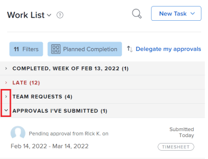

# Anzeigen von Elementen im [!UICONTROL Arbeitsliste] im Startbereich

Die [!UICONTROL Arbeitsliste] im [!UICONTROL Startseite] zeigt alle Arbeitselemente an, die Ihnen zugewiesen sind. Sie können steuern, welche Elemente in der [!UICONTROL Arbeit] Liste wie unten beschrieben.

>[!NOTE]
>
>Beim Konvertieren eines Problems in eine Aufgabe oder ein Projekt wird das Problem aus dem Startbereich des dem Problem zugewiesenen Benutzers entfernt.
>
>Beim Konvertieren einer Aufgabe in ein Projekt wird die Aufgabe gelöscht und aus dem Startbereich des der Aufgabe zugewiesenen Benutzers entfernt.

## Zugriffsanforderungen

Sie müssen über folgenden Zugriff verfügen, um die Schritte in diesem Artikel ausführen zu können:

<table style="table-layout:auto"> 
 <col> 
 </col> 
 <col> 
 </col> 
 <tbody> 
  <tr> 
   <td role="rowheader"><strong>[!DNL Adobe Workfront plan*]</strong></td> 
   <td> 
Beliebig
 </td> 
  </tr> 
  <tr> 
   <td role="rowheader"><strong>[!DNL Adobe Workfront] license*</strong></td> 
   <td> 
[!UICONTROL Review] nur für Genehmigungen
 
[!UICONTROL Arbeit] oder höher für alle anderen Objekte
 </td> 
  </tr> 
  <tr> 
   <td role="rowheader"><strong>Konfigurationen auf Zugriffsebene*</strong></td> 
   <td> 
[!UICONTROL Ansicht] oder höher Zugriff auf Projekte, Aufgaben, Probleme und Dokumente
 
Hinweis: Wenn Sie immer noch keinen Zugriff haben, fragen Sie Ihren [!DNL Workfront] Administrator , wenn sie zusätzliche Einschränkungen für Ihre Zugriffsebene festlegen. Informationen zur Verwendung von [!DNL Workfront] Administrator kann Ihre Zugriffsebene ändern, siehe <a href="../../../administration-and-setup/add-users/configure-and-grant-access/create-modify-access-levels.md" class="MCXref xref">Benutzerdefinierte Zugriffsebenen erstellen oder ändern</a>.
 </td> 
  </tr> 
  <tr> 
   <td role="rowheader"><strong>Objektberechtigungen</strong></td> 
   <td> 
Beitragen Sie Berechtigungen oder höher zu den Aufgaben und Problemen, an denen Sie arbeiten müssen.
 
Informationen zum Anfordern von zusätzlichem Zugriff finden Sie unter <a href="../../../workfront-basics/grant-and-request-access-to-objects/request-access.md" class="MCXref xref">Zugriff auf Objekte anfordern</a>.
 </td> 
  </tr> 
 </tbody> 
</table>

&#42;Wenden Sie sich an Ihren [!DNL Workfront] Administrator.

## Filtern Sie die [!UICONTROL Arbeitsliste]

Sie können Elemente im [!UICONTROL Arbeitsliste] um nur bestimmte Elementtypen anzuzeigen. Sie können beispielsweise die [!UICONTROL Arbeitsliste] , um nur Probleme oder Anforderungen anzuzeigen.

>[!NOTE]
>
>Die Filteroptionen werden im Browser gespeichert. Wenn Sie denselben Browser auf demselben Computer verwenden (und die Site-Daten nicht löschen), ändern sich die ausgewählten Filter nicht. Wenn Sie Browser oder Computer wechseln, kehren die Filter zur Standardoption zurück, bei der alle Filter deaktiviert sind.

1. Klicken Sie auf **[!UICONTROL Hauptmenü]**  in der oberen rechten Ecke und klicken Sie auf **[!UICONTROL Startseite]**.
1. Klicken Sie auf **[!UICONTROL Filter]**  Dropdown-Menü.
1. Wählen Sie aus den folgenden Filteroptionen aus, um den Typ der anzuzeigenden Elemente anzugeben:

   <table style="table-layout:auto"> 
    <col> 
    <col> 
    <tbody> 
     <tr> 
      <td role="rowheader"><strong>[!UICONTROL All]</strong></td> 
      <td>Zeigt alle Elemente an und wählt sie aus. Dazu gehören Aufgaben, Probleme, Genehmigungen, persönliche Aufgaben sowie abgeschlossene Aufgaben und Probleme. </td>
     </tr> 
     <tr> 
      <td role="rowheader"><strong>[!UICONTROL Aufgaben bearbeiten]</strong></td> 
      <td> 
Zeigt nur Aufgaben an, an denen Sie aktiv arbeiten. Hierbei handelt es sich um Aufgaben, die Ihnen zugewiesen sind und für die Sie auf die Schaltfläche [!UICONTROL Bearbeiten] geklickt haben.
 </td> 
     </tr> 
     <tr> 
      <td role="rowheader"><strong>[!UICONTROL Aufgaben bereit zum Start]</strong></td> 
      <td> 
       
 
        
Zeigt nur Aufgaben an, die für den Start bereit sind. Beide der folgenden Anweisungen müssen wahr sein:
 
        <ul> 
         <li> 
Die Aufgaben und ihre Eltern haben keine Vorgänger oder Aufgabeneinschränkungen, die sie daran hindern, daran gearbeitet zu werden.
 </li> 
         <li> 
Das geplante [!UICONTROL Startdatum] der Aufgaben liegt in der Vergangenheit oder bis zu zwei Wochen in der Zukunft.
 </li> 
        </ul> 
       
 </td> 
     </tr> 
     <tr> 
      <td role="rowheader"><strong>[!UICONTROL Aufgaben nicht bereit]</strong></td> 
      <td> 
       
 
        
Zeigt nur Aufgaben an, die noch nicht startbereit sind. Jede der folgenden Anweisungen muss "true"lauten:
 
        <ul> 
         <li> 
Die Aufgaben und ihre Eltern haben möglicherweise Vorgänger oder Aufgabeneinschränkungen, die deren Bearbeitung verhindern.
 </li> 
         <li> 
Die Aufgaben verfügen über ein [!UICONTROL Geplantes Startdatum], das in Zukunft mehr als zwei Wochen beträgt.
 </li> 
        </ul> 
       
 </td> 
     </tr> 
     <tr> 
      <td role="rowheader"><strong>[!UICONTROL Probleme bearbeiten]</strong></td> 
      <td> 
Zeigt nur Probleme an, an denen Sie aktiv arbeiten. Hierbei handelt es sich um Probleme, die Ihnen zugewiesen sind und für die Sie auf die Schaltfläche [!UICONTROL Bearbeiten] geklickt haben.
 </td> 
     </tr> 
     <tr> 
      <td role="rowheader"><strong>[!UICONTROL Probleme angefordert]</strong></td> 
      <td>Zeigt nur Probleme an, denen Sie zugewiesen sind, für die Sie jedoch nicht auf die Schaltfläche [!UICONTROL Bearbeiten] geklickt haben.</td> 
     </tr> 
     <tr> 
      <td role="rowheader"><strong>Persönlich</strong></td> 
      <td>Zeigt nur persönliche Aufgaben an. Dies sind Aufgaben, die Sie als [!UICONTROL Aufgabe erstellen, wie im Abschnitt beschrieben. <a href="../../../workfront-basics/using-home/using-the-home-area/create-work-items-in-home.md#creating-a-personal-task">Persönliche Aufgabe erstellen</a> im Artikel <a href="../../../workfront-basics/using-home/using-the-home-area/create-work-items-in-home.md">Arbeitselemente aus dem [!UICONTROL Home]-Bereich erstellen</a>.</td> 
     </tr> 
     <tr> 
      <td role="rowheader"><strong>[!UICONTROL Validierungen]</strong></td> 
      <td> 
       
 
        
Zeigt nur die Ihnen zugewiesenen oder zugewiesenen Genehmigungen und die von Ihnen eingereichten Genehmigungen an. Zu den Genehmigungen gehören Genehmigungen für Arbeitselemente (Projekte, Aufgaben und Probleme) sowie Genehmigungen für Dokumente, Testsendungen, Zugriffsanfragen und Timesheets. Weitere Informationen zu Genehmigungen finden Sie in den folgenden Artikeln:
 
        <ul> 
         <li><a href="../../../review-and-approve-work/manage-approvals/view-approvals.md" class="MCXref xref">Anzeigen von Genehmigungen</a> </li> 
        </ul> 
        <ul> 
         <li> 
<a href="../../../review-and-approve-work/manage-approvals/manage-approvals.md" class="MCXref xref">Arbeitsgenehmigungen</a> 
 </li> 
        </ul> 
        
Hinweis: Die von Ihnen eingereichten Validierungen, bei denen Sie auch einer der Genehmiger sind, werden zweimal gezählt.
 
       
 </td> 
     </tr> 
     <tr> 
      <td role="rowheader"><strong>[!UICONTROL Abgeschlossen]</strong></td> 
      <td> 
Zeigt nur abgeschlossene Aufgaben, Probleme und persönliche Aufgaben an. Die abgeschlossene Arbeit wird für die letzten zwei Wochen angezeigt und in der Arbeitsliste nach der Woche gruppiert, in der sie abgeschlossen wurden. Genehmigungen sind nicht enthalten.
 
Abgeschlossene Arbeiten werden in der [!UICONTROL Arbeitsliste] ausgeblendet, sofern Sie diesen Filter nicht auswählen.
 </td> 
     </tr> 
    </tbody> 
   </table>

   

   >[!TIP]
   >
   >* Filteroptionen basieren auf Objekten (Aufgaben, Probleme, Genehmigungen, Persönliche Aufgaben).
   >* Aufgaben und Probleme werden im Zusammenhang mit unserer Bereitschaft zur Bearbeitung weiter nach ihrem Status gefiltert ([!UICONTROL Arbeiten an], [!UICONTROL Bereit zum Start], [!UICONTROL Nicht bereit] für Aufgaben und [!UICONTROL Arbeiten an] und [!UICONTROL Angefordert] für Probleme). Sie können auswählen, ob Aufgaben oder Probleme in einem bestimmten Status angezeigt werden sollen, oder auf Aufgaben oder Probleme klicken, um alle Status auszuwählen und anzuzeigen.
   >* Es gibt einen separaten Filter für abgeschlossene Elemente, der sowohl Aufgaben als auch Probleme enthält. Dies umfasst keine Genehmigungen. Die [!UICONTROL Abgeschlossen] -Filter enthält Persönliche Aufgaben.
   >* Sie können jeweils nur einen Status auswählen. Beispielsweise können Sie nur [!UICONTROL Arbeiten an] Aufgaben und nur [!UICONTROL Angefordert] Probleme.
   >* Sie können keine Filter auf Elemente anwenden, die einem Ihrer Teams zugewiesen sind, und diese sind nicht in den Elementen enthalten, die Ihnen direkt zugewiesen sind.

1. (Optional) Weitere Organisation der [!UICONTROL Arbeitsliste], wie im Abschnitt beschrieben [Gruppieren und Sortieren nach Datum, Projekt und Priorität](#group-and-sort-by-date-project-and-priority) in diesem Artikel.

## Gruppieren und sortieren nach [!UICONTROL Datum], [!UICONTROL Projekt], und [!UICONTROL Priorität]

Sie können die [!UICONTROL Arbeitsliste] von [!UICONTROL Geplantes Abschlussdatum], [!UICONTROL Datum der Übermittlung], [!UICONTROL Projekt]oder [!UICONTROL Meine Priorität]. Die von Ihnen ausgewählte Option bestimmt, wie Elemente im [!UICONTROL Arbeitsliste].

1. Klicken Sie auf **[!UICONTROL Hauptmenü]**  in der oberen rechten Ecke und klicken Sie auf **[!UICONTROL Startseite]**.
1. Klicken Sie auf **[!UICONTROL Gruppieren nach]** Dropdown-Menü.

   

1. Wählen Sie aus den folgenden Optionen aus:

   <table style="table-layout:auto"> 
    <col> 
    <col> 
    <tbody> 
     <tr> 
      <td role="rowheader"><strong>[!UICONTROL Geplanter Abschluss]</strong></td> 
      <td> 
 Elemente werden in den folgenden Gruppen in der [!UICONTROL Arbeitsliste] angezeigt, je nach ihrem geplanten [!UICONTROL Abschlussdatum] (die Anzahl der in jeder Gruppierung enthaltenen Elemente wird in Klammern neben dem Überschriftentitel angezeigt):
 
       <ul> 
        <li> 
[!UICONTROL Late]
 </li> 
        <li> 
[!UICONTROL Kein geplanter Abschlussdatum]
 </li> 
        <li> 
[!UICONTROL Diese Woche]
 
Diese Gruppierung wird standardmäßig erweitert.
 </li> 
        <li> 
[!UICONTROL Nächste Woche]
 </li> 
        <li> 
[!UICONTROL Geplant], gefolgt von verschiedenen geplanten [!UICONTROL Abschlussdaten] (mehrere Gruppierungen)
 </li> 
        <li> 
[!UICONTROL Abgeschlossen]
 </li> 
       </ul> </td> 
     </tr> 
     <tr> 
      <td role="rowheader"><strong>[!UICONTROL Geplanter Start]</strong></td> 
      <td> 
Elemente werden in den folgenden Gruppierungen in der [!UICONTROL Arbeitsliste] angezeigt, je nach ihrem geplanten [!UICONTROL Startdatum] (die Anzahl der in jeder Gruppierung enthaltenen Elemente wird in Klammern neben dem Überschriftentitel angezeigt):
 
       <ul> 
        <li> 
[!UICONTROL Late]
 </li> 
        <li> 
[!UICONTROL Diese Woche] 
 
Diese Gruppierung wird standardmäßig erweitert.
 </li> 
        <li> 
[!UICONTROL Nächste Woche]
 </li> 
        <li> 
[!UICONTROL Geplant], gefolgt von verschiedenen [!UICONTROL geplanten Startdaten] (mehreren Gruppierungen)
 </li> 
       </ul> </td> 
     </tr> 
     <tr> 
      <td role="rowheader"><strong>[!UICONTROL Veröffentlichungsdatum]</strong></td> 
      <td> 
Elemente werden in den folgenden Gruppierungen in der [!UICONTROL Arbeitsliste] angezeigt (die Anzahl der Elemente innerhalb jeder Gruppierung wird in Klammern neben dem Überschriftentitel angezeigt):
 
       <ul> 
        <li> 
[!UICONTROL No Commit Date]
 </li> 
        <li> 
[!UICONTROL Nächste Woche gebunden]
 </li> 
       </ul> </td> 
     </tr> 
     <tr> 
      <td role="rowheader"><strong>[!UICONTROL Projekt]</strong></td> 
      <td>Elemente werden nach Projekt gruppiert und Projekte werden alphabetisch in der [!UICONTROL Arbeitsliste] angezeigt. (Die Anzahl der Elemente in den einzelnen Gruppierungen wird in Klammern neben dem Überschriftentitel angezeigt.)</td> 
     </tr> 
     <tr> 
      <td role="rowheader"><strong>[!UICONTROL My Priority]</strong></td> 
      <td>Elemente werden in der von Ihnen gewählten Reihenfolge angezeigt. Weitere Informationen finden Sie unter <a href="../../../workfront-basics/using-home/using-the-home-area/prioritize-work-in-home.md" class="MCXref xref">Priorisieren von Arbeiten im [!UICONTROL Home]-Bereich</a>.</td> 
     </tr> 
    </tbody> 
   </table>

>[!NOTE]
>
>Die Standardsortierung ist aufsteigend. Wenn Sie die Sortierung in absteigend ändern, werden die ausgewählten Sortieroptionen im Browser gespeichert. Wenn Sie denselben Browser auf demselben Computer verwenden (und die Site-Daten nicht löschen), ändert sich die Sortierung nicht. Wenn Sie jedoch Browser oder Computer wechseln, wird die Sortierung zur Standardsortierung geändert.

## Anzeigen verspäteter Elemente

[!DNL Adobe Workfront] verwendet die folgenden Daten, um zu ermitteln, ob Arbeitsanforderungen verspätet sind:

* **Aufgaben**: [!UICONTROL Geplantes Abschlussdatum]
* **Probleme**: [!UICONTROL Geplantes Abschlussdatum]
* **Dokumente**: [!UICONTROL Gesendetes Datum]
* **Timesheets**: [!UICONTROL Gesendetes Datum]
* **Genehmigungen**: [!UICONTROL Gesendetes Datum]
* **Genehmigungen für den Nachweis**: [!UICONTROL Testversand-Deadline]

## Suchen Sie die [!UICONTROL Arbeitsliste]

Wenn Sie die [!UICONTROL Arbeitsliste], werden alle Ihnen zugewiesenen Elemente bei der Suche zurückgegeben (auch Elemente, die derzeit nicht auf dem Bildschirm geladen sind). Wenn die Variable [!UICONTROL Abschluss anzeigen] ausgewählt ist, werden auch alle Elemente zurückgegeben, die Sie in den letzten zwei Wochen als vollständig markiert haben.

Darüber hinaus werden nur die Namen der Arbeitselemente durchsucht (Informationen innerhalb des Arbeitselements werden nicht durchsucht, ebenso die Namen der Projekte, in denen sich das Arbeitselement befindet).

So durchsuchen Sie die [!UICONTROL Arbeitsliste]:

1. Klicken Sie auf **[!UICONTROL Hauptmenü]**  in der oberen rechten Ecke und klicken Sie auf **[!UICONTROL Startseite]**.
1. (Optional) Filtern Sie die [!UICONTROL Arbeitsliste], wie unter [Filtern Sie die [!UICONTROL Arbeitsliste]](#filter-the-work-list) und [Gruppieren und Sortieren nach Datum, Projekt und Priorität](#group-and-sort-by-date-project-and-priority).

1. (Optional) Wenn Sie nach einem bereits abgeschlossenen Arbeitselement suchen, müssen Sie die [!UICONTROL Arbeitsliste] , um vor der Suche abgeschlossene Elemente anzuzeigen.
1. 

1. Beginnen Sie mit der Eingabe des Namens des gesuchten Elements.\
   Die [!UICONTROL Arbeitsliste] wird automatisch gefiltert, um Elemente mit einem übereinstimmenden Namen einzuschließen.

## Größe der Arbeitsliste ändern

Sie können die Größe der [!UICONTROL Arbeitsliste] sodass es zwischen etwa einem Viertel des Home-Bereichs und etwa der Hälfte des Home-Bereichs verbraucht [!UICONTROL Startseite] Bereich.

1. Klicken Sie auf **[!UICONTROL Hauptmenü]**  in der oberen rechten Ecke und klicken Sie auf **[!UICONTROL Startseite]**.
1. Bewegen Sie den Mauszeiger über den rechten Rand des [!UICONTROL Arbeitsliste]und ziehen Sie dann nach links oder rechts, bis die Arbeitsliste die gewünschte Größe aufweist.

## Reduzieren und Erweitern von Gruppierungen

Elemente in [!UICONTROL Arbeitsliste] innerhalb von Gruppierungen angezeigt werden. Sie können Gruppierungen reduzieren und erweitern, um zu steuern, wie viele Informationen zu einem bestimmten Zeitpunkt auf der Seite angezeigt werden.

Sie können Gruppierungen innerhalb der [!UICONTROL Arbeitsliste] um besser kontrollieren zu können, welche Informationen sichtbar sind.\
Standardmäßig wird die Variable [!UICONTROL Diese Woche] Gruppierung wird erweitert und alle anderen Gruppierungen werden reduziert. Alle Änderungen, die Sie vornehmen, werden beim nächsten Zugriff auf den Startbereich gespeichert.

1. Klicken Sie auf **[!UICONTROL Hauptmenü]**  in der oberen rechten Ecke und klicken Sie auf **[!UICONTROL Startseite]**.
1. Klicken Sie auf **[!UICONTROL Erweitern]** oder **[!UICONTROL Reduzieren]** neben allen Gruppen, die Sie erweitern oder reduzieren möchten.

   

   Oder\
   Um alle Gruppierungen gleichzeitig zu erweitern oder zu reduzieren, klicken Sie auf die Schaltfläche **[!UICONTROL Erweitern]** oder **[!UICONTROL Reduzieren]** Pfeil neben einer beliebigen Gruppierung, während Sie die [!UICONTROL Umschalt] Schlüssel.
