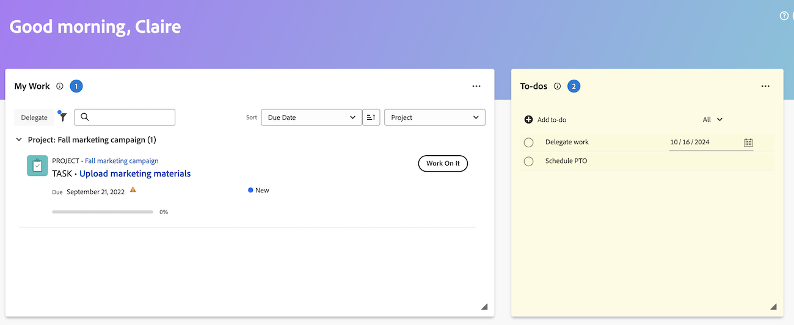

# Erstellen und Verwalten persönlicher Aufgabenelemente

Sie können im Bereich „Startseite“ im Widget „Aufgaben[!UICONTROL  persönliche ] erstellen. Die Aufgaben sind persönliche Aufgaben, die Sie selbst erstellen.

Sie und andere Benutzer können Ihre persönlichen Aufgaben in einem persönlichen Aufgabenbericht anzeigen. Von dort aus können sie sie bei Bedarf zu Projekten hinzufügen.

>[!TIP]
>
>Arbeitselemente, die Sie über die Benutzerprofilseite an andere Benutzer oder an sich selbst senden, werden auch im Aufgabenwidget im Bereich Startseite des Benutzers angezeigt. Weitere Informationen finden Sie unter [Persönliche Aufgaben erstellen](/help/quicksilver/workfront-basics/updating-work-items-and-viewing-updates/create-personal-tasks.md).

## Zugriffsanforderungen

+++ Erweitern, um die Zugriffsanforderungen für die in diesem Artikel beschriebene Funktionalität anzuzeigen. 

<table style="table-layout:auto"> 
 <col> 
 <col> 
 <tbody> 
  <tr> 
   <td role="rowheader"><strong>[!DNL Adobe Workfront package]</strong></td> 
   <td> 
Beliebig
 </td> 
  </tr> 
  <tr> 
   <td role="rowheader"><strong>[!DNL Adobe Workfront] Lizenz</strong></td> 
   <td> 
   
Standard

   
Work oder höher
 </td> 
  </tr> 
  <tr> 
   <td role="rowheader"><strong>Konfigurationen der Zugriffsebene</strong></td> 
   <td> 
Anzeigen- oder Bearbeitungszugriff für das Objekt, auf dem die Aktualisierung ausgeführt wird
 </td> 
  </tr> 
  <tr> 
   <td role="rowheader"><strong>Objektberechtigungen</strong></td> 
   <td> 
Zugriff auf [!UICONTROL Bearbeiten] oder höher für Aufgaben
 </td> 
  </tr> 
 </tbody> 
</table>

Weitere Informationen finden Sie unter [Zugriffsanforderungen](/help/quicksilver/administration-and-setup/add-users/access-levels-and-object-permissions/access-level-requirements-in-documentation.md) in der Dokumentation zu Workfront.

+++

## Erstellen von Aufgabenelementen

1. Klicken Sie auf **[!UICONTROL Hauptmenü]**  in der oberen rechten Ecke oder auf das **Hauptmenü**  in der oberen linken Ecke, falls verfügbar, und klicken Sie dann auf **[!UICONTROL Startseite]**.
1. (Bedingt) Klicken Sie auf **Anpassen** und anschließend auf **Aufgaben**, um das Aufgaben-Widget zu Ihrem Startbildschirm hinzuzufügen.
1. Gehen Sie zum **Aufgaben**-Widget und klicken Sie dann auf **Aufgabe hinzufügen**.
1. Geben Sie den Namen für Ihr persönliches Aufgabenelement ein und klicken Sie dann auf die Eingabetaste.
1. (Optional) Klicken Sie auf das **Datum**-Symbol , um ein Fälligkeitsdatum für das Element hinzuzufügen.
   
1. (Optional) Erstellen Sie einen persönlichen Aufgabenbericht oder Filter. Informationen zum Erstellen eines Filters für eine persönliche Aufgabe finden Sie unter [Filter: persönliche Aufgabe](/help/quicksilver/reports-and-dashboards/reports/custom-view-filter-grouping-samples/filter-personal-tasks.md).
Sie können Ihre Aufgabenelemente sowie die Aufgabenelemente anderer Benutzer im persönlichen Aufgabenbericht anzeigen.

## Verwalten von Aufgaben

1. Klicken Sie auf **[!UICONTROL Hauptmenü]**  in der oberen rechten Ecke oder auf das **Hauptmenü**  in der oberen linken Ecke, falls verfügbar, und klicken Sie dann auf **[!UICONTROL Startseite]**.
1. (Bedingt) Klicken Sie auf **Anpassen** und anschließend auf **Aufgaben**, um das Aufgaben-Widget zu Ihrem Startbildschirm hinzuzufügen.
1. Gehen Sie zum **Aufgaben**-Widget und führen Sie einen der folgenden Schritte aus:
   1. Um den Namen einer Aufgabe zu bearbeiten, klicken Sie in den Namensbereich und nehmen Sie eine Änderung vor.
   1. Um das Fälligkeitsdatum für eine Aufgabe zu ändern, klicken Sie auf das Kalendersymbol oder geben Sie ein neues Datum ein.
   1. Um ein Aufgabenelement zu löschen, bewegen Sie den Mauszeiger über das Element und klicken Sie dann auf das Symbol Löschen .
