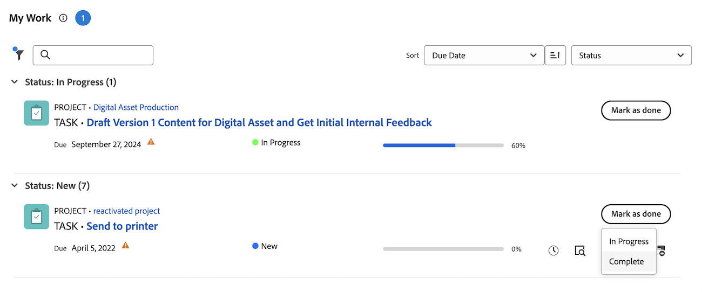

# Markieren Sie ein Element als [!UICONTROL Fertig] im Bereich [!UICONTROL Home] .

Sie können eine Aufgabe oder ein Problem als &quot;Fertig&quot;markieren, wenn Sie die Aufgabe oder der Problemverantwortliche sind. Wenn Sie eine Aufgabe oder ein Problem als [!UICONTROL Fertig] markieren, wird der Status der Aufgabe oder des Problems in [!UICONTROL Abgeschlossen] geändert.

>[!NOTE]
>
>Die Schaltfläche [!UICONTROL Fertig] wird nur angezeigt, wenn Sie einer der Ressourcen sind, die der Aufgabe oder dem Problem zugewiesen sind.

+++ Erweitern Sie , um die Zugriffsanforderungen für die Funktionalität in diesem Artikel anzuzeigen.

## Zugriffsanforderungen

Sie müssen über folgenden Zugriff verfügen, um die Schritte in diesem Artikel ausführen zu können:

<table style="table-layout:auto"> 
 <col> 
 </col> 
 <col> 
 </col> 
 <tbody> 
  <tr> 
   <td role="rowheader"><strong>[!DNL Adobe Workfront plan*]</strong></td> 
   <td> 
Alle
 </td> 
  </tr> 
  <tr> 
   <td role="rowheader"><strong>[!DNL Adobe Workfront] license*</strong></td> 
   <td> 
[!UICONTROL Arbeit] oder höher
 </td> 
  </tr> 
  <tr> 
   <td role="rowheader"><strong>Konfigurationen auf Zugriffsebene*</strong></td> 
   <td> 
[!UICONTROL Zugriff auf Aufgaben und Probleme bearbeiten
 
Hinweis: Wenn Sie immer noch keinen Zugriff haben, fragen Sie Ihren [!DNL Workfront] -Administrator, ob er zusätzliche Zugriffsbeschränkungen für Ihre Zugriffsebene festlegt. Informationen dazu, wie ein [!DNL Workfront] -Administrator Ihre Zugriffsebene ändern kann, finden Sie unter <a href="../../../administration-and-setup/add-users/configure-and-grant-access/create-modify-access-levels.md" class="MCXref xref">Benutzerdefinierte Zugriffsebenen erstellen oder ändern</a>.
 </td> 
  </tr> 
  <tr> 
   <td role="rowheader"><strong>Objektberechtigungen</strong></td> 
   <td> 
Contribute-Berechtigungen oder höher für die Aufgaben und Probleme, an denen Sie arbeiten müssen
 
Weitere Informationen zum Anfordern von zusätzlichem Zugriff finden Sie unter <a href="../../../workfront-basics/grant-and-request-access-to-objects/request-access.md" class="MCXref xref">Anfordern des Zugriffs auf Objekte </a>.
 </td> 
  </tr> 
 </tbody> 
</table>

&#42;Wenden Sie sich an Ihren [!DNL Workfront] -Administrator, um zu erfahren, welchen Plan, welchen Lizenztyp oder welchen Zugriff Sie haben.

+++

## Kennzeichnen eines Arbeitselements als &quot;Fertig&quot;im Widget &quot;Meine Arbeit&quot;

1. Klicken Sie oben rechts auf das Hauptmenü ]** und dann auf**[!UICONTROL  Startseite ]**.**[!UICONTROL 
1. (Bedingt) Klicken Sie auf **Anpassen** , um das Widget **Meine Arbeit** hinzuzufügen.
1. Suchen Sie das Arbeitselement und klicken Sie dann auf **[!UICONTROL Als Fertig markieren]** im Arbeitselement.
Weitere Informationen dazu, wie diese Schaltfläche angezeigt werden kann, finden Sie unter [Grundlegendes zu den Optionen der Schaltfläche [!UICONTROL Fertig] ](#understand-the-options-of-the-done-button) .
   

## Kennzeichnen eines Arbeitselements Fertig im Bedienfeld &quot;Zusammenfassung&quot;

Sie können ein Arbeitselement im Widget My Tasks and My Issues über das Bedienfeld &quot;Zusammenfassung&quot;mit &quot;Fertig&quot;markieren.

1. Klicken Sie oben rechts auf das Hauptmenü ]** und dann auf**[!UICONTROL  Startseite ]**.**[!UICONTROL 
1. (Bedingt) Klicken Sie auf **Anpassen** , um die Widgets **My Tasks** oder **My Issues** hinzuzufügen.
1. Bewegen Sie den Mauszeiger über das Arbeitselement und klicken Sie dann auf das Symbol **Zusammenfassung** .
   
1. Klicken Sie oben im Bedienfeld &quot;Zusammenfassung&quot;auf **Als fertig markieren** .

## Machen Sie sich mit den Optionen der Schaltfläche [!UICONTROL Fertig] vertraut

Standardmäßig ändert das Klicken auf die Schaltfläche [!UICONTROL Fertig] für ein Arbeitselement den Status dieses Elements in [!UICONTROL Fertig] (für Aufgaben) oder [!UICONTROL Aufgelöst] (für Probleme).

Ihr [!DNL Adobe Workfront] -Administrator kann anpassen, welche Status mit der Schaltfläche [!UICONTROL Fertig] verknüpft sind, und diese Anpassungen auf Ihr Home-Team anwenden.

Je nachdem, wie viele Status mit der Schaltfläche [!UICONTROL Fertig] verknüpft sind oder wie viele Ressourcen der Aufgabe oder dem Problem zugewiesen sind, kann sich das Aussehen der Schaltfläche [!UICONTROL Fertig] ändern.

* [Schaltfläche [!UICONTROL Fertig], die mit einem Status verknüpft ist](#done-button-associated-with-one-status)
* [Schaltfläche [!UICONTROL Fertig] für mehrere Status](#done-button-associated-with-multiple-statuses)
* [Schaltfläche [!UICONTROL Fertig] für Elemente, die mehreren Ressourcen zugewiesen sind](#done-button-for-items-assigned-to-multiple-resources)

### Schaltfläche [!UICONTROL Fertig], die mit einem Status verknüpft ist

Wenn die Schaltfläche [!UICONTROL Fertig] mit einem Status verknüpft ist und das Arbeitselement Ihnen nur zugewiesen ist, lautet die Schaltfläche **[!UICONTROL Fertig]**. Wenn Sie darauf klicken, wird der Status der Aufgabe oder des Problems in den Status geändert, der mit der Schaltfläche [!UICONTROL Fertig] verknüpft ist.

Um zu verstehen, welcher Status mit der Schaltfläche [!UICONTROL Fertig] verknüpft ist, überprüfen Sie die [!UICONTROL Team-Einstellungen] Ihres Home-Teams für den Abschnitt [!UICONTROL Fertig-Schaltfläche] , wie unter [Team-Einstellungen bearbeiten](../../../people-teams-and-groups/create-and-manage-teams/edit-team-settings.md) beschrieben.

Wenn Sie keinem Home-Team zugewiesen sind, wird der Standardstatus beim Klicken auf [!UICONTROL Fertig] ausgewählt, wie oben unter [Optionen der Schaltfläche [!UICONTROL Fertig] verstehen](#understand-the-options-of-the-done-button) beschrieben.

### Schaltfläche [!UICONTROL Fertig] für mehrere Status

Wenn die Schaltfläche [!UICONTROL Fertig] mit mehr als einem Status verknüpft ist, zeigt die Schaltfläche das Wort **[!UICONTROL Fertig]** an, gefolgt von einem Dropdown-Menü. In diesem Szenario können Sie nicht einfach auf [!UICONTROL Fertig] klicken. Sie müssen einen Status aus dem Dropdown-Menü auswählen. Wählen Sie den Status aus, der am besten zum Abschluss des Arbeitselements passt. Dadurch ändern Sie den Status des Arbeitselements.

Informationen dazu, wie Sie mehrere Status mit der Schaltfläche [!UICONTROL Fertig] verknüpfen können, finden Sie unter [Konfigurieren der Schaltfläche [!UICONTROL Fertig] für Aufgaben](../../../people-teams-and-groups/create-and-manage-teams/configure-the-done-button-for-tasks.md) und [Konfigurieren der Schaltfläche [!UICONTROL Fertig] für Probleme](../../../people-teams-and-groups/create-and-manage-teams/configure-the-done-button-for-issues.md).

### Schaltfläche [!UICONTROL Fertig] für Elemente, die mehreren Ressourcen zugewiesen sind

Wenn die Aufgabe oder das Problem mehr als einer Ressource zugewiesen ist, zeigt die Schaltfläche das Wort **[!UICONTROL Fertig]** an, gefolgt von einem Dropdown-Menü. Im Dropdown-Menü haben Sie die Möglichkeit, zwischen **[!UICONTROL Fertig mit meinem Teil]** (der Team-Mitgliedern mitteilt, dass Sie mit Ihrem Teil der Aufgabe fertig sind) oder dem Status zu wählen, der der Schaltfläche [!UICONTROL Fertig] zugeordnet ist (mit der das Element abgeschlossen wird). Nachdem Sie **[!UICONTROL Fertig mit meinem Teil]** ausgewählt haben, wird das Arbeitselement aus Ihrer Arbeitsliste entfernt, bleibt jedoch in der Arbeitsliste der dem Arbeitselement weiterhin zugewiesenen Elemente.\
Wenn die Schaltfläche Fertig mit mehreren Status verknüpft ist, werden diese unter **Fertig mit meinem Teil** aufgeführt.

>[!NOTE]
>
>Bei einer Aufgabe oder einem Problem mit mehreren Verantwortlichen ist jeder Benutzer dafür verantwortlich anzugeben, dass seine eigene Zuweisung zu der Aufgabe oder dem Problem tatsächlich abgeschlossen wurde. Aus diesem Grund muss jeder Bevollmächtigte auf [!UICONTROL Fertig] klicken, um anzuzeigen, dass er die ihm für das Element zugewiesene Arbeit abgeschlossen hat.

