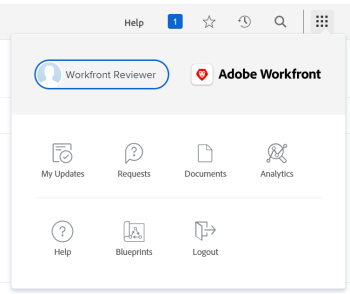

# Verwenden Sie den Bereich [!UICONTROL Meine Aktualisierungen].

Die hervorgehobenen Informationen auf dieser Seite beziehen sich auf Funktionen, die noch nicht allgemein verfügbar sind. Sie ist nur in der Vorschau -Umgebung für alle Kunden verfügbar. Nach den monatlichen Releases in der Produktion stehen dieselben Funktionen auch in der Produktionsumgebung für Kunden zur Verfügung, die schnelle Releases aktiviert haben. 

Informationen zu Schnellversionen finden Sie unter [Aktivieren oder Deaktivieren von Schnellversionen für Ihre Organisation](/help/quicksilver/administration-and-setup/set-up-workfront/configure-system-defaults/enable-fast-release-process.md). 

Im Bereich [!UICONTROL Meine Updates] können Sie schnell die Genehmigungen überprüfen, die auf Ihre Entscheidung warten, oder die Konversationen, in die Sie aufgenommen wurden.

Als Benutzer mit einer [!UICONTROL Review]-Lizenz finden Sie standardmäßig den Bereich [!UICONTROL Meine Updates] im [!UICONTROL Hauptmenü] und der Bereich [!UICONTROL Meine Updates] ist die standardmäßige Landingpage für Sie.

Informationen zu [!DNL Adobe Workfront] finden Sie unter [[!DNL Adobe Workfront] Lizenzen - Übersicht](../../../administration-and-setup/add-users/access-levels-and-object-permissions/wf-licenses.md).

Wenn Sie einen anderen Lizenztyp als „Überprüfen“ haben, muss der [!DNL Workfront]- oder Gruppenadministrator den Bereich &quot;[!UICONTROL  Updates] zu Ihrer Layoutvorlage hinzufügen, um ihn im Hauptmenü anzuzeigen. Weitere Informationen finden Sie unter [Anpassen des [!UICONTROL Hauptmenüs] mithilfe einer Layout-Vorlage](../../../administration-and-setup/customize-workfront/use-layout-templates/customize-main-menu.md).

## Zugriffsanforderungen

+++ Erweitern Sie , um die Zugriffsanforderungen für die -Funktion in diesem Artikel anzuzeigen.

Sie müssen über folgenden Zugriff verfügen, um die Schritte in diesem Artikel ausführen zu können:

<table style="table-layout:auto"> 
 <col> 
 <col> 
 <tbody> 
  <tr> 
   <td role="rowheader"><strong>[!DNL Adobe Workfront plan]</strong></td> 
   <td> 
Beliebig
 </td> 
  </tr> 
  <tr> 
   <td role="rowheader"><strong>[!DNL Adobe Workfront] Lizenz*</strong></td> 
   <td> 
Neu: Mitwirkender oder höher

   Oder   
   
Aktuell: [!UICONTROL-Anfrage] oder höher
 </td> 
  </tr> 
  <tr> 
   <td role="rowheader"><strong>Konfiguration der Zugriffsebene</strong></td> 
   <td> 
Anzeigen des Zugriffs auf oder höher für alle Objekte, für die Sie in einer Konversation getaggt sind oder eine Genehmigung auflösen müssen (Projekte, Aufgaben, Probleme, Dokumente)
 </td> 
  </tr> 
  <tr> 
   <td role="rowheader"><strong>Objektberechtigungen</strong></td> 
   <td> 
[!UICONTROL Anzeigen] Berechtigungen oder höher für Projekte, Aufgaben, Probleme, Dokumente, bei denen Sie in einer Konversation getaggt sind oder eine Genehmigung auflösen müssen
 </td> 
  </tr> 
 </tbody> 
</table>

*Wenden Sie sich an Ihren [!DNL Workfront], um herauszufinden, über welchen Plan, welchen Lizenztyp oder welchen Zugriff Sie verfügen. Weitere Informationen finden Sie unter [Zugriffsanforderungen in der Dokumentation zu Workfront](/help/quicksilver/administration-and-setup/add-users/access-levels-and-object-permissions/access-level-requirements-in-documentation.md).

+++

## Voraussetzungen

Bevor Sie beginnen, benötigen Sie Folgendes:

* Wenn Sie eine andere [!DNL Workfront] als [!UICONTROL Überprüfen] haben, muss Ihr [!DNL Workfront]- oder Gruppenadministrator den Bereich [!UICONTROL Meine Updates] mithilfe einer Layout-Vorlage dem [!UICONTROL Hauptmenü] hinzufügen und Sie dieser Vorlage zuweisen.

* Benutzer, die eine Review-Lizenz besitzen, können den Bereich [!UICONTROL Meine Updates] standardmäßig in ihrem [!UICONTROL Hauptmenü] einsehen.

## Rufen Sie den Bereich [!UICONTROL Meine Aktualisierungen] auf

1. Klicken Sie **[!UICONTROL Hauptmenü]** auf **[!UICONTROL Meine Aktualisierungen]**.

   

   Der Bereich [!UICONTROL Meine Updates] wird geöffnet.

   Die Genehmigungen und Zugriffsanfragen, die Ihnen zugewiesen wurden, werden in der ersten Hälfte der Seite unter &quot;**Updates“**.

   

   

   

1. (Optional) Scrollen Sie zum unteren Rand des Bereichs [!UICONTROL **Meine Aktualisierungen**] und klicken Sie auf den nach rechts zeigenden Pfeil, um weitere Genehmigungen anzuzeigen, die auf zusätzlichen Seiten angezeigt werden.

   >[!TIP]
   >
   >Die ersten fünf Genehmigungen oder Zugriffsanfragen werden standardmäßig angezeigt. Die verbleibenden Genehmigungen werden auf zusätzlichen Seiten angezeigt. Sie können maximal 2.000 Genehmigungen im Bereich [!UICONTROL Meine Updates] anzeigen.

   

1. (Optional) Erweitern Sie das **[!UICONTROL Filter]** Dropdown- in der oberen rechten Ecke des Abschnitts **[!UICONTROL Meine Aktualisierungen]** und wählen Sie aus den folgenden Optionen:

   <table style="table-layout:auto"> 
    <col> 
    </col> 
    <col> 
    </col> 
    <tbody> 
     <tr> 
      <td role="rowheader"><strong>[!UICONTROL ALL]</strong></td> 
      <td>Genehmigungen, die Ihnen übermittelt oder von einem anderen Benutzer an Sie delegiert wurden. Informationen zum Delegieren von Genehmigungen finden Sie unter <a href="../../../review-and-approve-work/manage-approvals/delegate-approval-requests.md" class="MCXref xref">Delegieren einer Genehmigungsanfrage</a>. </td> 
     </tr> 
     <tr> 
      <td role="rowheader"><strong>[!UICONTROL delegierte Genehmigungen]</strong></td> 
      <td>Genehmigungen, die von einem anderen Benutzer an Sie delegiert wurden. </td> 
     </tr> 
     <tr> 
      <td role="rowheader"><strong>[!UICONTROL Meine Genehmigungen]</strong></td> 
      <td> 
Ihnen übermittelte Genehmigungen. 
 
Weitere Informationen zur Genehmigung von Elementen finden Sie unter <a href="../../../review-and-approve-work/manage-approvals/approving-work.md" class="MCXref xref">Genehmigen von </a>.
 </td> 
     </tr> 
    </tbody> 
   </table>

1. Gehen Sie wie folgt vor, um ein Element zu genehmigen oder abzulehnen oder Änderungen an einem Dokument vorzuschlagen:

   1. (Optional) Klicken Sie auf das **Dropdown**-Symbol  neben Ihrer Genehmigungsentscheidung (**[!UICONTROL Genehmigen]**, **[!UICONTROL Änderungen]**,**[!UICONTROL Ablehnen]**) und fügen Sie einen Kommentar hinzu und klicken Sie dann auf **[!UICONTROL Hinzufügen]**.

      Oder

      Klicken Sie **[!UICONTROL Überspringen]**, wenn Sie keinen Kommentar eingeben möchten.

      

      >[!NOTE]
      >
      >Die [!UICONTROL Änderungen] wird nur für Dokumentgenehmigungen angezeigt.

      Je nachdem, welches Dropdown-Symbol Sie ausgewählt haben, wird das Element genehmigt, abgelehnt oder, im Fall einer Dokumentgenehmigung, mit einer Anfrage zum Vornehmen zusätzlicher Änderungen genehmigt.

      >[!TIP]
      >
      >Wenn Sie Ihrer Entscheidung keinen Kommentar hinzufügen möchten, können Sie auf die Schaltfläche **[!UICONTROL Genehmigen]**, **[!UICONTROL Ablehnen]** oder **[!UICONTROL Änderungen]** klicken und die Genehmigungsentscheidung wird sofort erteilt.
      >
      >
      >
      >
      >Weitere Informationen zur Genehmigung von Arbeiten finden Sie unter [Arbeit genehmigen](../../../review-and-approve-work/manage-approvals/approving-work.md).

1. Klicken Sie **[!UICONTROL Zugriff gewähren]**, um die an Sie gesendete Zugriffsanfrage zu gewähren

   Oder

   Erweitern Sie das **[!UICONTROL Zugriff ändern]** Dropdown-Menü, um den Zugriff zu ändern, der vor der Gewährung angefordert wurde.

   

1. (Optional) Klicken Sie auf **[!UICONTROL Ignorieren]**, um die Zugriffsanfrage aus Ihrer Genehmigungsliste zu löschen, ohne sie zu gewähren.
1. Klicken Sie **[!UICONTROL Meine Genehmigungen delegieren]**, um die an Sie übermittelten Genehmigungen zu delegieren, wenn Sie für einige Zeit nicht mehr zur Verfügung stehen, um Genehmigungsentscheidungen zu treffen. Weitere Informationen zum Delegieren von Genehmigungen finden Sie unter [Delegieren von Genehmigungsanfragen](../../../review-and-approve-work/manage-approvals/delegate-approval-requests.md).
1. Scrollen Sie zum Bereich **[!UICONTROL Erwähnungen]** unter Ihren Genehmigungen. Hier können Sie alle Elemente anzeigen, bei denen Sie in eine Konversation einbezogen wurden.

   >[!TIP]
   >
   >Die ersten 50 Erwähnungen werden standardmäßig angezeigt.

1. (Optional) Klicken Sie auf **[!UICONTROL Weitere Updates anzeigen]**, um weitere Erwähnungen anzuzeigen.
1. (Optional) Klicken Sie **[!UICONTROL Antworten]**, um auf einen Kommentar zu antworten, und führen Sie einen der folgenden Schritte aus:
   * Mit der Eingabe einer Antwort beginnen
   * Verwenden Sie die Rich-Text-Symbolleiste, um Text zu formatieren, Links, Listen, Emojis, Anführungszeichen oder Bilder zu Ihrer Nachricht hinzuzufügen
   * Fügen Sie Benutzer oder Teams hinzu, um sie über Ihre Antwort zu informieren.

     Weitere Informationen zum Antworten auf Aktualisierungen finden Sie unter [Aktualisierungsarbeit](/help/quicksilver/workfront-basics/updating-work-items-and-viewing-updates/update-work.md).

     Wenn Sie mit dem Hinzufügen der Antwort fertig sind, klicken Sie auf **[!UICONTROL Senden]**.

     

     

     

1. (Optional) Klicken Sie auf **[!UICONTROL Aktuelle Seite anheften]**, um den Bereich [!UICONTROL Meine Aktualisierungen] an Ihre obere Navigation anzuheften.
