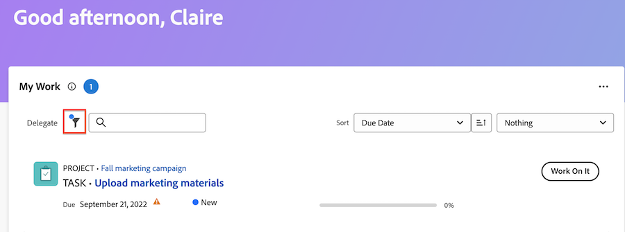
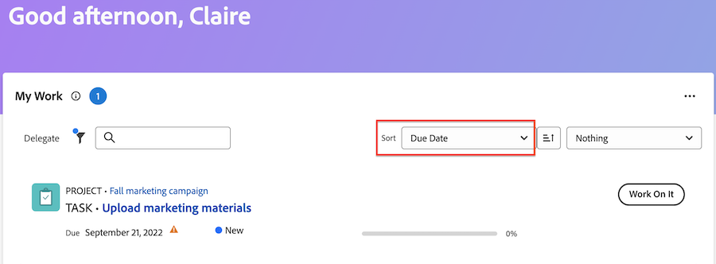

# Verwalten Ihrer Arbeit mit dem Widget „Meine Arbeit“

Das Widget Meine Arbeit zeigt alle Ihnen zugewiesenen Aufgaben, Probleme und Anfragen an einem Ort an. Hier können Sie Ihre Arbeit filtern und organisieren, die Zeit protokollieren, Aktualisierungen vornehmen und Arbeitselemente als abgeschlossen markieren.

>[!IMPORTANT]
>
>Um Aufgaben und Probleme im Widget „Meine Arbeit“ anzuzeigen, muss das übergeordnete Projekt sich im Status „Aktuell“ oder in einem Status befinden, der „Aktuell“ entspricht.

## Zugriffsanforderungen

+++ Erweitern, um die Zugriffsanforderungen für die in diesem Artikel beschriebene Funktionalität anzuzeigen.

<table style="table-layout:auto"> 
 <col> 
 </col> 
 <col> 
 </col> 
 <tbody> 
  <tr> 
   <td role="rowheader"><strong>[!DNL Adobe Workfront package]</strong></td> 
   <td> 
Beliebig
 </td> 
  </tr> 
  <tr> 
   <td role="rowheader"><strong>[!DNL Adobe Workfront] Lizenz</strong></td> 
   <td> 
      
Licht oder höher

   
Beitragen oder höher

  </td> 
  </tr>
  <tr> 
   <td role="rowheader"><strong>Konfigurationen der Zugriffsebene</strong></td> 
   <td> 
Zugriff auf Projekte, Aufgaben, Probleme und Dokumente in [!UICONTROL View] oder höher
 </td> 
  </tr>  
  <tr> 
   <td role="rowheader"><strong>Objektberechtigungen</strong></td> 
   <td> 
Tragen Sie Berechtigungen oder höher zu den Aufgaben und Problemen bei, an denen Sie arbeiten müssen
  </td> 
  </tr> 
 </tbody> 
</table>

Weitere Informationen finden Sie unter [Zugriffsanforderungen](/help/quicksilver/administration-and-setup/add-users/access-levels-and-object-permissions/access-level-requirements-in-documentation.md) in der Dokumentation zu Workfront.

+++

## Arbeiten mit Filtern suchen

Sie können die Filter Meine Arbeit so anpassen, dass sie auf bestimmte Elemente in Ihrer Arbeitsliste fokussiert sind:

### Filterdetails

<table>
  <tbody>
    <tr>
      <td>Wird bearbeitet an</td>
      <td>Zeigt Elemente an, an denen Sie derzeit arbeiten</td>
    </tr>
    <tr>
      <td>Startbereit</td>
      <td>Zeigt Elemente an mit 
      <ul>
      <li>Keine unvollständigen Vorgänger oder Aufgabenbeschränkungen</li>
      
und

      <li>Das geplante Startdatum liegt in den letzten oder bis zu zwei Wochen in der Zukunft</li>
      </ul>
      </td>
    </tr>
    <tr>
      <td>Nicht bereit</td>
      <td>Zeigt Elemente an, die
       <ul>
      <li>Unvollständige Vorgänger oder Aufgabenbeschränkungen verhindern, dass das Element bearbeitet wird</li>
      
oder

      <li>Das geplante Startdatum liegt mehr als zwei Wochen in der Zukunft</li>
      </ul>
       </td>
    </tr>
    <tr>
      <td>Angefordert</td>
      <td>Zeigt Probleme an, mit denen Sie noch nicht begonnen haben</td>
    </tr>
    <tr>
      <td>Von mir delegiert</td>
      <td>Zeigt Elemente an, die Sie an andere Benutzer delegiert haben</td>
    </tr>
    <tr>
      <td>An mich delegiert</td>
      <td>Zeigt Elemente an, die Ihnen von Benutzern zugewiesen wurden</td>
    </tr>
    <tr>
      <td>Abgeschlossen</td>
      <td>Zeigt Arbeiten an, die in den letzten zwei Wochen abgeschlossen wurden. Diese Filteroption umfasst keine Genehmigungen.</td>
    </tr>
  </tbody>
</table>

>[!TIP]
>
>Wenn Sie nach spezifischeren Filteroptionen suchen, können Sie die Widgets Meine Aufgabe oder Meine Anfrage verwenden. Weitere Informationen zu den Filtern Meine Aufgabe und Meine Probleme finden Sie unter [Übersicht über Widget-Filter &#x200B;](/help/quicksilver/workfront-basics/using-home/using-the-home-area/widget-filter-overview-home.md).

## Organisieren Ihrer Arbeit

Sie können die Sortier- und Gruppenfunktionen des Widgets Meine Arbeit verwenden, um Ihre Arbeit so zu organisieren, dass es für Sie sinnvoll ist.

### Sortieren

Sie können die Arbeitsliste sortieren nach

* Fälligkeitsdatum
Überfällige Elemente zeigen ein Warnsymbol neben dem Datum an. Workfront verwendet das geplante Abschlussdatum, um festzustellen, ob Aufgaben und Probleme überfällig sind.
* Name
* Prozent abgeschlossen
* Status

>[!TIP]
>
>Um eine Liste zu erstellen, die alle überfälligen Elemente oben im Widget Meine Arbeit anzeigt, sortieren Sie nach Fälligkeitsdatum und wenden Sie keine Gruppierung an.

### Gruppe

Sie können die Arbeitsliste gruppieren nach

* Projekt
* Status
* Fälligkeitsdatum
Das Fälligkeitsdatum wird durch das geplante Abschlussdatum bestimmt.

>[!NOTE]
>
>Wenn Sie eine Gruppierung anwenden, bestimmt Ihre Auswahl im Menü Sortieren die Reihenfolge innerhalb der Gruppierung.

## Aktualisieren von Arbeitselementinformationen in der Zusammenfassung

Sie können das Bedienfeld Zusammenfassung öffnen, um Informationen in einer Aufgabe oder einem Problem schnell zu aktualisieren. In der Zusammenfassung haben Sie folgende Möglichkeiten

* Prozentualen Fertigstellungsgrad aktualisieren
* Aktualisierung hinzufügen
* Navigieren Sie zum Dokumentbereich, um ein Dokument hochzuladen
* Arbeitsaufgabendetails anzeigen und benutzerdefinierte Felder aktualisieren
Workfront-Admins können anpassen, welche Felder in der Layout-Vorlage in der Zusammenfassung angezeigt werden. Weitere Informationen finden Sie unter [Anpassen des Bedienfelds Zusammenfassung mithilfe einer Layout-Vorlage](/help/quicksilver/administration-and-setup/customize-workfront/use-layout-templates/customize-home-summary-layout-template.md).
* Ändern des Status des Arbeitselements
* Teilaufgaben anzeigen
* Zeit erfassen
* Angehängte Genehmigungsprozesse anzeigen

Um die Zusammenfassung zu öffnen, bewegen Sie den Mauszeiger über das Arbeitselement und klicken Sie dann auf **Zusammenfassung** Symbol .

Weitere Informationen zur Verwendung des Bedienfelds Zusammenfassung finden Sie unter [Übersicht](/help/quicksilver/workfront-basics/the-new-workfront-experience/summary-overview.md).

## Verwenden von Schnellaktionen zum Aktualisieren von Arbeitselementen

Das Schnellaktionsmenü bietet folgende Möglichkeiten

* Zeit erfassen
* Update hinzufügen
* Aktualisieren eines benutzerdefinierten Formulars
* Datei hochladen

Um das Schnellaktionsmenü zu finden, bewegen Sie den Mauszeiger über das Arbeitselement. Die Liste der Schnellaktionen wird neben der Schaltfläche **Bearbeiten** oder **Fertig** angezeigt.

## Anzeigen von Genehmigungen und Teamanfragen

Genehmigungen und Teamanfragen werden nicht im Widget Meine Arbeit angezeigt. Wenn Sie regelmäßig mit Validierungen und Teamanfragen arbeiten, empfehlen wir, die folgenden Widgets zu Ihrer neuen Startseite hinzuzufügen:

* Meine Genehmigung
* Alle Genehmigungen
* Teamanfragen

Informationen zum Hinzufügen von Widgets zur neuen Startseite finden Sie unter [Hinzufügen, Bearbeiten oder Entfernen von Widgets in der Startseite](/help/quicksilver/workfront-basics/using-home/using-the-home-area/add-edit-remove-widgets-in-new-home.md).
