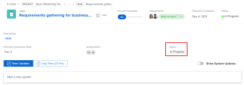

# Aktualisieren oder Bearbeiten eines Arbeitselements im Bereich [!UICONTROL Home]

<!--Audited: April 2024-->

Sie können ein Arbeitselement im Bereich [!UICONTROL Startseite] in [!DNL Adobe Workfront] anzeigen und ihm Aktualisierungen hinzufügen. Sie können auch andere Daten im Zusammenhang mit dem Arbeitselement bearbeiten, wenn Sie Zugriff darauf haben.

## Zugriffsanforderungen

Sie müssen über folgenden Zugriff verfügen, um die Schritte in diesem Artikel ausführen zu können:

<table style="table-layout:auto"> 
 <col> 
 </col> 
 <col> 
 </col> 
 <tbody> 
  <tr> 
   <td role="rowheader"><strong>[!DNL Adobe Workfront plan]</strong></td> 
   <td> 
Alle
 </td> 
  </tr> 
  <tr> 
   <td role="rowheader"><strong>[!DNL Adobe Workfront] license*</strong></td> 
   <td> 
Neu: Standard

   Oder

Aktuell: [!UICONTROL Arbeit] oder höher
 </td> 
  </tr> 
  <tr> 
   <td role="rowheader"><strong>Konfiguration der Zugriffsebene</strong></td> 
   <td> 
[!UICONTROL Zugriff auf Aufgaben und Probleme bearbeiten
 </td> 
  </tr> 
  <tr> 
   <td role="rowheader"><strong>Objektberechtigungen</strong></td> 
   <td> 
Contribute-Berechtigungen oder höher für die Aufgaben und Probleme, an denen Sie arbeiten müssen
 </td> 
  </tr> 
 </tbody> 
</table>

*Wenden Sie sich an Ihren [!DNL Workfront] -Administrator, um zu erfahren, welchen Plan, welchen Lizenztyp oder welchen Zugriff Sie haben. Weitere Informationen finden Sie unter [Zugriffsanforderungen in der Workfront-Dokumentation](/help/quicksilver/administration-and-setup/add-users/access-levels-and-object-permissions/access-level-requirements-in-documentation.md).

## Anzeigen von Aktualisierungen für ein Arbeitselement

Sie können Aktualisierungen für jedes Arbeitselement in der [!UICONTROL Arbeitsliste] anzeigen:

1. Klicken Sie oben rechts auf das Hauptmenü ]** oder, falls verfügbar, auf das Menü** Hauptmenü&#x200B;** in der oberen linken Ecke und klicken Sie dann auf**[!UICONTROL  Startseite ]**.**[!UICONTROL 
1. Wählen Sie im Bereich **[!UICONTROL Arbeitsliste]** das Element aus, für das Sie Aktualisierungen anzeigen möchten.\
   Aktualisierungen werden im rechten Bereich angezeigt.

1. (Optional) Um Systemaktualisierungen so zu filtern, dass nur Benutzeraktualisierungen angezeigt werden, schalten Sie **[!UICONTROL Systemaktualisierungen anzeigen]** auf Aus.

   

## Bereitstellen von Aktualisierungen für ein Arbeitselement

Sie können Aktualisierungen für jedes Arbeitselement in der Liste [!UICONTROL Arbeit] bereitstellen:

1. Klicken Sie oben rechts auf das Hauptmenü ]** oder, falls verfügbar, auf das Menü** Hauptmenü&#x200B;** in der oberen linken Ecke und klicken Sie dann auf**[!UICONTROL  Startseite ]**.**[!UICONTROL 
1. Wählen Sie im Bereich **[!UICONTROL Arbeitsliste]** das Element aus, für das Sie eine Aktualisierung bereitstellen möchten.
1. Klicken Sie im rechten Bereich auf **[!UICONTROL Aktualisieren]** , um ein Textfeld anzuzeigen.

   

1. Geben Sie im entsprechenden Feld Ihre Aktualisierung an.
1. (Optional) Geben Sie eine der folgenden Informationen an:\
   **[!UICONTROL Veröffentlichungsdatum]:** Wählen Sie ein Datum aus der Datumsauswahl aus, wenn Sie sich verpflichten, das Arbeitselement abzuschließen.\
   **[!UICONTROL Wie geht es?]:** Wählen Sie eine neue Bedingung für die Aufgabe oder das Problem aus. Weitere Informationen zu Aufgaben- und Problembedingungen finden Sie unter [Aktualisierungsbedingung für Aufgaben und Probleme](../../../manage-work/projects/updating-work-in-a-project/update-condition-for-tasks-and-issues.md).\
   **[!UICONTROL Status]:** Wählen Sie einen neuen Status für die Aufgabe oder das Problem aus. Weitere Informationen zum Aufgabenstatus finden Sie unter [Aufgabenstatus aktualisieren](../../../manage-work/projects/updating-work-in-a-project/update-task-status.md). Weitere Informationen zu den Problemstatus finden Sie unter [Zugriff auf die Liste der Systemfehlerstatus](../../../administration-and-setup/customize-workfront/creating-custom-status-and-priority-labels/issue-statuses.md).\
   **[!UICONTROL Abschlussleiste]:** Gibt den Prozentsatz der abgeschlossenen Arbeit an, indem der Fortschrittsbalken auf den gewünschten Prozentsatz verschoben wird. Sie können auch auf die Abschlussleiste doppelklicken und den Prozentsatz eingeben, der abgeschlossen ist.

1. Klicken Sie auf **[!UICONTROL Aktualisieren]**.

## Arbeitselement bearbeiten

Sie können jedes Feld eines beliebigen Arbeitselements bearbeiten, auf das Sie Zugriff haben.

1. Klicken Sie oben rechts auf das Hauptmenü ]** oder, falls verfügbar, auf das Menü** Hauptmenü&#x200B;** in der oberen linken Ecke und klicken Sie dann auf**[!UICONTROL  Startseite ]**.**[!UICONTROL 
1. Wählen Sie im Bereich **[!UICONTROL Arbeitsliste]** das Element aus, das Sie bearbeiten möchten.\
   Alle Felder, auf die Sie Zugriff haben, werden im rechten Bereich angezeigt.

1. Bewegen Sie im rechten Bereich den Mauszeiger über das Feld, das Sie bearbeiten möchten.\
   Wenn Sie berechtigt sind, das Feld zu bearbeiten, wird das Feld hervorgehoben, während Sie den Mauszeiger darüber bewegen.

   

1. Klicken Sie auf das Feld, das Sie bearbeiten möchten, und nehmen Sie die gewünschte Aktualisierung vor.
1. Klicken Sie aus dem Feld weg, um Ihre Änderungen zu speichern.
