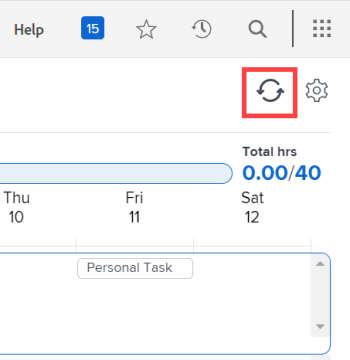
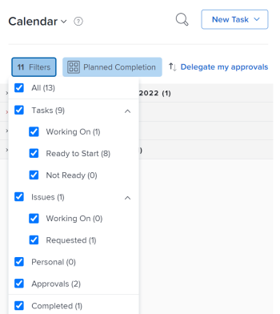

# Verwenden Sie die [!UICONTROL Home Calendar] Ansicht

Sie können die Kalenderansicht im [!UICONTROL Startseite] Bereich zur Verwaltung Ihrer Arbeitstage und Arbeitsaufgaben. Nur Sie können Ihre [!UICONTROL Home Calendar].

>[!NOTE]
>
>Die [!UICONTROL Kalender] Ansicht in der [!UICONTROL Startseite] -Bereich unterscheidet sich von einem [!DNL Adobe Workfront] [!UICONTROL Kalender] -Bericht, ein dynamischer Bericht, der eine visuelle Darstellung Ihrer Arbeit bietet. Informationen zum [!DNL Workfront] [!UICONTROL Kalender] Bericht, siehe [Kalenderberichte - Übersicht](../../../reports-and-dashboards/reports/calendars/calendar-reports-overview.md).
>
>  <!--
>  <li data-mc-conditions="QuicksilverOrClassic.Draft mode">Due to a temporary problem, your Workfront Calendar data might not display as described in this article. This problem will be fixed in the near future. (NOTE: From Alina: Spoke with Lisa and Court and they agreed to draft or delete this. Court could not remember what this was referring to and Lisa did not add this note. Lisa might update this if she hears from the team that this is still accurate.)</li>>
>  -->

## Zugriffsanforderungen

Sie müssen über folgenden Zugriff verfügen, um die Schritte in diesem Artikel ausführen zu können:

<table style="table-layout:auto"> 
 <col> 
 </col> 
 <col> 
 </col> 
 <tbody> 
  <tr> 
   <td role="rowheader"><strong>[!DNL Adobe Workfront plan*]</strong></td> 
   <td> 
Beliebig
 </td> 
  </tr> 
  <tr> 
   <td role="rowheader"><strong>[!DNL Adobe Workfront] license*</strong></td> 
   <td> 
[!UICONTROL Arbeit] oder höher
 </td> 
  </tr> 
  <tr> 
   <td role="rowheader"><strong>Konfigurationen auf Zugriffsebene*</strong></td> 
   <td> 
[!UICONTROL Zugriff auf Aufgaben und Probleme bearbeiten
 
Hinweis: Wenn Sie noch keinen Zugriff haben, fragen Sie Ihren [!DNL Workfront] Administrator , wenn sie zusätzliche Einschränkungen für Ihre Zugriffsebene festlegen. Für Informationen zur [!DNL Workfront] Administrator kann Ihre Zugriffsebene ändern, siehe <a href="../../../administration-and-setup/add-users/configure-and-grant-access/create-modify-access-levels.md" class="MCXref xref">Benutzerdefinierte Zugriffsebenen erstellen oder ändern</a>.
 </td> 
  </tr> 
  <tr> 
   <td role="rowheader"><strong>Objektberechtigungen</strong></td> 
   <td> 
[!UICONTROL Beitragsberechtigungen oder höher zu den Aufgaben und Problemen, die Sie dem Kalender hinzufügen möchten
 
Informationen zum Anfordern von zusätzlichem Zugriff finden Sie unter <a href="../../../workfront-basics/grant-and-request-access-to-objects/request-access.md" class="MCXref xref">Zugriff auf Objekte anfordern </a>.
 </td> 
  </tr> 
 </tbody> 
</table>

&#42;Wenden Sie sich an Ihren [!DNL Workfront] Administrator.

## Planen Sie Arbeitselemente in Ihren [!UICONTROL Home Calendar]

Sie können die [!UICONTROL Home Calendar] , um Arbeitselemente für Ihre Woche zu planen.

>[!NOTE]
>
>Platzieren eines Arbeitselements auf Ihrem [!UICONTROL Home Calendar] ändert nicht die vorhandenen Daten, die mit dem Arbeitselement verknüpft sind.

So fügen Sie eine [!DNL Workfront] Arbeitselement für Ihren Kalender:

1. Navigieren Sie zu [!UICONTROL Home Calendar] Ansicht, wie unter [Anzeigen der [!UICONTROL Home Calendar]](../../../workfront-basics/using-home/using-the-home-area/view-home-calendar.md).

   Im linken Bereich werden alle Arbeitselemente angezeigt, die Ihnen oder Ihren Gruppen, Teams oder Jobrollen zugewiesen sind. Sie können die Liste sortieren und filtern, sodass nur bestimmte Elemente angezeigt werden.

   Weitere Informationen finden Sie unter [Arbeitselemente filtern und sortieren](#filter-and-sort-work-items) später in diesem Artikel.

1. Ziehen Sie das Arbeitselement aus dem linken Bereich an den Tag und die Uhrzeit, an dem Sie es bearbeiten möchten.

   Wenn Sie planen, dass Sie nach dem geplanten Abschlussdatum oder für mehr Zeit als der geplanten Anzahl von Stunden an einem Artikel arbeiten, wird das Arbeitselement rot angezeigt und es wird ein Warnhinweis angezeigt.

   So erfahren Sie mehr über die Fälligkeitsdaten von Arbeitselementen und darüber, wie sie sich auf die zugewiesene Zeit im [!UICONTROL Home Calendar], siehe  [[!UICONTROL Home Calendar] Ansicht](../../../workfront-basics/using-home/using-the-home-area/home-calendar-view.md).

1. Führen Sie einen der folgenden Schritte aus:

   * **So planen Sie ein Arbeitselement für mehrere Tage:** Wiederholen Sie Schritt 2, um das Element zu jedem Tag und jeder Uhrzeit hinzuzufügen, an denen Sie es bearbeiten möchten.
   * **So ändern Sie die Dauer eines Kalenderelements:** Bewegen Sie den Mauszeiger über den unteren Rand des Elements, bis der Cursor zu einem Doppelpfeil wird, und ziehen Sie dann den unteren Rand zur gewünschten Endzeit.
   * **So löschen Sie ein Kalenderelement:** Bewegen Sie den Mauszeiger über das Element und klicken Sie auf [!UICONTROL Papierkorb] angezeigt.

## Arbeitselement auf Ihrer [!UICONTROL Home Calendar]

Sie können Aktualisierungen an Arbeitselementen vornehmen, die in [!UICONTROL Home Calendar] anzeigen. Ihre Aktualisierungen werden auch auf der Seite [!UICONTROL Updates] des eigentlichen Arbeitselements.

1. Navigieren Sie zu [!UICONTROL Home Calendar] Ansicht, wie unter [Anzeigen der [!UICONTROL Home Calendar]](../../../workfront-basics/using-home/using-the-home-area/view-home-calendar.md).

1. Öffnen Sie die [!UICONTROL Details] für das Arbeitselement, das Sie aktualisieren möchten:

   * Im linken Bereich: Wählen Sie das Arbeitselement aus und klicken Sie auf **[!UICONTROL Details]**.
   * Im Kalender: Klicken Sie auf das geplante Kalenderereignis.

   Details zum Arbeitselement werden in einem Bereich angezeigt, der rechts vom Fenster angezeigt wird.

   

1. Führen Sie einen der folgenden Schritte aus, um das Arbeitselement zu aktualisieren:

   * Im **[!UICONTROL Neue Aktualisierung starten]** ein, geben Sie Ihre Aktualisierung ein, geben Sie eine der folgenden Informationen an und klicken Sie auf **[!UICONTROL Aktualisieren]**.

      <table style="table-layout:auto">
      <col>
      <col>
      <tbody>
       <tr>
        <td role="rowheader"><strong>[!UICONTROL Benachrichtigen]</strong></td>
        <td>
 Taggen Sie Benutzer, die über Ihre Aktualisierung benachrichtigt werden sollen. Weitere Informationen finden Sie unter <a href="../../../workfront-basics/updating-work-items-and-viewing-updates/tag-others-on-updates.md" class="MCXref xref">Tagging anderer Benutzer auf Updates</a>.

 
</td>
       </tr>
       <tr data-mc-conditions="">
        <td role="rowheader"><strong>[!UICONTROL Veröffentlichungsdatum]</strong></td>
        <td>Wählen Sie im Dropdown-Kalender das Datum aus, an dem Sie sich verpflichten, das Arbeitselement abzuschließen. Weitere Informationen zum Festlegen des [!UICONTROL Zusagedatums] finden Sie unter <a href="../../../manage-work/projects/updating-work-in-a-project/overview-of-commit-dates.md" class="MCXref xref">[!UICONTROL Veröffentlichungsdatum] - Übersicht</a>.</td>
       </tr>
       <tr data-mc-conditions="">
        <td role="rowheader"><strong>[!UICONTROL Wie läuft das?]</strong></td>
        <td>Wählen Sie eine neue Bedingung für die Aufgabe oder das Problem aus. Informationen zu Aufgaben- und Problembedingungen finden Sie unter <a href="../../../manage-work/projects/updating-work-in-a-project/update-condition-for-tasks-and-issues.md" class="MCXref xref">Aktualisierungsbedingung für Aufgaben und Probleme</a>.</td>
       </tr>
       <tr>
        <td role="rowheader"><strong>[!UICONTROL Privat für mein Unternehmen</strong></td>
        <td>Deaktivieren Sie diese Option, um zu verhindern, dass Benutzer außerhalb Ihres Unternehmens diese Aktualisierung anzeigen können.</td>
       </tr>
      </tbody>
     </table>

   * Klicken Sie auf die aktuelle **[!UICONTROL Status]** für das Element klicken Sie dann in der angezeigten Liste auf einen neuen Status. Weitere Informationen finden Sie unter [Übersicht über den Genehmigungsprozess](../../../review-and-approve-work/manage-approvals/approval-process-in-workfront.md).

      >[!NOTE]
      >
      >Wenn Sie ein Arbeitselement markieren, das Ihnen zugewiesen ist als [!UICONTROL Complete - Ausstehende Genehmigung], werden Sie möglicherweise feststellen, dass sie nicht mehr in Ihrem Kalender angezeigt wird. Dies liegt daran, dass von Ihnen keine weiteren Aktionen erwartet werden, bis der Benutzer, der für die Genehmigung des Elements festgelegt ist, es als [!UICONTROL Genehmigt]. In diesem Fall können Sie das Element auf Ihrem Kalender als [!UICONTROL Genehmigt] Element.

   * (Optional) Um auf einen vorhandenen Kommentar oder eine vorhandene Aktualisierung zu antworten, klicken Sie auf **[!UICONTROL Antwort]**, geben Sie die Empfänger in der **[!UICONTROL Benachrichtigen]** und geben Sie Ihre Antwort ein. Klicken Sie dann auf **[!UICONTROL Antwort]**.\

      Informationen zum Festlegen von Empfängern finden Sie unter [Tagging anderer Benutzer auf Updates](../../../workfront-basics/updating-work-items-and-viewing-updates/tag-others-on-updates.md).

1. (Optional) So schließen Sie die **[!UICONTROL Details]** klicken Sie auf eine beliebige Stelle außerhalb des Bedienfelds.

## Ereignisse von integrierten Kalendern aktualisieren

So aktualisieren Sie die integrierten Kalenderereignisse in Ihrer [!UICONTROL Home Calendar]:

1. Navigieren Sie zu [!UICONTROL Home Calendar] Ansicht, wie unter [Anzeigen der [!UICONTROL Home Calendar]](../../../workfront-basics/using-home/using-the-home-area/view-home-calendar.md).
1. Klicken **[!UICONTROL Kalender aktualisieren]** in der oberen rechten Ecke der [!UICONTROL Home Calendar].

   

   Integrierte Kalenderereignisse werden beim Öffnen der [!UICONTROL Home Calendar] Ansicht oder beim Aktualisieren der [!UICONTROL Home Calendar].

## Arbeitselemente filtern und sortieren

1. Navigieren Sie zu [!UICONTROL Home Calendar] Ansicht, wie unter [Anzeigen der [!UICONTROL Home Calendar]](../../../workfront-basics/using-home/using-the-home-area/view-home-calendar.md).
1. Klicken Sie auf **[!UICONTROL Filter]** Dropdown-Menü.

   >[!NOTE]
   >
   >Einige Filteroptionen basieren auf Objekten (Aufgaben, Anforderungen, Probleme, Genehmigungen, Testsendungen und Persönliche Daten) und andere basieren auf dem Status ([!UICONTROL Arbeiten an], [!UICONTROL Bereit zum Start], [!UICONTROL Nicht bereit]und [!UICONTROL Abgeschlossen]). Wenn kein Status ausgewählt ist, wird der [!UICONTROL Home Calendar] zeigt alle ausgewählten Objekte beliebigen Status an. Wenn kein Objekt ausgewählt ist, werden alle Objekte eines beliebigen Status angezeigt.

1. Wählen Sie aus den folgenden Filteroptionen aus, um die Elementtypen anzugeben, die angezeigt werden sollen:

   <table style="table-layout:auto"> 
    <col> 
    <col> 
    <tbody> 
     <tr> 
      <td role="rowheader"><strong>[!UICONTROL All]</strong></td> 
      <td>Zeigt alle Elemente an und wählt sie aus. Dazu gehören Aufgaben, issues, Genehmigungen, persönliche Aufgaben und abgeschlossene Aufgaben und Probleme.</td> 
     </tr> 
     <tr> 
      <td role="rowheader"><strong>[!UICONTROL Aufgaben bearbeiten]</strong></td> 
      <td> 
Zeigt nur Aufgaben an, an denen Sie aktiv arbeiten. Diese Aufgaben werden Ihnen zugewiesen, für die Sie auf die Schaltfläche [!UICONTROL Bearbeiten] geklickt haben. 
 </td> 
     </tr> 
     <tr> 
      <td role="rowheader"><strong>[!UICONTROL Aufgaben bereit zum Start]</strong></td> 
      <td> 
       
 
        
Zeigt nur Aufgaben an, die für den Start bereit sind. Beide der folgenden Anweisungen müssen wahr sein:
 
        <ul style="list-style-type: square;"> 
         <li> 
Die Aufgaben und ihre Eltern haben keine Vorgänger oder Aufgabeneinschränkungen, die sie daran hindern, daran gearbeitet zu werden.
 </li> 
         <li> 
Das geplante [!UICONTROL Startdatum] der Aufgaben liegt in der Vergangenheit oder bis zu zwei Wochen in der Zukunft.
 </li> 
        </ul> 
       
 </td> 
     </tr> 
     <tr> 
      <td role="rowheader"><strong>[!UICONTROL Aufgaben nicht bereit]</strong></td> 
      <td> 
       
 
        
Zeigt nur Aufgaben an, die noch nicht startbereit sind. Jede der folgenden Anweisungen muss "true"lauten:
 
        <ul> 
         <li> 
Die Aufgaben und ihre Eltern haben möglicherweise Vorgänger oder Aufgabeneinschränkungen, die deren Bearbeitung verhindern.
 </li> 
         <li> 
Die Aufgaben verfügen über ein [!UICONTROL Geplantes Startdatum], das in Zukunft mehr als zwei Wochen beträgt.
 </li> 
        </ul> 
       
 </td> 
     </tr> 
     <tr> 
      <td role="rowheader"><strong>[!UICONTROL Probleme bearbeiten]</strong></td> 
      <td> 
Zeigt nur Probleme an, an denen Sie aktiv arbeiten. Hierbei handelt es sich um Probleme, die Ihnen zugewiesen sind und für die Sie auf die Schaltfläche [!UICONTROL Bearbeiten] geklickt haben.
 </td> 
     </tr> 
     <tr> 
      <td role="rowheader"><strong>[!UICONTROL Probleme angefordert]</strong></td> 
      <td>Zeigt nur Probleme an, denen Sie zugewiesen sind, für die Sie jedoch nicht auf die Schaltfläche [!UICONTROL Bearbeiten] geklickt haben. </td> 
     </tr> 
     <tr> 
      <td role="rowheader"><strong>[!UICONTROL Personal]</strong></td> 
      <td>Zeigt nur persönliche Aufgaben an. Dies sind Aufgaben, die Sie als [!UICONTROL Aufgaben]-Aufgabe erstellen, wie im Abschnitt beschrieben. <a href="../../../workfront-basics/using-home/using-the-home-area/create-work-items-in-home.md#creating-a-personal-task">[!UICONTROL Persönliche Aufgabe erstellen]</a> im Artikel <a href="../../../workfront-basics/using-home/using-the-home-area/create-work-items-in-home.md">Arbeitselemente aus dem [!UICONTROL Home]-Bereich erstellen</a>.</td> 
     </tr> 
     <tr> 
      <td role="rowheader"><strong>[!UICONTROL Validierungen]</strong></td> 
      <td> 
       
 
        
Zeigt nur die Ihnen zugewiesenen oder zugewiesenen Genehmigungen und die von Ihnen eingereichten Genehmigungen an. Zu den Genehmigungen gehören Genehmigungen für Arbeitselemente (Projekte, Aufgaben und Probleme) sowie Genehmigungen für Dokumente, Testsendungen, Zugriffsanfragen und Timesheets. Weitere Informationen zu Genehmigungen finden Sie in den folgenden Artikeln:
 
        <ul> 
         <li><a href="../../../review-and-approve-work/manage-approvals/view-approvals.md" class="MCXref xref">Genehmigungen anzeigen </a> </li> 
        </ul> 
        <ul> 
         <li> 
<a href="../../../review-and-approve-work/manage-approvals/manage-approvals.md" class="MCXref xref">Genehmigungen verwalten</a> 
 </li> 
        </ul> 
        
Hinweis: Die von Ihnen eingereichten Validierungen, bei denen Sie auch einer der Genehmiger sind, werden zweimal gezählt. 
 
       
 </td> 
     </tr> 
     <tr> 
      <td role="rowheader"><strong>[!UICONTROL Abgeschlossen]</strong></td> 
      <td>Zeigt nur abgeschlossene Aufgaben, Probleme und persönliche Aufgaben an. Die abgeschlossene Arbeit wird für die vorherigen zwei Wochen angezeigt und in der Arbeitsliste nach Woche gruppiert. Genehmigungen sind nicht enthalten. </td> 
     </tr> 
    </tbody> 
   </table>

   

1. Um Ihre Arbeitsliste zu gruppieren und zu sortieren, klicken Sie auf die Schaltfläche **[!UICONTROL Gruppieren nach]** und wählen Sie die gewünschten Kriterien aus.

   Die Elemente werden auf der linken Seite des Kalenders entsprechend den Kriterien und in der von Ihnen angegebenen Reihenfolge aufgelistet.

   

   Wählen Sie aus den folgenden Optionen:

   <table style="table-layout:auto">
    <tr>
        <td><strong>[!UICONTROL Geplanter Abschluss]</strong></td>
        <td>Aufgaben und Probleme werden in der Reihenfolge der geplanten [!UICONTROL Abschlussdaten] sortiert. Weitere Informationen zu geplanten [!UICONTROL Abschlussdaten] finden Sie unter <a href="../../../manage-work/tasks/task-information/planned-hours.md">Übersicht über geplante Stunden</a>.</td>
        <td></td>
    </tr>
    <tr>
        <td><strong>[!UICONTROL Geplanter Start]</strong></td>
        <td>Aufgaben und Probleme werden in der Reihenfolge der geplanten [!UICONTROL Startdaten] sortiert. Weitere Informationen zu Aufgaben [!UICONTROL Geplante Startdaten] finden Sie unter <a href="../../../manage-work/tasks/task-information/task-planned-start-date.md">Übersicht über die Aufgabe [!UICONTROL Geplantes Startdatum]</a>.</td>
    </tr>
    <tr>
        <td><strong>[!UICONTROL Veröffentlichungsdatum]</strong></td>
        <td>Aufgaben und Probleme werden in der Reihenfolge der [!UICONTROL Zusagedaten] sortiert. Weitere Informationen zu [!UICONTROL Zusagedaten] finden Sie unter <a href="../../../manage-work/projects/updating-work-in-a-project/overview-of-commit-dates.md">[!UICONTROL Veröffentlichungsdatum] - Übersicht</a>.</td>
    </tr>
    <tr>
        <td><strong>[!UICONTROL Projekt]</strong></td>
        <td>Arbeitselemente werden nach Projekt sortiert.</td>
    </tr>
    <tr>
        <td><strong>[!UICONTROL My Priority]</strong></td>
        <td>Elemente werden in der von Ihnen gewählten Reihenfolge angezeigt. Weitere Informationen finden Sie unter <a href="../../../workfront-basics/using-home/using-the-home-area/prioritize-work-in-home.md">Priorisieren von Arbeiten im [!UICONTROL Home]-Bereich</a>.</td>
    </tr>
   </table>

## Zu einer anderen Woche navigieren

1. Gehen Sie zu [!UICONTROL Home Calendar] Ansicht, wie unter [Anzeigen der [!UICONTROL Home Calendar]](../../../workfront-basics/using-home/using-the-home-area/view-home-calendar.md).
1. Im **[!UICONTROL Kalender-Symbolleiste]** klicken Sie auf den linken Pfeil der Datumsanzeige, um die Kalenderansicht um eine Woche zu verschieben, oder auf den Pfeil nach rechts, um eine Woche vorwärts zu bewegen.

   

   Sie können auf **[!UICONTROL Heute]** , um zur aktuellen Woche zurückzukehren.

## Angeben, welche Kalender Sie anzeigen

Sie können festlegen, welche integrierten Kalender, wie z. B. Ihr PTO, Ihr Geburtstags- oder Feiertagskalender, auf Ihrer [!UICONTROL Home Calendar]. Anweisungen finden Sie unter [Konfigurieren Sie Ihre [!UICONTROL Home Calendar] Ansichtseinstellungen](../../../workfront-basics/using-home/using-the-home-area/configure-home-calendar-view.md).
