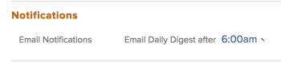

# Ihre eigenen E-Mail-Benachrichtigungen ändern

<!-- Audited: 1/2024 -->

Ihr Adobe [!DNL Workfront] -Administrator konfiguriert, welche E-Mail-Benachrichtigungen Benutzer erhalten, wenn Ereignisse in Workfront auftreten (wie unter [[!UICONTROL Ereignisbenachrichtigungen konfigurieren] für alle Benutzer im System](../../administration-and-setup/manage-workfront/emails/configure-event-notifications-for-everyone-in-the-system.md) beschrieben).

Ihr Gruppenadministrator kann auch konfigurieren, welche Benachrichtigungen für Sie aktiviert werden, und die Benutzer in Ihrer [!UICONTROL Home Group]. Wenn Ihre [!UICONTROL Home Group] eine Untergruppe ist, erhalten Sie die Benachrichtigungen, die für die Gruppe der obersten Ebene über Ihrer Gruppe aktiviert wurden.

Sie können dies weiter anpassen, indem Sie konfigurieren, welche Benachrichtigungen Sie erhalten. Sie können auch auswählen, ob Sie Benachrichtigungen bei Ereignissen oder eine tägliche Digest-E-Mail erhalten möchten.

Weitere Informationen zu E-Mail-Benachrichtigungen finden Sie unter [[!DNL Adobe Workfront] Benachrichtigungen](../../workfront-basics/using-notifications/wf-notifications.md).

>[!NOTE]
>
>* Wenn Sie einen Benachrichtigungstyp aktivieren und dann feststellen, dass Sie keine Benachrichtigungen dieses Typs erhalten, liegt dies möglicherweise daran, dass dieser Typ nicht für Ihre Rolle gilt.
>* Der [!DNL Workfront] -Administrator oder ein Gruppenadministrator kann keine Benachrichtigungen für [!DNL Workfront Goals] konfigurieren. Weitere Informationen dazu, welche Benachrichtigungen der [!DNL Workfront]-Administrator konfigurieren kann, finden Sie unter [Ereignisbenachrichtigungen für alle Benutzer im System konfigurieren](../../administration-and-setup/manage-workfront/emails/configure-event-notifications-for-everyone-in-the-system.md). Weitere Informationen zum Konfigurieren von einzelnen Benachrichtigungen für [!DNL Workfront Goals] finden Sie in diesem Artikel.
>

## Zugriffsanforderungen

+++ Erweitern Sie , um die Zugriffsanforderungen für die Funktionalität in diesem Artikel anzuzeigen.

Sie müssen über folgenden Zugriff verfügen, um die Schritte in diesem Artikel ausführen zu können:

<table style="table-layout:auto"> 
 <col> 
 </col> 
 <col> 
 </col> 
 <tbody> 
  <tr> 
   <td role="rowheader"><strong>[!DNL Adobe Workfront plan]</strong></td> 
   <td> 
Alle
 </td> 
  </tr> 
  <tr> 
   <td role="rowheader"><strong>[!DNL Adobe Workfront] Lizenz</strong></td> 
   <td>  
Neu:
 
   <ul><li>Mitwirkende oder höher</li></ul>
   
Aktuell:

   <ul><li>Anfrage oder höher</li></ul>
   </td> 
  </tr> 
 </tbody> 
</table>

Weitere Informationen zu den Informationen in dieser Tabelle finden Sie unter [Zugriffsanforderungen in der Workfront-Dokumentation](/help/quicksilver/administration-and-setup/add-users/access-levels-and-object-permissions/access-level-requirements-in-documentation.md).

+++

## E-Mail-Benachrichtigungseinstellungen anzeigen und ändern

{{step1-click-profile-pic}}

1. Klicken Sie auf das Symbol **[!UICONTROL Mehr]**  neben Ihrem Namen und dann auf **[!UICONTROL Bearbeiten]**.

1. Wechseln Sie im angezeigten Feld **[!UICONTROL Person bearbeiten]** zum Abschnitt **[!UICONTROL Benachrichtigungen]** .

1. Klicken Sie auf eine Kategorie, um die Benachrichtigungseinstellungen für diese Kategorie anzuzeigen.

   

1. Aktivieren oder deaktivieren Sie die Kontrollkästchen auf der rechten Seite, um anzugeben, ob Sie Benachrichtigungen täglich, sofort oder beides empfangen möchten.

   Sie können auch die Kontrollkästchen für eine Kategorie verwenden, um alle Benachrichtigungen in dieser Kategorie zu aktivieren oder zu deaktivieren.

   >[!NOTE]
   >
   >Wenn Sie Teammitglied eines Projekts sind, erhalten Sie weiterhin E-Mail-Benachrichtigungen dafür, bis Sie aus dem Team entfernt werden, auch wenn Sie keinen Zugriff mehr auf das Projekt haben. Anweisungen zum Entfernen von Benutzern aus einem Team finden Sie unter [Entfernen von Benutzern aus Projekten](../../manage-work/projects/manage-projects/remove-users-from-projects.md).

   In der Kategorie **[!UICONTROL Kommunikation]** können Sie einzelne Benachrichtigungen nur für den sofortigen Versand auswählen. Damit Benachrichtigungen täglich versendet werden können, müssen Sie alle Benachrichtigungen auswählen.

   Wenn alle E-Mail-Benachrichtigungen für eine bestimmte Kategorie aktiviert sind, wird das Feld im Kategorientitel wie ausgewählt angezeigt. Wenn alle E-Mail-Benachrichtigungen einer bestimmten Kategorie deaktiviert sind, wird das Kontrollkästchen deaktiviert. Wenn einige Benachrichtigungen aktiviert und andere deaktiviert sind, wird das Kategorieprüffeld als gerade Zeile angezeigt.\
   Wenn Sie eine Benachrichtigungseinstellung ändern, wird für diese Benachrichtigungseinstellung die Bezeichnung **[!UICONTROL Bearbeitet]** angezeigt, um Sie darüber zu informieren, dass diese Benachrichtigungseinstellung geändert wurde.

1. Wenn Sie Benachrichtigungen ausgewählt haben, die als tägliche Zusammenfassung gesendet werden sollen, wählen Sie oben im Abschnitt **[!UICONTROL Benachrichtigungen]** im Menü **[!UICONTROL Tägliche Digest per E-Mail nach]** die Tageszeit aus, zu der Sie die Benachrichtigungen erhalten möchten.

   

   Die tägliche Zusammenfassung enthält Ereignisse, die die Kriterien der Benachrichtigungen 24 Stunden vor dem ausgewählten Zeitpunkt erfüllen. Sie erhalten für jeden Benachrichtigungstyp eine tägliche Digest-E-Mail.\
   Der tägliche Digest kann nach der von Ihnen ausgewählten Zeit eintreffen, je nachdem, wie viele E-Mails in die Warteschlange für den Versand im System gestellt werden. Die angegebene Uhrzeit entspricht der Ortszeit, die Sie in den Browsereinstellungen angegeben haben.

1. (Bedingt und optional) Aktivieren Sie beim Ändern der Einstellungen für E-Mail-Benachrichtigungen in der Vorschau-Umgebung die Einstellung **[!UICONTROL E-Mails aus dieser Testumgebung empfangen]** , um E-Mails zu empfangen. E-Mails werden nicht automatisch aus der Vorschau-Umgebung generiert.

   

1. Klicken Sie auf **[!UICONTROL Änderungen speichern]**.
