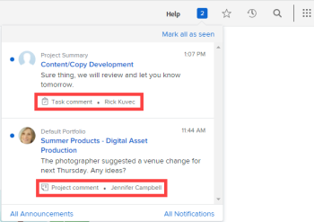

# Übersicht über In-App-Benachrichtigungen

In diesem Artikel werden die In-App-Benachrichtigungen aufgelistet, die Sie erhalten können. In-App-Benachrichtigungen halten Sie über zwei Arten von Informationen auf dem Laufenden: Ankündigungsbenachrichtigungen und Arbeitsaufgabenbenachrichtigungen. Sie sind sowohl in der Web-Anwendung als auch in der Mobile App verfügbar.

Anweisungen zum Anzeigen und Verwalten dieser Benachrichtigungen finden Sie unter [Anzeigen und Verwalten von In-App-](../../workfront-basics/using-notifications/view-and-manage-in-app-notifications.md).

* [[!UICONTROL Ankündigung] Benachrichtigungen](#announcement-notifications)
* [[!UICONTROL Arbeitselement] Benachrichtigungen](#work-item-notifications)

## [!UICONTROL Ankündigung] Benachrichtigungen

Ankündigungen erfolgen auf eine von zwei Arten:

* [!DNL Workfront] sendet eine Nachricht an die [!UICONTROL Ankündigung] der [!DNL Workfront]-Administratoren Ihres Unternehmens
* Ein [!DNL Workfront] sendet eine Nachricht von der Seite [!UICONTROL Ankündigung] an Benutzer

Wenn Admins oder Benutzende in beiden Fällen auf das nummerierte Symbol  in der oberen rechten Ecke von [!DNL Workfront] klicken, um die Liste der Benachrichtigungen zu öffnen, wird die Betreffzeile der Nachricht mit einem Megaphon-Symbol  und dem Wort &quot;[!UICONTROL Ankündigung] angezeigt.

![[!UICONTROL Ankündigung] Benachrichtigung](assets/notification-list-announcement-350x271.png)

Weitere Informationen zur Seite [!UICONTROL Ankündigungen] finden Sie unter [Anzeigen und Verwalten von In-App-Benachrichtigungen](../../workfront-basics/using-notifications/view-and-manage-in-app-notifications.md).

## [!UICONTROL Arbeitselement] Benachrichtigungen

Wenn Sie auf das nummerierte Symbol  in der oberen rechten Ecke von [!DNL Workfront] klicken, um die Liste der Benachrichtigungen zu öffnen, wird die Betreffzeile der Arbeitsaufgabennachricht mit einem Symbol und einer kurzen Beschreibung angezeigt, um zu ermitteln, worum es geht. Symbol- und Beschreibungsarten sind unten aufgeführt.

>[!NOTE]
>
>In-App-Benachrichtigungen für Arbeitsaktivitäten sind in [!DNL Workfront] nicht an E-Mail-Benachrichtigungen gebunden. Weitere Informationen finden Sie unter [[!DNL Adobe Workfront] Benachrichtigungen](../../workfront-basics/using-notifications/wf-notifications.md).

* [[!UICONTROL Genehmigungen]](#approvals)
* [[!UICONTROL Anfragen]](#requests)
* [[!UICONTROL Arbeitsaufträge]](#assignments)
* [[!UICONTROL Kommentare]](#comments)
* [[!UICONTROL Updates]](#updates)
* [[!UICONTROL Datumsänderungen]](#date-changes)
* [[!UICONTROL Freigeben]](#share)
* [[!UICONTROL Sonstige]](#other)

### [!UICONTROL Genehmigungen]

*  [!UICONTROL Projekt muss genehmigt ] - [Name des Absenders]
*  [!UICONTROL Aufgabe benötigt Ihre Genehmigung] - [Name des Absenders]
*  [!UICONTROL Problem erfordert Ihre Genehmigung] - [Name des Absenders]
*  [!UICONTROL Dokument muss genehmigt ] - [Name des Absenders]
*  [!UICONTROL Korrekturabzug muss von ] genehmigt werden - [Name des Absenders]
*  [!UICONTROL Arbeitszeittabelle benötigt Ihre Genehmigung] - [Name des Absenders]

  <!--
  <li data-mc-conditions="QuicksilverOrClassic.Draft mode,QuicksilverOrClassic.Quicksilver">  You need to approve a portfolio</li>
  -->

* [Objektname] [!UICONTROL benötigt Ihre Zugriffsgenehmigung] - [Absendername]

  Das Objekt kann ein  Projekt, eine , ein  Problem, ein  Dokument, ein Bericht, ein Dashboard, ein  Portfolio, ein  oder ein Kalender sein.

*  [!UICONTROL Arbeitszeittabelle genehmigt] - [Name der genehmigenden Person]
*  [!UICONTROL Arbeitszeittabelle abgelehnt] - [Name der genehmigenden Person]
*  [!UICONTROL Arbeitszeittabelle erneut geöffnet] - [Name des Öffners]
*  [!UICONTROL Arbeitszeittabellen-] - [Name des Kommentators]
*  [!UICONTROL Dokumentengenehmigung abgeschlossen] - [Name des Absenders]
*  [!UICONTROL Dokument genehmigt] - [Name des Absenders]
*  [!UICONTROL Dokument mit Änderungen genehmigt] - [Name des Absenders]
*  [!UICONTROL Dokument abgelehnt] - [Name des Absenders]
*  [!UICONTROL Dokumentengenehmigungsanfrage storniert] - [Name des Absenders]

### [!UICONTROL Anfragen]

*  [Benutzersymbol] ([!UICONTROL  Sie ein Dokument hochladen] - [Name des Anforderers]
*  [!UICONTROL Anfrage zum Hochladen eines Dokuments ] erfüllt[ - (Name des Ausfüllers]
*  [!UICONTROL Kommentar anfordern] - Absendername
*  [!UICONTROL Dokumentuploadanfrage abgebrochen] - [Name des Absenders]
* [Objektname] [!UICONTROL Zugriff angefordert] - [Absendername]

  Das Objekt kann ein  Projekt, eine , ein  Problem, ein  Dokument, ein Bericht, ein Dashboard, ein  Portfolio, ein  oder ein Kalender sein.

### [!UICONTROL Arbeitsaufträge]

*  [!UICONTROL Ihnen zugewiesene Aufgabe] - [Name des Zuweisers]
*  [!UICONTROL Ihnen zugewiesenes Problem] - [Name des Zuweisenden]
*  [!UICONTROL Problem zugewiesen zu] [Team-Name] - [Name des Zuweisenden]
*  [!UICONTROL Aufgabe zugewiesen zu] [Team-Name] - [Name des Zuweisenden]

   * Zuweisungsbenachrichtigungen werden nur gesendet, wenn der Projektstatus auf [!UICONTROL Aktuell] (oder einen benutzerdefinierten Status, der dem „Aktuell“ entspricht[!UICONTROL  festgelegt ].
   * Es ist nicht vorgesehen, dass Antragstellern und Prüfern Arbeiten zugewiesen werden. Daher werden sie nicht benachrichtigt, wenn sie Aufgaben und Problemen zugewiesen sind.
   * Wenn Sie sich oder einem Team, dem Sie angehören, Arbeit zuweisen, erhalten Sie keine Benachrichtigung.

### [!UICONTROL Kommentare]

*  [Objektname] [!UICONTROL Kommentar] - [Name des Kommentators]

  Das Objekt kann ein  Projekt, eine , ein  Problem, ein  Dokument, ein Bericht, ein Dashboard, ein  Portfolio, ein  oder ein Kalender sein.

* [Objektname] [!UICONTROL Aktualisieren] - [Name des Updaters]

  Das Objekt kann ein  Projekt, eine , ein  Problem, ein  Dokument, ein Bericht, ein Dashboard, ein  Portfolio, ein  oder ein Kalender sein.

* [Objektname] [!UICONTROL Aktualisieren] - [Name des Updaters]

  Das Objekt kann ein  Projekt, eine , ein  Problem, ein  Dokument, ein Bericht, ein Dashboard, ein  Portfolio, ein  oder ein Kalender sein.

*  [!UICONTROL Gefällt Ihr Kommentar] - [Liker&#39;s Name]
*  [!UICONTROL Arbeitszeittabellen-] - [Name des Kommentators]
* [!UICONTROL Kommentar] - [Name des Kommentators]
*  [!UICONTROL Kommentar] - Name des Kommentators
*  [!UICONTROL Arbeitszeittabellen-] - Name des Kommentators

### [!UICONTROL Updates]

*  [!UICONTROL Sie in einem Kommentar getaggt] - [Name des Taggers]
*  [!UICONTROL Ihr Team in einem Kommentar getaggt] - [Name des Taggers]
*  [!UICONTROL Ihr Team in einem Kommentar getaggt] - [Name des Taggers]

### [!UICONTROL Datumsänderungen]

*  [!UICONTROL Fälligkeitsdatum für das Problem ] geändert - [Name des Änderers]
*  [!UICONTROL Fälligkeitsdatum der ] geändert[ - (Name des Änderers]
*  [!UICONTROL Commit-Datum für Anfrage geändert] - [Name des Änderers]
*  [!UICONTROL Commit-Datum der Aufgabe ] geändert[ - (Name des Änderers]

### [!UICONTROL Freigeben]

*  [!UICONTROL Dokument für Sie freigegeben] - [Name des Teilnehmers]
*  [!UICONTROL Dokument freigegeben für] [Team-Name] - [Name des Teilnehmers]
*  [!UICONTROL Korrekturabzug für Sie freigegeben] - [Name des Teilnehmers]

### [!UICONTROL Sonstige]

*  [!UICONTROL Ein Fehler erfordert Ihre Aufmerksamkeit]
*  [!UICONTROL Ankündigung] - [Name des Workfront-Administrators]
