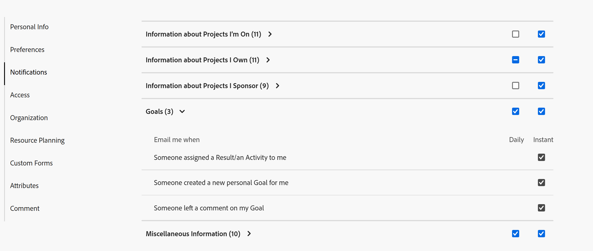

# Benachrichtigungen: Goals

Sie können Ihre E-Mail-Benachrichtigungen für Ereignisse aktivieren, die in [!DNL Adobe Workfront Goals] in Ihrem Profil auftreten. Benutzende mit einer [!UICONTROL Plan]-Lizenz können sie auch für andere Benutzende aktivieren. Weitere Informationen finden Sie unter [[!DNL Adobe Workfront] Benachrichtigungen](../../workfront-basics/using-notifications/wf-notifications.md).

## Zugriffsanforderungen

<!--

(NOTE: because there are conditions for who sees this, I added this from the How To articles/ template although this is not a How To. But I like the format, so I thought keeping it consistent might help users. We may decide to update this when we have access and prereq for overview-type articles)

-->

+++ Erweitern, um die Zugriffsanforderungen für die in diesem Artikel beschriebene Funktionalität anzuzeigen. 

<table style="table-layout:auto"> 
 <col> 
 <col> 
 <tbody> 
  <tr> 
   <td role="rowheader"><strong>[!DNL Adobe Workfront package]</strong></td> 
   <td> 
Beliebig
 </td> 
  </tr> 
  <tr> 
   <td role="rowheader"><strong>[!DNL Adobe Workfront] Lizenz</strong></td> 
   <td>
   
Mitwirkende oder höher

    
Anfragende oder höher
 </td> 
  </tr> 
  <tr> 
   <td role="rowheader"><strong>Zusätzliche Produkte</strong></td> 
   <td>[!DNL Workfront Goals] 
Weitere Informationen zu [!DNL Workfront Goals] finden Sie unter „Überblick über <a href="../../workfront-goals/goal-management/wf-goals-overview.md" class="MCXref xref">[!DNL Adobe Workfront Goals]</a>“.
 </td> 
  </tr> 
  <tr> 
   <td role="rowheader"><strong>Konfigurationen der Zugriffsebene*</strong></td> 
   <td> 
[!UICONTROL View] Zugriff auf [!DNL Goals] oder höher
</td> 
  </tr>
 </tbody> 
</table>

Weitere Informationen finden Sie unter [Zugriffsanforderungen](/help/quicksilver/administration-and-setup/add-users/access-levels-and-object-permissions/access-level-requirements-in-documentation.md) in der Dokumentation zu Workfront.

+++

## Voraussetzungen

* Der Benutzer, dessen [!DNL Goals] Benachrichtigungen Sie aktualisieren möchten, muss über eine Layout-Vorlage verfügen, die den [!DNL Goals] Bereich im [!UICONTROL Hauptmenü“ &#x200B;].

## [!DNL Goals]-Benachrichtigungen im [!UICONTROL Benutzerprofil] Bereich

Die in der folgenden Tabelle aufgeführten Benachrichtigungen informieren Sie über Ereignisse, die in [!DNL Workfront Goals] stattfinden, z. B. wenn Ihnen ein Ziel, ein Ergebnis oder eine Aktivität zugewiesen wird oder wenn jemand ein Ziel, ein Ergebnis oder eine Aktivität in Ihrem Besitz aktualisiert. Informationen zum Konfigurieren der empfangenen Benachrichtigungen finden Sie unter [Ändern eigener E-Mail-Benachrichtigungen](../../workfront-basics/using-notifications/activate-or-deactivate-your-own-event-notifications.md).

>[!NOTE]
>
>* Sofortige Benachrichtigungen für [!DNL Goals] sind standardmäßig deaktiviert. Sie können keine täglichen Benachrichtigungen aktivieren oder deaktivieren und Sie erhalten auch keine täglichen Auswahl-E-Mails für die Ereignisse in dieser Kategorie. Sie können einzelne Sofortbenachrichtigungen für die Kategorie [!DNL Goals] aktivieren oder deaktivieren.
>* Sie können weiterhin E-Mails zu Zielaktualisierungen erhalten, auch wenn Sie auf Ihrer Zugriffsebene keinen Zugriff auf Ziele haben, Ihnen aber jemand ein Ziel, ein Ergebnis oder eine Aktivität oder Kommentare zu einem Ziel zuweist, das Ihnen zugewiesen wurde.

Siehe auch [Ereignisbenachrichtigungen](../../workfront-basics/using-notifications/event-notifications.md).

<table style="table-layout:auto"> 
 <col> 
 <col> 
 <tbody> 
  <tr> 
   <td><strong>Benachrichtigung</strong></td> 
   <td> 
<strong>Enthaltene Felder</strong> 
 
<strong>*Nur Sofortige Benachrichtigungen</strong>
 </td> 
  </tr> 
  <tr> 
   <td><strong>Jemand hat mir ein Ergebnis/eine Aktivität zugewiesen</strong></td> 
   <td> 
Der Name der Person, die Ihnen das Ergebnis oder die Aktivität zugewiesen hat
 
Der Zeitraum des Ziels für das Ergebnis oder die Aktivität
 
Der Name des Ergebnisses oder der Aktivität
 
Die Schaltfläche <strong>[!UICONTROL In Web-App öffnen]</strong> mit der das Bedienfeld [!UICONTROL Goal Details] geöffnet wird.
 
Die <strong>[!UICONTROL Einstellungen für Benachrichtigungen ändern]</strong> Schaltfläche, mit der Sie Ihre Benachrichtigungen verwalten können.
 </td> 
  </tr> 
  <tr> 
   <td><strong>Jemand hat ein neues persönliches Ziel für mich erstellt</strong> </td> 
   <td> 
Der Name der Person, die das Ziel zugewiesen hat
 
Der Zeitraum des Ziels
 
Der Name des Ziels
 
Die Schaltfläche <strong>[!UICONTROL In Web-App öffnen]</strong> mit der das Bedienfeld [!UICONTROL Goal Details] geöffnet wird.
 
Die <strong>[!UICONTROL Einstellungen für Benachrichtigungen ändern]</strong> Schaltfläche, mit der Sie Ihre Benachrichtigungen verwalten können.
 </td> 
  </tr> 
  <tr> 
   <td><strong>Jemand hat mein Ziel kommentiert</strong></td> 
   <td> 
Der Name der Person, die den Kommentar verlassen hat
 
Der Zeitraum des Ziels 
 
Der Name des Ziels
 
Der Text des Kommentars
 
Die Schaltfläche <strong>[!UICONTROL In Web-App öffnen]</strong> mit der das Bedienfeld [!UICONTROL Goal Details] geöffnet wird.
 
Die <strong>[!UICONTROL Einstellungen für Benachrichtigungen ändern]</strong> Schaltfläche, mit der Sie Ihre Benachrichtigungen verwalten können.
 </td> 
  </tr> 
  <tr> 
  </tbody> 
</table>

<!--
these were removed at some point: 

   <td><strong>Someone liked my comment on a Goal</strong></td> 
   <td> 
The name of the person who liked the comment
 
The Period of the goal 
 
The name of the goal
 
The text of the comment 
 
The <strong>[!UICONTROL Open in web app]</strong> button which opens the [!UICONTROL Goal Details] panel
 
The <strong>[!UICONTROL Change Notifications Settings]</strong> button which allows you to manage your notifications.
 </td> 
  </tr> 
  <tr> 
   <td><strong>Someone liked an update on my Goal</strong></td> 
   <td> 
You receive an email when someone likes a comment you made on a goal or when you update the progress of your results or activities on the goal. 
 
The name of the person who liked the update
 
The Period of the goal 
 
The name of the goal
 
The <strong>[!UICONTROL Open in web app]</strong> button which opens the [!UICONTROL Goal Details] panel
 
The <strong>[!UICONTROL Change Notifications Settings]</strong> button which allows you to manage your notifications.
 </td> 
  </tr> 
 -->

<!--
NOTE FOR NAME OF GOAL IN LAST TABLE CELL: check this. Is this true? Didn't triggger when this was written; add anything else? Maybe the type of the update is mentioned?!
-->
