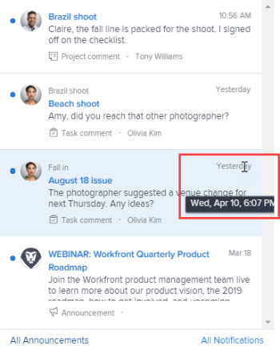

# Anzeigen und Verwalten von In-App-Benachrichtigungen

In-App-Benachrichtigungen informieren Sie über zwei Arten von Informationen: Benachrichtigungen zu Mitteilungen und Benachrichtigungen zu Arbeitselementen. Sie sind sowohl in der Webanwendung als auch in der Mobile App verfügbar.

Eine Liste der Arbeitselemente und Benachrichtigungen, die Sie erhalten können, finden Sie unter [Übersicht über In-App-Benachrichtigungen](../../workfront-basics/using-notifications/in-app-notifications-overview.md).

>[!NOTE]
>
>* In-App-Benachrichtigungen für Arbeitsaktivitäten sind nicht an E-Mail-Benachrichtigungen in [!DNL Workfront] gebunden. Weitere Informationen finden Sie unter [[!DNL Adobe Workfront] Benachrichtigungen](../../workfront-basics/using-notifications/wf-notifications.md)
>* In-App-Benachrichtigungen können nicht angepasst werden.
>

## Zugriffsanforderungen

Sie müssen über folgenden Zugriff verfügen, um die Schritte in diesem Artikel ausführen zu können:

<table style="table-layout:auto"> 
 <col> 
 </col> 
 <col> 
 </col> 
 <tbody> 
  <tr> 
   <td role="rowheader"><strong>[!DNL Adobe Workfront] plan*</strong></td> 
   <td> 
Alle
 </td> 
  </tr> 
  <tr> 
   <td role="rowheader"><strong>[!DNL Adobe Workfront] license*</strong></td> 
   <td> 
[!UICONTROL Anforderung] oder höher
 </td> 
  </tr> 
 </tbody> 
</table>

Wenden Sie sich an Ihren [!DNL Workfront] -Administrator, um zu erfahren, welchen Plan oder welchen Lizenztyp Sie haben.

## Benachrichtigungen anzeigen

Das nummerierte Symbol in der oberen rechten Ecke von [!DNL Workfront] zeigt die Anzahl der Benachrichtigungen an, die Sie noch nicht quittiert haben.

>[!NOTE]
>
>Sie können alle In-App-Benachrichtigungen sowohl über die Webanwendung als auch über die Mobile App anzeigen. Nur einige dieser Benachrichtigungen werden als Push-Benachrichtigungen in der Mobile App gesendet. Weitere Informationen zu Benachrichtigungen in der App finden Sie unter [[!DNL Adobe Workfront] für iOS](../../workfront-basics/mobile-apps/using-the-workfront-mobile-app/workfront-for-ios.md) oder [[!DNL Adobe Workfront] für Android](../../workfront-basics/mobile-apps/using-the-workfront-mobile-app/workfront-for-android.md).

1. Klicken Sie auf das nummerierte Symbol  in der oberen rechten Ecke von [!DNL Workfront], um Ihre Benachrichtigungsliste zu öffnen.

   Ihre letzten ungelesenen Benachrichtigungen werden unter dem nummerierten Symbol angezeigt, wobei sich die neueste Meldung oben befindet.

   

   Das Zahlensymbol zeigt eine Liste mit bis zu 80 Benachrichtigungen an. Um weitere Informationen anzuzeigen, können Sie unten in der Liste auf **[!UICONTROL Alle Benachrichtigungen]** klicken, um bis zu 500 Benachrichtigungen anzuzeigen. Benachrichtigungen werden nach 30 Tagen automatisch gelöscht.

   Am unteren Rand jeder Benachrichtigung werden der [!UICONTROL Benachrichtigungstyp] und ein entsprechendes Identifizierungssymbol angezeigt. Auf diese Weise können Sie erkennen, was mit dem erwähnten [!DNL Workfront] -Element passiert ist, und Sie werden benachrichtigt, wenn Sie über ein Aktionselement verfügen:

   * Benachrichtigungen bezüglich Mitteilungen werden durch das Symbol [!UICONTROL Mitteilungen] gekennzeichnet. 

   * Alle anderen Benachrichtigungen werden durch Symbole angezeigt, die den Typ des Arbeitselements angeben, mit dem sie verknüpft sind.

     
Das Symbol rechts neben dem blauen Punkt zeigt einen der folgenden Punkte an:

   * Das Profilfoto der Person, die die Informationen eingegeben hat, normalerweise ein Update eines [!DNL Workfront] -Objekts, an dem Sie arbeiten.
   * Das [!DNL Workfront] -Logo, wenn es sich bei der Benachrichtigung um eine Systemankündigung handelt.

1. (Optional) Wenn Sie das Datum anzeigen möchten, an dem Sie eine Benachrichtigung erhalten haben, bewegen Sie den Mauszeiger über die Tag- oder Zeitanzeige in der oberen rechten Ecke der Benachrichtigung.

   

1. Klicken Sie auf die Benachrichtigung, die Sie anzeigen möchten:

   * Wenn es sich bei der von Ihnen angeklickten Benachrichtigung um ein Arbeitselement handelt, wird das zugehörige [!DNL Workfront] -Objekt geöffnet, das die vollständige Meldung auf der Registerkarte **[!UICONTROL Aktualisierungen]** anzeigt. Sie können **[!UICONTROL einen neuen Aktualisierungsbereich starten]** oder **[!UICONTROL eine Antwort eingeben]**.

     

   * Wenn die von Ihnen angeklickte Benachrichtigung für eine Mitteilung  bestimmt wird, wird die Seite **[!UICONTROL Mitteilungen]** mit einer Liste aller Mitteilungen angezeigt. Die Mitteilung, auf die Sie geklickt haben, wird links und rechts angezeigt.

     

1. (Optional) Laden Sie alle Anlagen herunter, die in der Benachrichtigung enthalten sind, oder laden Sie alle Anlagen als ZIP-Datei herunter.

   

## Benachrichtigungen

Nachdem Sie Benachrichtigungen angesehen haben, können Sie sie bestätigen, sie aus der Liste [!UICONTROL Benachrichtigungen] zu löschen, oder sie später erneut darauf antworten lassen.

Auf der Seite [!UICONTROL Benachrichtigungen] können Sie aktuelle und gelöschte Benachrichtigungen anzeigen. Sie können gelöschte Benachrichtigungen auch wieder in die Liste [!UICONTROL Benachrichtigungen] zurückführen.

* [Benachrichtigungen](#acknowledge-notifications)
* [Anzeigen bestätigter Benachrichtigungen](#view-acknowledged-notifications)

### Benachrichtigungen

Wenn Sie auf das nummerierte Symbol klicken, um die Benachrichtigungsliste zu öffnen, wird nicht automatisch bestätigt, dass Sie alle Benachrichtigungen gelesen haben.

So bestätigen Sie eine Benachrichtigung und löschen sie aus der Benachrichtigungsliste:

1. Klicken Sie auf das nummerierte Symbol  in der oberen rechten Ecke von [!DNL Workfront], um Ihre Benachrichtigungsliste zu öffnen.
1. Führen Sie einen der folgenden Schritte aus:

   * Klicken Sie auf den blauen Punkt in der oberen linken Ecke der Benachrichtigung.
   * Wenn sich die Benachrichtigung auf ein Arbeitselement bezieht (und nicht auf eine Mitteilung), klicken Sie auf die Benachrichtigung, um zum Element zu gelangen.
   * Wenn es sich bei der Benachrichtigung um eine Mitteilung handelt, klicken Sie auf die Benachrichtigung, um die Seite **[!UICONTROL Mitteilungen]** zu öffnen.
   * Klicken Sie unten rechts in der Benachrichtigungsliste auf **[!UICONTROL Alle Benachrichtigungen]** , um die Seite **[!UICONTROL Benachrichtigungen]** anzuzeigen, und klicken Sie dann oben rechts in Workfront auf **[!UICONTROL Alle als sichtbar markieren]** .

### Anzeigen bestätigter Benachrichtigungen

So zeigen Sie Benachrichtigungen an, die Sie bereits bestätigt haben:

1. Klicken Sie auf das nummerierte Symbol  in der oberen rechten Ecke von [!DNL Workfront], um Ihre Benachrichtigungsliste zu öffnen.
1. Klicken Sie in der rechten unteren Ecke der Benachrichtigungsliste auf **[!UICONTROL Alle Benachrichtigungen]** .
1. Scrollen Sie auf der angezeigten Seite **[!UICONTROL Benachrichtigungen]** nach unten, um Ihre vergangenen Benachrichtigungen anzuzeigen.
1. (Optional) Um eine quittierte Benachrichtigung wieder in Ihre Liste der Benachrichtigungen aufzunehmen, klicken Sie auf den blauen Kreis neben der Benachrichtigung.

## Benachrichtigung löschen

Sie können keine Benachrichtigungen zu Arbeitselementen löschen. [!DNL Workfront] löscht alle Benachrichtigungen (ob sie gelesen oder nicht gelesen werden) nach 30 Tagen.

Sie können jedoch Benachrichtigungen löschen. Sie können auch auf eine Mitteilung zugreifen, die Sie innerhalb von 30 Tagen nach dem Löschen gelöscht haben. [!DNL Workfront] löscht Ankündigungen nicht automatisch.

* [Eine Mitteilung löschen](#delete-an-announcement)
* [Auf kürzlich gelöschte Mitteilungen zugreifen und sie wiederherstellen](#access-and-restore-an-announcement-you-deleted-recently)

### Eine Mitteilung löschen

1. Klicken Sie auf das nummerierte Symbol  in der oberen rechten Ecke von [!DNL Workfront], um Ihre Benachrichtigungsliste zu öffnen.
1. Klicken Sie auf **[!UICONTROL Mitteilungen]** oder **[!UICONTROL Alle Mitteilungen anzeigen]**.

1. Klicken Sie auf der angezeigten Seite **[!DNL Announcements]** in der Liste links auf die Mitteilung, die Sie löschen möchten, und klicken Sie dann oben rechts auf der Seite auf **[!UICONTROL Löschen]** .

### Auf kürzlich gelöschte Mitteilungen zugreifen und sie wiederherstellen

Sie können auf eine Benachrichtigung zugreifen, die Sie in den letzten 30 Tagen gelöscht haben.

1. Klicken Sie auf das nummerierte Symbol  in der oberen rechten Ecke von [!DNL Workfront], um Ihre Benachrichtigungsliste zu öffnen.
1. Klicken Sie auf **[!UICONTROL Mitteilungen]** oder **[!UICONTROL Alle Mitteilungen anzeigen]**.

1. Klicken Sie auf der angezeigten Seite **[!UICONTROL Mitteilungen]** auf **[!UICONTROL Gelöscht]**.

1. Klicken Sie auf die Nachricht, die Sie anzeigen möchten.
1. (Optional) Wenn Sie die Mitteilung wiederherstellen möchten, klicken Sie oben rechts neben dem Text der Mitteilung auf **[!UICONTROL Zum Posteingang wechseln]** .
