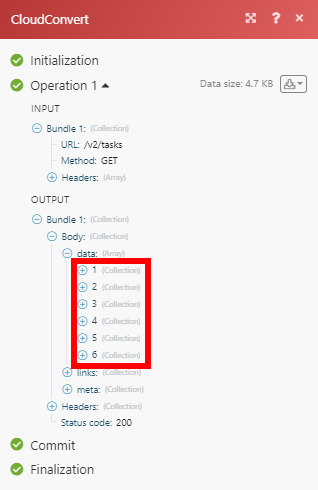
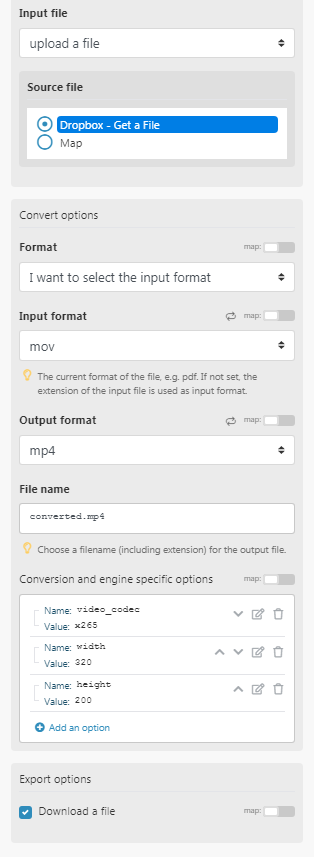

# [!DNL CloudConvert] Module

In einem Adobe Workfront Fusion-Szenario können Sie Workflows, die CloudConvert verwenden, automatisieren und mit mehreren Anwendungen und Diensten von Drittanbietern verbinden. Mit den [!DNL CloudConvert] -Modulen können Sie Vorgänge und Aufgaben überwachen und verwalten sowie Dateien in Ihr [!DNL CloudConvert] -Konto importieren und exportieren.

<table style="table-layout:auto">
 <col> 
 <col> 
 <tbody> 
  <tr> 
   <td role="rowheader">[!DNL Adobe Workfront] plan*</td>
  <td> 
[!UICONTROL Pro] oder höher
 </td>
  </tr> 
  <tr data-mc-conditions=""> 
   <td role="rowheader">[!DNL Adobe Workfront] license*</td>
   <td> 
[!UICONTROL Plan], [!UICONTROL Arbeit]
 </td> 
  </tr> 
  <tr> 
   <td role="rowheader">[!DNL Adobe Workfront Fusion] license**</td> 
   <td>
   
Aktuelle Lizenzanforderungen: Keine [!DNL Workfront Fusion] Lizenzanforderungen.

   
Oder

   
Alte Lizenzanforderung: [!UICONTROL [!DNL Workfront Fusion] für die Arbeitsautomatisierung und -integration] 

   </td> 
  </tr> 
  <tr> 
   <td role="rowheader">Produkt</td> 
   <td>
   
Aktuelle Produktanforderung: Wenn Sie über den [!UICONTROL Select]- oder [!UICONTROL Prime] [!DNL Adobe Workfront]-Plan verfügen, muss Ihr Unternehmen [!DNL Adobe Workfront Fusion] sowie [!DNL Adobe Workfront] erwerben, um die in diesem Artikel beschriebenen Funktionen nutzen zu können. [!DNL Workfront Fusion] ist im [!UICONTROL Ultimate] [!DNL Workfront]-Plan enthalten.

   
Oder

   
Alte Produktanforderung: Ihr Unternehmen muss [!DNL Adobe Workfront Fusion] sowie [!DNL Adobe Workfront] erwerben, um die in diesem Artikel beschriebenen Funktionen nutzen zu können.

   </td> 
  </tr> 
 </tbody> 
</table>

## CloudConvert-API-Informationen

Der CloudConvert-Connector verwendet Folgendes:

<table style="table-layout:auto"> 
 <col> 
 <col> 
 <tbody> 
  <tr> 
   <td role="rowheader">Basis-URL</td> 
   <td> https://api.cloudconvert.com/v2/</td> 
  </tr> 
  <tr> 
   <td role="rowheader">API-Version</td> 
   <td> v2 </td> 
  </tr> 
  <tr> 
   <td role="rowheader">API-Tag</td> 
   <td>v2.14.22</td> 
  </tr>
 </tbody> 
 </table>

## [!DNL CloudConvert] mit [!DNL Workfront Fusion] verbinden {#connect-cloudconvert-to-workfront-fusion}

Um Ihr [!DNL CloudConvert]-Konto mit [!DNL Workfront Fusion] zu verbinden, müssen Sie den API-Schlüssel von Ihrem [!DNL CloudConvert]-Konto abrufen.

1. Melden Sie sich bei Ihrem [!DNL CloudConvert] -Konto an und öffnen Sie Ihr [!UICONTROL Dashboard].
1. Öffnen Sie den Abschnitt **[!UICONTROL Autorisierung] > [!UICONTROL API-Schlüssel]** .
1. Klicken Sie auf **[!UICONTROL Neuen API-Schlüssel erstellen]**.
1. Geben Sie den Namen für den API-Schlüssel ein, aktivieren Sie die Bereiche, die Sie verwenden möchten, und klicken Sie dann auf **[!UICONTROL Erstellen]**.
1. Kopieren Sie das bereitgestellte Token und speichern Sie es an einem sicheren Ort.
1. Beginnen Sie in [!DNL Workfront Fusion] mit der Erstellung eines Szenarios und öffnen Sie das Dialogfeld **[!UICONTROL Verbindung erstellen]** des Moduls [!DNL CloudConvert].

   Anweisungen finden Sie unter [Erstellen eines Szenarios in  [!DNL Adobe Workfront Fusion]](../../workfront-fusion/scenarios/create-a-scenario.md).

1. Geben Sie das Token ein, das Sie in Schritt 5 gespeichert haben, und klicken Sie dann auf **[!UICONTROL Weiter]** , um die Verbindung herzustellen.

## [!DNL CloudConvert] Module und ihre Felder {#cloudconvert-modules-and-their-fields}

Wenn Sie [!DNL CloudConvert] -Module konfigurieren, zeigt [!DNL Workfront Fusion] die unten aufgeführten Felder an. Darüber hinaus können abhängig von Faktoren wie Ihrer Zugriffsebene in der App oder im Dienst zusätzliche [!DNL CloudConvert] -Felder angezeigt werden. Ein fett hervorgehobener Titel in einem Modul zeigt ein erforderliches Feld an.

Wenn Sie die Zuordnungsschaltfläche über einem Feld oder einer Funktion sehen, können Sie damit Variablen und Funktionen für dieses Feld festlegen. Weitere Informationen finden Sie unter [Informationen von einem Modul einem anderen zuordnen in [!DNL Adobe Workfront Fusion]](../../workfront-fusion/mapping/map-information-between-modules.md).

* [Allgemeine Aufgaben](#common-tasks)
* [Aufträge](#jobs)
* [Aufgaben](#tasks)
* [Sonstige](#other)

### Allgemeine Aufgaben

* [Erfassen einer Website](#capture-a-website)
* [[!UICONTROL Datei konvertieren]](#convert-a-file)
* [Erstellen eines Archivs](#create-an-archive)
* [Dateien zusammenführen](#merge-files)
* [Datei optimieren](#optimize-a-file)

#### [!UICONTROL Erfassen einer Website]

Dieses Aktionsmodul erfasst eine bestimmte Website und speichert sie im PDF-, JPG- oder PNG-Format.

Sie geben die URL der Website und andere Informationen an, z. B. wo die Informationen gespeichert werden sollen.

Das Modul gibt die Kennung der Datei und alle zugehörigen Felder sowie alle benutzerdefinierten Felder und Werte zurück, auf die die Verbindung zugreift. Sie können diese Informationen in nachfolgenden Modulen im Szenario zuordnen.

<table style="table-layout:auto">
 <col> 
 <col> 
 <tbody> 
  <tr> 
   <td role="rowheader">[!UICONTROL Verbindung]</td> 
   <td> 
Anweisungen zum Verbinden Ihres [!DNL CloudConvert]-Kontos mit [!DNL Workfront Fusion] finden Sie in diesem Artikel unter <a href="#connect-cloudconvert-to-workfront-fusion" class="MCXref xref">Verbinden von [!DNL CloudConvert] mit [!DNL Workfront Fusion]</a> .
 </td> 
  </tr> 
  <tr> 
   <td role="rowheader">[!UICONTROL URL]</td> 
   <td>Geben Sie die URL der Website ein, die Sie erfassen möchten. </td> 
  </tr> 
  <tr> 
   <td role="rowheader">[!UICONTROL Ausgabeformat] </td> 
   <td>Wählen Sie aus, ob Sie die erfasste Website im PNG-, JPG- oder PDF-Format speichern möchten. </td> 
  </tr> 
  <tr> 
   <td role="rowheader">[!UICONTROL Dateiname] </td> 
   <td>Geben Sie einen Dateinamen (einschließlich Erweiterung) für die Zielausgabedatei ein.</td> 
  </tr> 
  <tr> 
   <td role="rowheader">[!UICONTROL Header] </td> 
   <td> 
(Optional) Definieren Sie Anfragekopfzeilen. 
 
Dies ist beispielsweise dann nützlich, wenn die angegebene URL autorisiert werden muss. 
 </td> 
  </tr> 
  <tr> 
   <td role="rowheader"> 
[!UICONTROL Konversions- und Engine-spezifische Optionen] 
 </td> 
   <td>Geben Sie Konversions- und Engine-spezifische Optionen an. Informationen zum Anzeigen der verfügbaren Optionen finden Sie in der Dokumentation zur <a href="https://cloudconvert.com/api/v2/convert#convert-tasks">[!DNL CloudConvert] API</a> für <code>input_format</code> und <code>output_format</code>.</td> 
  </tr> 
  <tr> 
   <td role="rowheader">[!UICONTROL Datei herunterladen] </td> 
   <td> 
Aktivieren Sie diese Option, wenn Sie auch Dateidaten in die Ausgabe des Moduls aufnehmen möchten.
 </td> 
  </tr> 
 </tbody> 
</table>

#### [!UICONTROL Datei konvertieren]

Konvertiert eine Datei in ein ausgewähltes Ausgabeformat.

<table style="table-layout:auto">
 <col> 
 <col> 
 <tbody> 
  <tr> 
   <td role="rowheader">[!UICONTROL Verbindung]</td> 
   <td> 
Anweisungen zum Verbinden Ihres [!DNL CloudConvert]-Kontos mit [!DNL Workfront Fusion] finden Sie in diesem Artikel unter <a href="#connect-cloudconvert-to-workfront-fusion" class="MCXref xref">Verbinden von [!DNL CloudConvert] mit [!DNL Workfront Fusion]</a> .
 </td> 
  </tr> 
  <tr> 
   <td role="rowheader">[!UICONTROL Eingabedatei]</td> 
   <td>Wählen Sie aus, ob Sie eine Datei mit [!DNL Workfront Fusion] hochladen möchten oder geben Sie die URL an, von der die Datei hochgeladen werden soll.</td> 
  </tr> 
  <tr> 
   <td role="rowheader">[!UICONTROL Datei hochladen]</td> 
   <td> 
Wählen Sie eine Quelldatei aus einem vorherigen Modul aus oder ordnen Sie den Namen und die Daten der Quelldatei zu.
 </td> 
  </tr> 
  <tr> 
   <td role="rowheader">[!UICONTROL Import a File from URL]</td> 
   <td> 
    <ul> 
     <li> 
<strong>[!UICONTROL URL]</strong> 
 
Geben Sie die URL der Datei ein, die Sie konvertieren möchten.
 </li> 
     <li> 
<strong>[!UICONTROL Header]</strong>
 
Definieren von Anforderungsheadern (optional). Dies ist beispielsweise dann nützlich, wenn die angegebene URL die Autorisierung erfordert.
 </li> 
    </ul> </td> 
  </tr> 
  <tr> 
   <td role="rowheader">[!UICONTROL Format]</td> 
   <td>Wählen Sie aus, ob Sie das Eingabeformat der Datei angeben möchten, die konvertiert werden soll. Wenn nicht angegeben, wird die Erweiterung der Eingabedatei als Eingabeformat verwendet.</td> 
  </tr> 
  <tr data-mc-conditions=""> 
   <td role="rowheader">[!DNL Input Format]</td> 
   <td>Wählen Sie das aktuelle Dateiformat aus.</td> 
  </tr> 
  <tr data-mc-conditions=""> 
   <td role="rowheader">[!UICONTROL Ausgabeformat]</td> 
   <td>Wählen Sie das Zieldateiformat aus, in das Sie die Datei konvertieren möchten.</td> 
  </tr> 
  <tr data-mc-conditions=""> 
   <td role="rowheader">[!UICONTROL Dateiname]</td> 
   <td>Wählen Sie einen Dateinamen (einschließlich Erweiterung) für die Zielausgabedatei aus.</td> 
  </tr> 
  <tr data-mc-conditions=""> 
   <td role="rowheader"> 
[!UICONTROL Konversions- und Engine-spezifische Optionen] 
 </td> 
   <td>Geben Sie Konversions- und Engine-spezifische Optionen an. Informationen zum Anzeigen der verfügbaren Optionen finden Sie in der Dokumentation zur <a href="https://cloudconvert.com/api/v2/convert#convert-tasks">[!DNL CloudConvert] API</a> für <code>input_format</code> und <code>output_format</code>.</td> 
  </tr> 
  <tr data-mc-conditions=""> 
   <td role="rowheader">[!UICONTROL Datei herunterladen] </td> 
   <td> 
Aktivieren Sie diese Option, wenn Sie auch Dateidaten in die Ausgabe des Moduls aufnehmen möchten.
 </td> 
  </tr> 
 </tbody> 
</table>

#### [!UICONTROL Erstellen eines Archivs]

Ermöglicht das Hinzufügen einer oder mehrerer Dateien zum ZIP-, RAR-, 7Z-, TAR-, TAR.GZ- oder TAR.BZ2-Archiv.

<table style="table-layout:auto"> 
 <col> 
 <col> 
 <tbody> 
  <tr> 
   <td role="rowheader">[!UICONTROL Verbindung]</td> 
   <td> 
Anweisungen zum Verbinden Ihres [!DNL CloudConvert]-Kontos mit [!DNL Workfront Fusion] finden Sie in diesem Artikel unter <a href="#connect-cloudconvert-to-workfront-fusion" class="MCXref xref">Verbinden von [!DNL CloudConvert] mit [!DNL Workfront Fusion]</a> .
 </td> 
  </tr> 
  <tr> 
   <td role="rowheader"> 
[!UICONTROL Input Files]
 </td> 
   <td> 
Geben Sie Dateien an, die Sie zum Archiv hinzufügen möchten.
 </td> 
  </tr> 
  <tr> 
   <td role="rowheader">[!UICONTROL Datei hochladen]</td> 
   <td> 
Wählen Sie eine Quelldatei aus einem vorherigen Modul aus oder ordnen Sie den Namen und die Daten der Quelldatei zu.
 </td> 
  </tr> 
  <tr> 
   <td role="rowheader"> 
[!UICONTROL Import a file from URL]
 </td> 
   <td> 
<strong>[!UICONTROL URL]</strong> 
 
Geben Sie die URL der Datei ein, die Sie archivieren möchten.
 
<strong>[!UICONTROL Header]</strong> 
 
Definieren von Anforderungsheadern (optional). Dies ist beispielsweise dann nützlich, wenn die angegebene URL die Autorisierung erfordert.
 </td> 
  </tr> 
  <tr> 
   <td role="rowheader">[!UICONTROL Ausgabeformat]</td> 
   <td> 
 Wählen Sie das Zielformat der archivierten Datei aus.
 </td> 
  </tr> 
  <tr> 
   <td role="rowheader">[!UICONTROL Dateiname]</td> 
   <td> 
 Geben Sie den Dateinamen (einschließlich Erweiterung) für die Zielausgabedatei ein.
 </td> 
  </tr> 
  <tr> 
   <td role="rowheader">[!UICONTROL Konversions- und Engine-spezifische Optionen] </td> 
   <td> 
Geben Sie Konversions- und Engine-spezifische Optionen an. Informationen zum Anzeigen der verfügbaren Optionen finden Sie in der Dokumentation zur <a href="https://cloudconvert.com/api/v2/convert#convert-tasks">[!DNL CloudConvert] API</a> für <code>input_format</code> und <code>output_format</code>.
 </td> 
  </tr> 
  <tr> 
   <td role="rowheader">[!UICONTROL Datei herunterladen]</td> 
   <td> 
Aktivieren Sie diese Option, wenn Sie auch Dateidaten in die Ausgabe des Moduls aufnehmen möchten.
 </td> 
  </tr> 
 </tbody> 
</table>

#### [!UICONTROL Dateien zusammenführen]

Führt mindestens zwei Dateien zu einer PDF zusammen. Wenn Eingabedateien keine PDF sind, werden sie automatisch in PDF konvertiert.

<table style="table-layout:auto">
 <col> 
 <col> 
 <tbody> 
  <tr> 
   <td role="rowheader">[!UICONTROL Verbindung]</td> 
   <td> 
Anweisungen zum Verbinden Ihres [!DNL CloudConvert]-Kontos mit [!DNL Workfront Fusion] finden Sie in diesem Artikel unter <a href="#connect-cloudconvert-to-workfront-fusion" class="MCXref xref">Verbinden von [!DNL CloudConvert] mit [!DNL Workfront Fusion]</a> .
 </td> 
  </tr> 
  <tr> 
   <td role="rowheader"> 
[!UICONTROL Input Files]
 </td> 
   <td> 
Geben Sie die Dateien an, die Sie zusammenführen möchten.
 </td> 
  </tr> 
  <tr> 
   <td role="rowheader">[!UICONTROL Datei hochladen]</td> 
   <td> 
Wählen Sie eine Quelldatei aus einem vorherigen Modul aus oder ordnen Sie den Namen und die Daten der Quelldatei zu.
 </td> 
  </tr> 
  <tr> 
   <td role="rowheader"> 
[!UICONTROL Import a file from URL]
 </td> 
   <td> 
<strong>[!UICONTROL URL]</strong> 
 
Geben Sie die URL der Datei ein, die Sie archivieren möchten.
 
<strong>[!UICONTROL Header]</strong> 
 
Definieren von Anforderungsheadern (optional). Dies ist beispielsweise dann nützlich, wenn die angegebene URL die Autorisierung erfordert.
 </td> 
  </tr> 
  <tr> 
   <td role="rowheader">[!UICONTROL Ausgabeformat]</td> 
   <td> 
 Wählen Sie das Zielformat der zusammengeführten Datei aus.
 </td> 
  </tr> 
  <tr> 
   <td role="rowheader">[!UICONTROL Dateiname]</td> 
   <td> 
 Geben Sie den Dateinamen (einschließlich Erweiterung) für die Zielausgabedatei ein.
 </td> 
  </tr> 
  <tr> 
   <td role="rowheader">[!UICONTROL Konversions- und Engine-spezifische Optionen] </td> 
   <td> 
Geben Sie Konversions- und Engine-spezifische Optionen an. Informationen zum Anzeigen der verfügbaren Optionen finden Sie in der Dokumentation zur <a href="https://cloudconvert.com/api/v2/convert#convert-tasks">[!DNL CloudConvert] API</a> für <code>input_format</code> und <code>output_format</code>.
 </td> 
  </tr> 
  <tr> 
   <td role="rowheader">[!UICONTROL Datei herunterladen]</td> 
   <td> 
Aktivieren Sie diese Option, wenn Sie auch Dateidaten in die Ausgabe des Moduls aufnehmen möchten.
 </td> 
  </tr> 
 </tbody> 
</table>

#### [!UICONTROL Datei optimieren]

Dieses Aktionsmodul optimiert und komprimiert eine Datei im Format PDF, PNG oder JPG.

Sie geben die Datei und die Parameter zur Optimierung und Speicherung an.

Das Modul gibt die Kennung der Datei und alle zugehörigen Felder sowie alle benutzerdefinierten Felder und Werte zurück, auf die die Verbindung zugreift. Sie können diese Informationen in nachfolgenden Modulen im Szenario zuordnen.

Wenn Sie dieses Modul konfigurieren, werden die folgenden Felder angezeigt.

<table style="table-layout:auto">
 <col> 
 <col> 
 <tbody> 
  <tr> 
   <td role="rowheader">[!UICONTROL Verbindung]</td> 
   <td> 
Anweisungen zum Verbinden Ihres [!DNL CloudConvert]-Kontos mit [!DNL Workfront Fusion] finden Sie in diesem Artikel unter <a href="#connect-cloudconvert-to-workfront-fusion" class="MCXref xref">Verbinden von [!DNL CloudConvert] mit [!DNL Workfront Fusion]</a> .
 </td> 
  </tr> 
  <tr> 
   <td role="rowheader">[!UICONTROL Eingabedatei]</td> 
   <td>Wählen Sie aus, ob Sie eine Datei mit Workfront Fusion hochladen möchten, oder geben Sie die URL an, von der aus die Datei hochgeladen werden soll.</td> 
  </tr> 
  <tr> 
   <td role="rowheader"> 
[!UICONTROL Datei hochladen]
 </td> 
   <td> 
Wählen Sie eine Quelldatei aus einem vorherigen Modul aus oder ordnen Sie den Namen und die Daten der Quelldatei zu.
 </td> 
  </tr> 
  <tr> 
   <td role="rowheader">[!UICONTROL Import a file from URL] </td> 
   <td> 
    <ul> 
     <li><strong>[!UICONTROL URL]</strong>: Geben Sie die URL der Datei ein, die Sie konvertieren möchten.</li> 
     <li><strong>[!UICONTROL Headers]</strong>: (Optional) Definieren Sie Anforderungsheader. Dies ist beispielsweise dann nützlich, wenn die angegebene URL autorisiert werden muss.</li> 
    </ul> </td> 
  </tr> 
  <tr> 
   <td role="rowheader">[!UICONTROL Optimierung für] </td> 
   <td> 
Wählen Sie das Optimierungsprofil für spezifische Zielanforderungen aus.
 
    <ul> 
     <li> 
<strong>[!UICONTROL Web]</strong>: Optimierung für das Web (Standard)
 
      <ul> 
       <li>Entfernen Sie redundante und unnötige Daten für das Web</li> 
       <li>Bilder nach unten komprimieren, beschneiden und intelligent komprimieren</li> 
       <li>Schriftarten zusammenführen und unterteilen</li> 
       <li>Farben in RGB konvertieren</li> 
      </ul> </li> 
    </ul> 
    <ul> 
     <li> 
<strong>[!UICONTROL Print]</strong>: Optimierung für den Druck
 
      <ul> 
       <li> 
Entfernen Sie redundante und unnötige Daten für den Druck
 </li> 
       <li> 
Bilder nach unten komprimieren, beschneiden und intelligent komprimieren
 </li> 
       <li> 
Schriftarten zusammenführen und unterteilen
 </li> 
       <li> 
Farben in CMYK konvertieren
 </li> 
      </ul> </li> 
     <li> 
<strong>[!UICONTROL Archiv]</strong>: Optimierung für Archivierungszwecke
 
      <ul> 
       <li> 
Entfernen redundanter und unnötiger Daten für die Archivierung
 </li> 
       <li> 
Bilder intelligent komprimieren
 </li> 
       <li> 
Schriftarten zusammenführen und unterteilen
 </li> 
      </ul> </li> 
     <li> 
<strong>[!UICONTROL Gescannte Bilder]</strong>: Optimierung für gescannte Bilder
 
      <ul> 
       <li> 
Für PDF optimiertes Profil, das hauptsächlich aus Rasterbildern besteht
 </li> 
       <li> 
Komprimieren Sie die Bilder, ohne die visuelle Qualität zu reduzieren
 </li> 
      </ul> </li> 
     <li> 
<strong>[!UICONTROL maximale Größenreduzierung]</strong>: Optimierung der maximalen Größenreduzierung
 
      <ul> 
       <li> 
Maximale Komprimierung verwenden
 </li> 
       <li> 
Kann die visuelle Qualität verringern
 </li> 
      </ul> </li> 
    </ul> </td> 
  </tr> 
  <tr> 
   <td role="rowheader">[!UICONTROL Eingabeformat] </td> 
   <td>Wählen Sie das Format der zu optimierenden Eingabedatei aus. </td> 
  </tr> 
  <tr> 
   <td role="rowheader">[!UICONTROL Dateiname]</td> 
   <td> 
Geben Sie einen Dateinamen (einschließlich Erweiterung) für die Zielausgabedatei ein.
 </td> 
  </tr> 
  <tr> 
   <td role="rowheader">[!UICONTROL Konversions- und Engine-spezifische Optionen]</td> 
   <td> 
Geben Sie Konversions- und Engine-spezifische Optionen an. Informationen zum Anzeigen der verfügbaren Optionen finden Sie in der Dokumentation zur <a href="https://cloudconvert.com/api/v2/convert#convert-tasks">[!DNL CloudConvert] API</a> für <code>input_format</code> und <code>output_format</code>.
 </td> 
  </tr> 
  <tr> 
   <td role="rowheader">[!UICONTROL Datei herunterladen]</td> 
   <td> 
Aktivieren Sie diese Option, wenn Sie auch Dateidaten in die Ausgabe des Moduls aufnehmen möchten.
 </td> 
  </tr> 
 </tbody> 
</table>

### Jobs

* [[!UICONTROL Erstellen eines Auftrags (erweitert)]](#create-a-job-advanced)
* [[!UICONTROL Neues Auftragsereignis]](#new-job-event)
* [[!UICONTROL Auflistungsaufträge]](#list-jobs)
* [[!UICONTROL Vorgang abrufen]](#get-a-job)
* [[!UICONTROL Einen Auftrag löschen]](#delete-a-job)

#### [!UICONTROL Erstellen eines Auftrags (erweitert)]

Dieses Modul erstellt einen Auftrag. Ein Auftrag kann eine oder mehrere Aufgaben sein, die im Feld [!UICONTROL Name] identifiziert und mithilfe des Felds [!UICONTROL Eingabe] miteinander verknüpft sind.

<table style="table-layout:auto">
 <col> 
 <col> 
 <tbody> 
  <tr> 
   <td role="rowheader">[!UICONTROL Verbindung]</td> 
   <td> 
Anweisungen zum Verbinden Ihres [!DNL CloudConvert]-Kontos mit [!DNL Workfront Fusion] finden Sie in diesem Artikel unter <a href="#connect-cloudconvert-to-workfront-fusion" class="MCXref xref">Verbinden von [!DNL CloudConvert] mit [!DNL Workfront Fusion]</a> .
 </td> 
  </tr> 
  <tr> 
   <td role="rowheader">[!UICONTROL Input Files]</td> 
   <td> 
Wählen Sie aus, ob Sie eine Datei mit [!DNL Workfront Fusion] hochladen möchten, oder geben Sie die URL an, von der aus die Datei hochgeladen werden soll.
 </td> 
  </tr> 
  <tr> 
   <td role="rowheader">[!UICONTROL Datei hochladen]</td> 
   <td> 
Wählen Sie eine Quelldatei aus einem vorherigen Modul aus oder ordnen Sie den Namen und die Daten der Quelldatei zu.
 </td> 
  </tr> 
  <tr> 
   <td role="rowheader"> 
[!UICONTROL Import a File from URL]
 </td> 
   <td> 
    <ul> 
     <li><strong>[!UICONTROL URL]</strong>: Geben Sie die URL der Datei ein, die Sie verarbeiten möchten.</li> 
     <li><strong>[!UICONTROL Headers]</strong>: (Optional) Definieren Sie Anforderungsheader. Dies ist beispielsweise dann nützlich, wenn die angegebene URL autorisiert werden muss.</li> 
    </ul> </td> 
  </tr> 
  <tr> 
   <td role="rowheader"> 
[!UICONTROL Aufgaben]
 </td> 
   <td> 
Fügen Sie Aufgaben hinzu, die im Auftrag ausgeführt werden.
 
Die Beschreibung der Felder der einzelnen Aktionen finden Sie im entsprechenden Abschnitt.
 
    <ul> 
     <li><a href="#convert-a-file" class="MCXref xref">[!UICONTROL Datei konvertieren]</a> </li> 
     <li><a href="#capture-a-website" class="MCXref xref">[!UICONTROL Eine Website erfassen]e</a> </li> 
     <li><a href="#optimize-a-file" class="MCXref xref">[!UICONTROL Datei optimieren]</a> </li> 
     <li><a href="#create-an-archive" class="MCXref xref">[!UICONTROL Archiv erstellen]</a> </li> 
     <li><a href="#merge-files" class="MCXref xref">[!UICONTROL Zusammenführungsdateien]</a> </li> 
    </ul> 
    <ul> 
     <li> 
<strong>[!UICONTROL Befehl ausführen]</strong> 
 
Weitere Informationen zum Ausführen eines Befehls finden Sie in der <a href="https://cloudconvert.com/api/v2/command#command-tasks">[!DNL CloudConvert] API-Dokumentation</a>.
 </li> 
     <li> 
<strong>[!UICONTROL Datei in temporäre URL exportieren]</strong> 
 
 Geben Sie den Aufgabennamen und den Namen der Eingabeaufgabe an (z. B. Konversion).
 </li> 
    </ul> </td> 
  </tr> 
  <tr> 
   <td role="rowheader">[!UICONTROL Tag] </td> 
   <td> 
Geben Sie ein Tag ein. Tags sind beliebige Zeichenfolgen zur Identifizierung des Auftrags. Sie haben keine Auswirkungen und können verwendet werden, um den Auftrag mit einer ID zu verknüpfen.
 </td> 
  </tr> 
 </tbody> 
</table>

#### [!UICONTROL Einen Auftrag löschen]

Dieses Modul löscht einen Auftrag einschließlich aller Aufgaben und Daten.

>[!NOTE]
>
>Aufträge werden 24 Stunden nach Beendigung automatisch gelöscht.

<table style="table-layout:auto">
 <col> 
 <col> 
 <tbody> 
  <tr> 
   <td role="rowheader">[!UICONTROL Verbindung]</td> 
   <td> 
Anweisungen zum Verbinden Ihres [!DNL CloudConvert]-Kontos mit [!DNL Workfront Fusion] finden Sie in diesem Artikel unter <a href="#connect-cloudconvert-to-workfront-fusion" class="MCXref xref">Verbinden von [!DNL CloudConvert] mit [!DNL Workfront Fusion]</a> .
 </td> 
  </tr> 
  <tr> 
   <td role="rowheader">[!UICONTROL Auftrags-ID]</td> 
   <td> 
Geben Sie die ID des Auftrags ein, den Sie löschen möchten, oder ordnen Sie sie zu.
 </td> 
  </tr> 
 </tbody> 
</table>

#### [!UICONTROL Vorgang abrufen]

Dieses Modul ruft Auftragsdetails ab.

<table style="table-layout:auto">
 <col> 
 <col> 
 <tbody> 
  <tr> 
   <td role="rowheader">[!UICONTROL Verbindung]</td> 
   <td> 
Anweisungen zum Verbinden Ihres [!DNL CloudConvert]-Kontos mit [!DNL Workfront Fusion] finden Sie in diesem Artikel unter <a href="#connect-cloudconvert-to-workfront-fusion" class="MCXref xref">Verbinden von [!DNL CloudConvert] mit [!DNL Workfront Fusion]</a> .
 </td> 
  </tr> 
  <tr> 
   <td role="rowheader">[!UICONTROL Auftrags-ID]</td> 
   <td> 
Geben Sie die ID des Auftrags ein oder ordnen Sie sie zu, zu dem Sie Details abrufen möchten.
 </td> 
  </tr> 
 </tbody> 
</table>

#### [!UICONTROL Auflistungsaufträge]

Dieses Modul ruft alle Aufträge ab, die in Ihrem Konto ausgeführt wurden.

<table style="table-layout:auto">
 <col> 
 <col> 
 <tbody> 
  <tr> 
   <td role="rowheader">[!UICONTROL Verbindung]</td> 
   <td> 
Anweisungen zum Verbinden Ihres [!DNL CloudConvert]-Kontos mit [!DNL Workfront Fusion] finden Sie in diesem Artikel unter <a href="#connect-cloudconvert-to-workfront-fusion" class="MCXref xref">Verbinden von [!DNL CloudConvert] mit [!DNL Workfront Fusion]</a> .
 </td> 
  </tr> 
  <tr> 
   <td role="rowheader">[!UICONTROL Status] </td> 
   <td> 
Wählen Sie den Auftragsstatus aus, nach dem die zurückgegebenen Aufträge gefiltert werden sollen.
 </td> 
  </tr> 
  <tr> 
   <td role="rowheader">[!UICONTROL Limit] </td> 
   <td> 
Legen Sie die Anzahl der Aufträge fest, die Workfront Fusion 2.0 während eines Ausführungszyklus zurückgibt.
 </td> 
  </tr> 
 </tbody> 
</table>

#### [!UICONTROL Neues Auftragsereignis]

Trigger, in denen ein Auftrag in Ihrem Konto oder Ihrer Aufgabe erstellt, beendet oder fehlschlägt.

>[!NOTE]
>
>* Der vom Modul [!UICONTROL Vorgang erstellen (erweitert)] erstellte Auftrag besteht aus *mehreren* Aufgaben.
>* Der Trigger [!UICONTROL Neues Auftragsereignis] wird auch ausgelöst, wenn eine *einzelne* Aufgabe erstellt, beendet oder fehlgeschlagen ist.
>

<table style="table-layout:auto">
 <col> 
 <col> 
 <tbody> 
  <tr> 
   <td role="rowheader">[!UICONTROL Webhhook name]</td> 
   <td>Geben Sie den Webhook-Namen ein. </td> 
  </tr> 
  <tr> 
   <td role="rowheader">[!UICONTROL Verbindung]</td> 
   <td> 
Anweisungen zum Verbinden Ihres [!DNL CloudConvert]-Kontos mit [!DNL Workfront Fusion] finden Sie in diesem Artikel unter <a href="#connect-cloudconvert-to-workfront-fusion" class="MCXref xref">Verbinden von [!DNL CloudConvert] mit [!DNL Workfront Fusion]</a> .
 </td> 
  </tr> 
  <tr> 
   <td role="rowheader">[!UICONTROL Ausgabeformat] </td> 
   <td>Wählen Sie aus, ob Sie die erfasste Website im PNG-, JPG- oder PDF-Format speichern möchten. </td> 
  </tr> 
  <tr> 
   <td role="rowheader">[!UICONTROL Event]</td> 
   <td>Wählen Sie aus, ob das Modul ausgelöst wird, wenn der Auftrag oder die Aufgabe erstellt, beendet oder fehlschlägt.</td> 
  </tr> 
 </tbody> 
</table>

>[!NOTE]
>
>* Wenn Sie mit dem Array Aggregator arbeiten (z. B. wenn Sie viele Dateien in verschiedenen Formaten konvertieren müssen), verwenden Sie die Option **[!UICONTROL Ich kenne das Eingabeformat nicht]** im Dialogfeld [!UICONTROL Aufgabe hinzufügen] . Andernfalls wird der Fehler zurückgegeben.
>* Verknüpfen von Aufgaben innerhalb des Auftrags (Name > Eingabe, Name > Eingabe..):
>
>  >

### Aufgaben

* [[!UICONTROL Aufgabe abrufen]](#get-a-task)
* [[!UICONTROL Datei herunterladen]](#download-a-file)
* [[!UICONTROL Listenaufgaben]](#list-tasks)
* [[!UICONTROL Wiederholen einer Aufgabe]](#retry-a-task)
* [[!UICONTROL Aufgabe abbrechen]](#cancel-a-task)
* [[!UICONTROL Löschen einer Aufgabe]](#delete-a-task)

#### [!UICONTROL Aufgabe abbrechen]

Dieses Modul bricht eine Aufgabe ab, deren Status &quot;Warten&quot;oder &quot;Verarbeitung&quot;lautet.

<table style="table-layout:auto">
 <col> 
 <col> 
 <tbody> 
  <tr> 
   <td role="rowheader">[!UICONTROL Verbindung]</td> 
   <td> 
Anweisungen zum Verbinden Ihres [!DNL CloudConvert]-Kontos mit [!DNL Workfront Fusion] finden Sie in diesem Artikel unter <a href="#connect-cloudconvert-to-workfront-fusion" class="MCXref xref">Verbinden von [!DNL CloudConvert] mit [!DNL Workfront Fusion]</a> .
 </td> 
  </tr> 
  <tr> 
   <td role="rowheader">[!UICONTROL Task-ID]</td> 
   <td> 
 Geben Sie die Kennung der Aufgabe ein, die Sie abbrechen möchten, oder ordnen Sie sie zu.
 </td> 
  </tr> 
 </tbody> 
</table>

#### [!UICONTROL Löschen einer Aufgabe]

Löschen Sie eine Aufgabe, einschließlich aller Daten.

>[!NOTE]
>
>Aufgaben werden automatisch 24 Stunden nach Beendigung gelöscht.

<table style="table-layout:auto"> 
 <col> 
 <col> 
 <tbody> 
  <tr> 
   <td role="rowheader">[!UICONTROL Verbindung]</td> 
   <td> 
Anweisungen zum Verbinden Ihres [!DNL CloudConvert]-Kontos mit [!DNL Workfront Fusion] finden Sie in diesem Artikel unter <a href="#connect-cloudconvert-to-workfront-fusion" class="MCXref xref">Verbinden von [!DNL CloudConvert] mit [!DNL Workfront Fusion]</a> .
 </td> 
  </tr> 
  <tr> 
   <td role="rowheader">[!UICONTROL Task-ID]</td> 
   <td> 
 Geben Sie die ID der Aufgabe ein, die Sie löschen möchten (zuordnen).
 </td> 
  </tr> 
 </tbody> 
</table>

#### [!UICONTROL Datei herunterladen]

Dieses Modul ruft Dateinamen- und Dateidaten aus der angegebenen Aufgabe ab.

<table style="table-layout:auto">
 <col> 
 <col> 
 <tbody> 
  <tr> 
   <td role="rowheader">[!UICONTROL Verbindung]</td> 
   <td> 
Anweisungen zum Verbinden Ihres [!DNL CloudConvert]-Kontos mit [!DNL Workfront Fusion] finden Sie in diesem Artikel unter <a href="#connect-cloudconvert-to-workfront-fusion" class="MCXref xref">Verbinden von [!DNL CloudConvert] mit [!DNL Workfront Fusion]</a> .
 </td> 
  </tr> 
  <tr> 
   <td role="rowheader">[!UICONTROL Task-ID]</td> 
   <td> 
 Geben Sie die Kennung der Aufgabe ein, von der Sie die Datei herunterladen möchten, oder ordnen Sie sie zu.
 </td> 
  </tr> 
 </tbody> 
</table>

#### [!UICONTROL Aufgabe abrufen]

Dieses Modul ruft Aufgabendetails ab.

<table style="table-layout:auto">
 <col> 
 <col> 
 <tbody> 
  <tr> 
   <td role="rowheader">[!UICONTROL Verbindung]</td> 
   <td> 
Anweisungen zum Verbinden Ihres [!DNL CloudConvert]-Kontos mit [!DNL Workfront Fusion] finden Sie in diesem Artikel unter <a href="#connect-cloudconvert-to-workfront-fusion" class="MCXref xref">Verbinden von [!DNL CloudConvert] mit [!DNL Workfront Fusion]</a> .
 </td> 
  </tr> 
  <tr> 
   <td role="rowheader">[!UICONTROL Task-ID]</td> 
   <td> 
Geben Sie die ID der Aufgabe ein oder ordnen Sie sie zu, zu der Sie Details abrufen möchten.
 </td> 
  </tr> 
 </tbody> 
</table>

#### [!UICONTROL Listenaufgaben]

Dieses Modul ruft alle Aufgaben in Ihrem Konto basierend auf Filtereinstellungen ab.

<table style="table-layout:auto">
 <col> 
 <col> 
 <tbody> 
  <tr> 
   <td role="rowheader">[!UICONTROL Verbindung]</td> 
   <td> 
Anweisungen zum Verbinden Ihres [!DNL CloudConvert]-Kontos mit [!DNL Workfront Fusion] finden Sie in diesem Artikel unter <a href="#connect-cloudconvert-to-workfront-fusion" class="MCXref xref">Verbinden von [!DNL CloudConvert] mit [!DNL Workfront Fusion]</a> .
 </td> 
  </tr> 
  <tr> 
   <td role="rowheader">[!UICONTROL Status] </td> 
   <td> 
Wählen Sie den Aufgabenstatus aus, nach dem die zurückgegebenen Aufgaben gefiltert werden sollen.
 </td> 
  </tr> 
  <tr> 
   <td role="rowheader">[!UICONTROL Auftrags-ID] </td> 
   <td> 
Geben Sie die Auftrags-ID ein oder ordnen Sie sie zu, um nur Aufgaben innerhalb des angegebenen Auftrags zurückzugeben.
 </td> 
  </tr> 
  <tr> 
   <td role="rowheader">[!UICONTROL Vorgang] </td> 
   <td> 
Geben Sie den Vorgangstyp ein, um nur Aufgaben mit dem angegebenen Vorgang zurückzugeben. 
 
Hinweis: Verwenden Sie das Modul [!UICONTROL List Possible Operations] , um Vorgänge abzurufen.
 </td> 
  </tr> 
  <tr> 
   <td role="rowheader">[!UICONTROL Limit] </td> 
   <td> 
Geben Sie die maximale Anzahl von Datensätzen ein oder ordnen Sie sie zu, die das Modul während der verschiedenen Ausführungszyklen eines Szenarios zurückgeben soll.
 </td> 
  </tr> 
 </tbody> 
</table>

#### [!UICONTROL Wiederholen einer Aufgabe]

Dieses Modul erstellt eine neue Aufgabe basierend auf den Einstellungen (Payload) einer anderen Aufgabe.

<table style="table-layout:auto">
 <col> 
 <col> 
 <tbody> 
  <tr> 
   <td role="rowheader">[!UICONTROL Verbindung]</td> 
   <td> 
Anweisungen zum Verbinden Ihres [!DNL CloudConvert]-Kontos mit [!DNL Workfront Fusion] finden Sie in diesem Artikel unter <a href="#connect-cloudconvert-to-workfront-fusion" class="MCXref xref">Verbinden von [!DNL CloudConvert] mit [!DNL Workfront Fusion]</a> .
 </td> 
  </tr> 
  <tr> 
   <td role="rowheader">[!UICONTROL Task-ID]</td> 
   <td> 
 Geben Sie die Kennung der Aufgabe ein, aus der Sie eine neue Aufgabe erstellen möchten, oder ordnen Sie sie zu.
 </td> 
  </tr> 
 </tbody> 
</table>

### Sonstige

* [[!UICONTROL Meine Informationen abrufen]](#get-my-info)
* [[!UICONTROL API-Aufruf durchführen]](#make-an-api-call)

#### [!UICONTROL Meine Informationen abrufen]

Ruft authentifizierte Kontodetails zum aktuellen Benutzer ab.

<table style="table-layout:auto">
 <col> 
 <col> 
 <tbody> 
  <tr> 
   <td role="rowheader">[!UICONTROL Verbindung]</td> 
   <td> 
Anweisungen zum Verbinden Ihres [!DNL CloudConvert]-Kontos mit [!DNL Workfront Fusion] finden Sie in diesem Artikel unter <a href="#connect-cloudconvert-to-workfront-fusion" class="MCXref xref">Verbinden von [!DNL CloudConvert] mit [!DNL Workfront Fusion]</a> .
 </td> 
  </tr> 
 </tbody> 
</table>

#### [!UICONTROL API-Aufruf durchführen]

Ermöglicht die Ausführung eines benutzerdefinierten API-Aufrufs.

<table style="table-layout:auto"> 
 <col> 
 <col> 
 <tbody> 
  <tr> 
   <td role="rowheader">[!UICONTROL Verbindung]</td> 
   <td> 
Anweisungen zum Verbinden Ihres [Fusion App]-Kontos mit Workfront Fusion finden Sie unter <a href="../../workfront-fusion/connections/connect-to-fusion-general.md" class="MCXref xref" data-mc-variable-override="">Erstellen einer Verbindung mit Adobe Workfront Fusion - Grundlegende Anweisungen</a>
 </td> 
  </tr> 
  <tr> 
   <td role="rowheader">[!UICONTROL URL]</td> 
   <td> 
Geben Sie einen Pfad relativ zu <code>https://api.cloudconvert.com/</code> ein. Beispiel: <code>/v2/tasks</code>
 
Eine Liste der verfügbaren Endpunkte finden Sie in der Dokumentation zur <a href="https://cloudconvert.com/api/v2">[!DNL CloudConvert] API v2-Dokumentation</a>.
 </td> 
  </tr> 
  <tr> 
   <td role="rowheader">[!UICONTROL Methode]</td> 
   td&gt; 
Wählen Sie die HTTP-Anfragemethode aus, die Sie zum Konfigurieren des API-Aufrufs benötigen. Weitere Informationen finden Sie unter <a href="../../workfront-fusion/modules/http-request-methods.md" class="MCXref xref" data-mc-variable-override="">HTTP-Anforderungsmethoden in [!DNL Adobe Workfront Fusion]</a>.
 </td> 
  </tr> 
  <tr> 
   <td role="rowheader">[!UICONTROL Header]</td> 
   <td> 
Fügen Sie die Header der Anfrage in Form eines standardmäßigen JSON-Objekts hinzu.
 
Beispiel: <code>{"Content-type":"application/json"}</code>
 
Workfront Fusion 2.0 fügt die Autorisierungskopfzeilen für Sie hinzu.
 </td> 
  </tr> 
  <tr> 
   <td role="rowheader">[!UICONTROL Abfragezeichenfolge]</td> 
   <td> 
Fügen Sie die Abfrage für den API-Aufruf in Form eines standardmäßigen JSON-Objekts hinzu.
 
Beispiel: <code>{"name":"something-urgent"}</code>
 </td> 
  </tr> 
  <tr> 
   <td role="rowheader">[!UICONTROL Body]</td> 
   <td> 
Fügen Sie den Textinhalt für den API-Aufruf in Form eines standardmäßigen JSON-Objekts hinzu. Bei Verwendung von bedingten Anweisungen wie <code>if</code> in Ihrer JSON platzieren Sie die Anführungszeichen außerhalb der bedingten Anweisung.
 </td> 
  </tr> 
 </tbody> 
</table>

**Beispiel:** Listenaufgaben

Der folgende API-Aufruf gibt alle Aufgaben aus Ihrem CloudFront-Konto zurück:

URL: `/v2/tasks`

Methode: `GET`

Übereinstimmungen der Suche finden Sie in der Ausgabe des Moduls unter [!UICONTROL Bundle] > [!UICONTROL Hauptteil] > [!UICONTROL Daten].

In unserem Beispiel wurden sechs Aufgaben zurückgegeben:

## Fehlerbehebung {#troubleshooting}

In der folgenden Tabelle finden Sie mögliche Fehler und ihre Lösungen:

<table style="table-layout:auto">
 <col> 
 <col> 
 <thead> 
  <tr> 
   <th> 
Fehler
 </th> 
   <th>Nächste Schritte</th> 
  </tr> 
 </thead> 
 <tbody> 
  <tr> 
   <td role="rowheader"> 
[!UICONTROL Die Größe der Ausgabedatei überschreitet das für Ihr Szenario zulässige Limit.] 
 </td> 
   <td> 
Beachten Sie die Dateigrößenbeschränkungen.
 </td> 
  </tr> 
  <tr> 
   <td role="rowheader"> 
[!UICONTROL Sie haben die maximale Konvertierungsdauer überschritten.] 
 </td> 
   <td> 
Der kostenlose [!DNL CloudConvert]-Plan bietet täglich 25 Konversionsminuten. Wenn Ihre Nutzung das Limit des kostenlosen Plans überschreitet, können Sie zu einem (Prepaid)-Paket oder Abonnement wechseln.
 </td> 
  </tr> 
  <tr> 
   <td role="rowheader"> 
[!UICONTROL konnte die Rahmengröße nicht lesen: Suche auf 1508 nicht möglich. � /output/JLIADSA00137P0.mp3: Ungültiges Argument.] 
 </td> 
   <td> 
Dieser Fehler wird z. B. beim Konvertieren von Dateien von MP3 in WAV ausgegeben. Stellen Sie sicher, dass Sie die richtige Region ausgewählt haben, da dort Verweise auf Dateien gefunden werden, aber nicht nur die richtige Datei.
 </td> 
  </tr> 
  <tr> 
   <td role="rowheader"> 
[!UICONTROL RuntimeError:] 
 
[!UICONTROL Maximale Anzahl an Wiederholungen überschritten.] 
 </td> 
   <td> 
Suchen Sie den entsprechenden [!DNL CloudConvert]-Auftrag in der Liste der Aufträge Ihres [!DNL CloudConvert]-Dashboards und überprüfen Sie die Dauer des Auftrags:
 
  
 
Der Timeout des Moduls [!DNL CloudConvert] &gt; [!UICONTROL Datei konvertieren] ist auf 3 Minuten eingestellt. Wenn die Dauer des Auftrags 3 Minuten überschreitet (möglicherweise aufgrund einer vorübergehenden Überlastung des [!DNL CloudConvert]-Dienstes), gibt das Modul den oben genannten Fehler aus.
 
Beachten Sie in diesem Fall eine der folgenden Optionen:
 
    <ul> 
     <li>Aktivieren Sie die Option <strong>[!UICONTROL Speicherung unvollständiger Ausführungen zulassen]</strong> in den Szenario-Einstellungen, um die unvollständigen Ausführungen für eine spätere manuelle Auflösung zu speichern. Optional können Sie dem Modul [!DNL CloudConvert] mit der Anweisung [!UICONTROL Break] eine Fehlerbehebungsroute hinzufügen, um die unvollständigen Ausführungen automatisch zu beheben.</li> 
     <li>Deaktivieren Sie die Option <strong>[!UICONTROL Datei herunterladen]</strong> im Modul [!DNL CloudConvert] &gt; [!UICONTROL Datei konvertieren] . In diesem Fall wartet das Modul nicht auf das Konversionsergebnis. Um das Konversionsergebnis zu erhalten, erstellen Sie ein neues Szenario und verwenden Sie den Trigger "[!DNL CloudConvert] &gt; [!UICONTROL Neues Auftragsereignis]".</li> 
    </ul> </td> 
  </tr> 
 </tbody> 
</table>

## Beispiel-Workflow für den [!DNL CloudConvert]-Connector

>[!INFO]
>
>**Beispiel:** Konvertieren eines Videos aus dem MOV- in das MP4-Format
>
>1. Besuch [https://cloudconvert.com/video-converter](https://>cloudconvert.com/video-converter)
>1. Klicken Sie auf **[!UICONTROL Datei auswählen]** und wählen Sie Ihre MOV-Beispieldatei aus.
>1. Klicken Sie auf das Dropdown-Menü neben **[!UICONTROL In]** konvertieren und wählen Sie **[!UICONTROL MP4]** aus.
>
>1. Klicken Sie auf das Symbol **[!UICONTROL Schraubenschlüssel]**.
>1. Konfigurieren Sie die MP4-Komprimierungseinstellungen nach Bedarf.
>1. Klicken Sie auf **[!UICONTROL Konvertieren]**.
>1. Klicken Sie nach Abschluss der Konvertierung auf **[!UICONTROL Herunterladen]**.
>1. Überprüfen Sie das konvertierte Video.
>1. Wiederholen Sie die Schritte 1 bis 8, bis Sie die optimalen Konvertierungseinstellungen für Schritt 5 gefunden haben.
>1. Besuch [https://cloudconvert.com/api/v2/convert#convert-tasks](https://cloudconvert.com/api/v2/convert#convert-tasks)
>1. Wählen Sie **[!UICONTROL mov]** für das Feld **[!UICONTROL input_format]** aus.
>
>1. Wählen Sie **[!UICONTROL mp4]** für das Feld **[!UICONTROL output_format]** aus.
>
>1. Eine Liste aller möglichen Parameter wie video_codec, crf usw. angezeigt.
>1. Fügen Sie in Workfront Fusion 2.0 das Modul **[!UICONTROL CloudConvert]** > **[!UICONTROL Datei konvertieren]** in Ihr Szenario ein.
>
>1. Öffnen Sie die Einstellungen des Moduls.
>1. Konfigurieren Sie das Modul wie folgt:
>
>   
>
>1. Stellen Sie sicher, dass alle Einstellungen im Feld Konversions- und Engine-spezifische Optionen enthalten sind: Suchen Sie für jede Einstellung aus Schritt 5 den entsprechenden Parameter aus Schritt 13 und den entsprechenden Wert.
