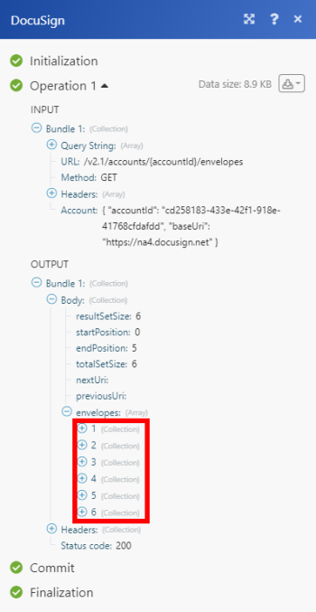

# DocuSign-Module

Die [!DNL Adobe Workfront Fusion] [!DNL DocuSign] -Module ermöglichen es Ihnen, den Umschlagstatus zu überwachen und abzurufen, Hüllkurse zu suchen und abzurufen oder ein Dokument herunterzuladen und zu senden, um sich in Ihrem [!DNL DocuSign] -Konto anzumelden.

Wenn Sie Anweisungen zum Erstellen eines Szenarios benötigen, finden Sie weitere Informationen unter [Erstellen eines Szenarios in [!DNL Adobe Workfront Fusion]](../../workfront-fusion/scenarios/create-a-scenario.md).

Weitere Informationen zu Modulen finden Sie unter [Module in [!DNL Adobe Workfront Fusion]](../../workfront-fusion/modules/modules.md).

## Zugriffsanforderungen

Sie müssen über den folgenden Zugriff verfügen, um die Funktionalität in diesem Artikel verwenden zu können:

<table style="table-layout:auto">
 <col> 
 <col> 
 <tbody> 
  <tr> 
   <td role="rowheader">[!DNL Adobe Workfront] plan*</td>
  <td> 
[!UICONTROL Pro] oder höher
 </td>
  </tr> 
  <tr data-mc-conditions=""> 
   <td role="rowheader">[!DNL Adobe Workfront] license*</td>
   <td> 
[!UICONTROL Plan], [!UICONTROL Arbeit]
 </td> 
  </tr> 
  <tr> 
   <td role="rowheader">[!DNL Adobe Workfront Fusion] license**</td> 
   <td>
   
Aktuelle Lizenzanforderungen: Keine [!DNL Workfront Fusion] Lizenzanforderungen.

   
Oder

   
Alte Lizenzanforderung: [!UICONTROL [!DNL Workfront Fusion] für die Arbeitsautomatisierung und -integration] 

   </td> 
  </tr> 
  <tr> 
   <td role="rowheader">Produkt</td> 
   <td>
   
Aktuelle Produktanforderung: Wenn Sie über den [!UICONTROL Select]- oder [!UICONTROL Prime] [!DNL Adobe Workfront]-Plan verfügen, muss Ihr Unternehmen [!DNL Adobe Workfront Fusion] sowie [!DNL Adobe Workfront] erwerben, um die in diesem Artikel beschriebene Funktionalität nutzen zu können. [!DNL Workfront Fusion] ist im [!UICONTROL Ultimate] [!DNL Workfront]-Plan enthalten.

   
Oder

   
Alte Produktanforderung: Ihr Unternehmen muss [!DNL Adobe Workfront Fusion] sowie [!DNL Adobe Workfront] erwerben, um die in diesem Artikel beschriebenen Funktionen nutzen zu können.

   </td> 
  </tr> 
 </tbody> 
</table>

Wenden Sie sich an Ihren [!DNL Workfront] -Administrator, um zu erfahren, welchen Plan, welchen Lizenztyp oder welchen Zugriff Sie haben.

Informationen zu [!DNL Adobe Workfront Fusion] -Lizenzen finden Sie unter [[!DNL Adobe Workfront Fusion] Lizenzen](../../workfront-fusion/get-started/license-automation-vs-integration.md).

## Voraussetzungen

Um [!DNL DocuSign] -Module zu verwenden, müssen Sie über ein [!DNL DocuSign] -Konto verfügen.

## DocuSign-API-Informationen

Der DocuSign-Connector verwendet Folgendes:

<table style="table-layout:auto"> 
 <col> 
 <col> 
 <tbody> 
  <tr> 
   <td role="rowheader">API-Tag</td> 
   <td>1,18,11</td> 
  </tr>
 </tbody> 
 </table>

## [!DNL DocuSign] mit [!DNL Workfront Fusion] verbinden {#connect-docusign-to-workfront-fusion}

So erstellen Sie eine Verbindung für Ihre [!DNL DocuSign] -Module:

1. Klicken Sie neben dem Feld [!UICONTROL Verbindung] auf **[!UICONTROL Hinzufügen]** , wenn Sie mit der Konfiguration des ersten [!DNL DocuSign]-Moduls beginnen.
1. Geben Sie Folgendes ein:

<table style="table-layout:auto">
    <col> 
    <col> 
    <tbody> 
     <tr> 
      <td role="rowheader"> 
[!UICONTROL Verbindungsname]
 </td> 
      <td>Geben Sie einen Namen für die neue [!DNL DocuSign]-Verbindung ein.</td> 
     </tr> 
     <tr> 
      <td role="rowheader">[!UICONTROL Kontotyp]</td> 
      <td>Wählen Sie aus, ob es sich bei dem Konto, mit dem Sie eine Verbindung herstellen möchten, um ein Produktions- oder Demokonto handelt.</td> 
     </tr> 
    </tbody> 
   </table>

1. Fahren Sie fort wie in [Erstellen einer Verbindung zu  [!DNL Adobe Workfront Fusion]  - Grundlegende Anweisungen](../../workfront-fusion/connections/connect-to-fusion-general.md#connect) beschrieben.

## [!DNL DocuSign] Module und ihre Felder

Wenn Sie [!DNL DocuSign] -Module konfigurieren, zeigt [!DNL Workfront Fusion] die unten aufgeführten Felder an. Darüber hinaus können abhängig von Faktoren wie Ihrer Zugriffsebene in der App oder im Dienst zusätzliche [!DNL DocuSign] -Felder angezeigt werden. Ein fett hervorgehobener Titel in einem Modul zeigt ein erforderliches Feld an.

Wenn Sie die Zuordnungsschaltfläche über einem Feld oder einer Funktion sehen, können Sie damit Variablen und Funktionen für dieses Feld festlegen. Weitere Informationen finden Sie unter [Informationen von einem Modul einem anderen zuordnen in [!DNL Adobe Workfront Fusion]](../../workfront-fusion/mapping/map-information-between-modules.md).

* [Trigger](#triggers)
* [Aktionen](#actions)

### Trigger

#### [!UICONTROL Briefumschläge ansehen]

Dieses Trigger-Modul startet ein Szenario, in dem ein Umschlag gesendet, ausgeliefert, signiert, abgeschlossen oder abgelehnt wird.

<table style="table-layout:auto">
 <col data-mc-conditions=""> 
 <col data-mc-conditions=""> 
 <tbody> 
  <tr> 
   <td role="rowheader">[!UICONTROL Verbindung] </td> 
   <td> 
Anweisungen zum Verbinden Ihres [!DNL DocuSign]-Kontos mit [!DNL Workfront Fusion] finden Sie unter <a href="../../workfront-fusion/scenarios/create-a-scenario.md#connect" class="MCXref xref">Verbinden der App oder des Webdiensts des Moduls mit [!DNL Workfront Fusion]</a> im Artikel <a href="../../workfront-fusion/scenarios/create-a-scenario.md" class="MCXref xref">Erstellen eines Szenarios in [!DNL Adobe Workfront Fusion]</a>.
 </td> 
  </tr> 
  <tr> 
   <td role="rowheader">[!UICONTROL Konto] </td> 
   <td> 
Wählen Sie das Konto aus, das die Datensätze enthält, die Sie sehen möchten.
 </td> 
  </tr> 
  <tr> 
   <td role="rowheader">[!UICONTROL Ereignistyp]</td> 
   <td> 
 Wählen Sie den Ereignistyp aus, den Sie sehen möchten.
 
    <ul> 
     <li>[!UICONTROL Dokument abgeschlossen]</li> 
     <li>[!UICONTROL Dokument abgelehnt]</li> 
     <li>[!UICONTROL Dokument gesendet]</li> 
     <li>[!UICONTROL Dokument signiert]</li> 
     <li>[!UICONTROL Neues Dokument im Posteingang]</li> 
    </ul> </td> 
  </tr> 
  <tr> 
   <td role="rowheader"> 
[!UICONTROL Output fields]
 </td> 
   <td> 
Wählen Sie die Felder aus, die Sie in die Modulausgabe einbeziehen möchten.
 </td> 
  </tr> 
  <tr> 
   <td role="rowheader">[!UICONTROL Limit]</td> 
   <td>Geben Sie die maximale Anzahl von Datensätzen ein oder ordnen Sie sie zu, mit denen das Modul während der verschiedenen Ausführungszyklen eines Szenarios arbeiten soll.</td> 
  </tr> 
 </tbody> 
</table>

### Aktionen

* [[!UICONTROL Benutzerspezifischer API-Aufruf]](#custom-api-call)
* [[!UICONTROL Herunterladen eines Dokuments]](#download-a-document)
* [[!UICONTROL Umschlag lesen]](#read-an-envelope)
* [[!UICONTROL Laden Sie eine Datei in einen Umschlag hoch]](#upload-a-file-to-an-envelope)
* [[!UICONTROL Erstellen eines neuen Umschlags]](#create-a-new-envelope)
* [[!UICONTROL Empfänger zum Umschlag hinzufügen]](#add-recipient-to-envelope)
* [[!UICONTROL Benutzerdefiniertes Feld hinzufügen]](#add-custom-field)
* [[!UICONTROL Benutzerdefiniertes Feld ändern]](#modify-custom-field)
* [[!UICONTROL Umschlag senden]](#send-envelope)

#### [!UICONTROL Benutzerspezifischer API-Aufruf]

Mit diesem Aktionsmodul können Sie einen benutzerdefinierten API-Aufruf ausführen.

<table style="table-layout:auto">
 <col> 
 <col> 
 <tbody> 
  <tr> 
   <td>[!UICONTROL Verbindung]</td> 
   <td> 
Anweisungen zum Verbinden Ihres [!DNL DocuSign]-Kontos mit [!DNL Workfront Fusion] finden Sie in diesem Artikel unter <a href="#connect-docusign-to-workfront-fusion" class="MCXref xref">Verbinden von [!DNL DocuSign] mit [!DNL Workfront Fusion]</a> .
 </td> 
  </tr> 
  <tr> 
   <td>[!UICONTROL Konto]</td> 
   <td>Geben Sie das Konto ein oder ordnen Sie es zu, das Sie für den Zugriff auf die [!DNL DocuSign]-API verwenden möchten.</td> 
  </tr> 
  <tr> 
   <td>[!UICONTROL URL]</td> 
   <td> 
Geben Sie die Adresse auf dem Webserver ein, mit der das Modul interagieren soll.
 
Sie können eine relative URL eingeben. Das bedeutet, dass Sie das Protokoll (z. B. <code>http://</code>) nicht am Anfang einbeziehen müssen. Dies legt dem Webserver nahe, dass die Interaktion auf dem Server stattfindet.
 
Beispiel: <code>[!DNL /api/conversations].create</code>
  </td> 
  </tr> 
  <tr> 
   <td>[!UICONTROL Methode]</td> 
   <td> 
Wählen Sie die HTTP-Anfragemethode aus, die Sie zum Konfigurieren des API-Aufrufs benötigen. Weitere Informationen finden Sie unter <a href="../../workfront-fusion/modules/http-request-methods.md" class="MCXref xref" data-mc-variable-override="">HTTP-Anforderungsmethoden in [!DNL Adobe Workfront Fusion]</a>.
 </td> 
  </tr> 
  <tr> 
   <td>[!UICONTROL Header]</td> 
   <td> 
Fügen Sie die Header der Anfrage in Form eines standardmäßigen JSON-Objekts hinzu. Dadurch wird der Inhaltstyp der Anforderung bestimmt.
 
Beispiel:<code> {"Content-type":"application/json"}</code>
 
Hinweis: Wenn Fehler auftreten und es schwierig ist, ihren Ursprung zu bestimmen, sollten Sie die Kopfzeilen auf Grundlage der [!DNL Workfront] -Dokumentation ändern. Wenn Ihr benutzerspezifischer API-Aufruf einen 422-HTTP-Anforderungsfehler zurückgibt, versuchen Sie, einen "Content-Type":"text/plain"-Header zu verwenden.
 </td> 
  </tr> 
  <tr> 
   <td>[!UICONTROL Abfragezeichenfolge]</td> 
   <td> 
Fügen Sie die Abfrage für den API-Aufruf in Form eines standardmäßigen JSON-Objekts hinzu.
 
Beispiel: <code>{"name":"something-urgent"}</code>
 </td> 
  </tr> 
  <tr> 
   <td>[!UICONTROL Body]</td> 
   <td> 
Fügen Sie den Textinhalt für den API-Aufruf in Form eines standardmäßigen JSON-Objekts hinzu.
 
Hinweis:  
Bei Verwendung von bedingten Anweisungen wie <code>if</code> in Ihrer JSON platzieren Sie die Anführungszeichen außerhalb der bedingten Anweisung.
 
     
Example: </b>"> 
      
  
 
     
 
 </td> 
  </tr> 
  <tr> 
   <td>[!UICONTROL Limit]</td> 
   <td>Geben Sie die maximale Anzahl von Ergebnissen ein, die während eines Ausführungszyklus verarbeitet werden sollen, oder ordnen Sie sie zu.</td> 
  </tr> 
 </tbody> 
</table>

>[!INFO]
>
>**Beispiel:** Listenumschläge
>
>Der folgende API-Aufruf gibt Umschläge vom angegebenen Datum in Ihrem [!DNL DocuSign] -Konto zurück:
>
>**URL**: `/v2.1/accounts/{accountId}/envelopes/`
>
>**Methode**: `GET`
>
>**Abfragezeichenfolge**:
>
>* **Schlüssel**: `from_date`
>
>* **Wert**: `YYYY-MM-DD`
>
>Gibt an, wann die Anfrage beginnt, im Konto Statusänderungen für Hüllkurven zu überprüfen.
>
>
>
>Das Ergebnis finden Sie in der Ausgabe des Moduls unter Bundle > Körper > Hüllkurven.
>
>In unserem Beispiel wurden 6 Umschläge zurückgegeben:
>
>

#### [!UICONTROL Herunterladen eines Dokuments]

Dieses Aktionsmodul lädt ein einzelnes Dokument herunter.

<table style="table-layout:auto">
 <col> 
 <col> 
 <tbody> 
  <tr> 
   <td role="rowheader">[!UICONTROL Verbindung]</td> 
   <td> 
Anweisungen zum Verbinden Ihres [!DNL DocuSign]-Kontos mit [!DNL Workfront Fusion] finden Sie in diesem Artikel unter <a href="#connect-docusign-to-workfront-fusion" class="MCXref xref">Verbinden von [!DNL DocuSign] mit [!DNL Workfront Fusion]</a> .
 </td>
  </tr> 
  <tr> 
   <td role="rowheader">[!UICONTROL Konto] </td> 
   <td> 
Wählen Sie das Konto aus, das das Dokument enthält, das Sie herunterladen möchten.
 </td> 
  </tr> 
  <tr> 
   <td role="rowheader">[!UICONTROL Envelope ID]</td> 
   <td> 
 Geben Sie die Kennung des Umschlags ein oder ordnen Sie ihn zu.
 </td> 
  </tr> 
  <tr> 
   <td role="rowheader"> 
[!UICONTROL Dokument-ID]
 </td> 
   <td> 
Geben Sie die Kennung des Dokuments ein, das Sie herunterladen möchten, oder ordnen Sie es zu.
 </td> 
  </tr> 
  <tr> 
   <td role="rowheader">[!UICONTROL Zertifikat]</td> 
   <td>Wählen Sie <strong>[!UICONTROL Ja]</strong> aus, wenn Sie das Umschlagsignaturzertifikat in den Download einbeziehen möchten.</td> 
  </tr> 
  <tr> 
   <td role="rowheader">[!UICONTROL Dokumente nach Benutzer-ID]</td> 
   <td>Wählen Sie <strong>[!UICONTROL Yes]</strong> aus, wenn Sie zulassen möchten, dass Empfänger Dokumente anhand der Benutzer-ID abrufen können. Wenn ein Benutzer beispielsweise in zwei verschiedenen Routing-Bestellungen mit unterschiedlichen Sichtbarkeiten enthalten ist, gibt die Verwendung dieser Option alle Dokumente aus beiden Routings zurück.</td> 
  </tr> 
  <tr> 
   <td role="rowheader">[!UICONTROL Encrypt]</td> 
   <td>Wählen Sie <strong>[!UICONTROL Yes]</strong> aus, wenn die in der Antwort zurückgegebenen PDF-Bytes für alle in Ihrem [!DNL DocuSign]-Konto konfigurierten Schlüsselmanager verschlüsselt werden sollen.</td> 
  </tr> 
  <tr> 
   <td role="rowheader">[!UICONTROL Sprache]</td> 
   <td>Wählen Sie die Sprache aus.</td> 
  </tr> 
  <tr> 
   <td role="rowheader">[!UICONTROL Änderungen anzeigen]</td> 
   <td>Wenn der Wert auf <strong>[!UICONTROL Ja]</strong> festgelegt ist, werden alle geänderten Felder für die zurückgegebene PDF gelb hervorgehoben und optionale Signaturen oder Initialen sind rot hervorgehoben.</td> 
  </tr> 
  <tr> 
   <td role="rowheader">[!UICONTROL Wasserzeichen]</td> 
   <td> 
Wählen Sie <strong>[!UICONTROL No]</strong> aus, um das Wasserzeichen aus den PDF-Dokumenten zu entfernen.
 </td> 
  </tr> 
 </tbody> 
</table>

#### [!UICONTROL Umschlag lesen]

Dieses Aktionsmodul liest Informationen über einen Umschlag in [!DNL DocuSign] unter Verwendung der Umschlag-ID.

<table style="table-layout:auto">
 <col> 
 <col> 
 <tbody> 
  <tr> 
   <td role="rowheader">[!UICONTROL Verbindung]</td> 
   <td> 
Anweisungen zum Verbinden Ihres [!DNL DocuSign]-Kontos mit [!DNL Workfront Fusion] finden Sie in diesem Artikel unter <a href="#connect-docusign-to-workfront-fusion" class="MCXref xref">Verbinden von [!DNL DocuSign] mit [!DNL Workfront Fusion]</a> .
 </td>
  </tr> 
  <tr> 
   <td role="rowheader">[!UICONTROL Konto] </td> 
   <td> 
Wählen Sie das Konto aus, das das Dokument enthält, aus dem Sie Informationen lesen möchten.
 </td> 
  </tr> 
  <tr> 
   <td role="rowheader">[!UICONTROL Envelope ID]</td> 
   <td> 
 Geben Sie die ID ein oder ordnen Sie sie zu, die das Dokument enthält, aus dem Sie Informationen lesen möchten.
 </td> 
  </tr> 
  <tr> 
   <td role="rowheader">[!UICONTROL Ausgaben]</td> 
   <td>Wählen Sie die Eigenschaften aus, die in der Ausgabe des Moduls angezeigt werden sollen. </td> 
  </tr> 
 </tbody> 
</table>

#### [!UICONTROL Laden Sie eine Datei in einen Umschlag hoch]

Dieses Modul lädt eine bestimmte Datei in einen vorhandenen Umschlag in DocuSign hoch.

<table style="table-layout:auto">
 <col> 
 <col> 
 <tbody> 
  <tr> 
   <td role="rowheader">[!UICONTROL Verbindung]</td> 
   <td> 
Anweisungen zum Verbinden Ihres [!DNL DocuSign]-Kontos mit [!DNL Workfront Fusion] finden Sie in diesem Artikel unter <a href="#connect-docusign-to-workfront-fusion" class="MCXref xref">Verbinden von [!DNL DocuSign] mit [!DNL Workfront Fusion]</a> .
 </td>
  </tr> 
  <tr> 
   <td role="rowheader">[!UICONTROL Konto] </td> 
   <td> 
Wählen Sie das Konto aus, das den Umschlag enthält, in den Sie eine Datei hochladen möchten.
 </td> 
  </tr> 
  <tr> 
   <td role="rowheader">[!UICONTROL Envelope ID]</td> 
   <td> 
 Geben Sie die Kennung des Umschlags ein, in den Sie eine Datei hochladen möchten, oder ordnen Sie sie zu.
 </td> 
  </tr> 
  <tr> 
   <td role="rowheader">[!UICONTROL Source-Datei]</td> 
   <td>Wählen Sie eine Quelldatei aus einem vorherigen Modul aus oder geben Sie den Namen und die Daten der Quelldatei ein.</td> 
  </tr> 
 </tbody> 
</table>

#### [!UICONTROL Erstellen eines neuen Umschlags]

Dieses Aktionsmodul erstellt einen neuen Umschlag aus einer Vorlage. Es werden die Kennung des neuen Umschlags sowie der Status des neuen Umschlags zurückgegeben.

<table style="table-layout:auto">
 <col data-mc-conditions=""> 
 <col data-mc-conditions=""> 
 <tbody> 
  <tr> 
    <td role="rowheader">[!UICONTROL Verbindung] </td>

<td> 
Anweisungen zum Verbinden Ihres DocuSign-Kontos mit Workfront Fusion finden Sie unter <a href="../../workfront-fusion/scenarios/create-a-scenario.md#connect" class="MCXref xref">Verbinden der App oder des Webdiensts des Moduls mit Workfront Fusion</a> im Artikel <a href="../../workfront-fusion/scenarios/create-a-scenario.md" class="MCXref xref">Erstellen eines Szenarios in Adobe Workfront Fusion</a> .
 </td> 
  </tr> 
  <tr> 
    <td role="rowheader">[!UICONTROL Konto] </td>
   <td> 
Wählen Sie das Konto aus, das den Umschlag enthält, in den Sie eine Datei hochladen möchten.
 </td> 
  </tr> 
  <tr> 
    <td role="rowheader" >[!UICONTROL Vorlage]</td>
   <td> 
 Wählen Sie die Vorlage aus, aus der Sie den neuen Umschlag erstellen möchten. Vorlagen sind basierend auf dem von Ihnen ausgewählten [!UICONTROL Konto] verfügbar.
 </td> 
  </tr> 
  <tr> 
   <td role="rowheader">
     [!UICONTROL Nach Erstellung]
   </td> 
   <td> 
Wählen Sie aus, ob Sie den Umschlag als Entwurf speichern oder zum Signieren senden möchten.
 </td> 
  </tr> 
  <tr> 
    <td role="rowheader" >[!UICONTROL Vorlagenempfänger]</td>
    <td>Empfänger dieses Briefumschlags auswählen</td>
  </tr> 
 </tbody> 
</table>

#### [!UICONTROL Empfänger zum Umschlag hinzufügen]

Dieses Aktionsmodul fügt einen oder mehrere Empfänger zu einem vorhandenen Umschlag hinzu. Wenn der Umschlag bereits gesendet wurde, wird dem Empfänger eine E-Mail gesendet. Dieses Modul gilt nicht für bereits abgeschlossene Umschläge.

<table style="table-layout:auto">
 <col data-mc-conditions=""> 
 <col data-mc-conditions=""> 
 <tbody> 
  <tr data-mc-conditions=""> 
    <td>[!UICONTROL Verbindung] </td>
   <td> 
Anweisungen zum Verbinden Ihres DocuSign-Kontos mit Workfront Fusion finden Sie unter <a href="../../workfront-fusion/scenarios/create-a-scenario.md#connect" class="MCXref xref">Verbinden der App oder des Webdiensts des Moduls mit Workfront Fusion</a> im Artikel <a href="../../workfront-fusion/scenarios/create-a-scenario.md" class="MCXref xref">Erstellen eines Szenarios in Adobe Workfront Fusion</a> .
 </td> 
  </tr> 
  <tr data-mc-conditions="">
    <td>[!UICONTROL Konto] </td>
   <td> 
Wählen Sie das Konto aus, das den Umschlag enthält, in den Sie Empfänger hinzufügen möchten.
 </td> 
  </tr> 
  <tr> 
    <td>[!UICONTROL Envelope ID]</td>
    <td>Wählen Sie die Kennung des Umschlags aus, in den Sie den Empfänger einfügen möchten, oder ordnen Sie sie zu.</td>
  </tr> 
  <tr data-mc-conditions="">
    <td role="rowheader">[!UICONTROL Empfänger-Typ]</td>
   <td> 
 Wählen Sie den Empfängertyp aus, den Sie dem Umschlag hinzufügen möchten.
 
    <ul> 
     <li> 
[!UICONTROL Agent]
 </li> 
     <li> 
[!UICONTROL Carbon Copy]
 </li> 
     <li> 
[!UICONTROL zertifizierter Versand]
 </li> 
     <li> 
[!UICONTROL In-person-signer]
 </li> 
     <li> 
[!UICONTROL Vermittelnder]
 </li> 
     <li> 
[!UICONTROL Signer]
 </li> 
    </ul> </td> 
  </tr> 
  <tr> 
    <td>[!UICONTROL Email]</td>
   <td> 
Geben Sie die E-Mail-Adresse des Empfängers ein oder ordnen Sie sie dem Umschlag zu.
 </td> 
  </tr> 
  <tr> 
    <td>[!UICONTROL Name]</td>
   <td>Geben Sie den Namen des Empfängers ein oder ordnen Sie ihn dem Umschlag zu.</td> 
  </tr> 
  <tr>
    <td>[!UICONTROL Routing-Reihenfolge]</td>
   <td> 
Geben Sie die Routing-Nummer für den Empfänger ein oder ordnen Sie sie zu. Die Routing-Nummer bestimmt die Reihenfolge, in der Empfänger Ihre Dokumente empfangen und unterschreiben.
 </td> 
  </tr> 
  <tr> 
    <td role="rowheader">[!UICONTROL Email body]</td>
   <td>Geben Sie den Hauptteil (Inhalt) der E-Mail ein oder ordnen Sie ihn dem Empfänger zu.</td> 
  </tr> 
  <tr>
    <td role="rowheader">[!UICONTROL E-Mail-Betreff]</td>
   <td>Geben Sie den Betreff der E-Mail ein oder ordnen Sie ihn dem Empfänger zu.</td> 
  </tr> 
    <td role="rowheader">[!UICONTROL Private Nachricht]</td>
   <td> <li> 
Nur der ausgewählte Empfänger sieht die private Nachricht sowie die allgemeine Nachricht. Die private Nachricht ist auf 1000 Zeichen begrenzt.
 </li> </td> 
  </tr> 
  <tr> 
   <td role="rowheader">[!UICONTROL Authentifizierung]</td> 
   <td> 
Wählen Sie die Authentifizierungsmethode aus, mit der Sie die Identität des Empfängers bestätigen möchten.
 
    <ul> 
     <li> 
<strong>[!UICONTROL None]</strong> 
 </li> 
     <li> 
<strong>[!UICONTROL Zugriffscode]</strong> 
 
Geben Sie den Zugriffscode ein oder ordnen Sie ihn zu.
 </li> 
     <li> 
<strong>[!UICONTROL Telefon]</strong> 
 
Telefonnummer eingeben oder zuordnen
 </li> 
     <li> 
<strong>[!UICONTROL SMS]</strong> 
 
Telefonnummer eingeben oder zuordnen
 </li> 
    </ul> </td> 
  </tr> 
 </tbody> 
</table>

#### [!UICONTROL Benutzerdefiniertes Feld hinzufügen]

Dieses Aktionsmodul fügt ein benutzerdefiniertes Feld zum Dokument hinzu.

<table style="table-layout:auto">
 <col> 
 <col> 
 <tbody> 
  <tr> 
   <td role="rowheader">[!UICONTROL Verbindung]</td> 
   <td> 
Anweisungen zum Verbinden Ihres [!DNL DocuSign]-Kontos mit [!DNL Workfront Fusion] finden Sie in diesem Artikel unter <a href="#connect-docusign-to-workfront-fusion" class="MCXref xref">Verbinden von [!DNL DocuSign] mit [!DNL Workfront Fusion]</a> .
 </td>
  </tr> 
  <tr> 
   <td role="rowheader">[!UICONTROL Konto] </td> 
   <td> 
Wählen Sie das Konto aus, das das Dokument enthält, dem Sie ein benutzerdefiniertes Feld hinzufügen möchten.
 </td> 
  </tr> 
  <tr> 
   <td role="rowheader">[!UICONTROL Envelope ID]</td> 
   <td> 
 Geben Sie die Kennung des Umschlags ein, der das Dokument enthält, in dem Sie ein benutzerdefiniertes Feld hinzufügen möchten, oder ordnen Sie sie zu.
 </td> 
  </tr> 
  <tr> 
   <td role="rowheader">[!UICONTROL Feldname]</td> 
   <td>Geben Sie einen Namen für das neue Feld ein, das Sie hinzufügen möchten, oder ordnen Sie einen Namen zu.</td> 
  </tr> 
  <tr> 
   <td role="rowheader">[!UICONTROL Erforderlich]</td> 
   <td>Aktivieren Sie diese Option, wenn das hinzugefügte Feld ein erforderliches Feld sein soll.</td> 
  </tr> 
  <tr> 
   <td role="rowheader">[!UICONTROL Feld anzeigen]</td> 
   <td>Aktivieren Sie diese Option, wenn das Feld sichtbar sein soll.</td> 
  </tr> 
  <tr> 
   <td role="rowheader">[!UICONTROL Wert]</td> 
   <td>Geben Sie den Wert (Inhalt) des hinzugefügten Felds ein oder ordnen Sie ihn zu. </td> 
  </tr> 
 </tbody> 
</table>

#### [!UICONTROL Benutzerdefiniertes Feld ändern]

Dieses Aktionsmodul ändert ein benutzerdefiniertes Feld unter Verwendung des Feldnamens.

<table style="table-layout:auto">
 <col> 
 <col> 
 <tbody> 
  <tr> 
   <td role="rowheader">[!UICONTROL Verbindung]</td> 
   <td> 
Anweisungen zum Verbinden Ihres [!DNL DocuSign]-Kontos mit [!DNL Workfront Fusion] finden Sie in diesem Artikel unter <a href="#connect-docusign-to-workfront-fusion" class="MCXref xref">Verbinden von [!DNL DocuSign] mit [!DNL Workfront Fusion]</a> .
 </td>
  </tr> 
  <tr> 
   <td role="rowheader">[!UICONTROL Konto] </td> 
   <td> 
Wählen Sie das Konto aus, das das Dokument enthält, in dem Sie ein benutzerdefiniertes Feld ändern möchten.
 </td> 
  </tr> 
  <tr> 
   <td role="rowheader">[!UICONTROL Envelope ID]</td> 
   <td> 
 Geben Sie die Kennung des Umschlags ein, der das Dokument enthält, in dem Sie ein benutzerdefiniertes Feld ändern möchten, oder ordnen Sie sie zu.
 </td> 
  </tr> 
  <tr> 
   <td role="rowheader">[!UICONTROL Feld-ID]</td> 
   <td>Geben Sie die Kennung des Felds ein, das Sie ändern möchten, oder ordnen Sie sie zu.</td> 
  </tr> 
  <tr> 
   <td role="rowheader">[!UICONTROL Feldname]</td> 
   <td>Geben Sie den Namen des Felds ein, das Sie ändern möchten, oder ordnen Sie ihn zu.</td> 
  </tr> 
  <tr> 
   <td role="rowheader">[!UICONTROL Erforderlich]</td> 
   <td>Aktivieren Sie diese Option, wenn das geänderte Feld ein erforderliches Feld sein soll.</td> 
  </tr> 
  <tr> 
   <td role="rowheader">[!UICONTROL Feld anzeigen]</td> 
   <td>Aktivieren Sie diese Option, wenn das Feld sichtbar sein soll.</td> 
  </tr> 
  <tr> 
   <td role="rowheader">[!UICONTROL Wert]</td> 
   <td>Geben Sie den Wert (Inhalt) des geänderten Felds ein oder ordnen Sie ihn zu. </td> 
  </tr> 
 </tbody> 
</table>

#### [!UICONTROL Umschlag senden]

Dieses Aktionsmodul sendet einen Briefumschlagentwurf an seine Empfänger.

<table style="table-layout:auto">
 <col> 
 <col> 
 <tbody> 
  <tr> 
   <td role="rowheader">[!UICONTROL Verbindung]</td> 
   <td> 
Anweisungen zum Verbinden Ihres [!DNL DocuSign]-Kontos mit [!DNL Workfront Fusion] finden Sie in diesem Artikel unter <a href="#connect-docusign-to-workfront-fusion" class="MCXref xref">Verbinden von [!DNL DocuSign] mit [!DNL Workfront Fusion]</a> .
 </td>
  </tr> 
  <tr> 
   <td role="rowheader">[!UICONTROL Konto] </td> 
   <td> 
Wählen Sie das Konto aus, das den Briefumschlagentwurf enthält, den Sie an die Empfänger senden möchten.
 </td> 
  </tr> 
  <tr> 
   <td role="rowheader">[!UICONTROL Envelope ID]</td> 
   <td> 
 Geben Sie die Kennung des Briefumschlagentwurfs ein oder ordnen Sie ihn den Empfängern zu.
 </td> 
  </tr> 
 </tbody> 
</table>
