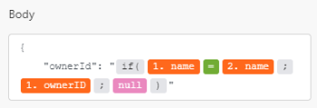

# [!DNL Google Calendar]-Module

In einer [!DNL Adobe Workfront Fusion] können Sie Workflows automatisieren, die [!UICONTROL Google-Kalender], und stellen Sie eine Verbindung zu mehreren Drittanbieteranwendungen und -diensten her.

Informationen zum Erstellen eines Szenarios finden Sie unter [Erstellen Sie ein Szenario in [!DNL Adobe Workfront Fusion]](../../workfront-fusion/scenarios/create-a-scenario.md).

Informationen zu Modulen finden Sie unter [Module in [!DNL Adobe Workfront Fusion]](../../workfront-fusion/modules/modules.md).

## Zugriffsanforderungen

Sie müssen über den folgenden Zugriff verfügen, um die in diesem Artikel enthaltene Funktionalität nutzen zu können:

<table style="table-layout:auto"> 
 <col> 
 <col> 
 <tbody> 
  <tr> 
   <td role="rowheader">[!DNL Adobe Workfront] Plan*</td>
  <td> 
[!UICONTROL Pro] oder höher
 </td>
  </tr> 
  <tr data-mc-conditions=""> 
   <td role="rowheader">[!DNL Adobe Workfront] license*</td>
   <td> 
[!UICONTROL Plan], [!UICONTROL Arbeit]
 </td> 
  </tr> 
  <tr> 
   <td role="rowheader">[!DNL Adobe Workfront Fusion] license**</td> 
   <td> 
[!UICONTROL [!DNL Workfront Fusion] für Arbeitsautomatisierung und Integration] 
 </td> 
  </tr> 
  <tr> 
   <td role="rowheader">Produkt</td> 
   <td>Ihr Unternehmen muss [!DNL Adobe Workfront Fusion] sowie [!DNL Adobe Workfront] , um die in diesem Artikel beschriebenen Funktionen zu verwenden.</td> 
  </tr> 
 </tbody> 
</table>

Wenden Sie sich an Ihren [!DNL Workfront] Administrator.

Informationen über [!DNL Adobe Workfront Fusion] Lizenzen, siehe [[!DNL Adobe Workfront Fusion] Lizenzen](../../workfront-fusion/get-started/license-automation-vs-integration.md).

## Voraussetzungen

Verwendung [!DNL Google Calendar] -Module, müssen Sie über eine [!DNL Google] -Konto.

## [!DNL Google Calendar] Module und ihre Felder

Bei der Konfiguration [!DNL Google Calendar] Module, [!DNL Workfront Fusion] zeigt die unten aufgeführten Felder an. Zusätzlich zu diesen [!DNL Google Calendar] -Felder können abhängig von Faktoren wie Ihrer Zugriffsebene in der App oder im Dienst angezeigt werden. Ein fett hervorgehobener Titel in einem Modul zeigt ein erforderliches Feld an.

Wenn Sie die Zuordnungsschaltfläche über einem Feld oder einer Funktion sehen, können Sie damit Variablen und Funktionen für dieses Feld festlegen. Weitere Informationen finden Sie unter [Ordnen Sie Informationen zwischen Modulen in [!DNL Adobe Workfront Fusion]](../../workfront-fusion/mapping/map-information-between-modules.md).

* [Veranstaltungen](#events)
* [Kalender](#calendars)
* [Zugriffskontrollregeln](#access-control-rules)
* [Iteratoren (nicht mehr unterstützt)](#iterators-deprecated)
* [Sonstige](#other)

### Veranstaltungen

* [[!UICONTROL Ereignisse beobachten]](#watch-events)
* [[!UICONTROL Suchereignisse]](#search-events)
* [[!UICONTROL Ereignis abrufen]](#get-an-event)
* [[!UICONTROL Ereignis erstellen]](#create-an-event)
* [[!UICONTROL Ereignis aktualisieren]](#update-an-event)
* [[!UICONTROL Ereignis löschen]](#delete-an-event)

#### [!UICONTROL Ereignisse beobachten]

Dieses Trigger-Modul führt ein Szenario aus, wenn ein neues Ereignis im angegebenen Kalender hinzugefügt, aktualisiert, gelöscht, gestartet oder beendet wird. Das Modul gibt alle mit dem Datensatz oder den Datensätzen verknüpften Standardfelder sowie alle benutzerdefinierten Felder und Werte zurück, auf die die Verbindung zugreift. Sie können diese Informationen in nachfolgenden Modulen im Szenario zuordnen.

Wenn Sie dieses Modul konfigurieren, werden die folgenden Felder angezeigt.

<table style="table-layout:auto"> 
 <col> 
 <col> 
 <tbody> 
  <tr> 
   <td>[!UICONTROL Verbindung] </td> 
   <td> 
Anweisungen zum Verbinden der [!DNL Google Calendar] Konto [!DNL Workfront Fusion], siehe <a href="../../workfront-fusion/connections/connect-to-fusion-general.md" class="MCXref xref" data-mc-variable-override="">Verbindung zur Adobe erstellen [!DNL Workfront Fusion] - Grundlegende Anweisungen</a>
 </td> 
  </tr> 
  <tr> 
   <td>[!UICONTROL Kalender] </td> 
   <td> 
Wählen Sie den Kalender aus, mit dem das Modul arbeiten soll.
 </td> 
  </tr> 
  <tr> 
   <td>[!UICONTROL Überwachungsereignisse]</td> 
   <td> 
Wählen Sie aus, ob Sie Ereignisse nach Erstellungsdatum, Aktualisierungsdatum, Startdatum oder Enddatum verfolgen möchten.
 </td> 
  </tr> 
  <tr> 
   <td>[!UICONTROL Gelöschte Ereignisse anzeigen]</td> 
   <td> 
Aktivieren Sie diese Option, um gelöschte Ereignisse einzuschließen.
 </td> 
  </tr> 
  <tr> 
   <td>[!UICONTROL Abfrage] </td> 
   <td> 
Geben Sie den Text ein, nach dem Sie suchen möchten.
 </td> 
  </tr> 
  <tr> 
   <td>[!UICONTROL Limit]</td> 
   <td> 
 Legen Sie die maximale Anzahl von Ereignissen fest, die [!DNL Workfront Fusion] arbeitet mit während eines Zyklus (die Anzahl der Wiederholungen pro Szenario-Ausführung). Wenn der Wert zu hoch eingestellt ist, kann die Verbindung auf der Seite des angegebenen Drittanbieterdienstes unterbrochen werden (Timeout). [!DNL Workfront Fusion] hat diesbezüglich keinen Einfluss. Es wird empfohlen, einen niedrigeren Wert festzulegen und entweder einen höheren Wert für die maximale Anzahl von Zyklen zu definieren oder das Szenario häufiger auszuführen.
 </td> 
  </tr> 
 </tbody> 
</table>

#### [!UICONTROL Suchereignisse]

Dieses Aktionsmodul sucht im ausgewählten Kalender nach einem Ereignis.

Sie geben den Kalender und die Suchparameter an.

Das Modul gibt die ID des Ereignisses sowie alle zugehörigen Felder sowie alle benutzerdefinierten Felder und Werte zurück, auf die die Verbindung zugreift. Sie können diese Informationen in nachfolgenden Modulen im Szenario zuordnen.

Wenn Sie dieses Modul konfigurieren, werden die folgenden Felder angezeigt.

<table style="table-layout:auto"> 
 <col> 
 <col> 
 <tbody> 
  <tr> 
   <td>[!UICONTROL Verbindung] </td> 
   <td>Anweisungen zum Verbinden der [!DNL Google Calendar] Informationen zu Workfront Fusion finden Sie unter <a href="../../workfront-fusion/connections/connect-to-fusion-general.md" class="MCXref xref" data-mc-variable-override="">Verbindung zu Adobe Workfront Fusion erstellen - Grundlegende Anweisungen</a></td> 
  </tr> 
  <tr> 
   <td>[!UICONTROL Kalender-ID]</td> 
   <td> 
Wählen Sie den Kalender aus, den Sie suchen möchten.
 </td> 
  </tr> 
  <tr> 
   <td>[!UICONTROL Startdatum]</td> 
   <td> 
 Geben Sie das Datum für den Beginn des Ereignisses ein oder ordnen Sie es zu. Dieses Modul ruft auch Ereignisse ab, die vor diesem Datum beginnen und noch am eingegebenen Startdatum auftreten. 
 
Eine Liste der unterstützten Datums- und Uhrzeitformate finden Sie unter <a href="../../workfront-fusion/mapping/type-coercion.md" class="MCXref xref">Typenkonvertierung in [!DNL Adobe Workfront Fusion]</a>.
 </td> 
  </tr> 
  <tr> 
   <td>[!UICONTROL Enddatum]</td> 
   <td> 
 Geben Sie das Datum zum Ende des Ereignisses ein oder ordnen Sie es zu. 
 
 Eine Liste der unterstützten Datums- und Uhrzeitformate finden Sie unter <a href="../../workfront-fusion/mapping/type-coercion.md" class="MCXref xref">Typenkonvertierung in [!DNL Adobe Workfront Fusion]</a>.
 </td> 
  </tr> 
  <tr> 
   <td>[!UICONTROL Einzelereignisse]</td> 
   <td> 
 Aktivieren Sie diese Option, um wiederkehrende Ereignisse als einzelne Instanzen zu behandeln. Wenn Sie beispielsweise ein wöchentliches Meeting haben und diese Option aktiviert ist, gibt das Modul das Meeting jeder Woche als separate Veranstaltung zurück.
 </td> 
  </tr> 
  <tr> 
   <td>[!UICONTROL Abfrage]</td> 
   <td> 
Geben Sie den Suchbegriff, nach dem Sie suchen möchten, ein oder ordnen Sie ihn zu. 
 </td> 
  </tr> 
  <tr> 
   <td>[!UICONTROL Reihenfolge nach]</td> 
   <td> 
Wählen Sie die Reihenfolge der im Ergebnis zurückgegebenen Ereignisse aus.
 
    <ul> 
     <li><strong>[!UICONTROL Startzeit]</strong>: Sortieren Sie nach Startdatum und -zeit (aufsteigend). Dies ist nur bei der Abfrage einzelner Ereignisse verfügbar.</li> 
     <li><strong>[!UICONTROL Aktualisierte Zeit]</strong>: Reihenfolge der letzten Änderungszeit (aufsteigend).</li> 
    </ul> </td> 
  </tr> 
  <tr> 
   <td>[!UICONTROL Limit]</td> 
   <td> 
Maximale Ereignisanzahl festlegen [!DNL Workfront Fusion] gibt während eines Ausführungszyklus zurück.
 </td> 
  </tr> 
 </tbody> 
</table>

#### [!UICONTROL Ereignis abrufen]

Dieses Aktionsmodul gibt die Metadaten für ein einzelnes Ereignis im angegebenen Kalender zurück.

Sie geben den Kalender und das Ereignis an.

Das Modul gibt die ID des Ereignisses und alle zugehörigen Felder sowie alle benutzerdefinierten Felder und Werte zurück, auf die die Verbindung zugreift. Sie können diese Informationen in nachfolgenden Modulen im Szenario zuordnen.

Wenn Sie dieses Modul konfigurieren, werden die folgenden Felder angezeigt.

<table style="table-layout:auto"> 
 <col> 
 <col> 
 <tbody> 
  <tr> 
   <td>[!UICONTROL Verbindung] </td> 
   <td> 
Anweisungen zum Verbinden der [!DNL Google Calendar] Konto [!DNL Workfront Fusion], siehe <a href="../../workfront-fusion/connections/connect-to-fusion-general.md" class="MCXref xref" data-mc-variable-override="">Verbindung zur Adobe erstellen [!DNL Workfront Fusion] - Grundlegende Anweisungen</a>
 </td> 
  </tr> 
  <tr> 
   <td>[!UICONTROL Kalender-ID]</td> 
   <td> 
Geben Sie die Kennung des Kalenders ein oder ordnen Sie sie zu, der das gewünschte Ereignis enthält.
 </td> 
  </tr> 
  <tr> 
   <td>[!UICONTROL Ereignis-ID] </td> 
   <td> 
Geben Sie die Ereignis-ID der vorhandenen ein. [!DNL Google Calendar] -Ereignis, das Sie erhalten möchten.
 </td> 
  </tr> 
 </tbody> 
</table>

#### [!UICONTROL Ereignis erstellen]

Dieses Aktionsmodul erstellt ein Ereignis.

Sie geben den Kalender und die Parameter für das Ereignis an.

Das Modul gibt die ID des Ereignisses sowie alle zugehörigen Felder sowie alle benutzerdefinierten Felder und Werte zurück, auf die die Verbindung zugreift. Sie können diese Informationen in nachfolgenden Modulen im Szenario zuordnen.

Wenn Sie dieses Modul konfigurieren, werden die folgenden Felder angezeigt.

<table style="table-layout:auto"> 
 <col> 
 <col> 
 <tbody> 
  <tr> 
   <td>[!UICONTROL Verbindung] </td> 
   <td>Anweisungen zum Verbinden der [!DNL Google Calendar] Informationen zu Workfront Fusion finden Sie unter <a href="../../workfront-fusion/connections/connect-to-fusion-general.md" class="MCXref xref" data-mc-variable-override="">Verbindung zu Adobe Workfront Fusion erstellen - Grundlegende Anweisungen</a></td> 
  </tr> 
  <tr> 
   <td>[!UICONTROL Ereignis erstellen]</td> 
   <td> 
Wählen Sie aus, wie das Ereignis erstellt werden soll.
 
    <ul> 
     <li><b>[!UICONTROL im Detail]</b>
Mit dieser Option können Sie detailliertere Informationen zum Ereignis bereitstellen. 
</li> 
     <li><b>[!UICONTROL Schnell]</b>
Sie müssen nur den Kalender auswählen und einen Namen für das Ereignis eingeben. Sie können Details zu Zeit und Ort in den Namen aufnehmen und [!DNL Google Calendar] wird das Ereignis für diesen Ort und diese Uhrzeit planen.
</li> 
    </ul> </td> 
  </tr> 
  <tr> 
   <td>[!UICONTROL Kalender-ID]</td> 
   <td> 
Wählen Sie den Kalender aus, in dem das Ereignis angezeigt werden soll.
 </td> 
  </tr> 
  <tr> 
   <td>[!UICONTROL Farbe]</td> 
   <td>Wählen Sie die Farbe aus, die das Ereignis im Kalender anzeigt.</td> 
  </tr> 
  <tr> 
   <td>[!UICONTROL Ereignisname]</td> 
   <td> 
 Geben Sie einen Namen für das Ereignis ein oder ordnen Sie ihn zu. 
 
Hinweis: Wenn Sie [!UICONTROL Quick Add] im Feld [!UICONTROL Ereignis erstellen] ausgewählt haben, können Sie das Datum und die Uhrzeit des Ereignisses angeben und [!DNL Workfront Fusion] erstellt das Ereignis für dieses Datum und diese Uhrzeit. Beispiel: <code>Appointment at Capitol Hill on June 3rd 10am-10:25am</code>. Wenn Sie [!UICONTROL Quick Add] ausgewählt haben, aber kein Datum und keine Uhrzeit in den Ereignisnamen einschließen, wird das Ereignis von der aktuellen Zeit aus erstellt und dauert eine Stunde.
 </td> 
  </tr> 
  <tr> 
   <td>[!UICONTROL Ganztägiges Ereignis]</td> 
   <td>Aktivieren Sie diese Option, wenn es sich bei dem Ereignis um ein ganztägiges Ereignis handelt (keine Start- und Endzeiten erforderlich sind).</td> 
  </tr> 
  <tr> 
   <td>[!UICONTROL Startdatum]</td> 
   <td> 
Wenn es sich um ein ganztägiges Ereignis handelt, geben Sie das Startdatum des Ereignisses ein. 
 
Eine Liste der unterstützten Datumsformate finden Sie unter <a href="../../workfront-fusion/mapping/type-coercion.md" class="MCXref xref">Typenkonvertierung in [!DNL Adobe Workfront Fusion]</a>.
 </td> 
  </tr> 
  <tr> 
   <td>[!UICONTROL Enddatum]</td> 
   <td> 
 Wenn es sich um ein ganztägiges Ereignis handelt, geben Sie das Enddatum des Ereignisses ein. 
 
Eine Liste der unterstützten Datumsformate finden Sie unter <a href="../../workfront-fusion/mapping/type-coercion.md" class="MCXref xref">Typenkonvertierung in [!DNL Adobe Workfront Fusion]</a>.
 </td> 
  </tr> 
  <tr> 
   <td>[!UICONTROL Beschreibung]</td> 
   <td>Geben Sie eine Beschreibung für das Ereignis ein oder ordnen Sie es zu. Dieses Feld unterstützt HTML.</td> 
  </tr> 
  <tr> 
   <td>[!UICONTROL Standort]</td> 
   <td>Geben Sie einen Ort für das Ereignis im Textformular ein.</td> 
  </tr> 
  <tr> 
   <td>[!UICONTROL Verwenden Sie die standardmäßigen Erinnerungseinstellungen für dieses Ereignis]</td> 
   <td>Aktivieren Sie diese Option, um die standardmäßigen Erinnerungseinstellungen zu verwenden. Wenn Sie eine benutzerdefinierte Erinnerung im Feld [!UICONTROL Erinnerung] festlegen, wird dieser Wert auf "Nein"gesetzt.</td> 
  </tr> 
  <tr> 
   <td>[!UICONTROL Reminder] </td> 
   <td> 
Fügen Sie eine Erinnerung für das Ereignis hinzu. Wählen Sie für jede Erinnerung die Methode aus, an die Sie erinnert werden möchten, und definieren Sie, wie lange (in Minuten) vor dem Ereignis, an das Sie erinnert werden möchten.
 </td> 
  </tr> 
  <tr> 
   <td>[!UICONTROL Teilnehmer]</td> 
   <td>Fügen Sie die Teilnehmer zum Ereignis hinzu. Geben Sie für jeden Teilnehmer seinen Namen und seine E-Mail-Adresse ein oder ordnen Sie sie zu.</td> 
  </tr> 
  <tr> 
   <td>[!UICONTROL Anzeigen als]</td> 
   <td>Wählen Sie aus, ob Personen, die Ihren Kalender anzeigen, Sie während dieser Veranstaltung als beschäftigt oder verfügbar anzeigen sollen.</td> 
  </tr> 
  <tr> 
   <td>[!UICONTROL Sichtbarkeit] </td> 
   <td> 
Wählen Sie die Sichtbarkeit dieses Ereignisses aus. 
 
    <ul> 
     <li> 
<b>[!UICONTROL Standard]</b>
 
Das Ereignis hat die Sichtbarkeit, die Sie in Ihren Kalendereinstellungen festgelegt haben.
 </li> 
     <li> 
<b>[!UICONTROL Public]</b>
 
Jeder, für den der Kalender freigegeben ist, kann dieses Ereignis sehen.
 </li> 
     <li> 
<b>[!UICONTROL Private]</b>
 
Dieses Ereignis kann nur von Teilnehmern angezeigt werden.
 </li> 
    </ul> </td> 
  </tr> 
  <tr> 
   <td>[!UICONTROL Benachrichtigung zur Ereigniserstellung senden]</td> 
   <td> 
Wählen Sie aus, ob Benachrichtigungen über die Erstellung eines neuen Ereignisses an alle Gäste, an Nicht-Besucher, gesendet werden sollen.[!DNL Google Calendar] Gäste oder niemandem.
 
Tipp: Es wird empfohlen, die Option [!UICONTROL None] nur für Migrationsanwendungsfälle zu verwenden.
 </td> 
  </tr> 
  <tr> 
   <td>[!UICONTROL Gäste können das Ereignis ändern]</td> 
   <td> 
Aktivieren Sie diese Option, wenn Sie möchten, dass Gäste dieses Ereignis ändern können.
 </td> 
  </tr> 
  <tr> 
   <td>[!UICONTROL Recurence]</td> 
   <td>Fügen Sie alle Wiederholungsregeln hinzu, die Sie auf dieses Ereignis anwenden möchten. Für jede Regel ist eine Liste der Zeilen [!UICONTROL RRULE], [!UICONTROL EXRULE], [!UICONTROL RDATE] und [!UICONTROL EXDATE] für ein wiederkehrendes Ereignis erforderlich. Beachten Sie, dass die Zeilen [!UICONTROL DTSTART] und [!UICONTROL DTEND] in diesem Feld nicht zulässig sind. Beginn- und Endzeiten von Ereignissen werden in den Feldern Start und Ende angegeben. Dieses Feld wird für einzelne Ereignisse oder Instanzen wiederkehrender Ereignisse weggelassen. Weitere Informationen finden Sie unter <a href="https://tools.ietf.org/html/rfc5545#section-3.8.5">RFC 5545</a>.</td> 
  </tr> 
 </tbody> 
</table>

#### [!UICONTROL Ereignis aktualisieren]

Dieses Aktionsmodul ändert ein vorhandenes Ereignis.

Sie geben den Kalender und die Ereignis-ID an.

Das Modul gibt die ID des Ereignisses sowie alle zugehörigen Felder sowie alle benutzerdefinierten Felder und Werte zurück, auf die die Verbindung zugreift. Sie können diese Informationen in nachfolgenden Modulen im Szenario zuordnen.

Wenn Sie dieses Modul konfigurieren, werden die folgenden Felder angezeigt.

<table style="table-layout:auto"> 
 <col> 
 <col> 
 <tbody> 
  <tr> 
   <td>[!UICONTROL Verbindung] </td> 
   <td> 
Anweisungen zum Verbinden der [!DNL Google Calendar] Konto [!DNL Workfront Fusion], siehe <a href="../../workfront-fusion/connections/connect-to-fusion-general.md" class="MCXref xref" data-mc-variable-override="">Verbindung zur Adobe erstellen [!DNL Workfront Fusion] - Grundlegende Anweisungen</a>
 </td> 
  </tr> 
  <tr> 
   <td>[!UICONTROL Kalender] </td> 
   <td> 
Wählen Sie den Kalender aus, mit dem Sie arbeiten möchten.
 </td> 
  </tr> 
  <tr> 
   <td>[!UICONTROL Ereignis-ID] </td> 
   <td> 
Geben Sie die Ereignis-ID aus der zuvor erstellten ein [!DNL Google Calendar] -Ereignis, das Sie aktualisieren möchten.
 </td> 
  </tr> 
 </tbody> 
</table>

Sie können die Ereignisinformationen aktualisieren, indem Sie neue Werte in das gewünschte Feld eingeben. Weitere Informationen zu den einzelnen Feldern finden Sie unter [[!UICONTROL Ereignis erstellen]](#create-an-event).

#### [!UICONTROL Ereignis löschen]

Dieses Aktionsmodul löscht ein Ereignis.

Sie geben den Kalender und die Ereignis-ID an.

Das Modul gibt die ID des Ereignisses sowie alle zugehörigen Felder sowie alle benutzerdefinierten Felder und Werte zurück, auf die die Verbindung zugreift. Sie können diese Informationen in nachfolgenden Modulen im Szenario zuordnen.

Wenn Sie dieses Modul konfigurieren, werden die folgenden Felder angezeigt.

<table style="table-layout:auto"> 
 <col> 
 <col> 
 <tbody> 
  <tr> 
   <td>[!UICONTROL Verbindung] </td> 
   <td> 
Anweisungen zum Verbinden der [!DNL Google Calendar] Konto [!DNL Workfront Fusion], siehe <a href="../../workfront-fusion/connections/connect-to-fusion-general.md" class="MCXref xref" data-mc-variable-override="">Verbindung zur Adobe erstellen [!DNL Workfront Fusion] - Grundlegende Anweisungen</a>
 </td> 
  </tr> 
  <tr> 
   <td>[!UICONTROL Kalender-ID]</td> 
   <td> 
Wählen Sie den Kalender aus, der das Ereignis enthält, das Sie löschen möchten.
 </td> 
  </tr> 
  <tr> 
   <td>[!UICONTROL Ereignis-ID]</td> 
   <td> 
 Ereignis-ID aus einer zuvor erstellten [!DNL Google Calendar] -Ereignis, das Sie löschen möchten.
 </td> 
  </tr> 
  <tr> 
   <td>[!UICONTROL Benachrichtigung zum Löschen des Ereignisses senden]</td> 
   <td>Wählen Sie aus, ob Sie Benachrichtigungen zum Löschen des Ereignisses an alle Gäste senden möchten, Gäste, die nicht [!DNL Google Calendar]oder niemand.</td> 
  </tr> 
 </tbody> 
</table>

### Kalender

* [[!UICONTROL Listenkalender]](#list-calendars)
* [[!UICONTROL Kalender abrufen]](#get-a-calendar)
* [[!UICONTROL Kalender erstellen]](#create-a-calendar)
* [[!UICONTROL Kalender aktualisieren]](#update-a-calendar)
* [[!UICONTROL Kalender löschen]](#delete-a-calendar)
* [[!UICONTROL Löschen eines Kalenders]](#clear-a-calendar)

#### [!UICONTROL Listenkalender]

Dieses Aktionsmodul gibt die Kalender in der Kalenderliste eines Benutzers zurück.

Das Modul gibt die Kennung des Kalenders sowie alle zugehörigen Felder sowie alle benutzerdefinierten Felder und Werte zurück, auf die die Verbindung zugreift. Sie können diese Informationen in nachfolgenden Modulen im Szenario zuordnen.

Wenn Sie dieses Modul konfigurieren, werden die folgenden Felder angezeigt.

<table style="table-layout:auto"> 
 <col> 
 <col> 
 <tbody> 
  <tr> 
   <td role="rowheader">[!UICONTROL Verbindung] </td> 
   <td> 
Anweisungen zum Verbinden der [!DNL Google Calendar] Konto [!DNL Workfront Fusion], siehe <a href="../../workfront-fusion/connections/connect-to-fusion-general.md" class="MCXref xref" data-mc-variable-override="">Verbindung zur Adobe erstellen [!DNL Workfront Fusion] - Grundlegende Anweisungen</a>
 </td> 
  </tr> 
  <tr> 
   <td role="rowheader">[!UICONTROL Mindestzugriffsrolle]</td> 
   <td> 
Wählen Sie die Mindestzugriffsrolle für den Benutzer aus. Das Modul gibt Kalender basierend auf dieser minimalen Zugriffsrolle zurück.
 
    <ul> 
     <li><strong>[!UICONTROL Free Busy Reader]</strong>: Der Benutzer kann freie/belebte Informationen lesen. </li> 
     <li><strong>[!UICONTROL Inhaber]</strong>: Der Benutzer kann Ereignisse lesen und ändern und auf Kontrolllisten zugreifen. </li> 
     <li><strong>[!UICONTROL Reader]</strong>: Der Benutzer kann Ereignisse lesen, die nicht privat sind. </li> 
     <li><strong>[!UICONTROL Writer]</strong>: Der Benutzer kann Ereignisse lesen und ändern.</li> 
    </ul> </td> 
  </tr> 
  <tr> 
   <td role="rowheader">[!UICONTROL Verborgene Kalender anzeigen]</td> 
   <td>Aktivieren Sie diese Option, um ausgeblendete Kalender in die Liste einzuschließen, die das Modul zurückgibt.</td> 
  </tr> 
  <tr> 
   <td role="rowheader">[!UICONTROL Limit]</td> 
   <td>Maximale Kalenderanzahl festlegen [!DNL Workfront Fusion] gibt während eines Ausführungszyklus zurück.</td> 
  </tr> 
 </tbody> 
</table>

#### [!UICONTROL Kalender abrufen]

Dieses Aktionsmodul ruft einen Kalender ab.

Sie geben die Kennung des Kalenders an, den Sie abrufen möchten.

Das Modul gibt die Kennung des Datensatzes und alle zugehörigen Felder sowie alle benutzerdefinierten Felder und Werte zurück, auf die die Verbindung zugreift. Sie können diese Informationen in nachfolgenden Modulen im Szenario zuordnen.

Wenn Sie dieses Modul konfigurieren, werden die folgenden Felder angezeigt.

<table style="table-layout:auto"> 
 <col> 
 <col> 
 <tbody> 
  <tr> 
   <td role="rowheader">[!UICONTROL Verbindung] </td> 
   <td> 
Anweisungen zum Verbinden der [!DNL Google Calendar] Konto [!DNL Workfront Fusion], siehe <a href="../../workfront-fusion/connections/connect-to-fusion-general.md" class="MCXref xref" data-mc-variable-override="">Verbindung zur Adobe erstellen [!DNL Workfront Fusion] - Grundlegende Anweisungen</a>
 </td> 
  </tr> 
  <tr> 
   <td role="rowheader">[!UICONTROL Kalender-ID]</td> 
   <td> 
Wählen Sie den Kalender aus, den Sie abrufen möchten.
 </td> 
  </tr> 
 </tbody> 
</table>

#### [!UICONTROL Kalender erstellen]

Dieses Aktionsmodul erstellt einen neuen Kalender.

Sie geben einen Namen für den Kalender an.

Das Modul gibt die Kennung des Kalenders sowie alle zugehörigen Felder sowie alle benutzerdefinierten Felder und Werte zurück, auf die die Verbindung zugreift. Sie können diese Informationen in nachfolgenden Modulen im Szenario zuordnen.

Wenn Sie dieses Modul konfigurieren, werden die folgenden Felder angezeigt.

<table style="table-layout:auto"> 
 <col> 
 <col> 
 <tbody> 
  <tr> 
   <td>[!UICONTROL Verbindung] </td> 
   <td> 
Anweisungen zum Verbinden der [!DNL Google Calendar] Konto [!DNL Workfront Fusion], siehe <a href="../../workfront-fusion/connections/connect-to-fusion-general.md" class="MCXref xref" data-mc-variable-override="">Verbindung zur Adobe erstellen [!DNL Workfront Fusion] - Grundlegende Anweisungen</a>
 </td> 
  </tr> 
  <tr> 
   <td>[!UICONTROL Kalendername]</td> 
   <td> 
 Geben Sie einen Namen für den neuen Kalender ein.
 </td> 
  </tr> 
 </tbody> 
</table>

#### [!UICONTROL Kalender aktualisieren]

Dieses Aktionsmodul aktualisiert einen Kalender.

Sie geben die Kennung des Kalenders an, den Sie aktualisieren möchten.

Das Modul gibt die Kennung des Kalenders sowie alle zugehörigen Felder sowie alle benutzerdefinierten Felder und Werte zurück, auf die die Verbindung zugreift. Sie können diese Informationen in nachfolgenden Modulen im Szenario zuordnen.

Wenn Sie dieses Modul konfigurieren, werden die folgenden Felder angezeigt.

<table style="table-layout:auto"> 
 <col> 
 <col> 
 <tbody> 
  <tr> 
   <td>[!UICONTROL Verbindung] </td> 
   <td> 
Anweisungen zum Verbinden der [!DNL Google Calendar] Konto [!DNL Workfront Fusion], siehe <a href="../../workfront-fusion/connections/connect-to-fusion-general.md" class="MCXref xref" data-mc-variable-override="">Verbindung zur Adobe erstellen [!DNL Workfront Fusion] - Grundlegende Anweisungen</a>
 </td> 
  </tr> 
  <tr> 
   <td>[!UICONTROL Kalender-ID]</td> 
   <td> 
Wählen Sie den zu aktualisierenden Kalender aus.
 </td> 
  </tr> 
  <tr> 
   <td>[!UICONTROL Kalendername]</td> 
   <td> 
 Geben Sie einen neuen Namen für den Kalender ein.
 </td> 
  </tr> 
 </tbody> 
</table>

#### [!UICONTROL Kalender löschen]

Dieses Aktionsmodul löscht einen Kalender.

Sie geben die Kennung des Kalenders an, den Sie löschen möchten.

Das Modul gibt die Kennung des Kalenders sowie alle zugehörigen Felder sowie alle benutzerdefinierten Felder und Werte zurück, auf die die Verbindung zugreift. Sie können diese Informationen in nachfolgenden Modulen im Szenario zuordnen.

Wenn Sie dieses Modul konfigurieren, werden die folgenden Felder angezeigt.

<table style="table-layout:auto"> 
 <col> 
 <col> 
 <tbody> 
  <tr> 
   <td role="rowheader">[!UICONTROL Verbindung] </td> 
   <td> 
Anweisungen zum Verbinden der [!DNL Google Calendar] Konto [!DNL Workfront Fusion], siehe <a href="../../workfront-fusion/connections/connect-to-fusion-general.md" class="MCXref xref" data-mc-variable-override="">Verbindung zur Adobe erstellen [!DNL Workfront Fusion] - Grundlegende Anweisungen</a>
 </td> 
  </tr> 
  <tr> 
   <td role="rowheader">[!UICONTROL Kalender-ID]</td> 
   <td> 
Geben Sie die Kennung des Kalenders ein oder ordnen Sie ihn zu.
 </td> 
  </tr> 
 </tbody> 
</table>

#### [!UICONTROL Löschen eines Kalenders]

Dieses Aktionsmodul entfernt alle Ereignisse aus dem primären Kalender eines Kontos.

Sie geben die Verbindung an, die eine Verbindung zu dem Konto herstellt, das den Kalender enthält, den Sie löschen möchten.

Das Modul gibt die Kennung des Kalenders sowie alle zugehörigen Felder sowie alle benutzerdefinierten Felder und Werte zurück, auf die die Verbindung zugreift. Sie können diese Informationen in nachfolgenden Modulen im Szenario zuordnen.

Wenn Sie dieses Modul konfigurieren, werden die folgenden Felder angezeigt.

<table style="table-layout:auto"> 
 <col> 
 <col> 
 <tbody> 
  <tr> 
   <td role="rowheader">[!UICONTROL Verbindung] </td> 
   <td> 
Anweisungen zum Verbinden der [!DNL Google Calendar] Konto [!DNL Workfront Fusion], siehe <a href="../../workfront-fusion/connections/connect-to-fusion-general.md" class="MCXref xref" data-mc-variable-override="">Verbindung zur Adobe erstellen [!DNL Workfront Fusion] - Grundlegende Anweisungen</a>
 </td> 
  </tr> 
 </tbody> 
</table>

### Zugriffskontrollregeln

* [[!UICONTROL Zugriffssteuerungsregeln auflisten]](#list-access-control-rules)
* [[!UICONTROL Zugriffssteuerungsregel abrufen]](#get-an-access-control-rule)
* [[!UICONTROL Zugriffssteuerungsregel erstellen]](#create-an-access-control-rule)
* [[!UICONTROL Zugriffssteuerungsregel aktualisieren]](#update-an-access-control-rule)
* [[!UICONTROL Zugriffssteuerungsregel löschen]](#delete-an-access-control-rule)

#### [!UICONTROL Zugriffssteuerungsregeln auflisten]

Dieses Aktionsmodul gibt die Regeln in der Zugriffssteuerungsliste eines Kalenders zurück.

Wenn Sie dieses Modul konfigurieren, werden die folgenden Felder angezeigt.

<table style="table-layout:auto"> 
 <col> 
 <col> 
 <tbody> 
  <tr> 
   <td role="rowheader">[!UICONTROL Verbindung] </td> 
   <td> 
Anweisungen zum Verbinden der [!DNL Google Calendar] Konto [!DNL Workfront Fusion], siehe <a href="../../workfront-fusion/connections/connect-to-fusion-general.md" class="MCXref xref" data-mc-variable-override="">Verbindung zur Adobe erstellen [!DNL Workfront Fusion] - Grundlegende Anweisungen</a>
 </td> 
  </tr> 
  <tr> 
   <td role="rowheader">[!UICONTROL Kalender-ID]</td> 
   <td> 
Wählen Sie den Kalender aus, der die Zugriffssteuerungsregeln enthält, die Sie abrufen möchten.
 </td> 
  </tr> 
  <tr> 
   <td role="rowheader">[!UICONTROL Limit]</td> 
   <td>Maximale Ergebnisanzahl festlegen [!DNL Workfront Fusion] gibt während eines Ausführungszyklus zurück.</td> 
  </tr> 
 </tbody> 
</table>

#### [!UICONTROL Zugriffssteuerungsregel abrufen]

Dieses Aktionsmodul gibt die Metadaten einer Zugriffssteuerungsregel zurück.

Wenn Sie dieses Modul konfigurieren, werden die folgenden Felder angezeigt.

<table style="table-layout:auto"> 
 <col> 
 <col> 
 <tbody> 
  <tr> 
   <td role="rowheader">[!UICONTROL Verbindung] </td> 
   <td> 
Anweisungen zum Verbinden der [!DNL Google Calendar] Konto [!DNL Workfront Fusion], siehe <a href="../../workfront-fusion/connections/connect-to-fusion-general.md" class="MCXref xref" data-mc-variable-override="">Verbindung zur Adobe erstellen [!DNL Workfront Fusion] - Grundlegende Anweisungen</a>
 </td> 
  </tr> 
  <tr> 
   <td role="rowheader">[!UICONTROL Kalender-ID]</td> 
   <td> 
Wählen Sie den Kalender aus, der die Zugriffssteuerungsregel enthält, die Sie abrufen möchten.
 </td> 
  </tr> 
  <tr> 
   <td role="rowheader">[!UICONTROL Zugriffssteuerungsregel-ID]</td> 
   <td>Wählen Sie die Zugriffssteuerungsregel aus, die Sie abrufen möchten.</td> 
  </tr> 
 </tbody> 
</table>

#### [!UICONTROL Zugriffssteuerungsregel erstellen]

Dieses Aktionsmodul erstellt eine neue Zugriffssteuerungsregel.

Sie geben einen Namen für den Kalender an.

Das Modul gibt die ID der Zugriffssteuerungsregel und alle zugehörigen Felder sowie alle benutzerdefinierten Felder und Werte zurück, auf die die Verbindung zugreift. Sie können diese Informationen in nachfolgenden Modulen im Szenario zuordnen.

Wenn Sie dieses Modul konfigurieren, werden die folgenden Felder angezeigt.

<table style="table-layout:auto"> 
 <col> 
 <col> 
 <tbody> 
  <tr> 
   <td>[!UICONTROL Verbindung] </td> 
   <td> 
Anweisungen zum Verbinden der [!DNL Google Calendar] Konto [!DNL Workfront Fusion], siehe <a href="../../workfront-fusion/connections/connect-to-fusion-general.md" class="MCXref xref" data-mc-variable-override="">Verbindung zur Adobe erstellen [!DNL Workfront Fusion] - Grundlegende Anweisungen</a>
 </td> 
  </tr> 
  <tr> 
   <td>[!UICONTROL Kalender-ID]</td> 
   <td> 
Wählen Sie den Kalender aus, in dem Sie eine Zugriffssteuerungsregel erstellen möchten.
 </td> 
  </tr> 
  <tr> 
   <td>[!UICONTROL Rolle]</td> 
   <td> 
Wählen Sie die Rolle aus, die der Zugriffsregel zugewiesen werden soll. 
 
    <ul> 
     <li><strong>[!UICONTROL Free Busy Reader]</strong>: Der Benutzer kann freie/belebte Informationen lesen. </li> 
     <li><strong>[!UICONTROL Inhaber]</strong>: Der Benutzer kann Ereignisse lesen und ändern und auf Kontrolllisten zugreifen. </li> 
     <li><strong>[!UICONTROL Reader]</strong>: Der Benutzer kann Ereignisse lesen, die nicht privat sind. </li> 
     <li><strong>[!UICONTROL Writer]</strong>: Der Benutzer kann Ereignisse lesen und ändern.</li> 
    </ul> </td> 
  </tr> 
  <tr> 
   <td>[!UICONTROL Typ]</td> 
   <td> 
Wählen Sie den Perimeter aus. 
 
    <ul> 
     <li><strong>[!UICONTROL Standard]</strong>: Öffentlicher Geltungsbereich. Dies ist der Standardwert. </li> 
     <li><strong>[!UICONTROL Benutzer]</strong>: Beschränkt den Umfang auf einen einzelnen Benutzer. </li> 
     <li><strong>[!UICONTROL Group]</strong>: Beschränkt den Umfang auf eine Gruppe. </li> 
     <li><strong>[!UICONTROL Domain]</strong>: Beschränkt den Umfang auf eine Domäne. </li> 
    </ul> 
Hinweis: Die Berechtigungen, die dem [!UICONTROL Standard] oder dem öffentlichen Bereich gewährt werden, gelten für alle Benutzer, ob authentifiziert oder nicht.
 </td> 
  </tr> 
  <tr> 
   <td>[!UICONTROL Wert]</td> 
   <td>Geben Sie je nach Perimeter die E-Mail-Adresse eines Benutzers oder einer Gruppe oder den Namen einer Domain an.</td> 
  </tr> 
  <tr> 
   <td>[!UICONTROL Benachrichtigungen senden]</td> 
   <td> 
Aktivieren Sie diese Option, um Benachrichtigungen über die Zugriffsänderung zu senden. 
 
Hinweis: Es gibt keine Benachrichtigungen zum Entfernen des Zugriffs. 
 </td> 
  </tr> 
 </tbody> 
</table>

#### [!UICONTROL Zugriffssteuerungsregel aktualisieren]

Dieses Aktionsmodul aktualisiert eine Zugriffssteuerungsregel.

Sie geben einen Namen für den Kalender an.

Das Modul gibt die ID der Zugriffssteuerungsregel und alle zugehörigen Felder sowie alle benutzerdefinierten Felder und Werte zurück, auf die die Verbindung zugreift. Sie können diese Informationen in nachfolgenden Modulen im Szenario zuordnen.

Wenn Sie dieses Modul konfigurieren, werden die folgenden Felder angezeigt.

<table style="table-layout:auto"> 
 <col> 
 <col> 
 <tbody> 
  <tr> 
   <td>[!UICONTROL Verbindung] </td> 
   <td> 
Anweisungen zum Verbinden der [!DNL Google Calendar] Konto [!DNL Workfront Fusion], siehe <a href="../../workfront-fusion/connections/connect-to-fusion-general.md" class="MCXref xref" data-mc-variable-override="">Verbindung zur Adobe erstellen [!DNL Workfront Fusion] - Grundlegende Anweisungen</a>
 </td> 
  </tr> 
  <tr> 
   <td>[!UICONTROL Kalender-ID]</td> 
   <td> 
Wählen Sie den Kalender aus, der die zu aktualisierende Zugriffssteuerungsregel enthält.
 </td> 
  </tr> 
  <tr> 
   <td>[!UICONTROL Zugriffssteuerungsregel-ID]</td> 
   <td>Wählen Sie die Zugriffssteuerungsregel aus, die Sie aktualisieren möchten.</td> 
  </tr> 
  <tr> 
   <td>[!UICONTROL Rolle]</td> 
   <td> 
Wählen Sie die Rolle aus, die der Zugriffsregel zugewiesen werden soll. 
 
    <ul> 
     <li><strong>[!UICONTROL None]</strong>: Diese Rolle bietet keinen Zugriff.</li> 
     <li><strong>[!UICONTROL Free Busy Reader]</strong>: Der Benutzer kann freie/belebte Informationen lesen. </li> 
     <li><strong>[!UICONTROL Inhaber]</strong>: Der Benutzer kann Ereignisse lesen und ändern und auf Kontrolllisten zugreifen. </li> 
     <li><strong>[!UICONTROL Reader]</strong>: Der Benutzer kann Ereignisse lesen, die nicht privat sind. </li> 
     <li><strong>[!UICONTROL Writer]</strong>: Der Benutzer kann Ereignisse lesen und ändern.</li> 
    </ul> </td> 
  </tr> 
  <tr> 
   <td>[!UICONTROL Benachrichtigungen senden]</td> 
   <td> 
Aktivieren Sie diese Option, um Benachrichtigungen über die Zugriffsänderung zu senden. 
 
Hinweis: Es gibt keine Benachrichtigungen zum Entfernen des Zugriffs. 
 </td> 
  </tr> 
 </tbody> 
</table>

#### [!UICONTROL Zugriffssteuerungsregel löschen]

Dieses Aktionsmodul löscht eine Zugriffssteuerungsregel.

Sie geben einen Namen für den Kalender an.

Das Modul gibt die ID der Zugriffssteuerungsregel und alle zugehörigen Felder sowie alle benutzerdefinierten Felder und Werte zurück, auf die die Verbindung zugreift. Sie können diese Informationen in nachfolgenden Modulen im Szenario zuordnen.

Wenn Sie dieses Modul konfigurieren, werden die folgenden Felder angezeigt.

<table style="table-layout:auto"> 
 <col> 
 <col> 
 <tbody> 
  <tr> 
   <td>[!UICONTROL Verbindung] </td> 
   <td> 
Anweisungen zum Verbinden der [!DNL Google Calendar] Konto [!DNL Workfront Fusion], siehe <a href="../../workfront-fusion/connections/connect-to-fusion-general.md" class="MCXref xref" data-mc-variable-override="">Verbindung zur Adobe erstellen [!DNL Workfront Fusion] - Grundlegende Anweisungen</a>
 </td> 
  </tr> 
  <tr> 
   <td>[!UICONTROL Kalender-ID]</td> 
   <td> 
Wählen Sie die ID des Kalenders aus oder ordnen Sie sie zu, der die Zugriffssteuerungsregel enthält, die Sie löschen möchten.
 </td> 
  </tr> 
  <tr> 
   <td>[!UICONTROL Zugriffssteuerungsregel-ID]</td> 
   <td>Wählen Sie die ID der Zugriffssteuerungsregel aus, die Sie löschen möchten, oder ordnen Sie sie zu.</td> 
  </tr> 
 </tbody> 
</table>

### Iteratoren (nicht mehr unterstützt)

Die [!UICONTROL iterate attachments] und [!UICONTROL Teilnehmer iterieren] -Module werden nicht mehr unterstützt. Verwenden Sie zum Iterieren von Anhängen oder Teilnehmern die [!UICONTROL Flusssteuerung] > [!UICONTROL Iterator] -Modul. Weitere Informationen finden Sie unter [Iterator-Modul in [!DNL Adobe Workfront Fusion]](../../workfront-fusion/modules/iterator-module.md)

### Sonstige

* [[!UICONTROL API-Aufruf durchführen]](#make-an-api-call)
* [[!UICONTROL Kostenlose/betriebsbereite Informationen abrufen]](#get-freebusy-information)

#### [!UICONTROL API-Aufruf durchführen]

Mit diesem Modul können Sie einen benutzerdefinierten API-Aufruf ausführen.

<table style="table-layout:auto"> 
 <col> 
 <col> 
 <tbody> 
  <tr> 
   <td role="rowheader">[!UICONTROL Verbindung]</td> 
   <td> 
Anweisungen zum Verbinden der [!DNL Google Calendar] Konto [!DNL Workfront Fusion], siehe <a href="../../workfront-fusion/connections/connect-to-fusion-general.md" class="MCXref xref" data-mc-variable-override="">Verbindung zur Adobe erstellen [!DNL Workfront Fusion] - Grundlegende Anweisungen</a>
 </td> 
  </tr> 
  <tr> 
   <td role="rowheader"> 
[!UICONTROL URL]
 </td> 
   <td>Geben Sie einen Pfad relativ zu ein <code>https://www.googleapis.com/calendar</code>. Beispiel: <code>/v3/users/me/calendarList</code></td> 
  </tr> 
  <tr> 
   <td role="rowheader"> 
[!UICONTROL Methode]
 </td> 
   td&gt; 
Wählen Sie die HTTP-Anfragemethode aus, die Sie zum Konfigurieren des API-Aufrufs benötigen. Weitere Informationen finden Sie unter <a href="../../workfront-fusion/modules/http-request-methods.md" class="MCXref xref" data-mc-variable-override="">HTTP-Anforderungsmethoden in [!DNL Adobe Workfront Fusion]</a>.
 </td> 
  </tr> 
  <tr> 
   <td role="rowheader">[!UICONTROL Header]</td> 
   <td> 
Fügen Sie die Header der Anforderung in Form eines standardmäßigen JSON-Objekts hinzu. Beispiel: <code>{"Content-type":"application/json"}</code>. [!DNL Workfront Fusion] fügt die Autorisierungskopfzeilen für Sie hinzu.
 </td> 
  </tr> 
  <tr> 
   <td role="rowheader">[!UICONTROL Abfragezeichenfolge]</td> 
   <td> 
 Fügen Sie die Abfrage für den API-Aufruf in Form eines standardmäßigen JSON-Objekts hinzu.
 </td> 
  </tr> 
  <tr> 
   <td role="rowheader">[!UICONTROL Body]</td> 
   <td> 
Fügen Sie den Textinhalt für den API-Aufruf in Form eines standardmäßigen JSON-Objekts hinzu.
 
Notiz:   
Bei Verwendung von bedingten Anweisungen wie <code>if</code> Fügen Sie die Anführungszeichen in Ihre JSON-Datei außerhalb der bedingten Anweisung ein.
 
     
Example: </b>">  
      
  
 
     
 
 </td> 
  </tr> 
 </tbody> 
</table>

#### [!UICONTROL Kostenlose/betriebsbereite Informationen abrufen]

Dieses Aktionsmodul gibt kostenlose und vielseitige Informationen für eine Reihe von Kalendern zurück.

Das Modul gibt die Kennung des Kalenders sowie alle zugehörigen Felder sowie alle benutzerdefinierten Felder und Werte zurück, auf die die Verbindung zugreift. Sie können diese Informationen in nachfolgenden Modulen im Szenario zuordnen.

Wenn Sie dieses Modul konfigurieren, werden die folgenden Felder angezeigt.

<table style="table-layout:auto"> 
 <col> 
 <col> 
 <tbody> 
  <tr> 
   <td>[!UICONTROL Verbindung] </td> 
   <td>Anweisungen zum Verbinden der [!DNL Google Calendar] Informationen zu Workfront Fusion finden Sie unter <a href="../../workfront-fusion/connections/connect-to-fusion-general.md" class="MCXref xref" data-mc-variable-override="">Verbindung zu Adobe Workfront Fusion erstellen - Grundlegende Anweisungen</a></td> 
  </tr> 
  <tr> 
   <td>[!UICONTROL Mindestzeit]</td> 
   <td> 
 Geben Sie den Beginn des Intervalls ein, für das Sie Informationen abrufen möchten.
 
 Eine Liste der unterstützten Datums- und Uhrzeitformate finden Sie unter <a href="../../workfront-fusion/mapping/type-coercion.md" class="MCXref xref">Typenkonvertierung in [!DNL Adobe Workfront Fusion]</a>.
 </td> 
  </tr> 
  <tr> 
   <td>[!UICONTROL Maximum time]</td> 
   <td> 
 Geben Sie das Ende des Intervalls ein, für das Sie Informationen abrufen möchten. 
 
Eine Liste der unterstützten Datums- und Uhrzeitformate finden Sie unter <a href="../../workfront-fusion/mapping/type-coercion.md" class="MCXref xref">Typenkonvertierung in [!DNL Adobe Workfront Fusion]</a>.
 </td> 
  </tr> 
  <tr> 
   <td>[!UICONTROL Kalender]</td> 
   <td> 
Klicken Sie für jeden Kalender, aus dem Sie Informationen abrufen möchten, auf <strong>Hinzufügen</strong> und geben Sie die Kalender-ID ein oder ordnen Sie sie zu.
 </td> 
  </tr> 
 </tbody> 
</table>

## Trigger eines Szenarios vor einem Ereignis

Sie können ein Szenario mithilfe des Standardmodus zu einem bestimmten Zeitpunkt vor einem Ereignis Trigger haben [!DNL Google Calendar] E-Mail-Erinnerungen und die [!UICONTROL Webhooks] >[!UICONTROL Benutzerspezifischer Mailhook] -Modul.

1. Verwenden Sie die [!UICONTROL Google-Kalender] >[!UICONTROL Ereignis aktualisieren] -Modul, um Ihrem Ereignis eine E-Mail-Erinnerung hinzuzufügen:

   

1. Erstellen Sie ein neues Szenario, das mit dem [!UICONTROL Webhooks] >[!UICONTROL Benutzerspezifischer Mailhook] -Modul.

   1. Kopieren Sie die E-Mail-Adresse des Postfachs.
   1. Speichern Sie das Szenario und führen Sie es aus.

1. In [!DNL Gmail], die [!DNL Google Calendar] E-Mail-Erinnerungen an die E-Mail-Adresse des Postfachs:

   1. Öffnen Sie Ihre **[!UICONTROL [!DNL Gmail]settings]**.
   1. Öffnen Sie die **[!UICONTROL Weiterleitung und POP/IMAP]** Registerkarte.
   1. Klicken **[!UICONTROL Eine Weiterleitungsadresse hinzufügen].**
   1. Fügen Sie die E-Mail-Adresse des kopierten Postfachs ein und klicken Sie auf &#x200B;**[!UICONTROL Nächste]** durch Drücken der **[!UICONTROL Fortfahren]** Klicken Sie im Popup-Fenster auf **[!UICONTROL OK]**.

   1. In [!DNL Workfront Fusion], wechseln Sie zum neuen Szenario, das die Ausführung durch Erhalt der Bestätigungs-E-Mail abschließen soll.
   1. Klicken Sie auf die Blase über dem Modul, um die Ausgabe des Moduls zu überprüfen.
   1. Erweitern Sie die `Text` -Element ein und kopieren Sie den Bestätigungscode:

      

   1. Fügen Sie in Gmail den Bestätigungscode in das Bearbeitungsfeld ein und klicken Sie auf &#x200B;**[!UICONTROL Überprüfen]**:

      

   1. Öffnen Sie die **[!UICONTROL Filter und blockierte Adressen]** Registerkarte.
   1. Klicken **[!UICONTROL Neuen Filter erstellen]**.
   1. Filter für alle E-Mails einrichten, die von `     calendar-notification@google.com` und klicken Sie auf &#x200B;**[!UICONTROL Filter erstellen]**:
   1. Auswählen **[!UICONTROL Weiterleiten an]** und wählen Sie die E-Mail-Adresse der Mailhaken aus der Liste aus.
   1. Klicken **[!UICONTROL Filter erstellen]** , um den Filter zu erstellen.

1. (Optional) In [!DNL Workfront Fusion], fügen Sie die [!UICONTROL Text-Parser] > [!UICONTROL Übereinstimmungsmuster] -Modul nach [!UICONTROL Webhooks] >[!UICONTROL Benutzerspezifischer Mailhook] -Modul, um den HTML-Code der E-Mail zu analysieren, um alle benötigten Informationen abzurufen.

   Sie können das Modul beispielsweise wie folgt konfigurieren, um die ID des Ereignisses abzurufen:

   *Muster*: `<meta itemprop="eventId/googleCalendar" content="(?<evenitID>.*?)"/>`

   *Text*: Die `HTML content` aus dem [!UICONTROL Webhooks] >[!UICONTROL Benutzerspezifischer Mailhook] -Modul.
