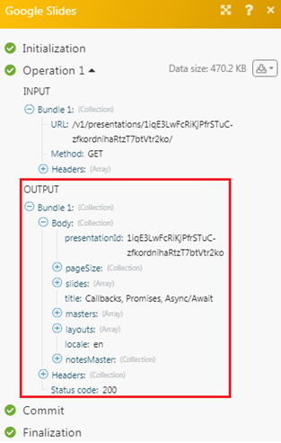

# [!DNL Google Slides]

>[!IMPORTANT]
>
>Die Dokumentation zu Adobe Workfront Fusion wurde an einen neuen Speicherort verschoben.
>
>Die Informationen in diesem Artikel finden Sie jetzt im Artikel:
>
>* [Google Slides-Module](https://experienceleague.adobe.com/docs/workfront-fusion/using/references/apps-and-their-modules/third-party-app-connectors/google-slides-modules.html)
>
>Bitte aktualisieren Sie alle Lesezeichen.
>
>Dieser Artikel wird nicht mehr aktualisiert und in naher Zukunft entfernt.

Mit den [!DNL Adobe Workfront Fusion] [!DNL Google Slides]-Modulen können Sie Präsentationen erstellen, aktualisieren, auflisten und/oder löschen und Bilder in Präsentationen in Ihrem [!DNL Google Slides]-Konto hochladen.

Um [!DNL Google Slides] mit [!DNL Workfront Fusion] verwenden zu können, muss ein [!DNL Google] Konto vorhanden sein. Wenn Sie noch kein [!DNL Google] Konto haben, können Sie eines auf der Hilfeseite zum [!DNL Google] Konto erstellen.

Außerdem benötigen Sie [!DNL Google Slides] in Ihrem [!DNL Google Drive].

## Zugriffsanforderungen

Sie müssen über folgenden Zugriff verfügen, um die Funktion in diesem Artikel verwenden zu können:

<table style="table-layout:auto"> 
 <col> 
 <col> 
 <tbody> 
  <tr> 
   <td role="rowheader">[!DNL Adobe Workfront] Plan*</td>
  <td> 
[!UICONTROL Pro] oder höher
 </td>
  </tr> 
  <tr data-mc-conditions=""> 
   <td role="rowheader">[!DNL Adobe Workfront] Lizenz*</td>
   <td> 
[!UICONTROL-Plan], [!UICONTROL-Arbeit]
 </td> 
  </tr> 
  <tr> 
   <td role="rowheader">[!DNL Adobe Workfront Fusion] Lizenz **</td> 
   <td>
   
Aktuelle Lizenzanforderung: Keine [!DNL Workfront Fusion].

   
Oder

   
Legacy-Lizenzanforderung: [!UICONTROL [!DNL Workfront Fusion] for Work Automation and Integration] 

   </td> 
  </tr> 
  <tr> 
   <td role="rowheader">Produkt</td> 
   <td>
   
Aktuelle Produktanforderung: Wenn Sie über den [!DNL Adobe Workfront] [!UICONTROL Select] oder [!UICONTROL Prime] verfügen, muss Ihr Unternehmen [!DNL Adobe Workfront Fusion] erwerben und [!DNL Adobe Workfront], die in diesem Artikel beschriebenen Funktionen zu nutzen. [!DNL Workfront Fusion] ist im [!DNL Workfront] [!UICONTROL Ultimate] enthalten.

   
Oder

   
Legacy-Produktanforderung: Ihr Unternehmen muss [!DNL Adobe Workfront Fusion] erwerben und [!DNL Adobe Workfront], die in diesem Artikel beschriebenen Funktionen zu verwenden.

   </td> 
  </tr> 
 </tbody> 
</table>

Wenden Sie sich an Ihren [!DNL Workfront], um herauszufinden, über welchen Plan, welchen Lizenztyp oder welchen Zugriff Sie verfügen.

Informationen zu [!DNL Adobe Workfront Fusion] finden Sie unter [[!DNL Adobe Workfront Fusion] Lizenzen](../../workfront-fusion/get-started/license-automation-vs-integration.md).

## Voraussetzungen

Um [!DNL Google Slides]-Module verwenden zu können, müssen Sie über ein [!DNL Google]-Konto verfügen.

## Informationen zur Google Slides-API

Der Google Slides-Connector verwendet Folgendes:

<table style="table-layout:auto"> 
 <col> 
 <col> 
 <tbody> 
  <tr> 
   <td role="rowheader">Basis-URL</td> 
   <td> https://slides.googleapis.com/v1</td> 
  </tr> 
  <tr> 
   <td role="rowheader">API-Version</td> 
   <td> v1 </td> 
  </tr> 
  <tr> 
   <td role="rowheader">API-Tag</td> 
   <td>v1.5.9</td> 
  </tr>
 </tbody> 
 </table>

## [!DNL Google Slides] Module und ihre Felder

Beim Konfigurieren von [!DNL Google Slides] zeigt Workfront Fusion die unten aufgeführten Felder an. Darüber hinaus können abhängig von Faktoren wie Ihrer Zugriffsebene in der App oder dem Service weitere [!DNL Google Slides] angezeigt werden. Ein fett gedruckter Titel in einem Modul gibt ein erforderliches Feld an.

Wenn die Zuordnungsschaltfläche über einem Feld oder einer Funktion angezeigt wird, können Sie damit Variablen und Funktionen für dieses Feld festlegen. Weitere Informationen finden Sie unter [Zuordnen von Informationen zu einem anderen Modul in [!DNL Adobe Workfront Fusion]](../../workfront-fusion/mapping/map-information-between-modules.md).

* [Präsentation](#presentation)
* [Sonstige](#other)

### Präsentation

* [[!UICONTROL Presentations ansehen]](#watch-presentations)
* [[!UICONTROL Presentations auflisten]](#list-presentations)
* [[!UICONTROL Präsentation abrufen]](#get-a-presentation)
* [[!UICONTROL Abrufen einer Seite/Miniaturansicht]](#get-a-pagethumbnail)
* [[!UICONTROL Erstellen einer Präsentation aus einer Vorlage]](#create-a-presentation-from-a-template)
* [[!UICONTROL Laden Sie ein Bild in eine Präsentation hoch]](#upload-an-image-to-a-presentation)
* [[!UICONTROL Aktualisieren eines Diagramms]](#refresh-a-chart)
* [[!UICONTROL Hinzufügen/Löschen einer Folie]](#adddelete-a-slide)

#### [!UICONTROL Presentations ansehen]

Trigger beim Erstellen oder Aktualisieren einer neuen Präsentation.

<table style="table-layout:auto"> 
 <col> 
 <col> 
 <tbody> 
  <tr> 
   <td role="rowheader">[!UICONTROL-Verbindung] </td> 
   <td> 
Anweisungen zum Verbinden Ihres [!DNL Google Slides]-Kontos mit [!DNL Workfront Fusion] finden Sie unter <a href="../../workfront-fusion/connections/connect-to-fusion-general.md" class="MCXref xref" data-mc-variable-override="">Erstellen einer Verbindung zu [!DNL Adobe Workfront Fusion] - Grundlegende Anweisungen</a>.
 </td> 
  </tr> 
  <tr> 
   <td role="rowheader">[!UICONTROL Uhr] </td> 
   <td> 
Wählen Sie die Option aus, um die Präsentationen anzusehen:
 
    <ul> 
     <li> 
[!UICONTROL Erstellungsdatum]
 </li> 
     <li> 
[!UICONTROL Änderungsdatum]
 </li> 
    </ul> </td> 
  </tr> 
  <tr> 
   <td role="rowheader">[!UICONTROL Limit]</td> 
   <td> 
Die maximale Anzahl von Präsentationen, die Workfront Fusion während eines Szenario-Ausführungszyklus zurückgeben sollte.
 </td> 
  </tr> 
 </tbody> 
</table>

#### [!UICONTROL Presentations auflisten]

Ruft eine Liste aller Präsentationen ab.

<table style="table-layout:auto"> 
 <col> 
 <col> 
 <tbody> 
  <tr> 
   <td role="rowheader">[!UICONTROL-Verbindung] </td> 
   <td> 
Anweisungen zum Verbinden Ihres [!DNL Google Slides]-Kontos mit [!DNL Workfront Fusion] finden Sie unter <a href="../../workfront-fusion/connections/connect-to-fusion-general.md" class="MCXref xref" data-mc-variable-override="">Erstellen einer Verbindung zu [!DNL Adobe Workfront Fusion] - Grundlegende Anweisungen</a>.
 </td> 
  </tr> 
  <tr> 
   <td role="rowheader">[!UICONTROL Speicherort des Laufwerks auswählen]</td> 
   <td> 
Wählen Sie die [!DNL Google Drive] aus, in der sich die aufzulistenden Präsentationen befinden:
 
    <ul> 
     <li>[!UICONTROL Mein Laufwerk]</li> 
     <li>[!UICONTROL für mich freigegeben]</li> 
     <li>[!UICONTROL [!DNL Google] freigegebenes Laufwerk]</li> 
    </ul> </td> 
  </tr> 
  <tr> 
   <td role="rowheader">[!UICONTROL Ordner-ID]</td> 
   <td> 
Wählen Sie den Ordnerspeicherort der Präsentationen aus, die Sie auflisten möchten.
 </td> 
  </tr> 
  <tr> 
   <td role="rowheader">[!UICONTROL Limit]</td> 
   <td> 
Die maximale Anzahl von Präsentationen, die [!DNL Workfront Fusion] während eines Szenario-Ausführungszyklus zurückgeben sollten.
 </td> 
  </tr> 
 </tbody> 
</table>

#### [!UICONTROL Präsentation abrufen]

Ruft die neueste Version einer angegebenen Präsentation ab.

<table style="table-layout:auto"> 
 <col> 
 <col> 
 <tbody> 
  <tr> 
   <td role="rowheader">[!UICONTROL-Verbindung] </td> 
   <td> 
Anweisungen zum Verbinden Ihres [!DNL Google Slides]-Kontos mit [!DNL Workfront Fusion] finden Sie unter <a href="../../workfront-fusion/connections/connect-to-fusion-general.md" class="MCXref xref" data-mc-variable-override="">Erstellen einer Verbindung zu [!DNL Adobe Workfront Fusion] - Grundlegende Anweisungen</a>.
 </td> 
  </tr> 
  <tr> 
   <td role="rowheader">[!UICONTROL Laufwerk auswählen]</td> 
   <td> 
Wählen Sie die [!DNL Google Drive] aus, in der sich die aufzulistenden Präsentationen befinden:
 
    <ul> 
     <li>[!UICONTROL Mein Laufwerk]</li> 
     <li>[!UICONTROL für mich freigegeben]</li> 
     <li>[!UICONTROL [!DNL Google] freigegebenes Laufwerk]</li> 
    </ul> </td> 
  </tr> 
  <tr> 
   <td role="rowheader">[!UICONTROL Präsentations-ID]</td> 
   <td> 
 Wählen Sie die Präsentation aus, die Sie abrufen möchten.
 </td> 
  </tr> 
 </tbody> 
</table>

#### [!UICONTROL Abrufen einer Seite/Miniaturansicht]

Ruft die neueste Version der angegebenen Seite oder der Miniaturansicht einer Seite in der Präsentation ab.

<table style="table-layout:auto"> 
 <col> 
 <col> 
 <tbody> 
  <tr> 
   <td role="rowheader">[!UICONTROL-Verbindung] </td> 
   <td> 
Anweisungen zum Verbinden Ihres [!DNL Google Slides]-Kontos mit [!DNL Workfront Fusion] finden Sie unter <a href="../../workfront-fusion/connections/connect-to-fusion-general.md" class="MCXref xref" data-mc-variable-override="">Erstellen einer Verbindung zu [!DNL Adobe Workfront Fusion] - Grundlegende Anweisungen</a>.
 </td> 
  </tr> 
  <tr> 
   <td role="rowheader">[!UICONTROL Präsentations-ID]</td> 
   <td> 
 Wählen Sie die Präsentations-ID aus, die Sie abrufen möchten.
 </td> 
  </tr> 
  <tr> 
   <td role="rowheader">[!UICONTROL Seitenobjekt-ID]</td> 
   <td> 
 Wählen Sie die Folie aus, für die Sie die Details des Seitenobjekts anzeigen möchten.
 </td> 
  </tr> 
  <tr> 
   <td role="rowheader">[!UICONTROL Seitenminiaturansicht anzeigen]</td> 
   <td> 
 Aktivieren Sie das Kontrollkästchen, wenn Sie die Informationen über die Miniaturansicht der Seite anzeigen möchten.
 </td> 
  </tr> 
 </tbody> 
</table>

#### [!UICONTROL Erstellen einer Präsentation aus einer Vorlage]

Erstellt eine neue Präsentation, indem alle Tags wie `{{Name}}`, `{{Email}}` in einer Vorlage, durch die bereitgestellten Daten ersetzt werden.

<table style="table-layout:auto"> 
 <col> 
 <col> 
 <tbody> 
  <tr> 
   <td role="rowheader">[!UICONTROL-Verbindung] </td> 
   <td> 
Anweisungen zum Verbinden Ihres [!DNL Google Slides]-Kontos mit [!DNL Workfront Fusion] finden Sie unter <a href="../../workfront-fusion/connections/connect-to-fusion-general.md" class="MCXref xref" data-mc-variable-override="">Erstellen einer Verbindung zu [!DNL Adobe Workfront Fusion] - Grundlegende Anweisungen</a>.
 </td> 
  </tr> 
  <tr> 
   <td role="rowheader">[!UICONTROL Titel] </td> 
   <td> 
Geben Sie einen Namen für die neue Präsentation ein.
 </td> 
  </tr> 
  <tr> 
   <td role="rowheader">[!UICONTROL Präsentation kopieren]</td> 
   <td> 
 Wählen Sie die Option, wenn Sie eine vorhandene Präsentation kopieren:
 
    <ul> 
     <li>[!UICONTROL nach Zuordnung]</li> 
     <li>[!UICONTROL nach Dropdown]</li> 
    </ul> </td> 
  </tr> 
  <tr> 
   <td role="rowheader">[!UICONTROL Kopie der vorhandenen Präsentations-ID]</td> 
   <td> 
 Geben Sie den Pfad oder die Präsentations-ID einer vorhandenen Präsentation ein, die Sie kopieren möchten. Dieses Feld wird angezeigt, wenn Sie die Präsentation erstellen [!UICONTROL By Mapping].
 </td> 
  </tr> 
  <tr> 
   <td role="rowheader">[!UICONTROL Laufwerk auswählen]</td> 
   <td> 
Wählen Sie die [!DNL Google Drive] aus, in der sich die aufzulistenden Präsentationen befinden:
 
    <ul> 
     <li>[!UICONTROL Mein Laufwerk]</li> 
     <li>[!UICONTROL für mich freigegeben]</li> 
     <li>[!UICONTROL [!DNL Google] freigegebenes Laufwerk]</li> 
    </ul> 
Dieses Feld wird angezeigt, wenn Sie die Präsentation erstellen [!UICONTROL By Dropdown].
 </td> 
  </tr> 
  <tr> 
   <td role="rowheader">[!UICONTROL Präsentations-ID]</td> 
   <td> 
 Wählen Sie die Präsentations-ID der Präsentation aus, die Sie als Vorlage verwenden möchten.
 </td> 
  </tr> 
  <tr> 
   <td role="rowheader">[!UICONTROL-Werte] </td> 
   <td> 
Fügen Sie die Werte hinzu:
 
    <ul> 
     <li><strong>[!UICONTROL Tag]</strong>: Geben Sie den Tag ein, den Sie in der Präsentation ersetzen möchten. Beispiel: <code>&#123;&#123;Name&#125;&#125;</code></li> 
     <li><strong>[!UICONTROL Replaced Value]</strong>: Geben Sie den Wert ein, durch den das vorhandene Tag ersetzt werden soll. Beispiel: Wenn eine Zeichenfolge <tr><ul><tr><tr><tr><code>&#123;&#123;Name&#125;&#125;/code> in the presentation and the replaced value is Sample, then the <code>&#123;&#123;Name&#125;&#125;</code> will be replaced by <code>Sample</code>.</li> 
    </ul> </td> 
  </tr> 
   
   <td role="rowheader">[!UICONTROL New Drive Location]</td> 
   <td> 
Select the [!DNL Google Drive] where you want to store or add the new presentation:
 
     
     <li>[!UICONTROL My Drive]</li> 
     <li>[!UICONTROL Shared With Me]</li> 
     <li>[!UICONTROL [!DNL Google] Shared Drive]</li> 
    </ul> </td> 
  </tr> 
   
   <td role="rowheader"> 
[!UICONTROL New Document's Location]
 </td> 
   <td> 
Select the folder where you want to store or add the presentation.
 </td> 
  </tr> 
   
   <td role="rowheader">[!UICONTROL Shared] </td> 
   <td> 
Select if you want to share the presentation.
 </td> 
  </tr> 
   
   <td role="rowheader">[!UICONTROL Sharing with Other's Email Address]</td> 
   <td> 
 Enter the email address with whom you want to share the presentation. If you are not entering an email address and selecting only shared field, the presentation is shareable to anyone.
 </td> 
  </tr> 
 </tbody> 
</table>

#### [!UICONTROL Laden Sie ein Bild in eine Präsentation hoch]

Lädt ein Bild mit den bereitgestellten Daten hoch.

<table style="table-layout:auto"> 
 <col> 
 <col> 
 <tbody> 
  <tr> 
   <td role="rowheader">[!UICONTROL-Verbindung] </td> 
   <td> 
Anweisungen zum Verbinden Ihres [!DNL Google Slides]-Kontos mit [!DNL Workfront Fusion] finden Sie unter <a href="../../workfront-fusion/connections/connect-to-fusion-general.md" class="MCXref xref" data-mc-variable-override="">Erstellen einer Verbindung zu [!DNL Adobe Workfront Fusion] - Grundlegende Anweisungen</a>.
 </td> 
  </tr> 
  <tr> 
   <td role="rowheader">[!UICONTROL Präsentation wählen]</td> 
   <td> 
Wählen Sie aus, wie Sie die Präsentation auswählen möchten, in die Sie ein Bild hochladen.
 
    <ul> 
     <li>[!UICONTROL nach Zuordnung]</li> 
     <li>[!DNL By Dropdown]</li> 
    </ul> </td> 
  </tr> 
  <tr> 
   <td role="rowheader">[!UICONTROL Laufwerk auswählen]</td> 
   <td> 
Wählen Sie die [!DNL Google Drive] aus, in der sich die aufzulistenden Präsentationen befinden:
 
    <ul> 
     <li>[!UICONTROL Mein Laufwerk]</li> 
     <li>[!UICONTROL für mich freigegeben]</li> 
     <li>[!UICONTROL [!DNL Google] freigegebenes Laufwerk]</li> 
    </ul> 
Dieses Feld wird angezeigt, wenn Sie die Präsentation erstellen [!UICONTROL By Dropdown].
 </td> 
  </tr> 
  <tr> 
   <td role="rowheader">[!UICONTROL Präsentations-ID]</td> 
   <td> 
 Wählen Sie die Präsentations-ID der Präsentation aus, in die Sie ein Bild hochladen.
 </td> 
  </tr> 
  <tr> 
   <td role="rowheader">[!UICONTROL-Werte]</td> 
   <td> 
Werte Fügen Sie die Werte hinzu:
 
    <ul> 
     <li><strong>[!UICONTROL Tag]</strong>: Geben Sie den Tag ein, dem Sie die URL hinzufügen möchten.</li> 
     <li><strong>[!UICONTROL Bild URL]</strong>: Geben Sie den Pfad oder die URL zum Bild ein, das Sie hochladen möchten.</li> 
    </ul> 
Hinweis: Die Bilder müssen kleiner als 50 MB sein, dürfen 25 Megapixel nicht überschreiten und müssen im PNG-, JPEG- oder GIF-Format vorliegen.
 </td> 
  </tr> 
 </tbody> 
</table>

#### [!UICONTROL Aktualisieren eines Diagramms]

Aktualisiert die Diagrammdaten, die in einer durch die ID festgelegten Präsentation gespeichert sind

<table style="table-layout:auto"> 
 <col> 
 <col> 
 <tbody> 
  <tr> 
   <td role="rowheader">[!UICONTROL-Verbindung] </td> 
   <td> 
Anweisungen zum Verbinden Ihres [!DNL Google Slides]-Kontos mit [!DNL Workfront Fusion] finden Sie unter <a href="../../workfront-fusion/connections/connect-to-fusion-general.md" class="MCXref xref" data-mc-variable-override="">Erstellen einer Verbindung zu [!DNL Adobe Workfront Fusion] - Grundlegende Anweisungen</a>.
 </td> 
  </tr> 
  <tr> 
   <td role="rowheader">[!UICONTROL Laufwerk auswählen]</td> 
   <td> 
Wählen Sie die [!DNL Google Drive] aus, in der sich die aufzulistenden Präsentationen befinden:
 
    <ul> 
     <li>[!UICONTROL Mein Laufwerk]</li> 
     <li>[!UICONTROL für mich freigegeben]</li> 
     <li>[!UICONTROL [!DNL Google] freigegebenes Laufwerk]</li> 
    </ul> </td> 
  </tr> 
  <tr> 
   <td role="rowheader">[!UICONTROL Präsentations-ID]</td> 
   <td> 
Wählen Sie die Präsentations-ID der Präsentation aus, die das Diagramm enthält, das Sie aktualisieren möchten.
 </td> 
  </tr> 
  <tr> 
   <td role="rowheader">[!UICONTROL Diagrammobjekt-ID]</td> 
   <td> 
 Wählen Sie das Diagramm aus, das Sie aktualisieren möchten.
 </td> 
  </tr> 
 </tbody> 
</table>

#### [!UICONTROL Hinzufügen/Löschen einer Folie]

Erstellt eine leere Folie oder löscht eine vorhandene Folie in der angegebenen Präsentation.

<table style="table-layout:auto"> 
 <col> 
 <col> 
 <tbody> 
  <tr> 
   <td role="rowheader">[!UICONTROL-Verbindung] </td> 
   <td> 
Anweisungen zum Verbinden Ihres [!DNL Google Slides]-Kontos mit [!DNL Workfront Fusion] finden Sie unter <a href="../../workfront-fusion/connections/connect-to-fusion-general.md" class="MCXref xref" data-mc-variable-override="">Erstellen einer Verbindung zu [!DNL Adobe Workfront Fusion] - Grundlegende Anweisungen</a>.
 </td> 
  </tr> 
  <tr> 
   <td role="rowheader">[!UICONTROL Methode auswählen]</td> 
   <td> 
Wählen Sie aus, ob Sie eine neue Folie hinzufügen oder eine Folie löschen möchten.
 </td> 
  </tr> 
  <tr> 
   <td role="rowheader">[!DNL Presentation ID]</td> 
   <td> 
Wählen Sie die Präsentations-ID der Präsentation aus, für die Sie eine Folie hinzufügen oder löschen möchten.
 </td> 
  </tr> 
  <tr> 
   <td role="rowheader">[!UICONTROL vordefinierter Layouttyp]</td> 
   <td> 
 Wählen Sie das vordefinierte Folien-Layout aus, das die hinzugefügte Folie verwenden soll. Geben Sie Werte für alle zusätzlichen Felder an (z. B. [!UICONTROL Title]).
 
    <ul> 
     <li>[!UICONTROL Leeres Layout, ohne Platzhalter]</li> 
     <li>[!UICONTROL Layout mit einer Beschriftung am unteren Rand]</li> 
     <li>[!UICONTROL Layout mit Titel und Untertitel]</li> 
     <li>[!UICONTROL Layout mit Titel und Textkörper]</li> 
     <li>[!UICONTROL Layout mit einem Titel und zwei Spalten]</li> 
     <li>[!UICONTROL Layout mit nur einem Titel]</li> 
     <li>[!UICONTROL Layout mit Abschnittstitel]</li> 
     <li>[!UICONTROL Layout mit Titel und Untertitel auf der einen Seite und Beschreibung auf der anderen Seite]</li> 
     <li>[!UICONTROL-Layout mit einem Titel und einem Hauptteil, in einer einzigen Spalte angeordnet]</li> 
     <li>[!UICONTROL Layout mit einem Hauptpunkt]</li> 
     <li>[!DNL Layout with a big number heading]</li> 
    </ul> 
Dieses Feld ist verfügbar, wenn Sie eine Folie hinzufügen ausgewählt haben.
 </td> 
  </tr> 
 </tbody> 
</table>

### Sonstige

* [[!UICONTROL Erstellen eines API-Aufrufs]](#make-an-api-call)
* [[!UICONTROL Einfügen von Links in eine Präsentation]](#insert-links-in-a-presentation)

#### [!UICONTROL Erstellen eines API-Aufrufs]

Führt einen beliebigen autorisierten API-Aufruf aus.

<table style="table-layout:auto"> 
 <col> 
 <col> 
 <tbody> 
  <tr> 
   <td role="rowheader">[!UICONTROL-Verbindung] </td> 
   <td> 
Anweisungen zum Verbinden Ihres [!DNL Google Slides]-Kontos mit [!DNL Workfront Fusion] finden Sie unter <a href="../../workfront-fusion/connections/connect-to-fusion-general.md" class="MCXref xref" data-mc-variable-override="">Erstellen einer Verbindung zu [!DNL Adobe Workfront Fusion] - Grundlegende Anweisungen</a>.
 </td> 
  </tr> 
  <tr> 
   <td role="rowheader">[!UICONTROL URL]</td> 
   <td> 
Geben Sie einen Pfad relativ zu https://developers.google.com/slides/ ein. z. B. Präsentation.
 
Eine Liste der verfügbaren Endpunkte finden Sie in der <a href="https://developers.google.com/slides/reference/rest">[!DNL Google Slides] API-Dokumentation</a>.
 </td> 
  </tr> 
  <tr> 
   <td role="rowheader">[!UICONTROL-Methode]</td> 
   <td> 
Wählen Sie die HTTP-Anfragemethode aus, die Sie zum Konfigurieren des API-Aufrufs benötigen. Weitere Informationen finden Sie unter <a href="../../workfront-fusion/modules/http-request-methods.md" class="MCXref xref">HTTP-Anfragemethoden in [!DNL Adobe Workfront Fusion]</a>.
 </td> 
  </tr> 
  <tr> 
   <td role="rowheader">[!UICONTROL-Kopfzeilen]</td> 
   <td> 
Geben Sie die gewünschten Anfrage-Header ein. Sie müssen keine Autorisierungskopfzeilen hinzufügen.
 </td> 
  </tr> 
  <tr> 
   <td role="rowheader">[!UICONTROL Abfragezeichenfolge]</td> 
   <td> 
 Geben Sie die Abfragezeichenfolge der Anfrage ein.
 </td> 
  </tr> 
  <tr> 
   <td role="rowheader">[!UICONTROL body]</td> 
   <td> 
Fügen Sie den Hauptteil des Inhalts für den API-Aufruf in Form eines standardmäßigen JSON-Objekts hinzu.
 
Hinweis:  
Wenn Sie bedingte Anweisungen wie <code>if</code> in Ihrer JSON-Datei verwenden, setzen Sie die Anführungszeichen außerhalb der bedingten Anweisung.
 
     
Example: </b>"> 
      
  
 
     
 
 </td> 
  </tr> 
 </tbody> 
</table>

>[!INFO]
>
>**Beispiel** Mithilfe eines API-Aufrufs können Sie die Präsentationsdetails für die eingegebene Präsentations-ID abrufen. Die Präsentations-ID finden Sie in der URL, wenn Sie die Präsentation in [!DNL Google Slides] öffnen.
>
>
>
>Der folgende API-Aufruf gibt die Präsentationsdetails zurück:
>
>
>
>Treffer der Suche finden Sie in der Modulausgabe unter [!UICONTROL Bundle] > [!UICONTROL Body] > [!UICONTROL presentationId].
>
>In unserem Beispiel wurden die angeforderten Präsentationsdetails zurückgegeben:
>
>

#### [!UICONTROL Einfügen von Links in eine Präsentation]

Dieses Modul macht alle Links in einer Präsentation klickbar oder fügt einen Link in alle passenden Eingabetexte ein.

<table style="table-layout:auto"> 
 <col> 
 <col> 
 <tbody> 
  <tr> 
   <td role="rowheader">[!UICONTROL-Verbindung] </td> 
   <td> 
Anweisungen zum Verbinden Ihres [!DNL Google Slides]-Kontos mit [!DNL Workfront Fusion] finden Sie unter <a href="../../workfront-fusion/connections/connect-to-fusion-general.md" class="MCXref xref" data-mc-variable-override="">Erstellen einer Verbindung zu [!DNL Adobe Workfront Fusion] - Grundlegende Anweisungen</a>.
 </td> 
  </tr> 
  <tr> 
   <td role="rowheader">[!UICONTROL Präsentation wählen]</td> 
   <td> 
Wählen Sie aus, wie Sie die Präsentation auswählen möchten, in die Sie ein Bild hochladen.
 
    <ul> 
     <li>[!UICONTROL nach Zuordnung]</li> 
     <li>[!UICONTROL nach Dropdown]</li> 
    </ul> </td> 
  </tr> 
  <tr> 
   <td role="rowheader">[!UICONTROL Laufwerk auswählen]</td> 
   <td> 
Wählen Sie die [!DNL Google Drive] aus, in der sich die aufzulistenden Präsentationen befinden:
 
    <ul> 
     <li>[!UICONTROL Mein Laufwerk]</li> 
     <li>[!UICONTROL für mich freigegeben]</li> 
     <li>[!UICONTROL [!DNL Google] freigegebenes Laufwerk]</li> 
    </ul> 
Dieses Feld wird angezeigt, wenn Sie die Präsentation erstellen [!UICONTROL By Dropdown].
 </td> 
  </tr> 
  <tr> 
   <td role="rowheader">[!UICONTROL Präsentations-ID]</td> 
   <td> 
Wählen Sie den Ordnerspeicherort der Präsentationen aus, die Sie auflisten möchten.
 </td> 
  </tr> 
  <tr> 
   <td role="rowheader">[!UICONTROL select]</td> 
   <td> 
Wählen Sie aus, ob alle Links in einer Präsentation klickbar sein sollen oder ob Sie einen Link in alle Übereinstimmungseingabetexte einfügen möchten.
 </td> 
  </tr> 
  <tr> 
   <td role="rowheader">[!UICONTROL Texteingaben]</td> 
   <td>Fügen Sie für jedes Textelement, für das Sie einen Link hinzufügen möchten, das Element sowie den zugehörigen Link zur Liste hinzu. Jedes Mal, wenn das Element in der Präsentation angezeigt wird, wird es automatisch mit der angegebenen Site verknüpft.</td> 
  </tr> 
 </tbody> 
</table>
