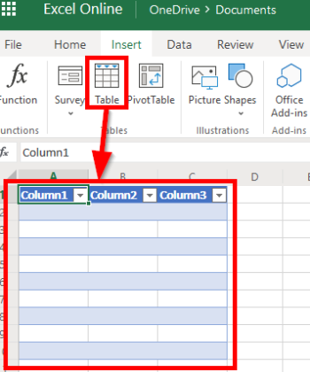

# [!DNL Microsoft Office 365 Excel] Module

In einem [!DNL Adobe Workfront Fusion] -Szenario können Sie Workflows automatisieren, die [!DNL Microsoft 365 Excel] verwenden, und sie mit mehreren Anwendungen und Diensten von Drittanbietern verbinden.

Wenn Sie Anweisungen zum Erstellen eines Szenarios benötigen, finden Sie weitere Informationen unter [Erstellen eines Szenarios in [!DNL Adobe Workfront Fusion]](../../workfront-fusion/scenarios/create-a-scenario.md).

Weitere Informationen zu Modulen finden Sie unter [Module in [!DNL Adobe Workfront Fusion]](../../workfront-fusion/modules/modules.md).

## Zugriffsanforderungen

Sie müssen über den folgenden Zugriff verfügen, um die Funktionalität in diesem Artikel verwenden zu können:

<table style="table-layout:auto"> 
 <col> 
 <col> 
 <tbody> 
  <tr> 
   <td role="rowheader">[!DNL Adobe Workfront] plan*</td>
  <td> 
[!UICONTROL Pro] oder höher
 </td>
  </tr> 
  <tr data-mc-conditions=""> 
   <td role="rowheader">[!DNL Adobe Workfront] license*</td>
   <td> 
[!UICONTROL Plan], [!UICONTROL Arbeit]
 </td> 
  </tr> 
  <tr> 
   <td role="rowheader">[!DNL Adobe Workfront Fusion] license**</td> 
   <td>
   
Aktuelle Lizenzanforderungen: Keine [!DNL Workfront Fusion] Lizenzanforderungen.

   
Oder

   
Alte Lizenzanforderung: [!UICONTROL [!DNL Workfront Fusion] für die Arbeitsautomatisierung und -integration] 

   </td>  
  </tr> 
  <tr> 
   <td role="rowheader">Produkt</td> 
   <td>
   
Aktuelle Produktanforderung: Wenn Sie über den [!UICONTROL Select]- oder [!UICONTROL Prime] [!DNL Adobe Workfront]-Plan verfügen, muss Ihr Unternehmen [!DNL Adobe Workfront Fusion] sowie [!DNL Adobe Workfront] erwerben, um die in diesem Artikel beschriebenen Funktionen nutzen zu können. [!DNL Workfront Fusion] ist im [!UICONTROL Ultimate] [!DNL Workfront]-Plan enthalten.

   
Oder

   
Alte Produktanforderung: Ihr Unternehmen muss [!DNL Adobe Workfront Fusion] sowie [!DNL Adobe Workfront] erwerben, um die in diesem Artikel beschriebenen Funktionen nutzen zu können.

   </td> 
  </tr> 
 </tbody> 
</table>

Wenden Sie sich an Ihren [!DNL Workfront] -Administrator, um zu erfahren, welchen Plan, welchen Lizenztyp oder welchen Zugriff Sie haben.

Informationen zu [!DNL Adobe Workfront Fusion] -Lizenzen finden Sie unter [[!DNL Adobe Workfront Fusion] Lizenzen](../../workfront-fusion/get-started/license-automation-vs-integration.md).

## Voraussetzungen

Um [!DNL Microsoft office 365 Excel] zu verwenden, müssen Sie über ein Microsoft-Konto verfügen.

## Verbinden des [!DNL Office 365 Excel]-Dienstes mit [!DNL Workfront Fusion]

Anweisungen zum Verbinden Ihres [!DNL Office 365 Excel]-Kontos mit [!UICONTROL Workfront Fusion] finden Sie unter [Erstellen einer Verbindung mit [!UICONTROL Adobe Workfront Fusion] - Grundlegende Anweisungen](../../workfront-fusion/connections/connect-to-fusion-general.md)

>[!NOTE]
>
>Einige Microsoft-Apps verwenden dieselbe Verbindung, die an individuelle Benutzerberechtigungen gebunden ist. Daher werden beim Erstellen einer Verbindung im Bildschirm für die Genehmigung von Berechtigungen alle Berechtigungen angezeigt, die zuvor für die Verbindung dieses Benutzers gewährt wurden, zusätzlich zu den neuen Berechtigungen, die für die aktuelle Anwendung erforderlich sind.
>
>Wenn beispielsweise ein Benutzer über den Excel-Connector über die Berechtigung &quot;Tabelle lesen&quot;verfügt und dann im Outlook-Connector eine Verbindung zum Lesen von E-Mails erstellt, zeigt der Bildschirm für die Genehmigung der Berechtigungen sowohl die bereits erteilte Berechtigung &quot;Tabelle lesen&quot;als auch die neu erforderliche Berechtigung &quot;E-Mail schreiben&quot;an.

## [!DNL Microsoft Office 365 Excel] Module und ihre Felder

Wenn Sie [!DNL Microsoft 365 Excel] -Module konfigurieren, zeigt [!DNL Workfront Fusion] die unten aufgeführten Felder an. Darüber hinaus können abhängig von Faktoren wie Ihrer Zugriffsebene in der App oder im Dienst zusätzliche [!DNL Microsoft 365 Excel] -Felder angezeigt werden. Ein fett hervorgehobener Titel in einem Modul zeigt ein erforderliches Feld an.

Wenn Sie die Zuordnungsschaltfläche über einem Feld oder einer Funktion sehen, können Sie damit Variablen und Funktionen für dieses Feld festlegen. Weitere Informationen finden Sie unter [Informationen von einem Modul einem anderen zuordnen in [!DNL Adobe Workfront Fusion]](../../workfront-fusion/mapping/map-information-between-modules.md).

* [Arbeitsmappe](#workbook)
* [Arbeitsblatt](#worksheet)
* [Tabelle](#table)
* [Sonstige](#other)

### Arbeitsmappe

* [Arbeitsmappen ansehen](#watch-workbooks)
* [Arbeitsmappen durchsuchen](#search-workbooks)
* [Arbeitsmappe herunterladen](#download-a-workbook)

#### [!UICONTROL Arbeitsmappen ansehen]

Dieses Trigger-Modul startet ein Szenario, wenn eine Arbeitsmappe erstellt wird.

<table style="table-layout:auto"> 
 <col data-mc-conditions=""> 
 <col data-mc-conditions=""> 
 <tbody> 
  <tr> 
   <td role="rowheader"> 
[!UICONTROL Verbindung]
 </td> 
   <td> 
Anweisungen zum Verbinden Ihres [!DNL Office 365]-Kontos mit [!DNL Workfront Fusion] finden Sie unter <a href="../../workfront-fusion/scenarios/create-a-scenario.md#connect" class="MCXref xref">Verbinden der App oder des Webdiensts des Moduls mit [!DNL Workfront Fusion]</a> im Artikel <a href="../../workfront-fusion/scenarios/create-a-scenario.md" class="MCXref xref">Erstellen eines Szenarios in [!DNL Adobe Workfront Fusion]</a>.
 </td> 
  </tr> 
  <tr> 
   <td role="rowheader">[!UICONTROL Ordner]</td> 
   <td> 
Wählen Sie den Ordner aus, den Sie nach neuen Arbeitsmappen suchen möchten.
 </td> 
  </tr> 
  <tr> 
   <td role="rowheader"> 
[!UICONTROL Filter]
 </td> 
   <td> 
Sie können einen Filter festlegen, der nur auf Arbeitsmappen überwacht, die den von Ihnen ausgewählten Kriterien entsprechen.
 
Geben Sie für jeden Filter das Feld, das der Filter auswerten soll, den Operator und den Wert ein, die der Filter zulassen soll. Sie können mehrere Filter verwenden, indem Sie UND- oder ODER-Regeln hinzufügen.
 </td> 
  </tr> 
  <tr> 
   <td role="rowheader">[!UICONTROL Limit]</td> 
   <td> 
Geben Sie die maximale Anzahl von Arbeitsmappen ein oder ordnen Sie sie zu, die das Modul während des Ausführungszyklus eines Szenarios zurückgeben soll.
 </td> 
  </tr> 
 </tbody> 
</table>

#### [!UICONTROL Arbeitsmappen durchsuchen]

Dieses Aktionsmodul sucht nach [!DNL Excel] -Arbeitsmappen.

<table style="table-layout:auto"> 
 <col data-mc-conditions=""> 
 <col data-mc-conditions=""> 
 <tbody> 
  <tr> 
   <td role="rowheader"> 
[!UICONTROL Verbindung]
 </td> 
   <td> 
Anweisungen zum Verbinden Ihres [!DNL Office 365]-Kontos mit [!DNL Workfront Fusion] finden Sie unter <a href="../../workfront-fusion/scenarios/create-a-scenario.md#connect" class="MCXref xref">Verbinden der App oder des Webdiensts des Moduls mit [!DNL Workfront Fusion]</a> im Artikel <a href="../../workfront-fusion/scenarios/create-a-scenario.md" class="MCXref xref">Erstellen eines Szenarios in [!DNL Adobe Workfront Fusion]</a>.
 </td> 
  </tr> 
  <tr> 
   <td role="rowheader">[!UICONTROL Ordner]</td> 
   <td> 
Wählen Sie den Ordner aus, nach dem Sie nach Arbeitsmappen suchen möchten.
 </td> 
  </tr> 
  <tr> 
   <td role="rowheader"> 
[!UICONTROL Filter]
 </td> 
   <td> 
Sie können einen Filter festlegen, um nur nach Arbeitsmappen zu suchen, die den von Ihnen ausgewählten Kriterien entsprechen.
 
Geben Sie für jeden Filter das Feld, das der Filter auswerten soll, den Operator und den Wert ein, die der Filter zulassen soll. Sie können mehrere Filter verwenden, indem Sie UND- oder ODER-Regeln hinzufügen.
 </td> 
  </tr> 
  <tr> 
   <td role="rowheader">[!UICONTROL Limit]</td> 
   <td> 
Geben Sie die maximale Anzahl von Arbeitsblättern ein oder ordnen Sie sie zu, die das Modul während der Ausführung jedes Szenarios zurückgeben soll.
 </td> 
  </tr> 
 </tbody> 
</table>

#### [!UICONTROL Eine Arbeitsmappe herunterladen]

Dieses Aktionsmodul lädt den Inhalt der angegebenen Excel-Arbeitsmappe herunter.

<table style="table-layout:auto"> 
 <col data-mc-conditions=""> 
 <col data-mc-conditions=""> 
 <tbody> 
  <tr> 
   <td role="rowheader"> 
[!UICONTROL Verbindung]
 </td> 
   <td> 
Anweisungen zum Verbinden Ihres [!DNL Office 365]-Kontos mit [!DNL Workfront Fusion] finden Sie unter <a href="../../workfront-fusion/scenarios/create-a-scenario.md#connect" class="MCXref xref">Verbinden der App oder des Webdiensts des Moduls mit [!DNL Workfront Fusion]</a> im Artikel <a href="../../workfront-fusion/scenarios/create-a-scenario.md" class="MCXref xref">Erstellen eines Szenarios in [!DNL Adobe Workfront Fusion]</a>.
 </td> 
  </tr> 
  <tr> 
   <td role="rowheader">[!UICONTROL Arbeitsmappe herunterladen]</td> 
   <td> 
Wählen Sie aus, wie Sie die Arbeitsmappe für das herunterzuladende Modul identifizieren möchten.
 
    <ul> 
     <li> 
<strong>[!UICONTROL Durch manuelles Eingeben einer ID]</strong> 
 
Geben Sie im Feld [!UICONTROL Arbeitsmappen-ID] die Kennung der Arbeitsmappe ein oder ordnen Sie sie zu, die das Modul herunterladen soll.
 </li> 
     <li> 
<strong>[!UICONTROL Durch Auswahl aus dem Pfad]</strong> 
 
Wählen Sie im Feld [!UICONTROL Arbeitsmappe] die Arbeitsmappe aus, die das Modul herunterladen soll.
 </li> 
    </ul> </td> 
  </tr> 
 </tbody> 
</table>

### Arbeitsblatt

* [[!UICONTROL Zeilen des Arbeitsblatts ansehen]](#watch-worksheet-rows)
* [[!UICONTROL Arbeitsblätter auflisten]](#list-worksheets)
* [[!UICONTROL Auflisten von Arbeitsblattzeilen]](#list-worksheet-rows)
* [[!UICONTROL Hinzufügen eines Arbeitsblatts]](#add-a-worksheet)
* [[!UICONTROL Eine Tabellenzeile hinzufügen]](#add-a-worksheet-row)
* [[!UICONTROL Eine Tabellenzeile aktualisieren]](#update-a-worksheet-row)
* [[!UICONTROL Eine Tabellenzeile löschen]](#delete-a-worksheet-row)

#### [!UICONTROL Zeilen des Arbeitsblatts ansehen]

Dieses Trigger-Modul startet ein Szenario, wenn dem Blatt eine neue Zeile hinzugefügt wird.

<table style="table-layout:auto"> 
 <col> 
 <col> 
 <tbody> 
  <tr> 
   <td role="rowheader"> 
[!UICONTROL Verbindung]
 </td> 
   <td> 
Anweisungen zum Verbinden Ihres [!DNL Office 365]-Kontos mit [!DNL Workfront Fusion] finden Sie unter <a href="../../workfront-fusion/scenarios/create-a-scenario.md#connect" class="MCXref xref">Verbinden der App oder des Webdiensts des Moduls mit [!DNL Workfront Fusion]</a> im Artikel <a href="../../workfront-fusion/scenarios/create-a-scenario.md" class="MCXref xref">Erstellen eines Szenarios in [!DNL Adobe Workfront Fusion]</a>.
 </td> 
  </tr> 
  <tr> 
    <td role="rowheader" >[!UICONTROL Arbeitsmappe] </td>
   <td> 
Wählen Sie die Arbeitsmappe aus, die das Arbeitsblatt enthält, das Sie für neue Zeilen überwachen möchten.
 </td> 
  </tr> 
  <tr>
    <td role="rowheader" >[!UICONTROL Arbeitsblatt] </td>
   <td> 
Wählen Sie das Excel-Blatt aus, das Sie für neue Zeilen überwachen möchten.
 </td> 
  </tr> 
  <tr> 
    <td role="rowheader" >[!UICONTROL Limit]</td>
   <td> 
Geben Sie die maximale Anzahl von Arbeitsblattzeilen ein oder ordnen Sie sie zu, die das Modul während jedes Szenario-Ausführungszyklus zurückgeben soll.
 </td> 
  </tr> 
 </tbody> 
</table>

#### [!UICONTROL Arbeitsblätter auflisten]

Dieses Aktionsmodul ruft eine Liste von Arbeitsblättern in der angegebenen Arbeitsmappe ab.

<table style="table-layout:auto"> 
 <col> 
 <col> 
 <tbody> 
  <tr> 
   <td role="rowheader"> 
[!UICONTROL Verbindung]
 </td> 
   <td> 
Anweisungen zum Verbinden Ihres [!DNL Office 365]-Kontos mit [!DNL Workfront Fusion] finden Sie unter <a href="../../workfront-fusion/scenarios/create-a-scenario.md#connect" class="MCXref xref">Verbinden der App oder des Webdiensts des Moduls mit [!DNL Workfront Fusion]</a> im Artikel <a href="../../workfront-fusion/scenarios/create-a-scenario.md" class="MCXref xref">Erstellen eines Szenarios in [!DNL Adobe Workfront Fusion]</a>.
 </td> 
  </tr> 
  <tr> 
    <td role="rowheader" >[!UICONTROL Arbeitsmappe] </td>
   <td> 
Wählen Sie die Arbeitsmappe aus, die die Arbeitsblätter enthält, die vom Modul aufgelistet werden sollen.
 </td> 
  </tr> 
  <tr> 
    <td role="rowheader" >[!UICONTROL Limit]</td>
   <td> 
Geben Sie die maximale Anzahl von Arbeitsblättern ein oder ordnen Sie sie zu, die das Modul während der Ausführung jedes Szenarios zurückgeben soll.
 </td> 
  </tr> 
 </tbody> 
</table>

#### [!UICONTROL Auflisten von Arbeitsblattzeilen]

Dieses Aktionsmodul ruft eine Liste von Zeilen im angegebenen Arbeitsblatt ab.

<table style="table-layout:auto"> 
 <col> 
 <col> 
 <tbody> 
  <tr> 
   <td role="rowheader"> 
[!UICONTROL Verbindung]
 </td> 
   <td> 
Anweisungen zum Verbinden Ihres [!DNL Office 365]-Kontos mit [!DNL Workfront Fusion] finden Sie unter <a href="../../workfront-fusion/scenarios/create-a-scenario.md#connect" class="MCXref xref">Verbinden der App oder des Webdiensts des Moduls mit [!DNL Workfront Fusion]</a> im Artikel <a href="../../workfront-fusion/scenarios/create-a-scenario.md" class="MCXref xref">Erstellen eines Szenarios in [!DNL Adobe Workfront Fusion]</a>.
 </td> 
  </tr> 
  <tr>
    <td role="rowheader" >[!UICONTROL Arbeitsmappe] </td>
   <td> 
Wählen Sie die Arbeitsmappe aus, die das Arbeitsblatt mit den Zeilen enthält, die Sie auflisten möchten.
 </td> 
  </tr> 
  <tr> 
    <td role="rowheader" >[!UICONTROL Arbeitsblatt] </td>
   <td> 
Wählen Sie das Arbeitsblatt aus, das die Zeilen enthält, die Sie auflisten möchten.
 </td> 
  </tr> 
  <tr> 
    <td role="rowheader" >[!UICONTROL Limit]</td>
   <td> 
Geben Sie die maximale Anzahl von Arbeitsblattzeilen ein oder ordnen Sie sie zu, die das Modul während jedes Szenario-Ausführungszyklus zurückgeben soll.
 </td> 
  </tr> 
 </tbody> 
</table>

#### [!UICONTROL Hinzufügen eines Arbeitsblatts]

Dieses Aktionsmodul erstellt ein neues Arbeitsblatt innerhalb der ausgewählten Arbeitsmappe.

<table style="table-layout:auto"> 
 <col data-mc-conditions=""> 
 <col data-mc-conditions=""> 
 <tbody> 
  <tr> 
   <td role="rowheader"> 
[!UICONTROL Verbindung]
 </td> 
   <td> 
Anweisungen zum Verbinden Ihres [!DNL Office 365]-Kontos mit [!DNL Workfront Fusion] finden Sie unter <a href="../../workfront-fusion/scenarios/create-a-scenario.md#connect" class="MCXref xref">Verbinden der App oder des Webdiensts des Moduls mit [!DNL Workfront Fusion]</a> im Artikel <a href="../../workfront-fusion/scenarios/create-a-scenario.md" class="MCXref xref">Erstellen eines Szenarios in [!DNL Adobe Workfront Fusion]</a>.
 </td> 
  </tr> 
  <tr>
    <td role="rowheader" >[!UICONTROL Arbeitsmappe] </td>
   <td> 
Wählen Sie die Arbeitsmappe aus, der Sie ein Arbeitsblatt hinzufügen möchten.
 </td> 
  </tr> 
  <tr> 
    <td role="rowheader" >[!UICONTROL Name] </td>
   <td> 
Geben Sie einen Namen für das neue Arbeitsblatt ein oder ordnen Sie ihn zu.
 </td> 
  </tr> 
 </tbody> 
</table>

#### [!UICONTROL Eine Tabellenzeile hinzufügen]

Dieses Aktionsmodul fügt dem ausgewählten Arbeitsblatt eine neue Zeile hinzu.

<table style="table-layout:auto"> 
 <col data-mc-conditions=""> 
 <col data-mc-conditions=""> 
 <tbody> 
  <tr> 
   <td role="rowheader"> 
[!UICONTROL Verbindung]
 </td> 
   <td> 
Anweisungen zum Verbinden Ihres [!DNL Office 365]-Kontos mit [!DNL Workfront Fusion] finden Sie unter <a href="../../workfront-fusion/scenarios/create-a-scenario.md#connect" class="MCXref xref">Verbinden der App oder des Webdiensts des Moduls mit [!DNL Workfront Fusion]</a> im Artikel <a href="../../workfront-fusion/scenarios/create-a-scenario.md" class="MCXref xref">Erstellen eines Szenarios in [!DNL Adobe Workfront Fusion]</a>.
 </td> 
  </tr> 
  <tr> 
    <td role="rowheader" >[!UICONTROL Arbeitsmappe] </td>
   <td> 
Wählen Sie die Arbeitsmappe aus, die das Arbeitsblatt enthält, dem Sie eine Zeile hinzufügen möchten.
 </td> 
  </tr> 
  <tr> 
    <td role="rowheader" >[!UICONTROL Arbeitsblatt] </td>
   <td> 
Wählen Sie das Arbeitsblatt aus, dem Sie eine Zeile hinzufügen möchten.
 </td> 
  </tr> 
  <tr> 
   <td role="rowheader"> 
[!UICONTROL Typ der eingegebenen Werte]
 </td> 
   <td> 
Wählen Sie den Werttyp aus, der in das Arbeitsblatt eingegeben werden soll. 
 
    <ul> 
     <li> 
<strong>[!UICONTROL Formeln]</strong> 
 
 Excel versucht, den angegebenen Ausdruck auszuwerten. Die Funktionsnamen in einer Formel sind in englischer Sprache. Beispiel: <code>[!DNL =SUM(A1:A10)]</code>
 </li> 
     <li> 
<strong>[!UICONTROL Formeln local]</strong> 
 
Excel versucht, den angegebenen Ausdruck auszuwerten. Die Funktionsnamen entsprechen der Sprache Ihrer Excel-Anwendung. Beispiel: <code>=SUM(A1, 1.5)</code> vs. <code>=SUMME(A1; 1,5)</code>
 </li> 
     <li> 
<strong>[!UICONTROL Wert]</strong> 
 
Excel wertet den Wert nicht aus. 
 </li> 
    </ul> </td> 
  </tr> 
  <tr> 
    <td role="rowheader" >[!UICONTROL Zeile]</td>
    <td>Geben Sie für jede Spalte den Wert ein, den die Spalte in der neuen Zeile enthalten soll.</td>
  </tr> 
 </tbody> 
</table>

#### [!UICONTROL Eine Tabellenzeile aktualisieren]

Dieses Aktionsmodul aktualisiert eine vorhandene Arbeitsblattzeile.

<table style="table-layout:auto"> 
 <col data-mc-conditions=""> 
 <col data-mc-conditions=""> 
 <tbody> 
  <tr> 
   <td role="rowheader"> 
[!UICONTROL Verbindung]
 </td> 
   <td> 
Anweisungen zum Verbinden Ihres [!DNL Office 365]-Kontos mit [!DNL Workfront Fusion] finden Sie unter <a href="../../workfront-fusion/scenarios/create-a-scenario.md#connect" class="MCXref xref">Verbinden der App oder des Webdiensts des Moduls mit [!DNL Workfront Fusion]</a> im Artikel <a href="../../workfront-fusion/scenarios/create-a-scenario.md" class="MCXref xref">Erstellen eines Szenarios in [!DNL Adobe Workfront Fusion]</a>.
 </td> 
  </tr> 
  <tr> 
    <td role="rowheader" >[!UICONTROL Arbeitsmappe] </td>
   <td> 
Wählen Sie die Arbeitsmappe aus, die das Arbeitsblatt enthält, das die zu aktualisierende Zeile enthält.
 </td> 
  </tr> 
  <tr> 
    <td role="rowheader" >[!UICONTROL Arbeitsblatt] </td>
   <td> 
Wählen Sie das Arbeitsblatt aus, das die zu aktualisierende Zeile enthält.
 </td> 
  </tr> 
  <tr> 
   <td role="rowheader"> 
[!UICONTROL Typ der eingegebenen Werte]
 </td> 
   <td> 
Wählen Sie den Werttyp aus, der in das Arbeitsblatt eingegeben werden soll. 
 
    <ul> 
     <li> 
<strong>[!UICONTROL Formeln]</strong> 
 
 Excel versucht, den angegebenen Ausdruck auszuwerten. Die Funktionsnamen in einer Formel sind in englischer Sprache. Beispiel: <code>[!DNL =SUM(A1:A10)]</code>
 </li> 
     <li> 
<strong>[!UICONTROL Formeln local]</strong> 
 
Excel versucht, den angegebenen Ausdruck auszuwerten. Die Funktionsnamen entsprechen der Sprache Ihrer Excel-Anwendung. Beispiel: <code>=SUM(A1, 1.5)</code> vs. <code>=SUMME(A1; 1,5)</code>
 </li> 
     <li> 
<strong>[!UICONTROL Wert]</strong> 
 
Excel wertet den Wert nicht aus. 
 </li> 
    </ul> </td> 
  </tr> 
  <tr> 
   <td role="rowheader">[!UICONTROL Zeilen-ID]</td> 
   <td>Wählen Sie die Nummer der zu aktualisierenden Zeile aus.</td> 
  </tr> 
  <tr> 
    <td role="rowheader" >[!UICONTROL Zeile]</td>
    <td>Geben Sie für jede Spalte den Wert ein, den die Spalte in der neuen Zeile enthalten soll.</td>
   --&gt; 
  </tr> 
 </tbody> 
</table>

#### [!UICONTROL Eine Tabellenzeile löschen]

Dieses Aktionsmodul löscht eine Zeile aus einem Arbeitsblatt.

<table style="table-layout:auto"> 
 <col data-mc-conditions=""> 
 <col data-mc-conditions=""> 
 <tbody> 
  <tr> 
   <td role="rowheader"> 
[!UICONTROL Verbindung]
 </td> 
   <td> 
Anweisungen zum Verbinden Ihres [!DNL Office 365]-Kontos mit [!DNL Workfront Fusion] finden Sie unter <a href="../../workfront-fusion/scenarios/create-a-scenario.md#connect" class="MCXref xref">Verbinden der App oder des Webdiensts des Moduls mit [!DNL Workfront Fusion]</a> im Artikel <a href="../../workfront-fusion/scenarios/create-a-scenario.md" class="MCXref xref">Erstellen eines Szenarios in [!DNL Adobe Workfront Fusion]</a>.
 </td> 
  </tr> 
  <tr> 
    <td role="rowheader" >[!UICONTROL Arbeitsmappe] </td>
   <td> 
Wählen Sie die Arbeitsmappe aus, die das Arbeitsblatt enthält, das die zu löschende Zeile enthält.
 </td> 
  </tr> 
  <tr> 
    <td role="rowheader" >[!UICONTROL Arbeitsblatt]</td>
   <td> 
 Wählen Sie das Arbeitsblatt aus, das die zu löschende Zeile enthält.
 </td> 
  </tr> 
  <tr> 
    <td role="rowheader" >[!UICONTROL Zeilen-ID]</td>
   <td>Geben Sie die Kennung der Zeile ein, die Sie löschen möchten, oder ordnen Sie sie zu.</td> 
  </tr> 
 </tbody> 
</table>

### Tabelle

* [[!UICONTROL Tabellenzeilen ansehen]](#watch-table-rows)
* [[!UICONTROL Tabellen auflisten]](#list-tables)
* [[!UICONTROL Tabellenzeilen auflisten]](#list-table-rows)
* [[!UICONTROL Abrufen einer Tabelle]](#get-a-table)
* [[!UICONTROL Hinzufügen einer Tabelle]](#add-a-table)
* [[!UICONTROL Hinzufügen einer Tabellenzeile]](#add-a-table-row)
* [[!UICONTROL Aktualisieren einer Tabelle]](#update-a-table)
* [[!UICONTROL Löschen einer Tabelle]](#delete-a-table)

#### [!UICONTROL Tabellenzeilen ansehen]

Dieser Trigger startet ein Szenario, wenn einer Tabelle eine neue Zeile hinzugefügt wird.

>[!NOTE]
>
>Die Tabelle hier bezieht sich auf das eingebettete Tabellenelement in der Arbeitsmappe. Nicht die gesamte Tabelle (Arbeitsmappe/Blatt).

<table style="table-layout:auto"> 
 <col> 
 <col> 
 <tbody> 
  <tr> 
   <td role="rowheader"> 
[!UICONTROL Verbindung]
 </td> 
   <td> 
Anweisungen zum Verbinden Ihres [!DNL Office 365]-Kontos mit [!DNL Workfront Fusion] finden Sie unter <a href="../../workfront-fusion/scenarios/create-a-scenario.md#connect" class="MCXref xref">Verbinden der App oder des Webdiensts des Moduls mit [!DNL Workfront Fusion]</a> im Artikel <a href="../../workfront-fusion/scenarios/create-a-scenario.md" class="MCXref xref">Erstellen eines Szenarios in [!DNL Adobe Workfront Fusion]</a>.
 </td> 
  </tr> 
  <tr> 
   <td role="rowheader"> 
[!UICONTROL Arbeitsmappe]
 </td> 
   <td> 
Wählen Sie die Arbeitsmappe aus, die die Tabelle enthält, die Sie sehen möchten.
 </td> 
  </tr> 
  <tr> 
    <td role="rowheader" >[!UICONTROL Arbeitsblatt] </td>
   <td> 
 Wählen Sie das Arbeitsblatt aus, das die zu überwachende Tabelle enthält.
 </td> 
  </tr> 
  <tr> 
   <td role="rowheader"> 
[!UICONTROL Tabelle]
 </td> 
   <td> 
Wählen Sie die Tabelle aus, die Sie sehen möchten.
 </td> 
  </tr> 
  <tr> 
    <td role="rowheader" >[!UICONTROL Limit]</td>
   <td> 
Geben Sie die maximale Anzahl von Zeilen ein oder ordnen Sie sie zu, die das Modul während jedes Szenario-Ausführungszyklus zurückgeben soll.
 </td> 
  </tr> 
 </tbody> 
</table>

#### [!UICONTROL Tabellen auflisten]

Dieses Suchmodul ruft eine Liste aller Tabellenobjekte ab.

<table style="table-layout:auto"> 
 <col> 
 <col> 
 <tbody> 
  <tr> 
   <td role="rowheader"> 
[!UICONTROL Verbindung]
 </td> 
   <td> 
Anweisungen zum Verbinden Ihres [!DNL Office 365]-Kontos mit [!DNL Workfront Fusion] finden Sie unter <a href="../../workfront-fusion/scenarios/create-a-scenario.md#connect" class="MCXref xref">Verbinden der App oder des Webdiensts des Moduls mit [!DNL Workfront Fusion]</a> im Artikel <a href="../../workfront-fusion/scenarios/create-a-scenario.md" class="MCXref xref">Erstellen eines Szenarios in [!DNL Adobe Workfront Fusion]</a>.
 </td> 
  </tr> 
  <tr>
    <td role="rowheader" >[!UICONTROL Arbeitsmappe] </td>
   <td> 
Wählen Sie die Arbeitsmappe aus, die die Tabellen enthält, die Sie auflisten möchten.
 </td> 
  </tr> 
  <tr> 
    <td role="rowheader" >[!UICONTROL Arbeitsblatt] </td>
   <td> 
Wählen Sie das Arbeitsblatt aus, das die aufzulistenden Tabellen enthält
 </td> 
  </tr> 
  <tr> 
    <td role="rowheader" >[!UICONTROL Limit]</td>
   <td> 
Geben Sie die maximale Anzahl von Tabellen ein oder ordnen Sie sie zu, die das Modul während der einzelnen Szenario-Ausführungszyklen zurückgeben soll.
 </td> 
  </tr> 
 </tbody> 
</table>

#### [!UICONTROL Tabellenzeilen auflisten]

Dieses Suchmodul ruft eine Liste aller Tabellenzeilen in einer Arbeitsmappe ab.

<table style="table-layout:auto"> 
 <col> 
 <col> 
 <tbody> 
  <tr> 
   <td role="rowheader"> 
[!UICONTROL Verbindung]
 </td> 
   <td> 
Anweisungen zum Verbinden Ihres [!DNL Office 365]-Kontos mit [!DNL Workfront Fusion] finden Sie unter <a href="../../workfront-fusion/scenarios/create-a-scenario.md#connect" class="MCXref xref">Verbinden der App oder des Webdiensts des Moduls mit [!DNL Workfront Fusion]</a> im Artikel <a href="../../workfront-fusion/scenarios/create-a-scenario.md" class="MCXref xref">Erstellen eines Szenarios in [!DNL Adobe Workfront Fusion]</a>.
 </td> 
  </tr> 
  <tr> 
    <td role="rowheader" >[!UICONTROL Arbeitsmappe] </td>
   <td> 
Wählen Sie die Arbeitsmappe aus, die die Tabelle mit den Zeilen enthält, die Sie auflisten möchten.
 </td> 
  </tr> 
  <tr> 
    <td role="rowheader" >[!UICONTROL Arbeitsblatt] </td>
   <td> 
Wählen Sie das Arbeitsblatt aus, das die Tabelle mit den Zeilen enthält, die Sie auflisten möchten
 </td> 
  </tr> 
  <tr> 
    <td role="rowheader" >[!UICONTROL Tabelle] </td>
   <td> 
Wählen Sie die Tabelle aus, die die Zeilen enthält, die Sie auflisten möchten.
 </td> 
  </tr> 
  <tr> 
    <td role="rowheader" >[!UICONTROL Limit]</td>
   <td> 
Geben Sie die maximale Anzahl von Tabellenzeilen ein oder ordnen Sie sie zu, die das Modul während jedes Szenario-Ausführungszyklus zurückgeben soll.
 </td> 
  </tr> 
 </tbody> 
</table>

#### [!UICONTROL Abrufen einer Tabelle]

Dieses Aktionsmodul ruft Metadaten für die angegebene Tabelle ab.

<table style="table-layout:auto"> 
 <col data-mc-conditions=""> 
 <col data-mc-conditions=""> 
 <tbody> 
  <tr> 
   <td role="rowheader"> 
     
[!UICONTROL Verbindung]

   </td> 
   <td> 
     
Anweisungen zum Verbinden Ihres Office 365-Kontos mit [!DNL Workfront Fusion] finden Sie unter <a href="../../workfront-fusion/scenarios/create-a-scenario.md#connect" class="MCXref xref">Verbinden der App oder des Webdiensts des Moduls mit [!DNL Workfront Fusion]</a> im Artikel <a href="../../workfront-fusion/scenarios/create-a-scenario.md" class="MCXref xref">Erstellen eines Szenarios in [!DNL Adobe Workfront Fusion]</a>.

    --&gt; </td> 
  </tr> 
  <tr> 
   <td role="rowheader">[!UICONTROL Tabelle abrufen]</td> 
   <td> 
Wählen Sie aus, wie Sie die Tabelle identifizieren möchten, die Sie abrufen möchten.
 
    <ul> 
     <li> 
<strong>[!UICONTROL manuell eingeben]</strong> 
 
Geben Sie im Feld [!UICONTROL Arbeitsmappen-ID] die Kennung der Arbeitsmappe ein oder ordnen Sie sie zu, die die abzurufende Tabelle enthält.
 
Geben Sie im Feld [!UICONTROL Tabellenname] den Namen der Tabelle ein, die Sie abrufen möchten, oder ordnen Sie sie zu.
 </li> 
     <li> 
<strong>[!UICONTROL Auswahl aus der Liste]</strong> 
 
Wählen Sie die Arbeitsmappe und das Arbeitsblatt aus, die die abzurufende Tabelle enthalten, und wählen Sie dann die Tabelle aus.
 </li> 
    </ul> </td> 
  </tr> 
 </tbody> 
</table>

#### [!UICONTROL Hinzufügen einer Tabelle]

Dieses Aktionsmodul erstellt ein Tabellenelement im Excel-Arbeitsblatt.

<table style="table-layout:auto"> 
 <col> 
 <col> 
 <tbody> 
  <tr> 
   <td role="rowheader"> 
[!UICONTROL Verbindung]
 </td> 
   <td> 
Anweisungen zum Verbinden Ihres [!DNL Office 365]-Kontos mit [!DNL Workfront Fusion] finden Sie unter <a href="../../workfront-fusion/scenarios/create-a-scenario.md#connect" class="MCXref xref">Verbinden der App oder des Webdiensts des Moduls mit [!DNL Workfront Fusion]</a> im Artikel <a href="../../workfront-fusion/scenarios/create-a-scenario.md" class="MCXref xref">Erstellen eines Szenarios in [!DNL Adobe Workfront Fusion]</a>.
 </td> 
  </tr> 
  <tr> 
   <td role="rowheader">[!UICONTROL Arbeitsmappe] </td> 
   <td> 
Wählen Sie die Arbeitsmappe aus, die das Arbeitsblatt enthält, in das Sie eine Tabelle hinzufügen möchten.
 </td> 
  </tr> 
  <tr> 
   <td role="rowheader">[!UICONTROL Arbeitsblatt] </td> 
   <td> 
Wählen Sie das Arbeitsblatt aus, dem Sie eine Tabelle hinzufügen möchten.
 </td> 
  </tr> 
  <tr> 
   <td role="rowheader">[!UICONTROL hat Kopfzeilen]</td> 
   <td> 
Aktivieren Sie diese Option, um die erste Zeile als Tabellenüberschriften zu definieren.
 </td> 
  </tr> 
  <tr> 
   <td role="rowheader"> 
[!UICONTROL Adresse]
 </td> 
   <td> 
Legen Sie die Größe der Tabelle fest, indem Sie die Zellen oben links und unten rechts angeben. Beispiel: <code>A1:C10</code> erstellt eine Tabelle mit 3 Spalten und 10 Zeilen.
 </td> 
  </tr> 
 </tbody> 
</table>

#### [!UICONTROL Hinzufügen einer Tabellenzeile]

Dieses Aktionsmodul ändert eine vorhandene Tabelle.

<table style="table-layout:auto"> 
 <col data-mc-conditions=""> 
 <col data-mc-conditions=""> 
 <tbody> 
  <tr> 
   <td role="rowheader"> 
[!UICONTROL Verbindung]
 </td> 
   <td> 
Anweisungen zum Verbinden Ihres [!DNL Office 365]-Kontos mit [!DNL Workfront Fusion] finden Sie unter <a href="../../workfront-fusion/scenarios/create-a-scenario.md#connect" class="MCXref xref">Verbinden der App oder des Webdiensts des Moduls mit [!DNL Workfront Fusion]</a> im Artikel <a href="../../workfront-fusion/scenarios/create-a-scenario.md" class="MCXref xref">Erstellen eines Szenarios in [!DNL Adobe Workfront Fusion]</a>.
 </td> 
  </tr> 
  <tr> 
    <td role="rowheader" >[!UICONTROL Arbeitsmappe] </td>
   <td> 
Wählen Sie die Arbeitsmappe aus, die die Tabelle enthält, der Sie eine Zeile hinzufügen möchten.
 </td> 
  </tr> 
  <tr> 
    <td role="rowheader" >[!UICONTROL Arbeitsblatt] </td>
   <td> 
Wählen Sie das Arbeitsblatt aus, das die Tabelle enthält, der Sie eine Zeile hinzufügen möchten.
 </td> 
  </tr> 
  <tr> 
    <td role="rowheader" >[!UICONTROL Tabelle]</td>
   <td>Wählen Sie die Tabelle aus, der Sie eine Zeile hinzufügen möchten.</td> 
  </tr> 
  <tr>
    <td role="rowheader" >[!UICONTROL Zeile]</td>
    <td>Geben Sie für jede Spalte den Wert ein, den die Spalte in der neuen Zeile enthalten soll.</td>
  </tr> 
  <tr> 
   <td role="rowheader"> 
[!UICONTROL Zeilen-ID]
 </td> 
   <td> 
Um eine Zeile an einer bestimmten Position auf der Tabelle hinzuzufügen, geben Sie eine Zeilennummer ein oder ordnen Sie sie zu. Das Modul fügt die neue Zeile nach dieser Zeile ein.
 </td> 
  </tr> 
 </tbody> 
</table>

#### [!UICONTROL Aktualisieren einer Tabelle]

Dieses Aktionsmodul aktualisiert eine vorhandene Tabelle.

<table style="table-layout:auto"> 
 <col> 
 <col> 
 <tbody> 
  <tr> 
   <td role="rowheader"> 
[!UICONTROL Verbindung]
 </td> 
   <td> 
Anweisungen zum Verbinden Ihres [!DNL Office 365]-Kontos mit [!DNL Workfront Fusion] finden Sie unter <a href="../../workfront-fusion/scenarios/create-a-scenario.md#connect" class="MCXref xref">Verbinden der App oder des Webdiensts des Moduls mit [!DNL Workfront Fusion]</a> im Artikel <a href="../../workfront-fusion/scenarios/create-a-scenario.md" class="MCXref xref">Erstellen eines Szenarios in [!DNL Adobe Workfront Fusion]</a>.
 </td> 
  </tr> 
  <tr> 
   <td role="rowheader">[!UICONTROL Tabelle aktualisieren]</td> 
   <td> 
Wählen Sie aus, wie Sie die zu aktualisierende Tabelle identifizieren möchten.
 
    <ul> 
     <li> 
<strong>Eingabetaste manuell</strong> 
 
Geben Sie im Feld [!UICONTROL Arbeitsmappen-ID] die Kennung der Arbeitsmappe ein oder ordnen Sie sie zu, die die zu aktualisierende Tabelle enthält.
 
Geben Sie im Feld [!UICONTROL Tabellenname] den Namen der Tabelle ein, die Sie aktualisieren möchten, oder ordnen Sie sie zu.
 </li> 
     <li> 
<strong>[!UICONTROL Auswahl aus der Liste]</strong> 
 
Wählen Sie die Arbeitsmappe und das Arbeitsblatt aus, die die zu aktualisierende Tabelle enthalten, und wählen Sie dann die Tabelle aus.
 </li> 
    </ul> </td> 
  </tr> 
  <tr> 
   <td role="rowheader">[!UICONTROL Tabelle] </td> 
   <td> 
Wählen Sie die Tabelle aus, die Sie aktualisieren möchten.
 </td> 
  </tr> 
  <tr> 
   <td role="rowheader">[!UICONTROL Name]</td> 
   <td> 
Wenn Sie die Tabelle umbenennen möchten, geben Sie einen neuen Namen für die Tabelle ein oder ordnen Sie ihn zu.
 </td> 
  </tr> 
  <tr> 
   <td role="rowheader">[!UICONTROL Kopfzeilen anzeigen]</td> 
   <td> 
Aktivieren Sie diese Option, um die Kopfzeilen der aktualisierten Tabelle anzuzeigen.
 </td> 
  </tr> 
  <tr> 
   <td role="rowheader">[!UICONTROL Summen anzeigen]</td> 
   <td>Aktivieren Sie diese Option, um die Gesamtwerte der Tabelle anzuzeigen.</td> 
  </tr> 
  <tr> 
   <td role="rowheader">[!UICONTROL Stil]</td> 
   <td>Wählen Sie einen Stil für die neue Tabelle aus.</td> 
  </tr> 
 </tbody> 
</table>

#### [!UICONTROL Löschen einer Tabelle]

Dieses Aktionsmodul löscht die angegebene Tabelle aus einem [!DNL Excel] -Arbeitsblatt.

<table style="table-layout:auto"> 
 <col> 
 <col> 
 <tbody> 
  <tr> 
   <td role="rowheader"> 
[!UICONTROL Verbindung]
 </td> 
   <td> 
Anweisungen zum Verbinden Ihres [!DNL Office 365]-Kontos mit [!DNL Workfront Fusion] finden Sie unter <a href="../../workfront-fusion/scenarios/create-a-scenario.md#connect" class="MCXref xref">Verbinden der App oder des Webdiensts des Moduls mit [!DNL Workfront Fusion]</a> im Artikel <a href="../../workfront-fusion/scenarios/create-a-scenario.md" class="MCXref xref">Erstellen eines Szenarios in [!DNL Adobe Workfront Fusion]</a>.
 </td> 
  </tr> 
  <tr> 
   <td role="rowheader">[!UICONTROL Tabelle abrufen]</td> 
   <td> 
Wählen Sie aus, wie Sie die zu löschende Tabelle identifizieren möchten.
 
    <ul> 
     <li> 
<strong>[!UICONTROL manuell eingeben]</strong> 
 
Geben Sie im Feld [!UICONTROL Arbeitsmappen-ID] die Kennung der Arbeitsmappe ein oder ordnen Sie sie zu, die die zu löschende Tabelle enthält.
 
Geben Sie im Feld [!UICONTROL Tabellenname] den Namen der Tabelle ein, die Sie löschen möchten, oder ordnen Sie sie zu.
 </li> 
     <li> 
<strong>[!UICONTROL Auswahl aus der Liste]</strong> 
 
Wählen Sie die Arbeitsmappe und das Arbeitsblatt aus, die die zu löschende Tabelle enthalten, und wählen Sie dann die Tabelle aus.
 </li> 
    </ul> </td> 
  </tr> 
 </tbody> 
</table>

### Sonstige

* [[!UICONTROL Daten abrufen]](#retrieve-data)
* [[!UICONTROL API-Aufruf durchführen]](#make-an-api-call)

#### [!UICONTROL Daten abrufen]

Diese Aktion ruft Daten aus dem definierten Arbeitsblattbereich ab und gibt für jede Zeile ein Bundle zurück.

<table style="table-layout:auto"> 
 <col> 
 <col> 
 <tbody> 
  <tr> 
   <td role="rowheader"> 
[!UICONTROL Verbindung]
 </td> 
   <td> 
Anweisungen zum Verbinden Ihres [!DNL Office 365]-Kontos mit [!DNL Workfront Fusion] finden Sie unter <a href="../../workfront-fusion/scenarios/create-a-scenario.md#connect" class="MCXref xref">Verbinden der App oder des Webdiensts des Moduls mit [!DNL Workfront Fusion]</a> im Artikel <a href="../../workfront-fusion/scenarios/create-a-scenario.md" class="MCXref xref">Erstellen eines Szenarios in [!DNL Adobe Workfront Fusion]</a>.
 </td> 
  </tr> 
  <tr> 
   <td role="rowheader">[!UICONTROL Arbeitsmappe] </td> 
   <td> 
Wählen Sie die Arbeitsmappe aus, die die Daten enthält, die Sie abrufen möchten.
 </td> 
  </tr> 
  <tr> 
   <td role="rowheader">[!UICONTROL Arbeitsblatt] </td> 
   <td> 
Wählen Sie das Arbeitsblatt aus, das die Daten enthält, die Sie abrufen möchten.
 </td> 
  </tr> 
  <tr> 
   <td role="rowheader">[!UICONTROL Bereich] </td> 
   <td> 
Geben Sie den Bereich des Arbeitsblatts an, aus dem Sie Daten abrufen möchten, indem Sie die Zellen oben links und unten rechts angeben. Beispiel: <code>A1:D10</code>
 </td> 
  </tr> 
 </tbody> 
</table>

#### [!UICONTROL API-Aufruf durchführen]

Mit diesem Aktionsmodul können Sie einen benutzerdefinierten API-Aufruf durchführen.

<table style="table-layout:auto"> 
 <col> 
 <col> 
 <tbody> 
  <tr> 
   <td role="rowheader"> 
[!UICONTROL Verbindung]
 </td> 
   <td> 
Anweisungen zum Verbinden Ihres [!DNL Office 365]-Kontos mit [!DNL Workfront Fusion] finden Sie unter <a href="../../workfront-fusion/scenarios/create-a-scenario.md#connect" class="MCXref xref">Verbinden der App oder des Webdiensts des Moduls mit [!DNL Workfront Fusion]</a> im Artikel <a href="../../workfront-fusion/scenarios/create-a-scenario.md" class="MCXref xref">Erstellen eines Szenarios in [!DNL Adobe Workfront Fusion]</a>.
 </td> 
  </tr> 
  <tr> 
   <td role="rowheader">[!UICONTROL URL]</td> 
   <td>Geben Sie einen Pfad relativ zu <code>https://graph.microsoft.com</code> ein. Beispiel:<code> /v1.0/me/drive/root/children</code></td> 
  </tr> 
  <tr> 
   <td role="rowheader">[!UICONTROL Methode]</td> 
   td&gt; 
Wählen Sie die HTTP-Anfragemethode aus, die Sie zum Konfigurieren des API-Aufrufs benötigen. Weitere Informationen finden Sie unter <a href="../../workfront-fusion/modules/http-request-methods.md" class="MCXref xref" data-mc-variable-override="">HTTP-Anforderungsmethoden in [!DNL Adobe Workfront Fusion]</a>.
 </td> 
  </tr> 
  <tr> 
   <td role="rowheader">[!UICONTROL Header]</td> 
   <td> 
Fügen Sie die Header der Anfrage in Form eines standardmäßigen JSON-Objekts hinzu.
 
Beispiel: <code>{"Content-type":"application/json"}</code>
 
Workfront Fusion fügt die Autorisierungskopfzeilen für Sie hinzu.
 </td> 
  </tr> 
  <tr> 
   <td role="rowheader">[!UICONTROL Abfragezeichenfolge]</td> 
   <td> 
Fügen Sie die Abfrage für den API-Aufruf in Form eines standardmäßigen JSON-Objekts hinzu.
 
Beispiel: <code>{"name":"something-urgent"}</code>
 </td> 
  </tr> 
  <tr> 
   <td role="rowheader">[!UICONTROL Body]</td> 
   <td> 
Fügen Sie den Textinhalt für den API-Aufruf in Form eines standardmäßigen JSON-Objekts hinzu.
 
Hinweis:   
Bei Verwendung von bedingten Anweisungen wie <code>if</code> in Ihrer JSON platzieren Sie die Anführungszeichen außerhalb der bedingten Anweisung.
 
     
Example: </b>">  
      
  
 
     
 
 </td> 
  </tr> 
 </tbody> 
</table>
