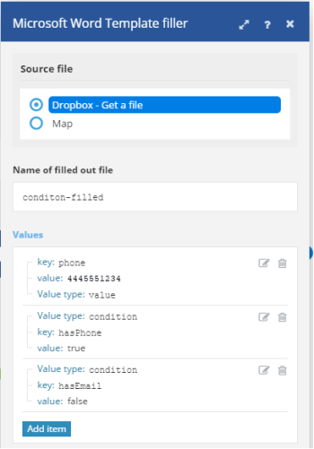

# [!DNL Microsoft Word Template]

In einem [!DNL Adobe Workfront Fusion] Szenario können Sie Workflows automatisieren, die [!DNL Microsoft Word Templates] verwenden, und sie mit mehreren Anwendungen und Services von Drittanbietern verbinden.

Anweisungen zum Erstellen eines Szenarios finden Sie unter [Erstellen eines Szenarios in [!DNL Adobe Workfront Fusion]](../../workfront-fusion/scenarios/create-a-scenario.md).

Weitere Informationen zu Modulen finden Sie unter [Module in [!DNL Adobe Workfront Fusion]](../../workfront-fusion/modules/modules.md).

## Zugriffsanforderungen

Sie müssen über folgenden Zugriff verfügen, um die Funktion in diesem Artikel verwenden zu können:

<table style="table-layout:auto"> 
 <col> 
 <col> 
 <tbody> 
  <tr> 
   <td role="rowheader">[!DNL Adobe Workfront] Plan*</td>
  <td> <p>[!UICONTROL Pro] oder höher</p> </td>
  </tr> 
  <tr data-mc-conditions=""> 
   <td role="rowheader">[!DNL Adobe Workfront] Lizenz*</td>
   <td> <p>[!UICONTROL-Plan], [!UICONTROL-Arbeit]</p> </td> 
  </tr> 
  <tr> 
   <td role="rowheader">[!DNL Adobe Workfront Fusion] Lizenz **</td> 
   <td> <p>[!UICONTROL [!DNL Workfront Fusion] für Arbeitsautomatisierung und -integration] </p> </td> 
  </tr> 
  <tr> 
   <td role="rowheader">Produkt</td> 
   <td>Ihr Unternehmen muss [!DNL Adobe Workfront Fusion] erwerben und [!DNL Adobe Workfront], die in diesem Artikel beschriebenen Funktionen zu nutzen.</td> 
  </tr> <!--
   <tr data-mc-conditions="QuicksilverOrClassic.Draft mode"> 
    <td role="rowheader">Access level configurations*</td> 
    <td> 
      <p data-mc-conditions="QuicksilverOrClassic.Draft mode">You must be a Workfront Fusion administrator for your organization.</p>
     --> <!--
      <p data-mc-conditions="QuicksilverOrClassic.Draft mode">You must be a Workfront Fusion administrator for your team.</p>
     --> </td> 
   </tr>
 </tbody> 
</table>

Wenden Sie sich an Ihren [!DNL Workfront], um herauszufinden, über welchen Plan, welchen Lizenztyp oder welchen Zugriff Sie verfügen.

Informationen zu [!DNL Adobe Workfront Fusion] finden Sie unter [[!DNL Adobe Workfront Fusion] Lizenzen](../../workfront-fusion/get-started/license-automation-vs-integration.md).

## Voraussetzungen

Um [!DNL Miscrosoft Word Templates] mit [!DNL Adobe Workfront Fusion] verwenden zu können, muss ein [!DNL Office 365] Konto vorhanden sein. Sie können einen unter www.office.com erstellen.


## Verbinden des [!DNL Office]-Services mit [!DNL Workfront Fusion]

Anweisungen zum Verbinden Ihres [!DNL Office]-Kontos mit [!UICONTROL Workfront Fusion] finden Sie unter [Erstellen einer Verbindung mit [!UICONTROL Adobe Workfront Fusion] - Grundlegende Anweisungen](../../workfront-fusion/connections/connect-to-fusion-general.md)

>[!NOTE]
>
>Einige Microsoft-Apps verwenden dieselbe Verbindung, die an individuelle Benutzerberechtigungen gebunden ist. Daher werden beim Erstellen einer Verbindung im Einverständnisbildschirm für Berechtigungen alle Berechtigungen angezeigt, die zuvor der Verbindung dieses Benutzers gewährt wurden, zusätzlich zu den neuen Berechtigungen, die für die aktuelle Anwendung erforderlich sind.
>
>Wenn ein Benutzer beispielsweise über die über den Excel-Connector gewährten Berechtigungen zum Lesen von Tabellen verfügt und dann im Outlook-Connector eine Verbindung zum Lesen von E-Mails erstellt, zeigt der Einverständnisbildschirm für Berechtigungen sowohl die bereits erteilte Berechtigung zum Lesen von Tabellen als auch die neu erforderliche Berechtigung zum Schreiben von E-Mails an.

## Verwenden von [!DNL Microsoft Word Templates]

Sie können ein [!DNL Microsoft Word Template]-Modul verwenden, um Daten aus mehreren Web-Services in einem [!DNL Microsoft Word]-Dokument zusammenzuführen.

Sie können beispielsweise diese [!DNL Microsoft Word] verwenden:


So erstellen Sie dieses Dokument:


## Über Wert-Tags

Eine [!DNL Microsoft Word] ist ein reguläres [!DNL Microsoft Word]-Dokument (.docx-Datei) mit speziellen Tags in seinem Text, die bestimmen, wo und wie Daten zusammengeführt oder ausgefüllt werden sollen. Es gibt drei Arten von Tags:

* [Einfaches Wert-Tag](#simple-value-tag)
* [Bedingungs-Tag](#condition-tag)
* [Loop-Tag](#loop-tag)

### Einfaches Wert-Tag {#simple-value-tag}

Ein einfaches Wert-Tag wird einfach durch einen entsprechenden Wert ersetzt. Der Name des Tags entspricht dem Wert [!UICONTROL Schlüssel], der in geschweiften Klammern steht, z. B. `{{name}}`.

**Beispiel** Um ein Dokument zu erstellen, in dem „Hallo Petr!“ steht, können Sie ein [!DNL Microsoft Word Template] Modul verwenden, um die folgende Vorlage zu erstellen:

```
> Hi {{name}}!
```

Richten Sie dazu das Modul wie folgt ein:


### Bedingungs-Tag {#condition-tag}

Sie können ein Bedingungs-Tag verwenden, um Text einzuschließen, der nur gerendert werden soll, wenn bestimmte Bedingungen erfüllt sind. Um den Text einzuschließen, platzieren Sie ihn zwischen öffnenden und schließenden Bedingungs-Tags, z. B. „hasPhone“, wenn die Bedingung ist, ob die Daten eine Telefonnummer enthalten oder nicht. Dem Namen eines öffnenden Tags wird ein Hash-Zeichen # vorangestellt, dem Namen eines schließenden Tags wird ein Schrägstrich / vorangestellt, wie im folgenden Beispiel gezeigt.

**Beispiel** Um ein Dokument zu erstellen, das die Telefonnummer eines Kunden enthält, wenn die Eingabedaten eine Telefonnummer, aber keine E-Mail-Adresse enthalten, können Sie ein [!DNL Microsoft Word Template] verwenden und die folgende Vorlage erstellen:

```
> {{#hasPhone}}Phone: {{phone}} {{/hasPhone}}
> {{#hasEmail}}Email: {{email}} {{/hasEmail}}
```

Richten Sie dazu das Modul wie folgt ein:



Im Dokument würde die Telefonnummer wie folgt angezeigt:

```
> Phone: 4445551234
```

### Loop-Tag {#loop-tag}

Sie können ein Schleifen-Tag, auch als Abschnittstags bezeichnet, verwenden, um einen Textabschnitt zu wiederholen. Umschließen Sie den Text, indem Sie ihn zwischen den öffnenden und schließenden Schleifen-Tags platzieren. Dem Namen eines öffnenden Tags wird ein Hash-Zeichen # vorangestellt; dem Namen eines schließenden Tags wird ein Schrägstrich / vorangestellt.

* [Loop-Tag mit dem Modul Dokument ausfüllen](#loop-tag-with-fill-out-a-document-module)
  <!-- [Loop tag with Fill a document with a batch of data module](#loop-tag-with-fill-a-document-with-a-batch-of-data-module)-->

#### Loop-Tag mit dem Modul Dokument ausfüllen {#loop-tag-with-fill-out-a-document-module}

**Beispiel** Um ein Dokument zu erstellen, das den Namen und die Telefonnummer jedes Kontakts in einer Kundenliste auflistet, können Sie ein [!DNL Microsoft Word Template] Modul verwenden und die folgende Vorlage erstellen:

```
> {{#contact}}
>     {{name}}, {{phone}}
> {{/contact}}
```

Richten Sie dazu das Modul wie folgt ein:


Das Modul würde das folgende Dokument erstellen:

```
> Jan Toman, 4445551234
> Eduard Salo, 4445552345
```

<!--

#### Loop tag with Fill a document with a batch of data module {#loop-tag-with-fill-a-document-with-a-batch-of-data-module}

**Example:** You can export Google contacts into a table that you create using loop tags.

The first module loads the template. The next module retrieves all contacts from the group you specify in [!DNL Google Contacts]. The aggregator module aggregates all values retrieved from Google Contacts and merges them into the template. And the last module saves the filled template to the desired location.


You could use this scenario with the following template:


To do this, you would set up the module as follows:


The module would create the following document:


-->

## [!DNL Microsoft Word Template]

Für diese Module ist keine Verbindung erforderlich.

* [Füllen Sie ein Dokument aus](#fill-out-a-document)
* [Ausfüllen eines Dokuments mit einem Datenstapel](#fill-a-document-with-a-batch-of-data)

### [!UICONTROL Füllen Sie ein Dokument aus] {#fill-out-a-document}

Mit diesem Transformatormodul können Sie ein Dokument mit von Ihnen angegebenen Daten füllen. Es kann mit einfachen Werten, Tags, bedingten Tags oder Schleifen-Tags verwendet werden.

<table style="table-layout:auto"> 
 <col> 
 <col> 
 <tbody> 
  <tr> 
   <td role="rowheader">[!UICONTROL Start-Trennzeichen des zu ersetzenden Textes]</td> 
   <td> <p>Geben Sie die Zeichen ein, die den Anfang des zu ersetzenden Textes markieren sollen. </p> <p class="example" data-mc-autonum="<b>Example: </b>"><span class="autonumber"><span><b>Beispiel: </b></span></span>Geben Sie <code>[[</code> ein, wenn Sie einen ähnlichen Text ersetzen möchten: <code>[[replace_me]]</code></p> </td> 
  </tr> 
  <tr> 
   <td role="rowheader"> <p>[!UICONTROL End-Trennzeichen des zu ersetzenden Textes]</p> </td> 
   <td> <p>Geben Sie die Zeichen ein, die am Ende des zu ersetzenden Textes stehen sollen. </p> <p class="example" data-mc-autonum="<b>Example: </b>"><span class="autonumber"><span><b>Beispiel: </b></span></span>Geben Sie <code>]]</code> ein, wenn Sie einen ähnlichen Text ersetzen möchten: <code>[[replace_me]]</code></p> </td> 
  </tr> 
  <tr> 
   <td role="rowheader">[!UICONTROL Source-Datei]</td> 
   <td> <p> Ordnen Sie die Datei zu, die Sie aus dem vorherigen Modul hochladen möchten (z. B. das Modul HTTP &gt; Datei abrufen oder Dropbox &gt; Dateimodul abrufen ). Oder geben Sie die Datendatei manuell ein.</p> </td> 
  </tr> 
  <tr> 
   <td role="rowheader">[!UICONTROL Name der ausgefüllten Datei]</td> 
   <td>Geben Sie einen Dateinamen (einschließlich Erweiterung) für die Zielausgabedatei ein.</td> 
  </tr> 
  <tr> 
   <td role="rowheader">[!UICONTROL-Datenquelle]</td> 
   <td> <p>Wählen Sie eine Option aus, um anzugeben, ob die von Ihnen verwendeten Daten aus einem Formular oder aus einer Rohdatenerfassung (nicht verarbeitete Computerdaten) stammen.</p> </td> 
  </tr> 
  <tr> 
   <td role="rowheader">[!UICONTROL-Werte]</td> 
   <td> <p>Dies muss ein Array von Sammlungen sein, wobei:</p> 
    <ul> 
     <li>Jede Sammlung entspricht einem Dateneintrag und enthält ein Element <code>entry</code></li> 
     <li>Element <code>entry </code>enthält eine Sammlung der <code>key </code>und <code>value</code></li> 
     <li>Element <code>key </code>enthält den Namen des Tags</li> 
     <li>Element <code>value </code>enthält den Wert des Tags</li> 
    </ul> 
    <p>Einen Eintrag hinzufügen:</p>
    <ol> 
     <li> Klicken Sie auf <b>[!UICONTROL Element hinzufügen]</b>. </li> 
     <li>Wählen Sie den Werttyp des Eintrags aus.</li> 
     <li>Fügen Sie den Namen und Wert hinzu. Weitere Informationen finden Sie im Beispiel für den ausgewählten Wertetyp in diesem Artikel. 
      <ul> 
       <li><a href="#simple-value-tag" class="MCXref xref">Einfaches Wert-Tag</a></li> 
       <li><a href="#condition-tag" class="MCXref xref">Bedingungs-Tag</a></li> 
       <li><a href="#loop-tag" class="MCXref xref">Loop-Tag</a></li> 
      </ul></li> 
    </ol> </td> 
  </tr> 
 </tbody> 
</table>

### [!UICONTROL Füllen eines Dokuments mit einem Datenstapel] {#fill-a-document-with-a-batch-of-data}

Dieses Aggregator-Modul ist nützlich, wenn Ihre Dateneinträge als separate Bundles vorliegen. Mit diesem Modul können Sie einfach die für das Wertefeld erforderliche Struktur einrichten und jedem Wertelement Elemente zuordnen. Im Gegensatz zum Modul Dokument ausfüllen erlaubt das Feld Werte im Modul Dokument mit einem Batch von Daten ausfüllen nur einen einzigen Eintrag, der Variablen enthält.

Sie können dieses Modul auch verwenden, wenn Ihre Dateneinträge als Array eingehen, indem Sie das Modul *Iterator* verwenden, um den Inhalt des Arrays in eine Reihe von Bundles umzuwandeln.

Die tatsächlichen Werte werden für jedes eingehende Bundle erstellt und ausgefüllt. Die Vorlage wird erstellt, nachdem alle Eingabepakete verarbeitet wurden.

Dieses Aggregator-Modul ist besonders nützlich für die Erstellung von Listen oder Berichten.

<table style="table-layout:auto"> 
 <col> 
 <col> 
 <tbody> 
  <tr> 
   <td role="rowheader">[!UICONTROL Source-Modul]</td> 
   <td>Wählen Sie das Modul aus, das die Quelle Ihres Textes ist.</td> 
  </tr> 
  <tr> 
   <td role="rowheader">[!UICONTROL Start-Trennzeichen des zu ersetzenden Textes]</td> 
   <td> <p>Geben Sie die Zeichen ein, die den Anfang des zu ersetzenden Textes markieren sollen. </p> <p class="example" data-mc-autonum="<b>Example: </b>"><span class="autonumber"><span><b>Beispiel: </b></span></span>Geben Sie <code>[[</code> ein, wenn Sie einen ähnlichen Text ersetzen möchten: <code>[[replace_me]]</code></p> </td> 
  </tr> 
  <tr> 
   <td role="rowheader"> <p>[!UICONTROL End-Trennzeichen des zu ersetzenden Textes]</p> </td> 
   <td> <p>Geben Sie die Zeichen ein, die am Ende des zu ersetzenden Textes stehen sollen. </p> <p class="example" data-mc-autonum="<b>Example: </b>"><span class="autonumber"><span><b>Beispiel: </b></span></span>Geben Sie <code>]]</code> ein, wenn Sie einen ähnlichen Text ersetzen möchten: <code>[[replace_me]]</code></p> </td> 
  </tr> 
  <tr> 
   <td role="rowheader">[!UICONTROL Gruppieren nach]</td> 
   <td> Definieren Sie einen Ausdruck, der ein oder mehrere zugeordnete Elemente enthält. Die aggregierten Daten werden unter Gruppen mit demselben Ausdruckswert getrennt. Jede Gruppe gibt als separates Bundle aus, das einen Schlüssel mit dem ausgewerteten Ausdruck und dem aggregierten Text enthält. Auf diese Weise können Sie den Schlüssel als Filter in nachfolgenden Modulen verwenden.</td> 
  </tr> 
  <tr> 
   <td role="rowheader">[!UICONTROL Verarbeitung nach einer leeren Aggregation anhalten]</td> 
   <td>Aktivieren Sie diese Option, um die Verarbeitung zu stoppen, wenn eine Aggregation keine Bundles enthält.</td> 
  </tr> 
  <tr> 
   <td role="rowheader">[!UICONTROL Source-Datei]</td> 
   <td> <p> Ordnen Sie die Datei zu, die Sie aus dem vorherigen Modul hochladen möchten (z. B. das Modul HTTP &gt; Datei abrufen oder Dropbox &gt; Dateimodul abrufen ). Oder geben Sie die Datendatei manuell ein.</p> </td> 
  </tr> 
  <tr> 
   <td role="rowheader">[!UICONTROL Name der ausgefüllten Datei]</td> 
   <td>Geben Sie einen Dateinamen (einschließlich Erweiterung) für die Zielausgabedatei ein.</td> 
  </tr> 
  <tr> 
   <td role="rowheader">[!UICONTROL-Datenquelle]</td> 
   <td> <p>Wählen Sie eine Option aus, um anzugeben, ob die von Ihnen verwendeten Daten aus einem Formular oder aus einer Rohdatenerfassung (nicht verarbeitete Computerdaten) stammen.</p> </td> 
  </tr> 
  <tr> 
   <td role="rowheader">[!UICONTROL-Werte]</td> 
   <td> <p>Dies muss ein Array von Sammlungen sein, wobei:</p> 
    <ul> 
     <li>Jede Sammlung entspricht einem Dateneintrag und enthält ein Element <code>entry</code></li> 
     <li>Element <code>entry </code>enthält eine Sammlung der <code>key </code>und <code>value</code></li> 
     <li>Element <code>key </code>enthält den Namen des Tags</li> 
     <li>Element <code>value </code>enthält den Wert des Tags</li> 
    </ul> 
    <p>Einen Eintrag hinzufügen:</p>
    <ol> 
     <li> Klicken Sie auf <b>[!UICONTROL Element hinzufügen]</b>. </li> 
     <li>Wählen Sie den Werttyp des Eintrags aus.</li> 
     <li>Fügen Sie den Namen und Wert hinzu. Weitere Informationen finden Sie im Beispiel für den ausgewählten Wertetyp in diesem Artikel. 
      <ul> 
       <li><a href="#simple-value-tag" class="MCXref xref">Einfaches Wert-Tag</a></li> 
       <li><a href="#condition-tag" class="MCXref xref">Bedingungs-Tag</a></li> 
       <li><a href="#loop-tag" class="MCXref xref">Loop-Tag</a></li> 
      </ul></li> 
    </ol> </td> 
  </tr> 
 </tbody> 
</table>
