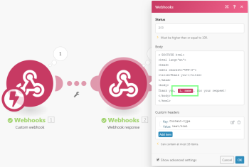
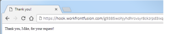

# Webhooks

Ein Webhook ist ein HTTP-Aufruf, der durch ein Ereignis ausgelöst wird. Sie können Webhooks verwenden, um Instant Trigger Module zu aktivieren. Jede Anwendung, die mit dem Internet verbunden ist und HTTP-Anfragen zulässt, kann Webhooks an Adobe Workfront Fusion senden.

## Zugriffsanforderungen

Sie müssen über den folgenden Zugriff verfügen, um die in diesem Artikel enthaltene Funktionalität nutzen zu können:

<table style="table-layout:auto"> 
 <col> 
 <col> 
 <tbody> 
  <tr> 
   <td role="rowheader">[!DNL Adobe Workfront] Plan*</td> 
   <td> <p>[!UICONTROL Pro] oder höher</p> </td> 
  </tr> 
  <tr data-mc-conditions=""> 
   <td role="rowheader">[!DNL Adobe Workfront] license*</td> 
   <td> <p>[!UICONTROL Plan], [!UICONTROL Arbeit]</p> </td> 
  </tr> 
  <tr> 
   <td role="rowheader">[!DNL Adobe Workfront Fusion] license**</td> 
   <td>
   <p>Aktuelle Lizenzanforderungen: Nein [!DNL Workfront Fusion] Lizenzanforderungen.</p>
   <p>Oder</p>
   <p>Ältere Lizenzanforderungen: [!UICONTROL [!DNL Workfront Fusion] für Arbeitsautomatisierung und Integration] </p>
   </td> 
  </tr> 
  <tr> 
   <td role="rowheader">Produkt</td> 
   <td>
   <p>Aktuelle Produktanforderungen: Wenn Sie über [!UICONTROL Select] oder [!UICONTROL Prime] verfügen [!DNL Adobe Workfront] Planung, Ihr Unternehmen muss [!DNL Adobe Workfront Fusion] sowie [!DNL Adobe Workfront] , um die in diesem Artikel beschriebenen Funktionen zu verwenden. [!DNL Workfront Fusion] ist in [!UICONTROL Ultimate] enthalten. [!DNL Workfront] Plan.</p>
   <p>Oder</p>
   <p>Ältere Produktanforderungen: Ihr Unternehmen muss [!DNL Adobe Workfront Fusion] sowie [!DNL Adobe Workfront] , um die in diesem Artikel beschriebenen Funktionen zu verwenden.</p>
   </td> 
  </tr>
 </tbody> 
</table>

&#42;Wenden Sie sich an Ihren Workfront-Administrator, um zu erfahren, welchen Plan, welchen Lizenztyp oder welchen Zugriff Sie haben.

&#42;&#42;Informationen über [!DNL Adobe Workfront Fusion] Lizenzen, siehe [[!DNL Adobe Workfront Fusion] Lizenzen](../../workfront-fusion/get-started/license-automation-vs-integration.md)

## Verwenden Sie einen Webhook in [!DNL Workfront Fusion]

>[!NOTE]
>
>Um einen Drittanbieter-Webhook (einen ausgehenden Webhook) aufzurufen, verwenden Sie eines der HTTP-Module. Weitere Informationen finden Sie unter [HTTP-Module](../../workfront-fusion/apps-and-their-modules/http-modules/http-modules-1.md).

So verbinden Sie eine App über einen Webhook mit [!DNL Workfront Fusion]:

1. Fügen Sie die **[!UICONTROL Webhooks]** >**[!UICONTROL Benutzerspezifischer Webhook]** Instant Trigger-Modul zu Ihrem Szenario.

1. Klicken **[!UICONTROL Hinzufügen]** neben dem Webhook-Feld und geben Sie einen Namen für den neuen Webhook ein.
1. (Optional) Klicken Sie auf **[!UICONTROL Erweiterte Einstellungen]**.
1. Im **[!UICONTROL IP-Beschränkungen]** Geben Sie eine kommagetrennte Liste der IP-Adressen ein, aus denen das Modul Daten aufnehmen kann.
1. Klicken Sie auf **[!UICONTROL Speichern]**

Nachdem Sie einen Webhook erstellt haben, wird eine eindeutige URL angezeigt. Dies ist die Adresse, an die der Webhook Daten sendet. Workfront Fusion validiert die an diese Adresse gesendeten Daten und gibt sie dann zur Verarbeitung im Szenario weiter.

>[!NOTE]
>
>Nachdem Sie einen Webhook erstellt haben, können Sie ihn in mehreren Szenarien gleichzeitig verwenden.

### Datenstruktur des Webhooks konfigurieren {#configure-the-webhook-s-data-structure}

Um die Datenstruktur der eingehenden Payload zu erkennen, [!DNL Workfront Fusion] analysiert Beispieldaten, die Sie an die angezeigte Adresse senden. Sie können die Beispieldaten bereitstellen, indem Sie eine Änderung im Dienst oder in der App vornehmen, die dazu führt, dass dieser Dienst oder diese App den Webhook aufruft. Sie können beispielsweise eine Datei entfernen.

Sie können auch die folgenden Schritte ausführen, um die Beispieldaten über die [!UICONTROL HTTP] > [!UICONTROL Anfrage stellen] -Modul.

1. Erstellen Sie ein neues Szenario mit dem **[!UICONTROL HTTP]** > **[!UICONTROL Anfrage stellen]** Modul

1. Konfigurieren Sie das Modul mit den folgenden Werten:

   <table style="table-layout:auto"> 
    <col> 
    <col> 
    <tbody> 
     <tr> 
      <td role="rowheader"><p>[!UICONTROL URL] </p></td> 
      <td>Geben Sie die URL des Webhooks ein. Sie finden diese URL im Modul [!UICONTROL Webhooks], das Sie zum Einrichten des Webhooks verwendet haben.</td> 
     </tr> 
     <tr> 
      <td role="rowheader">[!UICONTROL Methode] </td> 
      <td><p>[!UICONTROL POST]</p></td> 
     </tr> 
     <tr> 
      <td role="rowheader">[!UICONTROL Textkörper]</td> 
      <td><p> [!UICONTROL Raw]</p></td> 
     </tr> 
     <tr> 
      <td role="rowheader">[!UICONTROL Inhaltstyp]</td> 
      <td><p> JSON (application/json)</p></td> 
     </tr> 
     <tr> 
      <td role="rowheader">[!UICONTROL Anforderungsinhalt]</td> 
      <td><p>Rohe JSON im Webhook erwartet</p></td> 
     </tr> 
    </tbody> 
   </table>

   

1. Öffnen Sie das Szenario mit der [!UICONTROL Webhooks] -Modul in einem separaten Browser-Tab oder -Fenster.
1. Klicken Sie im Webhooks-Modul auf **[!UICONTROL Datenstruktur neu bestimmen]**.

   Sie müssen die Verknüpfung anderer Module nicht vom Webhooks-Modul aufheben.

1. Wechseln Sie mit dem Szenario [!UICONTROL HTTP] und führen Sie es aus.
1. Wechseln Sie mit dem Webhooks-Modul zurück zum Szenario.

   A[!UICONTROL Erfolgreich ermittelt]&quot; bedeutet, dass das Modul die Datenstruktur erfolgreich ermittelt hat.

   

1. Klicken **[!UICONTROL OK]** , um die Datenstruktur zu speichern.

   Die Elemente des Webhooks sind jetzt im Zuordnungsbereich für die Verwendung mit nachfolgenden Modulen im Szenario verfügbar.

## Warteschlange

Wenn ein Webhook Daten erhält und kein aktives Szenario mit diesen Daten verbunden ist, werden die Daten in der Warteschlange gespeichert. Nachdem Sie das Szenario aktiviert haben, werden alle Pakete, die in der Warteschlange warten, nacheinander verarbeitet.

>[!IMPORTANT]
>
>Webhook-Warteschlangen werden unter Szenarien freigegeben, die denselben Webhook verwenden. Wenn eines der Szenarien deaktiviert ist, werden alle eingehenden Daten in der Warteschlange gespeichert.

## Unterstützte eingehende Datenformate

[!DNL Workfront Fusion] unterstützt 3 eingehende Datenformate: [!UICONTROL Abfragezeichenfolge], [!UICONTROL Formulardaten] und [!UICONTROL JSON].

[!DNL Workfront Fusion] validiert alle eingehenden Daten mit der ausgewählten Datenstruktur. Anschließend werden die Daten je nach den Einstellungen des Szenarios entweder zur Verarbeitung in der Warteschlange gespeichert oder sofort verarbeitet.

Wenn ein Teil der Daten die Validierung nicht besteht, [!DNL Workfront Fusion] gibt einen 400-HTTP-Status-Code zurück und gibt im Text der HTTP-Antwort den Grund an, warum die eingehenden Daten bei den Validierungsprüfungen fehlgeschlagen sind. Wenn die Validierung der eingehenden Daten erfolgreich ist, gibt Workfront Fusion einen &quot;[!UICONTROL 200 Angenommen]&quot;.

* [[!UICONTROL Abfragezeichenfolge]](#query-string)
* [[!UICONTROL Formulardaten]](#form-data)
* [[!UICONTROL JSON]](#json)

### [!UICONTROL Abfragezeichenfolge]

```
GET https://app.workfrontfusion.com/wh/<yourunique32characterslongstring>?name=<yourname>&job=automate
```

### [!UICONTROL Formulardaten]

```
POST https://app.workfrontfusion.com/wh/<yourunique32characterslongstring>

Content-Type: application/x-www-form-urlencoded

name=<yourname>&job=automate
```

#### Formulardaten mit mehreren Elementen

```
POST https://app.workfrontfusion.com/wh/<yourunique32characterslongstring>


Content-Type: multipart/form-data; boundary=---generatedboundary

---generatedboundary

Content-Disposition: form-data; name="file"; filename="file.txt"


Content-Type: text/plain


Content of file.txt


---generatedboundary

Content-Disposition: form-data; name="name"

Workfront Fusion

---generatedboundary
```

Für den Empfang von Dateien, die mit `multipart/form-data`, müssen Sie eine Datenstruktur mit einer `collection` Typfeld, das die verschachtelten Felder enthält `name`, `mime`und `data`. Das Feld `name` ist `text` und enthält den Namen der hochgeladenen Datei. Die `mime` ist `text` und enthält eine Datei im MIME-Format. Das Feld `data` ist `buffer` und enthält Binärdaten für die zu übertragende Datei.

Weitere Informationen zum MIME-Format finden Sie unter [MIME-Module](../../workfront-fusion/apps-and-their-modules/mime.md).

### [!UICONTROL JSON]

```
POST https://app.workfrontfusion.com/wh/<yourunique32characterslongstring>

Content-Type: application/json

{"name": "Workfront Fusion", "job": "automate"}
```

>[!TIP]
>
>Wenn Sie auf die ursprüngliche JSON-Datei zugreifen möchten, aktivieren Sie die JSON-Weitergabe beim Einrichten des Webhooks.
>
>1. Klicken **[!UICONTROL Hinzufügen]** , um einen neuen Webhook hinzuzufügen.
>1. Klicken **[!UICONTROL Erweiterte Einstellungen anzeigen]**.
>1. Klicken **[!UICONTROL JSON-Pass-Through]**.
>

## Webhook-Header

Um auf die Header des Webhooks zuzugreifen, aktivieren Sie beim Einrichten des Webhooks die Option Anforderungsheader abrufen .

1. Klicken **[!UICONTROL Hinzufügen]** , um einen neuen Webhook hinzuzufügen.
1. Klicken **[!UICONTROL Erweiterte Einstellungen anzeigen]**.
1. Klicken **[!UICONTROL Anforderungsheader abrufen]**.

Sie können einen bestimmten Kopfzeilenwert mit der Kombination aus `map()` und `get()` Funktionen.

>[!INFO]
>
>**Beispiel:**
>
>Das folgende Beispiel zeigt eine Formel, die den Wert der `authorization` -Kopfzeile aus `Headers[]` Array. Die Formel wird in einem Filter verwendet, der den extrahierten Wert mit dem angegebenen Text vergleicht, um nur Webhooks zu übergeben, wenn eine Übereinstimmung vorliegt.
>
>
>
>Weitere Informationen zum Abrufen des Elements eines Arrays mit einem bestimmten Schlüssel finden Sie unter [Element eines Arrays mit einem bestimmten Schlüssel zuordnen](../../workfront-fusion/mapping/map-information-between-modules.md#mapping) im Artikel [Informationen in Adobe Workfront Fusion von einem Modul zum anderen zuordnen](../../workfront-fusion/mapping/map-information-between-modules.md).

## Antworten auf Webhooks

Die Standardantwort auf einen Webhook-Aufruf ist der Text &quot;Akzeptiert&quot;. Die Antwort wird während der Ausführung des Benutzerspezifischen Webhook-Moduls an die App zurückgegeben, die den Webhook aufgerufen hat.

* [Testen der Antwort auf einen Webhook](#test-the-response-to-a-webhook)
* [HTML-Antwortbeispiel](#html-response-example)
* [Beispiel einer Umleitung](#redirect-example)

### Testen der Antwort auf einen Webhook

1. Fügen Sie die **[!UICONTROL Benutzerspezifischer Webhook]** -Modul in Ihrem Szenario.
1. Fügen Sie dem Modul einen neuen Webhook hinzu.
1. Kopieren Sie die Webhook-URL in die Zwischenablage.
1. Führen Sie das Szenario aus.

   Das Blitzsymbol auf der [!UICONTROL Benutzerspezifischer Webhook] ändert sich in Drehpunkte. Dies zeigt, dass das Modul jetzt auf den Webhook-Aufruf wartet.

1. Öffnen Sie ein neues Browser-Fenster, fügen Sie die kopierte URL in die Adressleiste ein und drücken Sie die Eingabetaste. **[!UICONTROL Eingabe]**.

   Die [!UICONTROL Benutzerspezifischer Webhook] -Modul ausgelöst und der Browser zeigt eine neue Seite an.

Wenn Sie die Webhook-Antwort anpassen möchten, wenden Sie das Modul Webhook Response an.

Die Konfiguration des Moduls umfasst zwei Felder: [!UICONTROL Status] und [!UICONTROL body].

* Die [!UICONTROL Status] -Feld enthält HTTP-Antwortstatus-Codes wie 2xx für Erfolg (z. B. `200` für OK), 3xx für Umleitung (z. B. `307` für temporäre Weiterleitung), 4xx für Client-Fehler (z. B. `400` für fehlerhafte Anfragen) usw.

* Die [!UICONTROL body] enthält alles, was vom Webhook-Aufruf akzeptiert wird. Dabei kann es sich um einfachen Text, HTML, XML, JSON usw. handeln.

  >[!TIP]
  >
  >Es wird empfohlen, `Content-Type` -Kopfzeile zum entsprechenden MIME-Typ: `text/plain` für einfachen Text, `text/html` für HTML, `application/json` für JSON, `application/xml` für XML usw. Weitere Informationen zu MIME-Typen finden Sie unter [MIME-Module](../../workfront-fusion/apps-and-their-modules/mime.md).

Die Zeitüberschreitung für das Senden einer Antwort beträgt 40 Sekunden. Wenn die Antwort innerhalb dieses Zeitraums nicht verfügbar ist, gibt Workfront Fusion den Status &quot;200 Akzeptiert&quot;zurück.

### HTML-Antwortbeispiel

>[!INFO]
>
>**Beispiel:**
>
>Konfigurieren Sie die [!UICONTROL Webhook-Antwort] -Modul wie folgt:
>
><table style="table-layout:auto"> 
&gt; <col> 
&gt; <col> 
&gt; <tbody> 
&gt;  <tr> 
&gt;   <td role="rowheader">[!UICONTROL Status] </td> 
&gt;   <td> <p>2xx Erfolg HTTP-Status-Code, z. B. 200</p> </td> 
&gt;  </tr> 
&gt;  <tr> 
&gt;   <td role="rowheader">[!UICONTROL Body] </td> 
&gt;   <td> <p>HTML-Code</p> </td> 
&gt;  </tr> 
&gt;  <tr> 
&gt;   <td role="rowheader"> <p>[!UICONTROL Benutzerdefinierte Kopfzeilen]</p> </td> 
&gt;   <td> 
&gt;    <ul> 
&gt;     <li><strong>Schlüssel</strong>: Inhaltstyp</li> 
&gt;     <li><strong>Wert</strong>: text/html</li> 
&gt;    </ul> </td> 
&gt;  </tr> 
&gt; </tbody> 
&gt;</table>
>
>
>
>Dadurch wird eine HTML-Antwort erzeugt, die in einem Webbrowser angezeigt wird:
>
>

### Beispiel einer Umleitung

>[!INFO]
>
>**Beispiel:** Konfigurieren Sie die [!UICONTROL Webhook-Antwort] -Modul wie folgt:
>
><table style="table-layout:auto"> 
&gt; <col> 
&gt; <col> 
&gt; <tbody> 
&gt;  <tr> 
&gt;   <td role="rowheader">[!UICONTROL Status] </td> 
&gt;   <td> <p>3xx-Weiterleitungs-HTTP-Status-Code, z. B. 303</p> </td> 
&gt;  </tr> 
&gt;  <tr> 
&gt;   <td role="rowheader"> <p>[!UICONTROL Benutzerdefinierte Kopfzeilen]</p> </td> 
&gt;   <td> 
&gt;    <ul> 
&gt;     <li><strong>[!UICONTROL Schlüssel]</strong>: Standort</li> 
&gt;     <li><strong>[!UICONTROL Wert]</strong>: Die URL, zu der Sie umleiten möchten.</li> 
&gt;    </ul> </td> 
&gt;  </tr> 
&gt; </tbody> 
&gt;</table>
>
>

## Webhook-Deaktivierung

Webhooks werden automatisch deaktiviert, wenn eine der folgenden Aktionen zutrifft:

* Der Webhook ist seit mehr als 5 Tagen mit keinem Szenario verbunden
* Der Webhook wird nur in inaktiven Szenarien verwendet, die seit mehr als 30 Tagen inaktiv sind.

Deaktivierte Webhooks werden automatisch gelöscht und abgemeldet, wenn sie mit keinem Szenario verbunden sind und seit über 30 Tagen den Status deaktiviert haben.


## Fehlerbehebung

### Fehlende Elemente im Zuordnungsbereich

Wenn einige Elemente im Zuordnungsbereich bei der Einrichtung der Module fehlen, folgen Sie dem [!UICONTROL Webhooks] > [!UICONTROL Benutzerspezifischer Webhook] -Modul, klicken Sie auf die **[!UICONTROL Webhooks] > [!UICONTROL Benutzerspezifischer Webhook]** -Modul, um seine Einrichtung zu öffnen, und klicken Sie auf **[!UICONTROL Datenstruktur neu bestimmen]**:


Führen Sie dann die im Abschnitt beschriebenen Schritte aus. [Datenstruktur des Webhooks konfigurieren](#configure-the-webhook-s-data-structure) in diesem Artikel.
