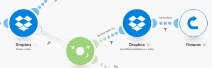
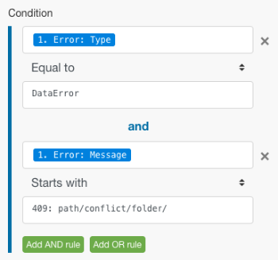

# Erweiterte Fehlerbehandlung in [!DNL Adobe Workfront Fusion]

>[!IMPORTANT]
>
>Die Dokumentation zu Adobe Workfront Fusion wurde an einen neuen Speicherort verschoben.
>
>Die Informationen in diesem Artikel finden Sie jetzt im Artikel:
>
>* [Filter und Verschachtelung zu Routen für die Fehlerbehandlung hinzufügen](https://experienceleague.adobe.com/docs/workfront-fusion/using/create-scenarios/configure-error-handling/advanced-error-handling.html)
>
>Bitte aktualisieren Sie alle Lesezeichen.
>
>Dieser Artikel wird nicht mehr aktualisiert und in naher Zukunft entfernt.

Zu den fortschrittlichen Techniken zur Fehlerbehandlung gehören Filterung und Verschachtelung.

## Zugriffsanforderungen

Sie müssen über folgenden Zugriff verfügen, um die Funktion in diesem Artikel verwenden zu können:

<table style="table-layout:auto">
 <col> 
 <col> 
 <tbody> 
  <tr> 
   <td role="rowheader">[!DNL Adobe Workfront] Plan*</td> 
   <td> 
[!UICONTROL Pro] oder höher
 </td> 
  </tr> 
  <tr data-mc-conditions=""> 
   <td role="rowheader">[!DNL Adobe Workfront] Lizenz*</td> 
   <td> 
[!UICONTROL-Plan], [!UICONTROL-Arbeit]
 </td> 
  </tr> 
  <tr> 
   <td role="rowheader">[!UICONTROL Adobe Workfront Fusion] Lizenz**</td> 
   <td>
   
Aktuelle Lizenzanforderung: Keine [!DNL Workfront Fusion].

   
Oder

   
Legacy-Lizenzanforderung: [!UICONTROL [!DNL Workfront Fusion] for Work Automation and Integration] 

   </td> 
  </tr> 
  <tr> 
   <td role="rowheader">Produkt</td> 
   <td>
   
Aktuelle Produktanforderung: Wenn Sie über den [!DNL Adobe Workfront] [!UICONTROL Select] oder [!UICONTROL Prime] verfügen, muss Ihr Unternehmen [!DNL Adobe Workfront Fusion] erwerben und [!DNL Adobe Workfront], die in diesem Artikel beschriebenen Funktionen zu nutzen. [!DNL Workfront Fusion] ist im [!DNL Workfront] [!UICONTROL Ultimate] enthalten.

   
Oder

   
Legacy-Produktanforderung: Ihr Unternehmen muss [!DNL Adobe Workfront Fusion] erwerben und [!DNL Adobe Workfront], die in diesem Artikel beschriebenen Funktionen zu verwenden.

   </td> 
  </tr> 
 </tbody> 
</table>

Wenden Sie sich an Ihren [!DNL Workfront], um herauszufinden, über welchen Plan, welchen Lizenztyp oder welchen Zugriff Sie verfügen.

Informationen zu [!DNL Adobe Workfront Fusion] finden Sie unter [[!DNL Adobe Workfront Fusion] Lizenzen](../../workfront-fusion/get-started/license-automation-vs-integration.md).

## Filtern

Es gibt zwei Arten der Filterung, die bei einer Fehler-Handler-Route erfolgen kann.

* [Hinzufügen eines Filters zur Fehler-Handler-Route](#adding-a-filter-to-the-error-handler-route)
* [Hinzufügen eines Routers und anschließender Filter zur Fehler-Handler-Route](#adding-a-router-followed-by-filters-to-the-error-handler)

### Hinzufügen eines Filters zur Fehler-Handler-Route

Sie können einen Filter verwenden, um zu steuern, welche Fehler von der Fehler-Handler-Route verarbeitet werden. Auf diese Weise können Sie nur bestimmte Fehlertypen verarbeiten. Wenn ein Fehler nicht durch den Filter geleitet wird, wird dies so behandelt, als ob für das angegebene Modul keine Fehler-Handler-Route definiert ist.

>[!INFO]
>
>**Beispiel:**
>
>

### Hinzufügen eines [!UICONTROL Routers] gefolgt von Filtern zum Fehler-Handler

>[!INFO]
>
>
>
>In diesem Beispiel findet der Fehler im Modul [!UICONTROL Ordner erstellen] (A) statt, das eine reguläre Route und eine Fehler-Handler-Route hat. Letzterer folgt ein Router mit einer Route, der einen Filter hat, der einen bestimmten Fehlertyp definiert (Datenfehler tritt auf), und der andere, der die Standardroute für alle anderen Fehler ist. Die erste Route endet mit der [!UICONTROL Resume]-Direktive, die Ersatzwerte für das Szenario enthält, das von Modul A fortgesetzt werden soll ([!UICONTROL Ordner erstellen]), während die zweite Route mit der [!UICONTROL Rollback]-Direktive endet, die die Ausführung des Szenarios sofort stoppt.

Weitere [ zu den verschiedenen Fehlertypen sowie  [!DNL Adobe Workfront Fusion]](../../workfront-fusion/errors/error-processing.md), wie [!DNL Workfront Fusion] diese verarbeitet und auswertet, finden Sie unter „Fehlerverarbeitung in“.

### Das Beispielszenario

Sie können dieses Beispielszenario einrichten, um zu verstehen, wie diese Filter für die Fehlerbehandlung funktionieren.

Verwenden Sie einen vorhandenen [!DNL Dropbox], um eine Datei hochzuladen, anstatt einen neuen zu erstellen

Wenn Sie das Modul [!UICONTROL Ordner erstellen] auf [!DNL Dropbox] verwenden und bereits ein Ordner mit demselben Namen vorhanden ist, löst das Modul einen Datenfehler aus, wie unten dargestellt:

Das vollständige Szenario:

1. Das [!UICONTROL Tools] > [!UICONTROL Variable festlegen] enthält den Ordnernamen
1. Das Modul [!UICONTROL HTTP] >[!UICONTROL Datei abrufen] ruft die Datei ab, die in den Ordner hochgeladen werden muss
1. Dropbox Das Modul  >[!UICONTROL Ordner erstellen] gibt einen Fehler aus, wenn bereits ein Ordner mit demselben Namen wie der im Modul zugeordnete vorhanden ist
1. Die Route des Fehler-Handlers (transparente Blasen) enthält einen Router zum Filtern der Fehler
1. Die erste Route ist für einen bestimmten Fehlertyp namens Datenfehler , wie wir bereits wissen:

   1. Wenn ein Datenfehler auftritt und die Fehlerdetails den Filter durchlaufen, listet [!UICONTROL Dropbox] >[!UICONTROL Alle Dateien/Unterordner in einem Ordnermodul ] alle Ordner in [!DNL Dropbox] auf
   1. Der nachfolgende Filter entspricht den Ordnernamen
   1. Die [!UICONTROL Resume]-Direktive gibt die Ordner-ID und den Ordnerpfad des bestehenden Ordners an. Die Ausführung des Szenarios wird von der [!UICONTROL Dropbox] >[!UICONTROL Erstellen eines Ordners]-Moduls fortgesetzt, aber anstatt zu versuchen, einen neuen Ordner zu erstellen, verwendet sie dieses Mal die Werte aus der [!UICONTROL Resume]-Direktive, um zum nächsten Modul zu wechseln und die Datei in den vorhandenen Ordner hochzuladen

1. Die zweite Route ist für alle anderen Fehler und endet mit der [!UICONTROL Rollback]-Direktive, was dazu führt, dass das Szenario sofort gestoppt wird

Nachstehend finden Sie eine ausführliche Erläuterung der 5. Erklärung:

Um den vorhandenen Ordner in Ihren nachfolgenden Modulen zu verwenden ([!UICONTROL laden Sie unten eine Datei ]), müssen Sie eine Fehler-Handler-Route zum Modul hinzufügen und den Ordnerpfad abrufen, der dem folgenden [!UICONTROL Fortsetzen]-Direktivenmodul zugeordnet werden soll:

Der Filter für die erste Route ist so eingestellt, dass nur der bestimmte Fehler (Datenfehler) verarbeitet wird, der angezeigt wird, wenn bereits ein Ordner mit demselben Namen vorhanden ist:

Das Modul [!UICONTROL Dropbox] >[!UICONTROL Alle Dateien in einem Ordner auflisten] ist so konfiguriert, dass es alle Ordner im Zielordner zurückgibt. Der folgende Filter übergibt nur den Filter, den wir ursprünglich erstellt haben (der Ordnername ist in der 33 gespeichert. Ordnername (Element):

Schließlich stellt die [!UICONTROL Resume]-Direktive den Ordnerpfad als Ausgabe für das fehlgeschlagene Modul bereit. Beachten Sie, dass die Ordner-ID leer gelassen wurde, da sie vom Modul „Datei hochladen[!UICONTROL  nicht benötigt ]:

## Verschachtelung

Unabhängig davon, wo sich ein Modul befindet, können Fehler-Handler-Routen für alle Module mit Ausnahme von Routern erstellt und implementiert werden. Es ist also möglich, eine Fehler-Handler-Route für ein Modul zu erstellen, das bereits Teil einer vorhandenen Fehler-Handler-Route ist, die für ein anderes Modul erstellt wurde.

Im Folgenden finden Sie ein Beispiel für eine verschachtelte Fehler-Handler-Route:

In diesem Szenario wird die zweite Fehler-Handler-Route unter der ersten Fehler-Handler-Route verschachtelt. Wenn also beim [!UICONTROL Dropbox] >[!UICONTROL Erstellen eines Ordnermoduls] ein Fehler auftritt, wechselt die Ausführung zu Route 1. Wenn der Filter [!UICONTROL Datenfehler tritt] übergeben wird, wird das nächste Modul ausgeführt, gefolgt vom [!UICONTROL Fortsetzen]-Direktivmodul, wenn beim [!UICONTROL Dropbox] >[!UICONTROL Alle Dateien/Unterordner auflisten] in einem Ordnermodul kein Fehler auftritt.

Wenn jedoch mit diesem [!DNL Dropbox] ein Fehler auftritt, wechselt die Ausführung zur Fehler-Handler-Route 2 und endet mit der [!UICONTROL Ignore]-Anweisung. Das [!UICONTROL Resume-Direktive]-Modul wird in diesem Fall nicht ausgeführt.

Dies ist eine Kombination aus Filtern und Verschachteln von Fehler-Handlern.

