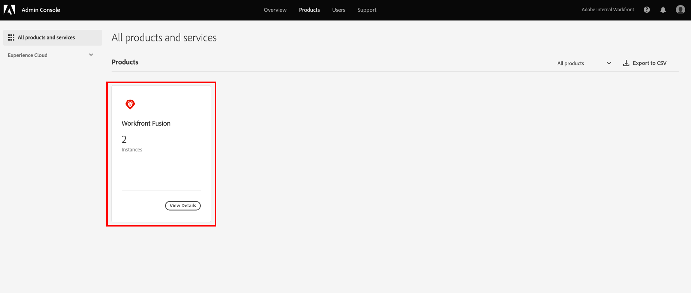

# Hinzufügen von Benutzern zu [!DNL Adobe Workfront Fusion] über die [!DNL Adobe Admin Console]

>[!IMPORTANT]
>
>Die auf dieser Seite beschriebenen Verfahren gelten nur für Organisationen, die in das [!DNL Adobe Admin Console] integriert wurden.
>
>Wenn Ihre Organisation noch nicht in die [!DNL Adobe Admin Console] integriert wurde, finden Sie weitere Informationen unter [Hinzufügen eines Benutzers zu einer Organisation in [!DNL Adobe Workfront Fusion]](../organizations/add-user-to-an-organization.md).
>
>Eine Liste der Verfahren, die sich je nachdem, ob Ihr Unternehmen in das [!DNL Adobe Admin Console] integriert wurde, unterscheiden, finden Sie unter [Unterschiede bei der Verwaltung über Platform ([!DNL Adobe Workfront Fusion]/[!DNL Adobe Business Platform])](../fusion-in-admin-console/fusion-adobe-admin-console.md).

Sie können einen Benutzer zum [!DNL Adobe Admin Console] hinzufügen und ihn [!DNL Adobe Workfront Fusion] zuweisen oder einen vorhandenen Benutzer im [!DNL Adobe Admin Console] zum [!DNL Workfront Fusion] zuweisen.

Ein Video, das [!DNL Workfront Fusion] in der [!DNL Adobe Admin Console] beschreibt, einschließlich der Hinzufügung von Benutzern, finden Sie unter [[!DNL Fusion] auf Adobe IMS](https://video.tv.adobe.com/v/3412464/){target=_blank}.

## Zugriffsanforderungen

Sie müssen über folgenden Zugriff verfügen, um die Funktion in diesem Artikel verwenden zu können:

<table style="table-layout:auto"> 
 <col> 
 <col> 
 <tbody> 
  <tr> 
   <td role="rowheader">[!DNL Adobe Workfront] Plan*</td> 
   <td> 
[!UICONTROL Pro] oder höher
 </td> 
  </tr> 
  <tr data-mc-conditions=""> 
   <td role="rowheader">[!DNL Adobe Workfront] Lizenz*</td> 
   <td> 
[!UICONTROL-Plan], [!UICONTROL-Arbeit]
 </td> 
  </tr> 
  <tr> 
   <td role="rowheader">[!DNL Adobe Workfront Fusion] Lizenz **</td> 
   <td>
   
Aktuelle Lizenzanforderung: Keine [!DNL Workfront Fusion].

   
Oder

   
Legacy-Lizenzanforderung: [!UICONTROL [!DNL Workfront Fusion] for Work Automation and Integration] 

   </td> 
  </tr> 
  <tr> 
   <td role="rowheader">Produkt</td> 
   <td>
   
Aktuelle Produktanforderung: Wenn Sie über den [!DNL Adobe Workfront] [!UICONTROL Select] oder [!UICONTROL Prime] verfügen, muss Ihr Unternehmen [!DNL Adobe Workfront Fusion] erwerben und [!DNL Adobe Workfront], die in diesem Artikel beschriebenen Funktionen zu nutzen. [!DNL Workfront Fusion] ist im [!DNL Workfront] [!UICONTROL Ultimate] enthalten.

   
Oder

   
Legacy-Produktanforderung: Ihr Unternehmen muss [!DNL Adobe Workfront Fusion] erwerben und [!DNL Adobe Workfront], die in diesem Artikel beschriebenen Funktionen zu verwenden.

   </td> 
  </tr>
   <tr> 
   <td role="rowheader">[!DNL Adobe] Administratorrechte</td> 
   <td>Sie müssen [!UICONTROL Product Configuration Administrator] für [!DNL Adobe] Produkte für Ihre Organisation sein.</td> 
  </tr>
  </tbody> 
</table>

&#42;Wenden Sie sich an Ihren [!DNL Workfront], um herauszufinden, über welchen Plan, welchen Lizenztyp oder welchen Zugriff Sie verfügen.

&#42;&#42;Informationen zu [!DNL Adobe Workfront Fusion] finden Sie unter [[!DNL Adobe Workfront Fusion] Lizenzen](../../workfront-fusion/get-started/license-automation-vs-integration.md)

## Voraussetzungen

Bevor Sie den [!DNL Admin Console] für die [!DNL Workfront] verwenden, sollten Sie eine E-Mail erhalten, in der Sie zur Konsole eingeladen werden.

1. Wenn Sie [!DNL Adobe] noch nicht kennen und eine E-Mail erhalten haben, in der Sie darauf hingewiesen werden, dass Sie jetzt über Administratorrechte für die Verwaltung [!DNL Adobe] Software und Services für Ihr Unternehmen verfügen, klicken Sie auf die Schaltfläche in der E-Mail, um ein [!DNL Adobe] Konto zu erstellen, und öffnen Sie die [!DNL Admin Console].

   Oder

   Wenn Sie bereits über ein Adobe-Konto verfügen, gehen Sie zur [[!DNL Adobe Admin Console] Seite](https://adminconsole.adobe.com/).

## Hinzufügen eines neuen Benutzers zur [!DNL Adobe Admin Console] und [!DNL Workfront Fusion]

1. Wählen Sie auf [[!DNL Adobe Admin Console] Seite](https://adminconsole.adobe.com/) die Registerkarte **[!UICONTROL Produkte]** in der oberen Navigationsleiste aus und wählen Sie dann die **[!DNL Workfront Fusion]** Produktkachel aus.

   

1. Wählen Sie in der angezeigten Liste die Organisation aus, der Sie einen Benutzer hinzufügen möchten.

   

1. Klicken Sie in der angezeigten Liste mit **[!UICONTROL ausgewählten Registerkarte]** Produktprofile[!DNL Workfront Fusion] auf den Link [!UICONTROL Produktprofil].

   

   >[!IMPORTANT]
   >
   > Nehmen Sie keine Änderungen am [!UICONTROL Produktprofil] vor.

1. Klicken Sie **[!UICONTROL der]** „Benutzer“ oberhalb der Liste auf **[!UICONTROL Benutzer hinzufügen]**.

1. Geben **[!UICONTROL im Feld „Benutzer zu diesem Produktprofil hinzufügen]** die E-Mail-Adresse oder den Namen eines Benutzers ein, den Sie hinzufügen möchten, und wählen Sie dann den Benutzer in der angezeigten Liste aus.

1. Klicken Sie auf **[!UICONTROL Speichern]**.

   Der Benutzer wird in [!DNL Workfront Fusion] erstellt.

   <!--
    >[!IMPORTANT]
    >
    > Do not make any changes to the Product Profile itself.
    -->

1. (Optional) Fahren Sie mit [Ändern der Zugriffsebene von Benutzenden in fort [!DNL Workfront Fusion]](#change-a-users-access-level-in-workfront-fusion)

## Ändern der Zugriffsebene von Benutzenden in Workfront Fusion

### Benutzerrolle in „Admin“ ändern

Die Zuweisung einer Administratorrolle an einen Benutzer muss in der [!DNL Adobe Admin Console] erfolgen.

1. Wählen Sie auf der [!DNL Workfront Fusion] [!UICONTROL Produktprofil]-Seite, auf der Sie den Benutzer hinzugefügt haben, die Registerkarte **[!UICONTROL Administratoren]** aus.

1. Klicken Sie **[!UICONTROL Admin hinzufügen]**.

1. Geben **[!UICONTROL im Feld „Produktprofil-]** hinzufügen“ die E-Mail-Adresse oder den Namen eines Benutzers ein, den Sie hinzufügen möchten, und wählen Sie dann den Benutzer in der angezeigten Liste aus.

1. Klicken Sie auf **[!UICONTROL Speichern]**.

   Dieser Benutzer ist jetzt Administrator in [!DNL Workfront Fusion].

### Ändern Sie die Rolle eines Benutzers in [!UICONTROL Mitglied], [!UICONTROL Buchhalter] oder [!UICONTROL App-Entwickler].

Die Rollen [!UICONTROL Mitglied], [!UICONTROL Buchhalter] und [!UICONTROL App-] werden in [!DNL Workfront Fusion] gehandhabt.

Anweisungen finden Sie unter [Anzeigen oder Bearbeiten von Benutzerrollen](../organizations/manage-fusion-users.md#view-or-edit-user-roles) im Artikel [Verwalten von  [!DNL Adobe Workfront Fusion]  in Ihrer Organisation](../organizations/manage-fusion-users.md)

## Zuweisen eines vorhandenen Benutzers in der [!DNL Adobe Admin Console] zu [!DNL Workfront Fusion]

Sie können einen vorhandenen Benutzer zu einem Team in Fusion hinzufügen. Dies wird innerhalb von Fusion gehandhabt.

Anweisungen finden Sie unter [Hinzufügen eines Benutzers zu einem Team](/help/quicksilver/workfront-fusion/organizations/add-user-to-an-organization.md#add-a-user-to-a-team) im Artikel Hinzufügen eines Benutzers zu einer Organisation oder einem Team in Adobe Workfront Fusion.
