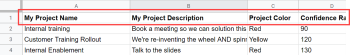

# Erstellen eines Szenarios für die praktische Integration in Adobe Workfront Fusion

In diesem Artikel wird beschrieben, wie Sie ein Integrationsszenario mit Adobe Workfront Fusion erstellen. Integrationsszenarien verbinden separate Apps miteinander, sodass Ihre Daten durch verschiedene Programme fließen können.

Um ein Integrationsszenario zu erstellen, muss Ihr Unternehmen über eine [!DNL Workfront Fusion for Work Automation and Integration]-Lizenz verfügen.

Anweisungen zum Erstellen eines reinen Automatisierungsszenarios für Workfront finden Sie unter [Erstellen eines praktischen Automatisierungsszenarios in Adobe Workfront Fusion](../../workfront-fusion/get-started/create-a-practice-automation-scenario.md)

Weitere Informationen zu Workfront Fusion-Lizenzen finden Sie unter [Adobe Workfront Fusion-Lizenzen](../../workfront-fusion/get-started/license-automation-vs-integration.md).

>[!NOTE]
>
>Ihr Unternehmen erlaubt möglicherweise keinen Zugriff auf Google Sheets. In diesem Fall können Sie diese Integration nicht einrichten, aber die hier präsentierten Informationen können als allgemeines Beispiel dafür verwendet werden, wie Integrationsszenarien funktionieren.

## Zugriffsanforderungen

Sie müssen über folgenden Zugriff verfügen, um die Funktion in diesem Artikel verwenden zu können:

<table style="table-layout:auto"> 
 <col> 
 <col> 
 <tbody> 
  <tr> 
    <td role="rowheader">[!DNL Adobe Workfront] Plan*</td> 
   <td> 
[!DNL Pro] oder höher
 </td> 
  </tr> 
  <tr data-mc-conditions=""> 
   <td role="rowheader">[!DNL Adobe Workfront] Lizenz*</td> 
   <td> 
[!UICONTROL-Plan], [!UICONTROL-Arbeit]
 </td> 
  </tr> 
  <tr> 
   <td role="rowheader">[!UICONTROL Adobe Workfront Fusion] Lizenz**</td> 
   <td>
   
Aktuelle Lizenzanforderung: Keine [!DNL Workfront Fusion].

   
Oder

   
Legacy-Lizenzanforderung: [!UICONTROL [!DNL Workfront Fusion] for Work Automation and Integration] 

   </td> 
  </tr> 
  <tr> 
   <td role="rowheader">Produkt</td> 
   <td>
   
Aktuelle Produktanforderung: Wenn Sie über den [!DNL Adobe Workfront] [!UICONTROL Select] oder [!UICONTROL Prime] verfügen, muss Ihr Unternehmen [!DNL Adobe Workfront Fusion] erwerben und [!DNL Adobe Workfront], die in diesem Artikel beschriebenen Funktionen zu nutzen. [!DNL Workfront Fusion] ist im [!DNL Workfront] [!UICONTROL Ultimate] enthalten.

   
Oder

   
Legacy-Produktanforderung: Ihr Unternehmen muss [!DNL Adobe Workfront Fusion] erwerben und [!DNL Adobe Workfront], die in diesem Artikel beschriebenen Funktionen zu verwenden.

   </td> 
  </tr> 
 </tbody> 
</table>

Wenden Sie sich an Ihren [!DNL Workfront], um herauszufinden, über welchen Plan, welchen Lizenztyp oder welchen Zugriff Sie verfügen.

Informationen zu [!DNL Adobe Workfront Fusion] finden Sie unter [[!DNL Adobe Workfront Fusion] Lizenzen](../../workfront-fusion/get-started/license-automation-vs-integration.md).

## Erstellen eines Übungsszenarios

Die Rolle von [!DNL Adobe Workfront Fusion] besteht darin, Ihre Prozesse zu automatisieren, damit Sie sich auf neue Aufgaben konzentrieren können, anstatt dieselben Aufgaben immer wieder zu wiederholen. Es funktioniert durch die Verknüpfung von Aktionen innerhalb und zwischen Apps und Services, um ein Szenario zu erstellen, das Ihre Daten automatisch überträgt und transformiert. Das Szenario, in dem Sie Daten in einer App oder einem Service erstellen, überwacht und verarbeitet diese Daten, um das gewünschte Ergebnis zu liefern.

Ein Szenario besteht aus einer Reihe von Modulen, die angeben, wie Daten innerhalb einer App transformiert oder zwischen Apps und Web-Services übertragen werden sollen.

Um zu erklären, wie Sie ein Szenario erstellen und Best Practices bestätigen, während Sie lernen, [!DNL Workfront Fusion] zu verwenden, führt Sie dieser Artikel Schritt für Schritt durch den Prozess. Wir erstellen ein Szenario, das für jede Zeile in einer [!DNL Google Sheets] Tabelle einen neuen Datensatz in [!DNL Workfront] erstellt.

>[!TIP]
>
>Ein Szenario wie dieses wäre nützlich, wenn Sie eine Tabelle hätten, in der Projekte aufgelistet sind, an denen mithilfe von Projekten in [!DNL Workfront] gearbeitet werden muss. Das Szenario könnte die Tabelle auf neue Zeilen „überwachen“ und für jede Zeile ein neues Projekt in [!DNL Workfront] hinzufügen.

Das Erstellen eines Szenarios besteht aus mehreren Hauptaufgaben:

## Apps auswählen und Szenario benennen

1. Laden Sie [Arbeitsblatt](https://cdn.experience.workfront.com/Documentation/Workfront+Fusion/Fusion+Practice+Scenario+Sample+Sheet.xlsx) herunter und laden Sie es dann in Ihre [!DNL Google Drive] hoch, um es während dieser Übung zu verwenden.

   Oder

   Erstellen oder suchen Sie eine eigene einfache [!DNL Google Sheets]-Tabelle, die der folgenden ähnelt:

   

1. Melden Sie sich bei Ihrem [!DNL Workfront Fusion] Konto an.
1. Klicken Sie **[!UICONTROL linken Bedienfeld]** Szenarios.

   >[!NOTE]
   >
   >Wenn der linke Navigationsbereich oder dessen Symbole nicht angezeigt werden, klicken Sie auf das Symbol Menü  .

   Im grauen [!UICONTROL Ordner]-Bedienfeld, das angezeigt wird, können Sie Ihre Szenarien in Ordner organisieren.

   Oben im Hauptbereich rechts können Sie die von Ihnen erstellten **[!UICONTROL Alle]**-Szenarien, Ihre **[!UICONTROL Aktiven Szenarien]** und **[!UICONTROL Inaktiven Szenarien]** und **[!UICONTROL Konzepte]** sehen. Dabei handelt es sich um Szenarien, an denen noch mehr gearbeitet werden muss, bevor [!DNL Workfront Fusion] sie als aktiv oder inaktiv einstufen können.

<!--
   
-->

1. Klicken Sie im [!UICONTROL Ordner]-Bedienfeld auf das Symbol **[!UICONTROL Ordner hinzufügen]**  und geben Sie dann einen Namen wie „Übungsszenarien“ für Ihren ersten Ordner ein.

1. Öffnen Sie den Ordner und klicken Sie **[!UICONTROL oben]** auf der Seite auf „Neues Szenario erstellen“.

   Auf der angezeigten Landingpage können Sie alle Apps vorab laden, die Sie in dem Szenario verwenden möchten, das Sie erstellen möchten.

1. Suchen Sie für diese Übung nach der App **[!UICONTROL Google Sheets]** und wählen Sie sie aus.
1. Klicken **[!UICONTROL oben]** auf „Weiter“.

   Der Szenario-Editor wird angezeigt. Er enthält in der Mitte ein leeres Modul, die [!DNL Google Sheets] App, die Sie vorgeladen haben, und unten in der Symbolleiste einige Optionen.

<!--
   
-->

Wenn Sie mit dem Erstellen eines neuen Szenarios beginnen, empfiehlt es sich, zunächst einen Namen dafür zu erstellen.

1. Wählen Sie **[!UICONTROL Platzhalternamen]** Neues Szenario“ in der oberen linken Ecke aus und geben Sie dann einen Namen ein, z. B. „Übungsszenario 1“.
1. Fahren Sie mit [Hinzufügen und konfigurieren Sie das erste Modul](#add-and-configure-the-first-module) unten fort.

## Hinzufügen und Konfigurieren des ersten Moduls

Das leere Modul mit einem Fragezeichen stellt das Trigger-Modul dar, das Sie hinzufügen müssen. Dieses Modul startet das Szenario bei jeder Ausführung. Das Uhrensymbol auf dem leeren Modul zeigt an, dass es sich um ein geplantes Modul handelt.

Dieses Modul enthält die Daten, auf die das Szenario achten soll.

1. Klicken Sie auf das leere Modul, um die App auszuwählen, aus der Sie ein Modul auswählen möchten.

   Die zuvor geladene App wird neben dem leeren Modul angezeigt. Sie können alle anderen Apps mit Modulen über das Feld [!UICONTROL Suche] hinzufügen.

   

1. Klicken Sie auf **[!DNL Google Sheets]**.

   Die Liste ändert sich und zeigt alle [!DNL Google Sheets] an, die Sie als Trigger-Modul verwenden können.

1. Klicken Sie auf das Trigger-Modul **[!UICONTROL Auf Datensätze]**.

   Jetzt müssen Sie eine authentifizierte Verbindung zu Ihrem Google-Konto herstellen. Jedes Modul, das Sie einem Szenario hinzufügen, muss über eine Verbindung zu seiner App verfügen.

1. Klicken Sie im **[!DNL Google Sheets]** unter **[!UICONTROL Verbindung]** auf **[!UICONTROL Hinzufügen]**, geben Sie dann einen Namen für die Verbindung ein, z. B. „Olivias Google-Konto“, und klicken Sie dann auf **[!UICONTROL Weiter]**.
1. Authentifizieren Sie die Verbindung im angezeigten Fenster.

   Der Prozess zum Authentifizieren einer Verbindung kann zwischen Apps etwas variieren. Möglicherweise müssen Sie sich bei der App anmelden. In der Regel müssen Sie auf die Schaltfläche **[!UICONTROL Zulassen]** klicken. Wenn Sie Hilfe benötigen, lesen Sie [Verbindungen - Übersicht](../../workfront-fusion/connections/about-connecting-wf-fusion-to-app-or-service.md).

## Konfigurieren des ersten Moduls

Nachdem Sie [!DNL Workfront Fusion] mit Ihrem [!DNL Google Sheets]-Konto verbunden haben, können Sie eine [!DNL Google Sheets] Tabelle, auf die Sie Zugriff haben, und die Daten dort angeben, die das erste Modul verarbeiten soll.

1. Klicken Sie auf **[!UICONTROL Tabelle]** und wählen Sie dann in der angezeigten Liste das **[!UICONTROL Übungsszenario] #1** von Workfront Fusion aus.

   Dieses Arbeitsblatt enthält zwei Blätter (Registerkarten). Daher müssen wir angeben, welches Blatt die gewünschten Daten enthält:

1. Wählen Sie in **[!UICONTROL Dropdown]** Liste „Blatt“ die Option **[!UICONTROL Projekte]** aus.

   Unsere Tabelle enthält Kopfzeilen, die vom Modul verwendet werden sollen, um die Daten zu identifizieren, die verarbeitet werden sollen:

   

1. Lassen Sie **[!UICONTROL Ja]** ausgewählt für **[!UICONTROL Tabelle enthält Kopfzeilen]**.

1. Im Feld **[!UICONTROL Zeile mit Kopfzeilen]** können Sie einen Bereich von Zeilen angeben, die Sie einbeziehen möchten. Lassen Sie uns jedoch für diese Übung die Standardeinstellung „A1:Z1“ beibehalten.
1. Geben Sie **[!UICONTROL Feld]** 1 ein.

   Auf diese Weise verarbeitet das Modul jedes Mal, wenn Sie das Szenario ausführen, nur eine Zeile in der Tabelle. Dies ist nützlich, um die Testausführungen beim Erstellen des Szenarios zu vereinfachen.

1. Klicken Sie **[!UICONTROL OK]**.

   Im Feld **[!UICONTROL Startpunkt auswählen]** werden Sie aufgefordert anzugeben, wo in der Tabelle das Modul die Verarbeitung beginnen soll.

1. Klicken Sie **[!UICONTROL Manuell auswählen]** wählen Sie die oberste Option in der angezeigten Liste aus und klicken Sie dann auf **[!UICONTROL OK]**.
1. Klicken Sie mit der rechten Maustaste auf das Modul **[!UICONTROL Umbenennen]** und geben Sie dann einen Namen ein, der beschreibt, was das Modul tun soll (z. B. „Projektliste ansehen„). Klicken Sie dann **[!UICONTROL OK]**.

   Der Name wird direkt unter dem Modul angezeigt. Darunter finden Sie [!DNL Workfront Fusion] kurze Beschreibung der Art der Aktion, die vom Modul ausgeführt wird.

   

1. Fahren Sie mit [Hinzufügen und konfigurieren Sie das zweite Modul](#add-and-configure-the-second-module) fort.

## Hinzufügen und Konfigurieren des zweiten Moduls

1. Klicken Sie auf den Teilkreis rechts neben dem Modul, um **[!UICONTROL Weitere Module hinzufügen]**.

   Dieses zweite Modul muss ein [!DNL Workfront] Modul sein, aber wir haben die [!DNL Workfront] App nicht vorgeladen.

1. Um die [!DNL Workfront] App zu finden, geben Sie &quot;[!DNL Workfront]&quot; ein und klicken Sie auf die App, wenn sie angezeigt wird.
1. Klicken Sie in der angezeigten Liste [!DNL Workfront] Module auf **[!UICONTROL Datensatz erstellen]**.

1. Klicken Sie wie zuvor bei der Google Sheets-App im [!DNL Workfront] auf **[!UICONTROL Hinzufügen]**, um eine Verbindung zwischen Workfront Fusion und Workfront hinzuzufügen.

   Jetzt fangen wir an zu spezifizieren, was wir mit den Daten aus der Tabelle machen wollen.

1. Klicken Sie **[!UICONTROL Datensatztyp]** und wählen Sie dann **[!UICONTROL Projekt]** aus, da wir ein Projekt in [!DNL Workfront] mithilfe einer Zeile aus der Tabelle erstellen möchten.

   >[!TIP]
   >
   >Sie finden **[!UICONTROL Projekt]** in der Liste, wenn Sie mit der Eingabe des Wortes &quot;[!UICONTROL Projekt] beginnen.

   Das Feld wird erweitert und zeigt alle verfügbaren [!DNL Workfront] Projektfelder an, in die Sie die vom ersten Modul gefundenen Informationen einfügen können.

   Wir verwenden das Feld **[!UICONTROL Name]**: Dieses Modul soll jedes Projekt in [!DNL Workfront] benennen, indem der Text in der entsprechenden Zeile [!UICONTROL Google Sheets] verwendet wird.

1. Suchen Sie das Feld **[!UICONTROL Name]** und klicken Sie darauf.

   >[!TIP]
   >
   >Sie können **Befehlstaste+F** ([!DNL Mac] OS) oder **Strg+F**([!DNL Windows] OS) verwenden, um ein Feld schnell zu finden.

   Dadurch wird die Liste der Variablen geöffnet, die Sie im Feld **[!UICONTROL Name]** verwenden können, um den Namen für jedes in Workfront erstellte Projekt zu definieren.

   

   Beachten Sie, dass die Variablen am Anfang der Liste den Spaltenüberschriften in der Tabelle entsprechen.

   

   

1. Klicken Sie auf die Variable **[!UICONTROL Mein Projektname (A)]**, um sie zum Feld **[!UICONTROL Name]** hinzuzufügen.

   Sie haben soeben Ihr erstes Datenelement für dieses Szenario zugeordnet.

   Ordnen wir nun noch ein weiteres Datenelement aus der Tabelle [!DNL Workfront] zu: das Startdatum für jedes Projekt.

1. Suchen Sie das Feld **[!UICONTROL Geplantes Startdatum]** und klicken Sie dann auf die Variable **[!UICONTROL Geplantes Startdatum (E)]**, um Daten aus dieser Spalte im Arbeitsblatt abzurufen.

1. Klicken Sie **[!UICONTROL OK]**.

   Jetzt haben Sie ein funktionierendes Szenario.

1. Benennen Sie das zweite Modul wie &quot;Workfront-Projekt erstellen“ und setzen Sie den Vorgang anschließend mit [Szenario testen](#test-the-scenario) fort.

## Testen des Szenarios

Bevor Sie Ihr Szenario aktivieren, müssen Sie es testen, indem Sie es mindestens einmal ausführen und die Ergebnisse anzeigen. Auf diese Weise können Sie verstehen, wie Daten durch das Szenario fließen, und Fehler finden.

Wir haben uns entschieden, eine Zeile aus der Tabelle verarbeiten zu lassen, um ein Projekt in Workfront zu erstellen. Wenn Sie das Szenario ausführen, sollte dies passieren.

1. Klicken Sie **[!UICONTROL Einmal ausführen]** in der linken unteren Ecke des Szenario-Editors.
1. Klicken Sie nach der Ausführung des Szenarios auf die Blase oberhalb des [!DNL Google Sheets].

   

   Im angezeigten Feld können Sie Informationen zum Datenpaket anzeigen, das vom Modul verarbeitet wurde, einschließlich der tatsächlichen Daten, die aus der Tabelle für die Zeile abgerufen wurden, mit der Sie begonnen haben.

   

1. Klicken Sie auf die Blase „Ausführungs-Inspektor“ über dem Modul [!DNL Workfront] , um die Eingabe von Informationen und die Ausgabe anzuzeigen, bei der es sich um die ID des Projekts handelt, das jetzt in [!DNL Workfront] erstellt wurde

   

   Weitere Informationen zum Lesen von Informationen zur Szenario-Ausführung finden Sie in den folgenden Artikeln:

   * Allgemeine Informationen finden Sie unter [Ausführungsfluss von Szenarien in [!DNL Adobe Workfront Fusion]](../../workfront-fusion/scenarios/scenario-execution-flow.md).
   * Informationen zu verarbeiteten Bundles finden Sie unter [Szenarioausführung, Zyklen und Phasen in [!DNL Adobe Workfront Fusion]](../../workfront-fusion/scenarios/scenario-execution-cycles-phases.md).

1. Gehen Sie zu [!DNL Workfront] und suchen Sie nach „soho downtown loft“, um das Projekt zu sehen, das das Szenario erstellt hat. Das war die letzte Zeile in der Tabelle.
1. Klicken Sie [!DNL Workfront Fusion] auf **[!UICONTROL Speichern]**  unten links, um Ihren Fortschritt im Szenario zu speichern.

   >[!IMPORTANT]
   >
   >Speichern Sie häufig, während Sie ein Szenario verfeinern und testen.

## Szenario abschließen und erneut testen

Wir müssen das Szenario weiterhin so konfigurieren, dass Projekte für alle anderen Zeilen in der Tabelle erstellt werden.

1. Klicken Sie auf **[!UICONTROL Modul „Zeilen]**&quot;, das Sie für Google Sheets erstellt haben.
1. Ändern Sie **[!UICONTROL Limit]** auf 100.

   Wenn Sie eine Zahl angeben, die höher ist als die Anzahl der Zeilen, von denen Sie wissen, dass sie in der Tabelle enthalten sind, wird sichergestellt, dass das Szenario alle Zeilen erfasst.

1. Klicken Sie mit der rechten Maustaste auf das **[!UICONTROL Zeilen]**), klicken Sie auf **[!UICONTROL Startpunkt auswählen]**, klicken Sie auf **[!UICONTROL Alle]** und klicken Sie dann auf **[!UICONTROL OK]**.

1. Klicken Sie **[!UICONTROL Einmal ausführen]** und beobachten Sie, was in den Blasen des Ausführungsinspektors passiert.

   Das Modul [!DNL Google]Zeilen **[!UICONTROL ansehen]** wird einmal ausgeführt, um alle Zeilen zu lesen. Anschließend wird **[!UICONTROL Workfront-Modul]** Datensatz erstellen) 20-mal ausgeführt, um ein Projekt für jede der verbleibenden 20 Zeilen im Arbeitsblatt zu erstellen.

1. Klicken Sie auf die Sprechblase „Ausführungs-Inspektor“ für das Modul &quot;[!DNL Workfront]&quot;, um alle 20 Vorgänge anzuzeigen, und klicken Sie dann auf einen der Vorgänge, um die Informationen über das erstellte Projekt anzuzeigen.
1. Klicken **[!UICONTROL unten links auf]** Speichern.
1. Navigieren Sie zu [!DNL Workfront] , um die vom Szenario erstellten Projekte anzuzeigen.

>[!TIP]
>
>Wir empfehlen die optionale, aber nützliche Vorgehensweise, Hinweise zu jedem Modul hinzuzufügen.
>
>1. Klicken Sie mit der rechten Maustaste auf das Modul [!DNL Workfront] und dann auf **[!UICONTROL Notiz hinzufügen]**.
>1. Geben Sie in der angezeigten Anmerkung eine Übersicht für das Modul ein.
>
>    Dies ist hilfreich, da Sie das Modul nicht ständig öffnen müssen, um zu sehen, was es tut. Sie können zum Beispiel „Erstellt ein Projekt mit dem Namen, dem geplanten Startdatum und der Priorität, die aus der Tabelle zugeordnet ist“ eingeben.
>
>    Für das Modul [!UICONTROL Google Sheets] können Sie beispielsweise „Projektliste für hinzugefügte neue Zeilen/Projekte ansehen“ eingeben.
>
>    Sie können mehrere Notizen für ein Modul hinzufügen.
>
>1. Schließen Sie den **[!UICONTROL Anmerkungen]**.
>
>    Nachdem Sie einem Szenario eine Anmerkung hinzugefügt haben, wird auf dem Symbol **[!UICONTROL Anmerkungen]** unten im Szenario-Editor ein orangefarbener Punkt .
>
>1. Klicken Sie auf das **[!UICONTROL Notizen]**-Symbol , um Ihre Notizen anzuzeigen.
>

## Aktivieren des Szenarios

Wenn dies ein Szenario wäre, das Sie für echte Daten verwenden würden, würden Sie es zuletzt aktivieren. Nachdem Sie ein Szenario aktiviert haben, wird es standardmäßig alle 15 Minuten ausgeführt. Sie können dies ändern, indem Sie festlegen, wann und wie oft die Ausführung erfolgen soll.

Weitere Informationen zum Aktivieren von Szenarien finden Sie unter [Aktivieren oder Deaktivieren eines Szenarios in Adobe Workfront Fusion](../../workfront-fusion/scenarios/activate-or-inactivate-scenario.md).

Weitere Informationen zu Zeitplänen finden Sie unter [Planen eines Szenarios in Adobe Workfront Fusion](../../workfront-fusion/scenarios/schedule-a-scenario.md).
