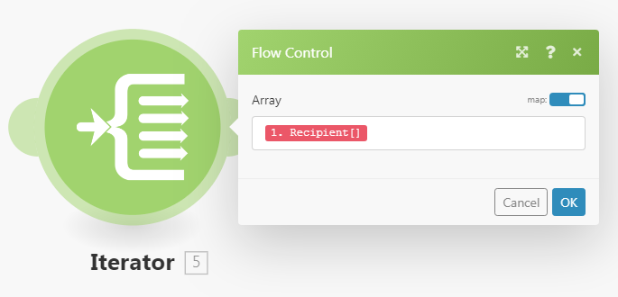

# Array in [!DNL Adobe Workfront Fusion] zuordnen

Ein Array ist ein spezieller Elementtyp, der Folgendes enthalten kann:

* Ein oder mehrere Textwerte (einfaches Array)
* Eine oder mehrere Sammlungen desselben Typs (komplexes Array)

>[!INFO]
>
>**Beispiel:** Das Modul [!UICONTROL E-Mails ansehen] gibt ein Array von Anhängen für jede E-Mail zurück. Jeder Anhang stellt eine Sammlung dar, die einen Namen, einen Inhalt, eine Größe usw. enthalten kann.

Weitere Informationen finden Sie unter [Elementdatentypen in  [!DNL Adobe Workfront Fusion]](../../workfront-fusion/mapping/item-data-types.md).

## Zugriffsanforderungen

Sie müssen über den folgenden Zugriff verfügen, um die Funktionalität in diesem Artikel verwenden zu können:

<table style="table-layout:auto">
 <col> 
 <col> 
 <tbody> 
  <tr> 
    <td role="rowheader">[!DNL Adobe Workfront] plan*</td> 
   <td> 
[!DNL Pro] oder höher
 </td> 
  </tr> 
  <tr data-mc-conditions=""> 
   <td role="rowheader">[!DNL Adobe Workfront] license*</td> 
   <td> 
[!UICONTROL Plan], [!UICONTROL Arbeit]
 </td> 
  </tr> 
  <tr> 
   <td role="rowheader">[!UICONTROL Adobe Workfront Fusion]-Lizenz*</td> 
   <td>
   
Aktuelle Lizenzanforderungen: Keine [!DNL Workfront Fusion] Lizenzanforderungen.

   
Oder

   
Alte Lizenzanforderung: [!UICONTROL [!DNL Workfront Fusion] für die Arbeitsautomatisierung und -integration] 

   </td> 
  </tr> 
  <tr> 
   <td role="rowheader">Produkt</td> 
   <td>
   
Aktuelle Produktanforderung: Wenn Sie über den [!UICONTROL Select]- oder [!UICONTROL Prime] [!DNL Adobe Workfront]-Plan verfügen, muss Ihr Unternehmen [!DNL Adobe Workfront Fusion] sowie [!DNL Adobe Workfront] erwerben, um die in diesem Artikel beschriebenen Funktionen nutzen zu können. [!DNL Workfront Fusion] ist im [!UICONTROL Ultimate] [!DNL Workfront]-Plan enthalten.

   
Oder

   
Alte Produktanforderung: Ihr Unternehmen muss [!DNL Adobe Workfront Fusion] sowie [!DNL Adobe Workfront] erwerben, um die in diesem Artikel beschriebenen Funktionen nutzen zu können.

   </td> 
  </tr> 
 </tbody> 
</table>

Wenden Sie sich an Ihren [!DNL Workfront] -Administrator, um zu erfahren, welchen Plan, welchen Lizenztyp oder welchen Zugriff Sie haben.

Informationen zu [!DNL Adobe Workfront Fusion] -Lizenzen finden Sie unter [[!DNL Adobe Workfront Fusion] Lizenzen](../../workfront-fusion/get-started/license-automation-vs-integration.md).

## Gesamtes Array zuordnen

1. Klicken Sie in den Modulen, denen Sie das Array zuordnen, auf das Feld, dem Sie das Array zuordnen möchten. Dies ist das Feld, dem das Array zugeordnet ist.

1. Ordnen Sie das Element im angezeigten Feld zu.

   Über den Bereich können Sie Felder auf die gleiche Weise zuordnen wie mit jedem anderen Elementtyp. Wenn Sie nicht jedes Element einzeln ausfüllen möchten, sondern ein weiteres Array dem Zielfeld zuordnen möchten, verwenden Sie die Schaltfläche [!UICONTROL Map] . Stellen Sie in diesem Fall sicher, dass beide Arrays (das Quell-Array und das Ziel-Array) dieselbe Struktur aufweisen.

   Sie können einem Array eine beliebige Anzahl von Elementen hinzufügen.

Sie können ein Array mithilfe eines Iterators in einzelne Bundles unterteilen. Weitere Informationen finden Sie unter [[!UICONTROL Iterator] -Modul in [!DNL Adobe Workfront Fusion]](/help/quicksilver/workfront-fusion/modules/iterator-module.md).

## Elemente in einem neuen Array zuordnen

Einige Felder in Workfront Fusion ermöglichen die Zuordnung von Elementen zu einem Array. Sie können beispielsweise eine Gruppe von Checklisten-Elementen im Workfront-Pinnwände > Checklisten-Element hinzufügen erstellen. Wenn das Modul ausgeführt wird, werden alle Elemente der Checkliste der Karte hinzugefügt.

Jedes Modulfeld, das &quot;Element hinzufügen&quot;anzeigt, erstellt ein Array.

So fügen Sie Elemente zum Array hinzu:

1. Klicken Sie auf **Element hinzufügen**
1. Geben Sie im sich öffnenden Bereich Details zum Element ein.
1. Klicken Sie auf **Hinzufügen**.
1. (Optional) Wiederholen Sie die Schritte 1 bis 3 für jedes Element, das Sie zum Array hinzufügen möchten.

## Array-Elemente zuordnen

### Ordnen Sie Array-Elemente nach Zahl zu

Array-Elemente werden als Zahl in eckigen Klammern hinter dem Array-Namen angezeigt. Mithilfe dieser Indexnummer können Sie ein einzelnes Element eines Arrays einem Feld zuordnen.

>[!NOTE]
>
>Die Array-Indizierung in Workfront Fusion beginnt bei 1.

Zuordnen eines Array-Elements:

1. Klicken Sie auf das Feld, in dem Sie das Element zuordnen möchten.

   Das Zuordnungsfenster wird geöffnet.

1. Suchen Sie das Array, das das Element enthält, das Sie zuordnen möchten.
1. Klicken Sie auf den Dropdown-Pfeil neben dem Array.
1. Klicken Sie auf das Element, das Sie zuordnen möchten.

   Das Element wird mit dem Index 1 zugeordnet. Dadurch wird das erste Element im Array zugeordnet.

1. Um ein anderes Element des Arrays zuzuordnen, klicken Sie auf &quot;[1]&quot;und geben Sie die Indexnummer des Array-Elements ein, das Sie zuordnen möchten.

   

### Element eines Arrays mit einem bestimmten Schlüssel zuordnen

Einige Arrays enthalten Sammlungen mit Schlüsselwertelementen wie Metadaten, Attributen usw. Um einen dieser Werte zu verwenden, können Sie ein Element anhand des angegebenen Schlüsselwerts nachschlagen und den entsprechenden Wert aus dem Wert-Element abrufen. Es wird empfohlen, eine Formel zu verwenden, die eine Kombination der Funktionen `map()` und `get()` enthält.

>[!BEGINSHADEBOX]

Das folgende Beispiel zeigt die Ausgabe der [!DNL Jira]-App.

In diesem Beispiel wird ein Dateiname aus einem Array von Anlagen für den spezifischen Anhang mit der ID 10108 abgerufen.

Dieses Beispiel generiert die folgende Ausgabe:

Die Formel lässt sich wie folgt erklären:

* `map`

   1. Der erste Parameter der Funktion `map()` ist das gesamte Array-Element.
   1. Der zweite Parameter ist der Rohname des Wertelements. Um den Rohnamen abzurufen, bewegen Sie den Mauszeiger über das Element im Bedienfeld [!UICONTROL mapping] :

      

      >[!NOTE]
      >
      >Bei allen Parametern wird zwischen Groß- und Kleinschreibung unterschieden. Auch wenn sich in diesem Beispiel die Beschriftung des Elements nur in Großbuchstaben von seinem Rohnamen unterscheidet, ist es notwendig, den Rohnamen zu verwenden.

   1. Der dritte Parameter ist der Rohname des Schlüsselelements:

      

   1. Der vierte Parameter ist der angegebene Schlüsselwert.

  Da die Funktion `map()` ein Array zurückgibt (da es mehr Elemente mit dem angegebenen Schlüsselwert geben kann), muss die Funktion `get()` angewendet werden, um das erste Element zu erhalten:

* `get`

   1. Der erste Parameter der Funktion `get()` ist das Ergebnis der Funktion `map()`.

   1. Der zweite Parameter ist der Index des Elements. In diesem Beispiel ist der Index `1`.

Dieses Beispiel generiert die folgende Ausgabe:

>[!ENDSHADEBOX]

Weitere Informationen zur Funktion `map()` finden Sie unter [Array-Funktionen](/help/quicksilver/workfront-fusion/functions/array-functions.md).

Weitere Informationen zur Funktion `get()` finden Sie unter [Allgemeine Funktionen](/help/quicksilver/workfront-fusion/functions/general-functions.md).

## Konvertieren von Array-Elementen in eine Reihe von Bundles

Arrays können mithilfe des Moduls [!UICONTROL Iterator] in eine Reihe von Bundles konvertiert werden. Weitere Informationen finden Sie unter [[!UICONTROL Iterator] module](/help/quicksilver/workfront-fusion/modules/iterator-module.md).

