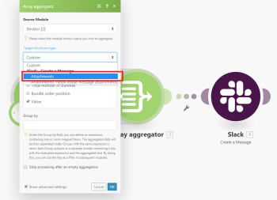

# [!UICONTROL Aggregator] Modul in [!DNL Adobe Workfront Fusion]

>[!IMPORTANT]
>
>Die Dokumentation zu Adobe Workfront Fusion wurde an einen neuen Speicherort verschoben.
>
>Die Informationen in diesem Artikel finden Sie jetzt im Artikel:
>
>* [Aggregator-Modul](https://experienceleague.adobe.com/docs/workfront-fusion/using/references/modules/aggregator-module.html)
>
>Bitte aktualisieren Sie alle Lesezeichen.
>
>Dieser Artikel wird nicht mehr aktualisiert und in naher Zukunft entfernt.

Ein Aggregator-Modul ist ein Modultyp, der dazu dient, mehrere Datenpakete zu einem einzigen Paket zusammenzuführen.

Weitere Informationen zu Modultypen finden Sie unter [Typen von Modulen](../../workfront-fusion/modules/module-types.md).

## Zugriffsanforderungen

+++ Erweitern Sie , um die Zugriffsanforderungen für die -Funktion in diesem Artikel anzuzeigen.

Sie müssen über folgenden Zugriff verfügen, um die Funktion in diesem Artikel verwenden zu können:

<table style="table-layout:auto">
 <col> 
 <col> 
 <tbody> 
  <tr> 
    <td role="rowheader">[!DNL Adobe Workfront] Plan*</td> 
   <td> 
[!DNL Pro] oder höher
 </td> 
  </tr> 
  <tr data-mc-conditions=""> 
   <td role="rowheader">[!DNL Adobe Workfront] Lizenz*</td> 
   <td> 
[!UICONTROL-Plan], [!UICONTROL-Arbeit]
 </td> 
  </tr> 
  <tr> 
   <td role="rowheader">[!UICONTROL Adobe Workfront Fusion] Lizenz**</td> 
   <td>
   
Aktuelle Lizenzanforderung: Keine [!DNL Workfront Fusion].

   
Oder

   
Legacy-Lizenzanforderung: [!UICONTROL [!DNL Workfront Fusion] for Work Automation and Integration] 

   </td> 
  </tr> 
  <tr> 
   <td role="rowheader">Produkt</td> 
   <td>
   
Aktuelle Produktanforderung: Wenn Sie über den [!DNL Adobe Workfront] [!UICONTROL Select] oder [!UICONTROL Prime] verfügen, muss Ihr Unternehmen [!DNL Adobe Workfront Fusion] erwerben und [!DNL Adobe Workfront], die in diesem Artikel beschriebenen Funktionen zu nutzen. [!DNL Workfront Fusion] ist im [!DNL Workfront] [!UICONTROL Ultimate] enthalten.

   
Oder

   
Legacy-Produktanforderung: Ihr Unternehmen muss [!DNL Adobe Workfront Fusion] erwerben und [!DNL Adobe Workfront], die in diesem Artikel beschriebenen Funktionen zu verwenden.

   </td> 
  </tr> 
 </tbody> 
</table>

Wenden Sie sich an Ihren [!DNL Workfront], um herauszufinden, über welchen Plan, welchen Lizenztyp oder welchen Zugriff Sie verfügen.

Informationen zu [!DNL Adobe Workfront Fusion] finden Sie unter [[!DNL Adobe Workfront Fusion] Lizenzen](../../workfront-fusion/get-started/license-automation-vs-integration.md).

+++

## [!UICONTROL Aggregator] Modulübersicht

Wenn ein [!UICONTROL Aggregator]-Modul ausgeführt wird, geschieht Folgendes:

* Sammelt alle Bundles, die es während des Vorgangs eines einzelnen Quellmoduls erhält.
* Gibt ein einzelnes Bundle mit einem Array aus, das ein Element pro akkumuliertem Bundle enthält. Der Inhalt der Array-Elemente hängt von dem jeweiligen [!UICONTROL Aggregator]-Modul und seiner Einrichtung ab.

Die folgende Abbildung zeigt eine typische Einrichtung des Moduls [!UICONTROL Aggregator] :

<table style="table-layout:auto">
 <col> 
 <col> 
 <tbody> 
  <tr> 
   <td> 
[!UICONTROL Source-Modul]
 </td> 
   <td> 
Das Modul, in dem die Bundle-Aggregation beginnt. Das Quellmodul ist in der Regel ein Iterator oder ein Suchmodul, das eine Reihe von Bundles ausgibt.

Wenn Sie das Quellmodul des Aggregators einrichten (und das Aggregator-Setup schließen), wird die Route zwischen dem Quellmodul und dem Aggregator-Modul in einen grauen Bereich eingeschlossen, sodass Sie den Beginn und das Ende der Aggregation deutlich sehen können. 
   
 
Weitere Informationen zu Iteratoren finden Sie unter <a href="../../workfront-fusion/modules/iterator-module.md" class="MCXref xref">[!UICONTROL Iterator]-Modul in [!DNL Adobe Workfront Fusion]</a>
 
Weitere Informationen zu Suchmodulen finden Sie unter Suchmodule in <a href="../../workfront-fusion/modules/module-types.md" class="MCXref xref">Modultypen</a>.
 </td> 
  </tr> 
  <tr> 
   <td> 
[!UICONTROL Zielstrukturtyp]
 </td> 
   <td> 
(Gilt nur für das Modul [!UICONTROL Array Aggregator].) Die Zielstruktur, in der die Daten aggregiert werden. Mit der Standardoption [!UICONTROL Custom] können Sie Elemente auswählen, die im Ausgabebundle des [!UICONTROL Array Aggregators] zusammengefasst werden sollen<code>Array </code>Element:
 
  
 
Sobald Sie nach dem Modul [!UICONTROL Array Aggregator] weitere Module verbinden und zum Setup des Moduls zurückkehren, enthält das Dropdown-Menü [!UICONTROL Target]-Strukturtyp alle folgenden Module und deren Felder, die vom Typ „Array von Sammlungen“ sind, wie im Feld [!UICONTROL Attachments] des Moduls [!DNL Slack] &gt;[!UICONTROL Nachricht erstellen] gezeigt:
 
  
 </td> 
  </tr> 
  <tr> 
   <td>[!UICONTROL Aggregierte Felder]</td> 
   <td>Die Felder, die Sie in die Ausgabe des Aggregator-Moduls einbeziehen möchten.</td> 
  </tr> 
  <tr> 
   <td> 
[!UICONTROL Gruppieren nach]
 </td> 
   <td> 
Die Ausgabe des Aggregators kann mithilfe des Felds [!UICONTROL Group by] in mehrere Gruppen aufgeteilt werden. Das Feld [!UICONTROL Group by] kann eine Formel enthalten, die für das Eingabebundle jedes Aggregators ausgewertet wird. Der Aggregator gibt dann ein Bundle pro dem Wert jeder einzelnen Formel aus. Jedes Bundle enthält zwei Elemente:
 
    <ul> 
     <li><code>Key </code>enthält den eindeutigen Wert.</li> 
     <li><code>Array </code>enthält die aggregierten Daten aus den Bundles, für die die Formel als (Wert<code>Key </code> ausgewertet wurde.</li> 
    </ul> </td> 
  </tr> 
  <tr> 
   <td> 
Verarbeitung nach einer leeren Aggregation anhalten
 </td> 
   <td> 
Standardmäßig gibt das [!UICONTROL Aggregator]-Modul das Ergebnis der Aggregation selbst dann aus, wenn keine Pakete das [!UICONTROL Aggregator]-Modul erreicht haben (z. B. weil sie alle auf ihrem Weg herausgefiltert wurden). Wenn die Option [!UICONTROL Verarbeitung stoppen nach einer leeren Aggregation] aktiviert ist, erzeugt das [!UICONTROL Aggregator]-Modul in diesem Fall kein Ausgabebundle und der Fluss wird angehalten.
 </td> 
  </tr> 
 </tbody> 
</table>

>[!NOTE]
>
>Pakete, die von Modulen zwischen dem Quellmodul und dem [!UICONTROL Aggregator]-Modul generiert werden, werden nicht vom [!UICONTROL Aggregator]-Modul ausgegeben, sodass sie für die Module im Fluss nach dem [!UICONTROL Aggregator] nicht zugänglich sind. Wenn Sie Daten aus einem Bundle benötigen, das von einem Modul zwischen dem Quellmodul und dem [!UICONTROL Aggregator]-Modul ausgegeben wird, stellen Sie sicher, dass Sie das angegebene Element in die Einrichtung des [!UICONTROL Aggregator]-Moduls einbeziehen (wie im Feld [!UICONTROL Aggregierte Felder] bei der Einrichtung des [!UICONTROL Array-Aggregator]-Moduls).

## Beispielszenario der Funktionsweise von Aggregatoren

Dieses Beispielszenario zeigt, wie Sie alle E-Mail-Anhänge komprimieren und die ZIP-Datei in [!DNL Dropbox] hochladen.

Das folgende Szenario zeigt, wie man:

* Das erste Modul überwacht ein Postfach auf eingehende E-Mails: [!UICONTROL E-] > [!UICONTROL E-Mails ]) Der Trigger gibt ein Bundle mit Element `Attachments[]` aus, bei dem es sich um ein Array handelt, das alle Anhänge der E-Mail enthält.

* Das zweite Modell durchläuft die Anhänge der E-Mail: [!UICONTROL E-] > [!UICONTROL Anhänge ]) Der Iterator nimmt die Elemente aus dem `Attachments[]`-Array einzeln und sendet sie als separate Bundles weiter.

* Das dritte Modul aggregiert die Bundles, die vom Modul [!UICONTROL E-Mail] > [!UICONTROL Anhänge iterieren] ausgegeben werden: [!UICONTROL Archivieren] > [!UICONTROL Archiv-Aggregator erstellen] sammelt alle Bundles, die es empfängt, und gibt ein einziges Bundle aus, das die ZIP-Datei enthält.

* Das letzte Modul lädt die resultierende ZIP-Datei in [!DNL Dropbox] hoch: [!DNL Dropbox] > [!UICONTROL Datei hochladen] bezieht die ZIP-Datei aus dem Modul [!UICONTROL Archiv] > [!UICONTROL Archiv erstellen] und lädt sie in [!DNL Dropbox] hoch.

Im Folgenden finden Sie ein Beispiel für die Einrichtung des Aggregators [!UICONTROL Archiv] > [!UICONTROL Archiv erstellen]:

