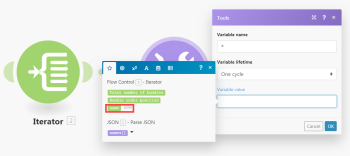

# [!UICONTROL Iterator]-Modul in [!DNL Adobe Workfront Fusion]

>[!IMPORTANT]
>
>Die Dokumentation zu Adobe Workfront Fusion wurde an einen neuen Speicherort verschoben.
>
>Die Informationen in diesem Artikel finden Sie jetzt im Artikel:
>
>* [Iterator-Modul](https://experienceleague.adobe.com/docs/workfront-fusion/using/references/modules/iterator-module.html)
>
>Bitte aktualisieren Sie alle Lesezeichen.
>
>Dieser Artikel wird nicht mehr aktualisiert und in naher Zukunft entfernt.

Ein [!UICONTROL Iterator]-Modul ist ein spezieller Modultyp, der ein Array in eine Reihe von Bundles konvertiert. Jedes Array-Element wird als separates Bundle ausgegeben.

Weitere Informationen finden Sie unter [Modultypen](../../workfront-fusion/modules/module-types.md) und [Zuordnen eines Arrays in Adobe Workfront Fusion](../../workfront-fusion/mapping/map-an-array.md).

## Zugriffsanforderungen

Sie müssen über folgenden Zugriff verfügen, um die Funktion in diesem Artikel verwenden zu können:

<table style="table-layout:auto">
 <col> 
 <col> 
 <tbody> 
  <tr> 
    <td role="rowheader">[!DNL Adobe Workfront] Plan*</td> 
   <td> 
[!DNL Pro] oder höher
 </td> 
  </tr> 
  <tr data-mc-conditions=""> 
   <td role="rowheader">[!DNL Adobe Workfront] Lizenz*</td> 
   <td> 
[!UICONTROL-Plan], [!UICONTROL-Arbeit]
 </td> 
  </tr> 
  <tr> 
   <td role="rowheader">[!UICONTROL Adobe Workfront Fusion] Lizenz**</td> 
   <td>
   
Aktuelle Lizenzanforderung: Keine [!DNL Workfront Fusion].

   
Oder

   
Legacy-Lizenzanforderung: [!UICONTROL [!DNL Workfront Fusion] for Work Automation and Integration] 

   </td> 
  </tr> 
  <tr> 
   <td role="rowheader">Produkt</td> 
   <td>Ihr Unternehmen muss Adobe Workfront Fusion sowie Adobe Workfront erwerben, um die in diesem Artikel beschriebenen Funktionen nutzen zu können.</td> 
  </tr> 
 </tbody> 
</table>

Wenden Sie sich an Ihren Workfront-Administrator, um herauszufinden, über welchen Plan, welchen Lizenztyp oder welchen Zugriff Sie verfügen.

Informationen zu [!DNL Adobe Workfront Fusion] finden Sie unter [[!DNL Adobe Workfront Fusion] Lizenzen](../../workfront-fusion/get-started/license-automation-vs-integration.md).

## [!UICONTROL Iterator]-Modulkonfiguration

Sie richten ein [!UICONTROL Iterator]-Modul ein, genauso wie Sie andere Module einrichten. Das Feld [!UICONTROL Array] enthält das Array, das konvertiert oder in separate Bundles aufgeteilt werden soll.

Weitere Informationen finden Sie [Konfigurieren der Moduleinstellungen in Adobe Workfront Fusion](../../workfront-fusion/modules/configure-a-modules-settings.md).

>[!INFO]
>
>**Beispiele:**
>
>* Das folgende Szenario zeigt, wie Sie E-Mails mit Anhängen abrufen und die Anhänge als einzelne Dateien in einem ausgewählten [!DNL Dropbox] speichern können.
>
>   E-Mails können ein Array von Anhängen enthalten. Das [!UICONTROL Iterator]-Modul, das nach dem ersten Modul eingefügt wird, ermöglicht es Ihnen, jede Anlage separat zu behandeln. Das [!UICONTROL Iterator]-Modul teilt das Array von Anlagen in einzelne Pakete auf. Jedes Bundle mit einer Anlage wird dann einzeln in einem ausgewählten [!DNL Dropbox]-Ordner gespeichert. Die [!UICONTROL  des ]-Moduls „Iterator“ wird oben gezeigt: Das Feld [!UICONTROL Array] sollte das `Attachments`-Array enthalten.
>
>   
>
>* Zur Vereinfachung bieten viele [!DNL Workfront Fusion]-Apps spezielle [!UICONTROL Iterator]-Module mit vereinfachter Einrichtung. Beispielsweise enthält die [!UICONTROL E-Mail]-App das spezielle [!UICONTROL Iterator]-Modul [!UICONTROL E-Mail] > [!UICONTROL Anlagen iterieren] das dieselben Ergebnisse erzeugt wie das allgemeine [!UICONTROL Iterator]-Modul.
>
>   

## Fehlerbehebung: Im Zuordnungsbereich werden keine zuordnungsfähigen Elemente unter dem Modul [!UICONTROL Iterator] angezeigt

Wenn ein [!UICONTROL Iterator]-Modul keine Informationen über die Struktur der Elemente des Arrays hat, zeigt das Zuordnungsbedienfeld in den Modulen nach dem [!UICONTROL Iterator]-Modul nur zwei Elemente unter dem [!UICONTROL Iterator]-Modul :`Total number of bundles` und `Bundle order position`:

Dies liegt daran, dass jedes Modul für die Bereitstellung von Informationen über von ihm ausgegebene Elemente verantwortlich ist, damit diese Elemente im Zuordnungsbereich in den nachfolgenden Modulen ordnungsgemäß angezeigt werden können. In einigen Fällen können jedoch mehrere Module diese Informationen möglicherweise nicht bereitstellen. Beispielsweise sind dies [!UICONTROL JSON] > [!UICONTROL Parse JSON] oder [!UICONTROL Webhooks] > [!UICONTROL Custom Webhook]-Module mit fehlender Datenstruktur.

Die Lösung besteht darin, das Szenario manuell auszuführen, damit das Modul mehr über die von ihm ausgegebenen Elemente weiß, sodass es die Informationen für die folgenden Module bereitstellen kann.

Wenn Sie beispielsweise über ein Modul [!UICONTROL JSON] > [!UICONTROL JSON parsen] ohne Datenstruktur wie unten beschrieben verfügen:

Und wenn Sie dann ein [!UICONTROL Iterator]-Modul damit verbinden, können Sie die Ausgabe des Moduls nicht dem Array-Feld im Setup-Bereich des [!UICONTROL Iterator]-Moduls zuordnen:

Um dies zu beheben, starten Sie das Szenario manuell im Szenario-Editor. Sie können die Verknüpfung der Module nach dem Modul [!UICONTROL JSON] > [!UICONTROL JSON parsen] aufheben, um zu verhindern, dass der Fluss weiter fortfährt. Alternativ können Sie mit der rechten Maustaste auf das Modul [!UICONTROL JSON] > [!UICONTROL Parse JSON] klicken und **[!UICONTROL Nur dieses Modul ausführen]** aus dem Kontextmenü auswählen, um nur das Modul [!UICONTROL JSON] > [!UICONTROL Parse JSON] auszuführen.

Wenn das [!UICONTROL JSON] > [!UICONTROL Parse JSON] ausgeführt wird, lernt es die von ihm ausgegebenen Elemente kennen und stellt diese Informationen allen nachfolgenden Modulen bereit, einschließlich des Iterator-Moduls. Das Zuordnungsbedienfeld bei der Einrichtung des Iterators zeigt dann die folgenden Elemente an:

Darüber hinaus zeigt das Zuordnungsbedienfeld in den Modulen, die nach dem Modul [!UICONTROL Iterator] verbunden sind, die in den Elementen des Arrays enthaltenen Elemente an:

Wenn einige Elemente im Zuordnungsbereich eines Moduls nicht angezeigt werden, führen Sie das Szenario einmal aus, damit alle Module mehr über die von ihnen ausgegebenen Elemente erfahren und diese Informationen den folgenden Modulen bereitstellen können.
