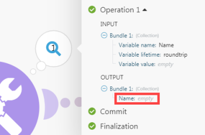

# Modultypen

A[!UICONTROL Adobe Workfront Fusion] unterscheidet fünf Modultypen: Aktionsmodule, Suchmodule, Trigger-Module, Aggregatoren und Iteratoren. Aggregatoren und Iteratoren eignen sich für erweiterte Szenarien.

## Zugriffsanforderungen

Sie müssen über den folgenden Zugriff verfügen, um die in diesem Artikel enthaltene Funktionalität nutzen zu können:

<table style="table-layout:auto">
 <col> 
 <col> 
 <tbody> 
  <tr> 
    <td role="rowheader">[!DNL Adobe Workfront] Plan*</td> 
   <td> 
[!DNL Pro] oder höher
 </td> 
  </tr> 
  <tr data-mc-conditions=""> 
   <td role="rowheader">[!DNL Adobe Workfront] license*</td> 
   <td> 
[!UICONTROL Plan], [!UICONTROL Arbeit]
 </td> 
  </tr> 
  <tr> 
   <td role="rowheader">[!UICONTROL Adobe Workfront Fusion]-Lizenz**</td> 
   <td>
   
Aktuelle Lizenzanforderungen: Nein [!DNL Workfront Fusion] Lizenzanforderungen.

   
Oder

   
Ältere Lizenzanforderungen: [!UICONTROL [!DNL Workfront Fusion] für Arbeitsautomatisierung und Integration] 

   </td> 
  </tr> 
  <tr> 
   <td role="rowheader">Produkt</td> 
   <td>Ihr Unternehmen muss Adobe Workfront Fusion sowie Adobe Workfront erwerben, um die in diesem Artikel beschriebenen Funktionen nutzen zu können.</td> 
  </tr> 
 </tbody> 
</table>

Wenden Sie sich an Ihren Workfront-Administrator, um zu erfahren, welchen Plan, welchen Lizenztyp oder welchen Zugriff Sie haben.

Informationen über [!DNL Adobe Workfront Fusion] Lizenzen, siehe [[!DNL Adobe Workfront Fusion] Lizenzen](../../workfront-fusion/get-started/license-automation-vs-integration.md).

## Aktionsmodule

Aktionsmodule sind der am häufigsten verwendete Modultyp. Ein typisches Aktionsmodul gibt ein einzelnes Bundle zurück, das dann zur Verarbeitung an das nächste Modul übergeben wird.

Im Gegensatz zu Trigger-Modulen können Aktionsmodule am Anfang, in der Mitte oder am Ende eines Szenarios platziert werden. Szenarien können eine unbegrenzte Anzahl von Aktionsmodulen enthalten.

>[!INFO]
>
>**Beispiele:**
>
>* **[!DNL Workfront]> [!UICONTROL Datei hochladen]** sendet eine Datei an [!DNL Workfront] und gibt die Kennung zurück.
>* **[!UICONTROL Bild] > [!UICONTROL Größe ändern]** empfängt ein Bild, ändert seine Größe in bestimmte Dimensionen und übergibt das in der Größe angepasste Bild an die nächste Aktion.

Der Aktionstyp besteht aus vier Untertypen: Erstellen, Lesen, Aktualisieren und Löschen. Der Untertyp Aktualisieren ermöglicht die folgenden drei Vorgänge:

* **Inhalt eines Felds löschen**. Dieser Vorgang erfolgt, wenn der Inhalt des Felds ausgewertet wird, um Suchbegriffe zu löschen (nicht zu verwechseln mit *leer*).

  

* **Inhalt eines Felds unverändert lassen**. Dieser Vorgang erfolgt, wenn das Feld leer gelassen oder der Inhalt des Felds als leer ausgewertet wird (in JSON über null dargestellt).

  

* **Inhalt eines Felds ersetzen**. Dieser Vorgang erfolgt in allen anderen Fällen als den beiden oben beschriebenen.

>[!NOTE]
>
>* Wenn die Variable `erase` im Mapping-Bedienfeld verwenden, ist das Modul kein Aktualisierungsmodul oder wurde nicht auf die neuesten Spezifikationen für die App aktualisiert.
>* &quot;[!UICONTROL Empty]&quot; ändert den Feldinhalt nicht. Wenn das Feld gelöscht werden muss, können Sie die folgende Formel verwenden:
>
>
>
>Es ist derzeit nicht möglich, ein Feld unverändert zu lassen, wenn sein Inhalt als leer ausgewertet wird.

## Suchmodule

Eine typische Suche gibt null, eins oder mehrere Pakete zurück, die dann zur Verarbeitung an das nächste Modul weitergegeben werden.

Sie können Suchvorgänge am Anfang, in der Mitte oder am Ende eines Szenarios platzieren.

Szenarien können eine unbegrenzte Anzahl von Suchen enthalten.

>[!INFO]
>
>**Beispiel:**
>
>**[!DNL Workfront]> [!UICONTROL Verwandte Aufzeichnungen lesen]**  liest Datensätze, die mit der von Ihnen angegebenen Suchabfrage übereinstimmen, in einem bestimmten übergeordneten Objekt

## Trigger-Module

Trigger generieren Bundles, wenn sich ein bestimmter Dienst geändert hat. Die Änderung kann in der Erstellung neuer Datensätze, dem Löschen von Datensätzen, dem Aktualisieren von Datensätzen usw. bestehen.

Jeder Trigger kann null, eins oder mehrere Pakete zurückgeben, die dann zur Verarbeitung an das nächste Modul übergeben werden.

Trigger können nur am Anfang eines Szenarios platziert werden.

Jedes Szenario kann nur einen Trigger enthalten.

[!DNL Workfront Fusion] unterscheidet zwischen zwei Typen von Triggern: Abruf von Triggern und sofortigen Triggern.

### Abruf von Triggern

Abruf-Trigger fragen einen bestimmten Dienst regelmäßig ab, selbst wenn sich seit der vorherigen Ausführung keine Änderungen ergeben haben. Es wird empfohlen, ein Szenario mit einem Abruf-Trigger so zu planen, dass es in regelmäßigen Abständen ausgeführt wird. Wenn eine *change*, gibt der Trigger Bundles mit Informationen zur Änderung zurück. Wenn keine *change*, gibt der Trigger keine Bundles aus. Anweisungen zum Planen eines Szenarios finden Sie unter [Planen eines Szenarios in [!DNL Adobe Workfront Fusion]](../../workfront-fusion/scenarios/schedule-a-scenario.md).

Abruf-Trigger ermöglichen es Ihnen, das erste Bundle auszuwählen, das über das Epochenbedienfeld ausgegeben werden soll. Das Bedienfeld wird automatisch angezeigt, nachdem Sie einen Trigger gespeichert oder die Trigger-Einstellungen geändert haben. Weitere Informationen finden Sie unter [Festlegen, wo ein Trigger-Modul beginnt [!UICONTROL Adobe Workfront Fusion]](../../workfront-fusion/modules/choose-where-trigger-module-starts.md).

>[!NOTE]
>
>Die im Epochenbedienfeld vorgenommenen Einstellungen wirken sich nur auf die erste Ausführung des Moduls aus. Nach Ausführung des Moduls wird das letzte ausgegebene Bundle gespeichert und die über das Epochenbedienfeld vorgenommenen Einstellungen werden aufgehoben.

>[!INFO]
>
>**Beispiele:**
>
>* **[!DNL Workfront]> [!UICONTROL Aufnahmen ansehen]** gibt Dateien zurück, die seit der letzten Ausführung des Szenarios neu hinzugefügt wurden
>
>* **[!DNL Google Sheets]> [!UICONTROL Zeilen ansehen]** gibt neue Zeilen zurück, die vom Benutzer seit der letzten Ausführung des Szenarios hinzugefügt wurden.

### Sofortige Trigger

Sofortige Trigger ermöglichen dem Dienst die Benachrichtigung [!DNL Workfront Fusion] über *change* sofort. Es wird empfohlen, ein Szenario mit einem sofortigen Trigger zu planen. Anweisungen finden Sie unter [Planen eines Szenarios in Adobe Workfront Fusion](../../workfront-fusion/scenarios/schedule-a-scenario.md). Siehe auch [Sofortige Trigger (Webhooks) in [!DNL Adobe Workfront Fusion]](../../workfront-fusion/webhooks/instant-triggers-webhooks.md) für Details zur Verarbeitung der eingehenden Daten.

>[!INFO]
>
>**Beispiele:**
>
>* **[!DNL Workfront]> [!UICONTROL Ereignisse beobachten]** gibt Informationen zurück, wenn ein bestimmter Ereignistyp in Workfront auftritt, z. B. die Erstellung einer Aufgabe.
>* **[!DNL Google Sheets]> [!UICONTROL Änderungen überwachen]** gibt bei jeder Aktualisierung einer Zelle Informationen zurück.

## Aggregatoren

Ein Aggregator ist ein Modultyp, der mehrere Bundles in einem Bundle ansammelt.

Jeder Aggregator gibt nur ein Bundle zurück, das dann zur weiteren Verarbeitung an das nächste Modul übergeben wird.

Aggregatoren können nur in der Mitte eines Szenarios platziert werden.

Szenarien können eine unbegrenzte Anzahl von Aggregatoren enthalten.

>[!INFO]
>
>**Beispiele:**
>
>* **[!UICONTROL Archivieren] > [!UICONTROL Erstellen eines Archivs]** Komprimiert empfangene Dateien in ein ZIP-Archiv
>* **[!UICONTROL CSV] > [!UICONTROL Aggregieren in CSV]** Führt mehrere Zeichenfolgen aus einer CSV-Datei in einer einzigen Zeile zusammen
>* **[!UICONTROL Instrumente] > [!UICONTROL Textaggregator]** kombiniert mehrere Zeichenfolgen zu einer einzigen Zeichenfolge

Weitere Informationen finden Sie unter [Aggregatormodul in [!DNL Adobe Workfront Fusion]](../../workfront-fusion/modules/aggregator-module.md).

## Iteratoren

Ein Iterator ist ein Modultyp, der Arrays in mehrere separate Bundles aufteilt.

Jeder Iterator gibt ein oder mehrere Bundles zurück, die dann zur Verarbeitung an das nächste Modul übergeben werden.

Sie können Iteratoren nur in der Mitte eines Szenarios platzieren.

Szenarien können eine unbegrenzte Anzahl von Iteratoren enthalten.

>[!INFO]
>
>**Beispiel:**
>
>**[!UICONTROL Email] > [!UICONTROL Anlagen abrufen]** unterteilt ein Array von Anlagen in separate Bundles

Weitere Informationen finden Sie unter [Iterator-Modul in [!DNL Adobe Workfront Fusion]](../../workfront-fusion/modules/iterator-module.md) und [Zuordnen eines Arrays in [!DNL Adobe Workfront Fusion]](../../workfront-fusion/mapping/map-an-array.md).
