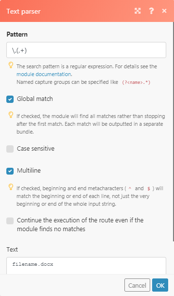

# Fehlerbehebung bei Text-Parsern in [!DNL Adobe Workfront Fusion]

Verwenden Sie diese Informationen, wenn Sie keinen Text-Parser erhalten können, um eine Ausgabe zu erzeugen.

## Zugriffsanforderungen

Sie müssen über den folgenden Zugriff verfügen, um die Funktionalität in diesem Artikel verwenden zu können:

<table style="table-layout:auto">
 <col> 
 <col> 
 <tbody> 
  <tr> 
    <td role="rowheader">[!DNL Adobe Workfront] plan*</td> 
   <td> 
[!DNL Pro] oder höher
 </td> 
  </tr> 
  <tr data-mc-conditions=""> 
   <td role="rowheader">[!DNL Adobe Workfront] license*</td> 
   <td> 
[!UICONTROL Plan], [!UICONTROL Arbeit]
 </td> 
  </tr> 
  <tr> 
   <td role="rowheader">[!UICONTROL Adobe Workfront Fusion]-Lizenz*</td> 
   <td>
   
Aktuelle Lizenzanforderungen: Keine [!DNL Workfront Fusion] Lizenzanforderungen.

   
Oder

   
Alte Lizenzanforderung: [!UICONTROL [!DNL Workfront Fusion] für die Arbeitsautomatisierung und -integration] 

   </td> 
  </tr> 
  <tr> 
   <td role="rowheader">Produkt</td> 
   <td>
   
Aktuelle Produktanforderung: Wenn Sie über den [!UICONTROL Select]- oder [!UICONTROL Prime] [!DNL Adobe Workfront]-Plan verfügen, muss Ihr Unternehmen [!DNL Adobe Workfront Fusion] sowie [!DNL Adobe Workfront] erwerben, um die in diesem Artikel beschriebenen Funktionen nutzen zu können. [!DNL Workfront Fusion] ist im [!UICONTROL Ultimate] [!DNL Workfront]-Plan enthalten.

   
Oder

   
Alte Produktanforderung: Ihr Unternehmen muss [!DNL Adobe Workfront Fusion] sowie [!DNL Adobe Workfront] erwerben, um die in diesem Artikel beschriebenen Funktionen nutzen zu können.

   </td> 
  </tr> 
 </tbody> 
</table>

Wenden Sie sich an Ihren [!DNL Workfront] -Administrator, um zu erfahren, welchen Plan, welchen Lizenztyp oder welchen Zugriff Sie haben.

Informationen zu [!DNL Adobe Workfront Fusion] -Lizenzen finden Sie unter [[!DNL Adobe Workfront Fusion] Lizenzen](../../workfront-fusion/get-started/license-automation-vs-integration.md).

## Fehlerbehebung

Im Beispielszenario möchten Sie den Dateityp eines Dateidokuments &quot;filename.docx&quot;analysieren und die Erweiterung des Dateinamens variiert immer von DOCX über PDF bis CSV.

Der Ausdruck, den Sie in diesem Fall verwenden können, ist [!DNL \..+]

Wenn Sie dies auf einem Regex-Ausdruck auf regex101.com verwenden würden, erhalten Sie eine vollständige Übereinstimmung.

Auf dem Bild oben wurde die Dateierweiterung korrekt zugeordnet. Wenn Sie dies vornehmen und versuchen, es in Ihrem Text-Parser zu implementieren:

Sie erhalten keine Übereinstimmung:

Der Grund dafür ist, dass das &quot;i&quot;nur die Anzahl der Übereinstimmungen pro Übereinstimmung anzeigt. In diesem Fall haben wir also 2 Übereinstimmungen, daher gibt es nach dem &quot;i&quot;einen numerischen Wert 1 und 2. Der Anwendungsfall dafür besteht darin, dass Sie, wenn Sie Daten je nur über den zweiten übereinstimmenden Wert über einen Filter abgleichen oder weitergeben müssen, den Wert angeben können, der durch den numerischen Wert dargestellt wird.

Um die Übereinstimmungswerte abzurufen, die Sie benötigen, um dem Teil, den Sie analysieren möchten (z. B. um aus &quot;filename.docx&quot;- nur &quot;docx&quot; zu extrahieren), sollten die Klammern gemäß dem für dieses Szenario verwendeten Regex-Ausdruck auf \ angewendet werden.(.+)

Dadurch wird das DOCX erfasst, in eine Gruppe eingefügt und der &quot;&quot;.&quot; aus.

In der Ausgabe, die im folgenden Bild gezeigt wird, stimmt die Erfassungsgruppe mit jedem Zeichen überein (mit Ausnahme der Zeilenenden).

Eine weitere Problemumgehung, die auch regex enthält, ist die Verwendung der Funktion replace

`{{replace("abcdefghijklmno pqr stuvw xyz.docx"; "/.\./"; ".")}}`

Ersetzen Sie dann `abcdefghijklmno pqr stuvw xyz.docx` durch Ihre tatsächliche Dateinamenvariable.
