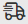

# Debugging-Szenarien mit dem [!DNL Adobe Workfront Fusion] Entwicklungstool

Die [!DNL Adobe Workfront Fusion] Mit Devtool können Sie Szenarien verstehen und Fehler beheben. Das Entwickler-Tool fügt ein zusätzliches Bedienfeld zum [!DNL Chrome Developer Tools]. Mithilfe dieses Debugger-Bedienfelds können Sie alle manuellen Ausführungen Ihres Szenarios überprüfen, alle ausgeführten Vorgänge überprüfen und die Details jedes ausgeführten API-Aufrufs anzeigen. Sie können sehen, welches Modul, welcher Vorgang oder welche einzelne Antwort den Fehler verursacht hat, und dieses Wissen verwenden, um Ihr Szenario zu verfeinern.

Eine ausführliche Videoeinführung des Fusion Devtool finden Sie unter [Schrittweise Anleitung für Entwickler](https://experienceleague.adobe.com/docs/workfront-learn/tutorials-workfront/fusion/troubleshooting-and-error-handling/dev-tool-walkthrough.html?lang=en).

## Zugriffsanforderungen

Sie müssen über den folgenden Zugriff verfügen, um die Funktionalität in diesem Artikel verwenden zu können:

<table style="table-layout:auto"> 
 <col> 
 <col> 
 <tbody> 
  <tr> 
    <td role="rowheader">[!DNL Adobe Workfront] plan*</td> 
   <td> 
[!DNL Pro] oder höher
 </td> 
  </tr> 
  <tr data-mc-conditions=""> 
   <td role="rowheader">[!DNL Adobe Workfront] license*</td> 
   <td> 
[!UICONTROL Plan], [!UICONTROL Arbeit]
 </td> 
  </tr> 
  <tr> 
   <td role="rowheader">[!UICONTROL Adobe Workfront Fusion]-Lizenz*</td> 
  <td>
   
Aktuelle Lizenzanforderungen: nein [!DNL Workfront Fusion] Lizenzanforderungen.

   
Oder

   
Alte Lizenzanforderung: [!UICONTROL [!DNL Workfront Fusion] für Arbeitsautomatisierung und Integration], [!UICONTROL [!DNL Workfront Fusion] für die Arbeitsautomatisierung]

   </td>    </tr> 
  </tr> 
  <tr> 
   <td role="rowheader">Produkt</td> 
   <td>
   
Aktuelle Produktanforderung: Wenn Sie über [!UICONTROL Select] oder [!UICONTROL Prime] verfügen [!DNL Adobe Workfront] Planung, Ihr Unternehmen muss [!DNL Adobe Workfront Fusion] sowie [!DNL Adobe Workfront] , um die in diesem Artikel beschriebenen Funktionen zu verwenden. [!DNL Workfront Fusion] ist in [!UICONTROL Ultimate] enthalten. [!DNL Workfront] Plan.

   
Oder

   
Alte Produktanforderung: Ihr Unternehmen muss [!DNL Adobe Workfront Fusion] sowie [!DNL Adobe Workfront] , um die in diesem Artikel beschriebenen Funktionen zu verwenden.

   </td> 
  </tr> 
 </tbody> 
</table>

Wenden Sie sich an Ihren [!DNL Workfront] Administrator.

Informationen über [!DNL Adobe Workfront Fusion] Lizenzen, siehe [[!DNL Adobe Workfront Fusion] Lizenzen](../../workfront-fusion/get-started/license-automation-vs-integration.md).

## Zugriff auf das Workfront Fusion-Entwicklungstool

Der Zugriff auf das Entwickler-Tool hängt davon ab, ob Sie Fusion im [!DNL Adobe Unified Experience].

* [Greifen Sie auf das Entwickler-Tool im [!DNL Adobe Unified Experience]](#access-the-devtool-in-the-adobe-unified-experience)
* [Zugriff auf das Entwickler-Tool in der klassischen [!DNL Fusion] Erlebnis](#access-the-devtool-in-the-classic-fusion-experience)

### Greifen Sie auf das Entwickler-Tool im [!DNL Adobe Unified Experience]

Wenn Sie Fusion in der Adobe Unified Shell verwenden, können Sie über den Szenario-Editor auf das Dev-Tool zugreifen.

1. Wechseln Sie zum Szenario-Editor für das Szenario, das Sie debuggen möchten.

   Informationen zum Suchen des Szenario-Editors finden Sie unter [Szenario-Editor](/help/quicksilver/workfront-fusion/scenarios/scenario-editor.md).

1. Klicken Sie mit der rechten Maustaste in einen leeren Bereich der Seite (nicht auf ein Modul).
1. Auswählen **Entwickler-Tool öffnen**.

### Zugriff auf das Entwickler-Tool in der klassischen [!DNL Fusion] Erlebnis

So verwenden Sie das Entwickler-Tool im klassischen [!DNL Fusion] Erlebnis, müssen Sie eine [!DNL Chrome] -Erweiterung. Sie können diese Erweiterung dann über die [!DNL Chrome] Entwicklertools.

* [Installieren Sie die [!DNL Chrome] Entwicklererweiterung](#install-the-chrome-devtool-extension)
* [Suchen Sie die [!DNL Workfront Fusion] Entwicklungstool](#locate-the-workfront-fusion-devtool)

#### Installieren Sie die [!DNL Chrome] Entwicklererweiterung

Sie können die [!DNL Workfront Fusion] Entwickeln in [!DNL Chrome] durch die [!UICONTROL [!DNL Chrome] Webstore].

1. Klicks [dieser Link](https://chromewebstore.google.com/u/1/detail/workfront-fusion-devtool/hkimbmkkmmejdnhbhoaefggkpkndfjnn) , um zu [!DNL Workfront Fusion] Entwickler im [!UICONTROL [!DNL Chrome] Webstore].
1. Klicks **[!UICONTROL Hinzufügen zu[!DNL Chrome]]**.
1. Überprüfen Sie im sich öffnenden Fenster die Berechtigungen. Wenn Sie den Berechtigungen zustimmen, klicken Sie auf **[!UICONTROL Erweiterung hinzufügen]**.

Die [!DNL Workfront Fusion] Die Entwicklererweiterung wird zu Ihrem [!DNL Chrome] Erweiterungen.

#### Suchen Sie die [!DNL Workfront Fusion] Entwicklungstool

So verwenden Sie die [!DNL Workfront Fusion] Entwickler: Sie müssen die [!DNL Workfront Fusion] Entwickeln der Tool-Erweiterung für Ihre [!DNL Chrome] Browser, wie beschrieben in [Installieren der Chrome Developer Tool-Erweiterung](#install-the-chrome-Devtool-extension).

1. Öffnen Sie Ihre [!DNL Workfront Fusion] Szenario.
1. Öffnen [!DNL Chrome Developer Tools]:

   <table style="table-layout:auto"> 
    <col> 
    <col> 
    <tbody> 
     <tr> 
      <td role="rowheader">[!DNL Mac]</td> 
      <td>Befehl + Option + I</td> 
     </tr> 
     <tr> 
      <td role="rowheader">[!DNL Windows]</td> 
      <td> 
Strg + Umschalt + I
 
 Oder 
 
F12
 </td> 
     </tr> 
    </tbody> 
   </table>

   >[!TIP]
   >
   >Es wird empfohlen, die [!DNL Chrome Developer Console] nach unten, um eine bessere Ansicht Ihrer Module zu erhalten.

1. Klicken Sie auf **[!DNL Workfront Fusion]** Registerkarte in [!DNL Chrome Dev Tools].

## Verwenden Sie die [!DNL Workfront Fusion] Entwicklungstool

Workfront Fusion Devtool ist in drei Hauptbereiche unterteilt. Sie finden diese im linken Bereich Ihres Entwickler-Tools-Fensters.

* [Live Stream](#live-stream)
* [Szenario-Debugger](#scenario-debugger)
* [Instrumente](#tools)

### Live Stream

Live Stream zeigt an, was im Hintergrund passiert, wenn Sie in Ihrem Szenario auf &quot;Einmal ausführen&quot;klicken.

1. Klicken Sie auf **[!UICONTROL Live Stream]** icon  , um den Abschnitt &quot;Live-Stream&quot;zu öffnen.
1. Führen Sie einen der folgenden Schritte aus:

   <table style="table-layout:auto"> 
    <col> 
    <col> 
    <thead> 
     <tr> 
      <th>Aktion</th> 
      <th>Anleitung</th> 
     </tr> 
    </thead> 
    <tbody> 
     <tr> 
      <td role="rowheader">Anfrageinformationen anzeigen</td> 
      <td> 
Sie können die folgenden Informationen für jedes Modul in Ihrem Szenario anzeigen
 
       <ul> 
        <li> 
Anfragekopfzeilen (API-Endpunkt-URL, HTTP-Methode, Uhrzeit und Datum des Aufrufs der Anfrage, Anfragekopfzeilen und Abfragezeichenfolge)
 </li> 
        <li> 
Anfrageinhalt
 </li> 
        <li> 
Antwortheader
 </li> 
        <li> 
Response Body
 </li> 
       </ul> 
Um diese Informationen anzuzeigen, klicken Sie auf die entsprechende Registerkarte im rechten Bereich des [!DNL Workfront Fusion] Entwickler.
 </td> 
     </tr> 
     <tr> 
      <td role="rowheader"> 
Suchanfragen und Antworten
 </td> 
      <td> 
Geben Sie den Suchbegriff in das Suchfeld im linken Bereich des [!DNL Workfront Fusion] Entwickler-Tool, um nur Anforderungen anzuzeigen, die den Suchbegriff enthalten.
 </td> 
     </tr> 
     <tr> 
      <td role="rowheader"> 
Liste von Anforderungen entfernen 
 </td> 
      <td> 
Klicken Sie auf das Papierkorbsymbol in der oberen rechten Ecke des linken Bedienfelds des Entwickler-Tools, um die Liste der von der [!DNL Workfront Fusion] Entwickler. 
 </td> 
     </tr> 
     <tr> 
      <td role="rowheader"> 
Aktivieren der Konsolenprotokollierung
 </td> 
      <td> 
Klicken Sie auf das Computersymbol  in der oberen rechten Ecke des linken Bedienfelds des Entwickler-Tools.
 
Die Protokollierung in der Konsole ist aktiviert, wenn das Computersymbol grün ist.
 </td> 
     </tr> 
     <tr> 
      <td role="rowheader"> 
Rufen Sie die Anforderung im JSON-Rohformat oder in der cURL ab
 </td> 
      <td> 
       <ul> 
        <li> 
<strong>Rohe JSON</strong> 
 
Klicks <strong>[!UICONTROL RAW kopieren]</strong> in der oberen rechten Ecke des rechten Bereichs des Entwickler-Tools.
 </li> 
        <li> 
<strong>cURL</strong> 
 
Klicks <strong>[!UICONTROL cURL kopieren]</strong> in der oberen rechten Ecke des rechten Bereichs des Entwickler-Tools.
 </li> 
       </ul> </td> 
     </tr> 
    </tbody> 
   </table>

### Szenario-Debugger

Der Szenario-Debugger ist für komplexere Szenarien nützlich. Er zeigt den Verlauf der ausgeführten Szenarien an und ermöglicht es Ihnen, Module nach ihrem Namen oder ihrer ID zu suchen.

1. Klicken Sie auf **[!UICONTROL Szenario-Debugger]** icon  , um den Szenario-Debugger zu öffnen.
1. (Optional) Geben Sie den Suchbegriff (Name oder Modul-ID) in das Suchfeld im linken Bereich von ein. [!DNL Workfront Fusion] Entwickler im [!UICONTROL Szenario-Debugger] Abschnitt.
1. Doppelklicken Sie auf den Namen des Moduls, um seine Einstellungen im Szenario-Editor zu öffnen.
1. Zeigen Sie die Anfragedetails an, indem Sie auf den gewünschten Vorgang klicken.

### Instrumente

Die [!DNL Workfront Fusion] Das Entwickler-Tool verfügt über Tools, die die Einrichtung Ihres Szenarios erleichtern.

1. Klicken Sie auf **[!UICONTROL Instrumente]** icon  , um die Tools zu öffnen.
1. Wählen Sie das gewünschte Tool aus
1. Konfigurieren Sie die Felder wie unten beschrieben.
1. Klicks **[!UICONTROL Ausführen]**.

Tools und ihre Felder:

* [Fokussieren eines Moduls](#focus-a-module)
* [Module nach Zuordnung suchen](#find-modules-by-mapping)
* [App-Metadaten abrufen](#get-app-metadata)
* [Zuordnung kopieren](#copy-mapping)
* [Filter kopieren](#copy-filter)
* [Verbindung austauschen](#swap-connection)
* [Variable tauschen](#swap-variable)
* [App tauschen](#swap-app)
* [Basis 64](#base-64)
* [Modulname kopieren](#copy-module-name)
* [Remap Source](#remap-source)
* [App markieren](#highlight-app)
* [Migrieren von GS](#migrate-gs)

#### [!UICONTROL Fokussieren eines Moduls]

Öffnet die Einstellungen des angegebenen Moduls nach ID.

<table style="table-layout:auto">
    <tr>
        <td>[!UICONTROL Modul-ID]</td>
        <td>Geben Sie die ID des Moduls ein, für das Sie Einstellungen öffnen möchten.</td>
    </tr>
</table>

#### [!UICONTROL Module nach Zuordnung suchen]

Ermöglicht die Suche nach Modulwerten für einen bestimmten Begriff. Die Ausgabe enthält IDs von Modulen, die den gesuchten Begriff enthalten.

<table style="table-layout:auto">
 <col> 
 <col> 
 <tbody> 
  <tr> 
   <td role="rowheader">[!UICONTROL Keyword]</td> 
   <td> 
 Geben Sie den Begriff ein, nach dem Sie suchen möchten. 
 </td> 
  </tr> 
  <tr> 
   <td role="rowheader"> 
[!UICONTROL Nur Werte verwenden]
 </td> 
   <td> 
Aktivieren Sie diese Option, um nur in den Werten der Modulfelder zu suchen.
 
Deaktivieren Sie diese Option, um auch in den Namen der Modulfelder zu suchen.
 
Die Suche wird über die Parameter name und label durchgeführt.
 </td> 
  </tr> 
 </tbody> 
</table>

#### [!UICONTROL App-Metadaten abrufen]

Ruft Metadaten der App anhand des Modulnamens oder der ID der App ab. Dies ist beispielsweise nützlich, wenn Sie die Version der App kennen müssen, die in Ihrem Szenario verwendet wird.

<table style="table-layout:auto">
    <tr>
        <td>[!UICONTROL Quellmodul]</td>
        <td>Wählen Sie das Modul aus, für das Sie Metadaten abrufen möchten.</td>
    </tr>
</table>

#### [!UICONTROL Zuordnung kopieren]

Kopiert Werte aus dem Quellmodul in das Zielmodul.

>[!CAUTION]
>
>Stellen Sie sicher, dass Sie die richtigen Quell- und Zielmodule festlegen. Wenn Sie einen anderen Modultyp auswählen, werden die Werte im Zielmodul gelöscht.

<table style="table-layout:auto">
 <col> 
 <col> 
 <tbody> 
  <tr> 
   <td role="rowheader">[!UICONTROL Quellmodul]</td> 
   <td> 
 Wählen Sie das Modul aus oder geben Sie die ID des Moduls ein, aus dem Sie Feldwerte kopieren möchten.
 </td> 
  </tr> 
  <tr> 
   <td role="rowheader"> 
[!UICONTROL Target Module]
 </td> 
   <td> 
Wählen Sie das Modul aus oder geben Sie die ID des Moduls ein, in das Sie die Quellmodulwerte einfügen möchten.
 
Wichtig: Werte im Zielmodul werden überschrieben.
 </td> 
  </tr> 
 </tbody> 
</table>

#### [!UICONTROL Filter kopieren]

Kopiert die Filtereinstellungen aus dem Quellmodul in das Zielmodul.

>[!NOTE]
>
>Die Kopieraktion wird für den Filter durchgeführt, der auf der linken Seite des ausgewählten Moduls platziert wird.

<table style="table-layout:auto"> 
 <col> 
 <col> 
 <tbody> 
  <tr> 
   <td role="rowheader">[!UICONTROL Quellmodul]</td> 
   <td> 
 Wählen Sie das Modul aus oder geben Sie die ID des Moduls ein, aus dem Sie Filterwerte kopieren möchten.
 </td> 
  </tr> 
  <tr> 
   <td role="rowheader"> 
[!UICONTROL Target Module]
 </td> 
   <td> 
Wählen Sie das Modul aus oder geben Sie die ID des Moduls ein, in das Sie die Filterwerte aus dem Quellmodul einfügen möchten.
 
Wichtig: Werte im Zielmodul werden überschrieben.
 </td> 
  </tr> 
  <tr> 
   <td role="rowheader"> 
[!UICONTROL Einstellung Fallback-Route beibehalten]
 </td> 
   <td> 
Der Quellfilter wird als Ausweichroute festgelegt. Aktivieren Sie diese Option, um auch festzulegen, dass der Zielfilter als Ausweichroute festgelegt ist.
 </td> 
  </tr> 
 </tbody> 
</table>

#### [!UICONTROL Verbindung austauschen]

Dupliziert eine Verbindung vom Quellmodul zu jedem Modul im Szenario derselben App.

<table style="table-layout:auto">
    <tr>
        <td>[!UICONTROL Quellmodul]</td>
        <td>Wählen Sie das Modul aus oder geben Sie die Kennung des Moduls ein, aus dem Sie die Verbindung duplizieren möchten.</td>
    </tr>
</table>

#### [!UICONTROL Variable tauschen]

Sucht nach bestimmten Variablen im Szenario und ersetzt sie durch eine neue Variable.

<table style="table-layout:auto">
 <col> 
 <col> 
 <tbody> 
  <tr> 
   <td role="rowheader">[!UICONTROL Variable zu suchen]</td> 
   <td> 
 Suchen Sie die Variable, die Sie ersetzen möchten, aus dem Modul in Ihrem Szenario und kopieren Sie sie in das Feld ([!UICONTROL Variable to Find]). Im Feld wird es mit doppelten geschweiften Klammern angezeigt. Beispiel: <code>&#123;&#123;5.value&#125;&#125;</code>.
 </td> 
  </tr> 
  <tr> 
   <td role="rowheader"> 
[!UICONTROL Ersetzen durch]
 </td> 
   <td> 
Suchen Sie die Variable, die Sie durch ersetzen möchten, aus dem -Modul in Ihrem Szenario und kopieren Sie sie in dieses Feld ([!UICONTROL Variable to Find]). Im Feld wird es mit doppelten geschweiften Klammern angezeigt. Beispiel: <code>&#123;&#123;5.value&#125;&#125;</code>.
 </td> 
  </tr> 
  <tr> 
   <td role="rowheader"> 
[!UICONTROL Modul]
 </td> 
   <td> 
Wählen Sie das Modul aus, in dem Sie die Variable ersetzen möchten. Wenn kein Modul ausgewählt ist, wird die Variable im gesamten Szenario ersetzt.
 </td> 
  </tr> 
 </tbody> 
</table>

#### [!UICONTROL App tauschen]

Ersetzt die ausgewählte App-Version in Ihrem Szenario durch eine andere App-Version.

Dies kann beispielsweise verwendet werden, um die Module von Gmail- und E-Mail-Apps auf die neueste Version zu aktualisieren.

<table style="table-layout:auto">
 <col> 
 <col> 
 <tbody> 
  <tr> 
   <td role="rowheader">[!UICONTROL App zu ersetzen]</td> 
   <td> 
 Wählen Sie die App aus, die Sie ersetzen möchten.
 </td> 
  </tr> 
  <tr> 
   <td role="rowheader"> 
[!UICONTROL Ersetzen durch]
 </td> 
   <td> 
Wählen Sie die App aus, durch die Sie sie ersetzen möchten.
 </td> 
  </tr> 
 </tbody> 
</table>

#### [!UICONTROL Basis 64]

Dient der Codierung der eingegebenen Daten in Base64 oder der Dekodierung von Base64. Einige Anforderungen sind in Base64 kodiert. Dieses Tool kann nützlich sein, wenn Sie in der kodierten Anforderung nach bestimmten Daten suchen möchten.

<table style="table-layout:auto">
 <col> 
 <col> 
 <tbody> 
  <tr> 
   <td role="rowheader">[!UICONTROL Vorgang] </td> 
   <td> 
Wählen Sie aus, ob Sie die Daten aus dem [!UICONTROL Rohdaten]-Feld in Base64 kodieren oder Base64 in Rohdaten dekodieren möchten.
 </td> 
  </tr> 
  <tr> 
   <td role="rowheader"> 
[!UICONTROL Rohdaten]
 </td> 
   <td> 
 Geben Sie die Daten ein, die Sie in Base64 oder Base64 kodieren möchten, wenn Sie die Dekodierung in Rohdaten durchführen möchten. Dies hängt von der im obigen Feld [!UICONTROL Vorgang] ausgewählten Option ab.
 </td> 
  </tr> 
 </tbody> 
</table>

#### [!UICONTROL Modulname kopieren]

Kopiert den Namen des ausgewählten Moduls in die Zwischenablage.

<table style="table-layout:auto">
 <col> 
 <col> 
 <tbody> 
  <tr> 
   <td role="rowheader">[!UICONTROL Modul] </td> 
   <td> 
Wählen Sie das Modul aus, dessen Namen Sie kopieren möchten.
 </td> 
  </tr> 
 </tbody> 
</table>

#### [!UICONTROL Remap Source]

Ermöglicht die Änderung der Zuordnungsquelle von einem Modul zum anderen.

Sie müssen zunächst das Modul, das Sie als Quellmodul verwenden möchten, zur Route in Ihrem Szenario hinzufügen.

<table style="table-layout:auto"> 
 <col> 
 <col> 
 <tbody> 
  <tr> 
   <td role="rowheader">[!UICONTROL Quellmodul] </td> 
   <td> 
 Wählen Sie das Modul aus, das Sie als Zuordnungsquelle für andere Module in Ihrem Szenario ersetzen möchten.
 </td> 
  </tr> 
  <tr> 
   <td role="rowheader"> 
[!UICONTROL Target Module]
 </td> 
   <td> 
Wählen Sie das Modul aus, das Sie als neue Zuordnungsquelle verwenden möchten.
 </td> 
  </tr> 
  <tr> 
   <td role="rowheader"> 
[!UICONTROL Modul zu bearbeiten]
 </td> 
   <td> 
Wählen Sie das Modul aus, für das Sie die Zuordnung ändern möchten, wenn Sie die Zuordnung im gesamten Szenario nicht ändern möchten. 
 </td> 
  </tr> 
 </tbody> 
</table>

#### [!UICONTROL App markieren]

Hebt Module der angegebenen App in Ihrem Szenario hervor.

<table style="table-layout:auto"> 
 <col> 
 <col> 
 <tbody> 
  <tr> 
   <td role="rowheader">[!UICONTROL App zu markieren] </td> 
   <td> 
 Wählen Sie die App aus, die im Szenario hervorgehoben werden soll.
 </td> 
  </tr> 
  <tr> 
   <td role="rowheader"> 
[!UICONTROL Version] 
 </td> 
   <td> 
Wählen Sie die Version der App aus, die hervorgehoben werden soll.
 </td> 
  </tr> 
  <tr> 
   <td role="rowheader"> 
[!UICONTROL Hervorhebungsfarbe]
 </td> 
   <td> 
 Geben Sie den Farb-Hexadezimal ein, den Sie für die Hervorhebung von Modulen verwenden möchten.
 </td> 
  </tr> 
 </tbody> 
</table>

#### [!UICONTROL Migrieren von GS]

Dieses Tool wurde speziell für die Aktualisierung entwickelt [!DNL Google Sheets] (alte) Module auf die neueste [!DNL Google Sheets] -Version. Es wird eine neue Version des Moduls direkt nach der älteren Version des Moduls in der Szenario-Route hinzugefügt.

Für dieses Modul müssen Sie keine Parameter festlegen.
