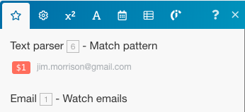

# [!DNL Adobe Workfront Fusion] Beispielszenario: E-Mail verbinden, [!UICONTROL Textanalyse]und [!DNL Google Sheets]

In diesem Szenario können Sie ein Protokoll aller E-Mail-Nachrichten erstellen und diese für weitere Aktionen in einer Tabelle taggen. Sie erfasst einen E-Mail-Textkörper in zwei separaten Tabellen in einer Tabelle und verwendet dabei Reguläre Ausdrücke (Regex) als Suchmuster. Das erste Muster sucht nach einer Wortgruppe und das zweite nach derselben Wortgruppe und einer E-Mail-Adresse.

## Zugriffsanforderungen

Sie müssen über den folgenden Zugriff verfügen, um die in diesem Artikel enthaltene Funktionalität nutzen zu können:

<table style="table-layout:auto"> 
 <col> 
 <col> 
 <tbody> 
  <tr> 
    <td role="rowheader">[!DNL Adobe Workfront] Plan*</td> 
   <td> 
[!DNL Pro] oder höher
 </td> 
  </tr> 
  <tr data-mc-conditions=""> 
   <td role="rowheader">[!DNL Adobe Workfront] license*</td> 
   <td> 
[!UICONTROL Plan], [!UICONTROL Arbeit]
 </td> 
  </tr> 
  <tr> 
   <td role="rowheader">[!UICONTROL Adobe Workfront Fusion]-Lizenz**</td> 
   <td>
   
Aktuelle Lizenzanforderungen: Nein [!DNL Workfront Fusion] Lizenzanforderungen.

   
Oder

   
Ältere Lizenzanforderungen: [!UICONTROL [!DNL Workfront Fusion] für Arbeitsautomatisierung und Integration] 

   </td> 
  </tr> 
  <tr> 
   <td role="rowheader">Produkt</td> 
   <td>
   
Aktuelle Produktanforderungen: Wenn Sie über [!UICONTROL Select] oder [!UICONTROL Prime] verfügen [!DNL Adobe Workfront] Planung, Ihr Unternehmen muss [!DNL Adobe Workfront Fusion] sowie [!DNL Adobe Workfront] , um die in diesem Artikel beschriebenen Funktionen zu verwenden. [!DNL Workfront Fusion] ist in [!UICONTROL Ultimate] enthalten. [!DNL Workfront] Plan.

   
Oder

   
Ältere Produktanforderungen: Ihr Unternehmen muss [!DNL Adobe Workfront Fusion] sowie [!DNL Adobe Workfront] , um die in diesem Artikel beschriebenen Funktionen zu verwenden.

   </td> 
  </tr> 
 </tbody> 
</table>

Wenden Sie sich an Ihren [!DNL Workfront] Administrator.

Informationen über [!DNL Adobe Workfront Fusion] Lizenzen, siehe [[!DNL Adobe Workfront Fusion] Lizenzen](../../workfront-fusion/get-started/license-automation-vs-integration.md).

## Voraussetzungen

Dieses Tutorial erfordert grundlegende Kenntnisse regulärer Ausdrücke. Weitere Informationen zu Regex finden Sie unter [https://regexone.com](https://regexone.com/).

Das erste Modul hinzufügen und konfigurieren

1. E-Mail suchen und auswählen **[!UICONTROL E-Mails ansehen]** als Trigger.

   >[!NOTE]
   >
   >Während Sie eine [!DNL Google] Konto, das die E verwendetE-Mail-Modul können Sie auch eine [!DNL Gmail] -Modul.

1. Verbinden Sie eine [!DNL Google] oder einem anderen IMAP-basierten E-Mail-Client (z. B. [!DNL Outlook]).
1. Wählen Sie nach der Verbindung einen Ordner aus, dessen eingehende E-Mails Sie sehen möchten, z. B. [!UICONTROL Posteingang].
1. under [!UICONTROL Kriterien]auswählen **[!UICONTROL Alle E-Mails]** (oder schränken Sie sie auf Lesen oder Unlesen von E-Mails ein).

   Sie können auch abgerufene E-Mails als gelesen oder ungelesen markieren.

1. Legen Sie die [!UICONTROL Maximale Ergebnisanzahl] auf 1.

   

   Sie können diese Einstellung je nach der Menge der empfangenen Nachrichten ändern. Es wird jedoch empfohlen, einen niedrigen Wert festzulegen und das Szenario häufiger auszuführen.

1. Klicken **[!UICONTROL Erweiterte Einstellungen anzeigen]** unten.

   

1. Filtern von E-Mails nach [!UICONTROL Absenderadresse], [!UICONTROL Betreff] und [!UICONTROL Satz].

   So können Sie nur relevante E-Mails sehen. In diesem Beispiel haben wir nur den Filter Betreff hinzugefügt und die anderen beiden leer gelassen.

   >[!NOTE]
   >
   >Wir fügen einen Router hinzu, um mithilfe der [!UICONTROL Übereinstimmungsmuster] Iterator und ein regulärer Ausdruck (Regex) als Suchmuster. Dies ermöglicht uns auch, ein Szenario mit mehreren Dienstprogrammen zu erstellen.

1. Nachdem die Konfiguration abgeschlossen ist und Sie aufgefordert werden, anzugeben, wo Ihre E-Mails angezeigt werden sollen, klicken Sie auf **[!DNL From now on]**.

   

1. Weiter zu [Suchen Sie nach [!UICONTROL Flusssteuerung] und fügen Sie eine [!UICONTROL Router]](#search-for-flow-control-and-add-a-router)

## Suchen Sie nach [!UICONTROL Flusssteuerung] und fügen Sie eine [!UICONTROL Router]

1. Fügen Sie nach einem Modul einen Router hinzu, um die Daten zu teilen oder zu duplizieren, bevor Sie sie an das nächste Modul senden.

   Hier haben wir eine [!UICONTROL Router] , um E-Mail-Textkörper an zwei separate Tabellen in einer [!DNL Google Sheet].

   

## Verwenden Sie die [!UICONTROL Textanalyse] Modul

1. Hinzufügen einer [!UICONTROL Übereinstimmungsmuster] Transformator , um nach einem Satz in einer E-Mail zu suchen.

   Wir werden nach dem Satz suchen &quot;[!UICONTROL Textparsermodul]&quot; in allen eingehenden E-Mails, um den Haupttext und den Absendernamen der E-Mails zu erfassen, die mit dieser Wortgruppe übereinstimmen.

   1. Schreiben Sie das Muster als regulären Ausdruck:

      text\sparser\smodule

   1. (Optional) Verwenden Sie eine der anderen Musteroptionen.

      

      Mehrzeilig ist nützlich, wenn Ihr Text mehrere Zeilen enthält und Sie in jeder Zeile nach dem Muster suchen müssen. Für dieses Tutorial müssen wir nach dem Muster im gesamten Text des E-Mail-Textkörpers suchen. Daher lassen wir es deaktiviert.

   1. Im [!UICONTROL Text] ein, klicken Sie auf das Attribut **Textinhalt** in der Liste.

      

      Dies ist das Attribut, das den Text aus dem E-Mail-Textkörper speichert, in dem nach dem Muster gesucht wird.

1. Weitere hinzufügen [!UICONTROL Übereinstimmungsmuster] , der nach demselben Satz und einer E-Mail-Adresse sucht.

   Dies ist besonders nützlich, wenn Sie über Kundenkonten mit mehreren Benutzern verfügen. Um Zeit zu sparen, können Sie die [!UICONTROL Textanalyse] -Modul, das Sie gerade erstellt haben, und verknüpfen Sie es mit dem Router.

   

1. Bearbeiten Sie das Muster wie folgt:

   text\sparser\smodule.+\s([\w.-]+@[\w.-]+)

   

   Dieses Muster sucht nach der Wortgruppe &quot;[!UICONTROL Textparsermodul]&quot; und eine E-Mail-Adresse wie john.doe@gmail.com und gibt nur die E-Mail-Adresse zurück.

   >[!NOTE]
   >
   >Es ist wichtig, Ihren Regex entsprechend der Spezifikation der E-Mail-Adressen zu schreiben, die Sie akzeptieren, aber die oben genannte übernimmt die meisten Standard-E-Mail-Adressen.

   * Wenn Sie nur nach E-Mail-Adresse suchen möchten, können Sie den unten stehenden Regex verwenden:

     ([\w.-]+@[\w.-]+)

   * Sie können auch nur mithilfe des unten stehenden Regex nach Telefonnummern suchen:

     ^[+]?\(?(\d{1,3})\)?[\s-]?\(?(\d{3})\)?[\s-]?\d{3}[\s-]?\d{3,4}
Das obige Muster deckt die gängigsten Formate ab, in denen eine Telefonnummer geschrieben wird.

   Um Ihre Muster zu testen, empfehlen wir Ihnen, [[!DNL https://regex101.com]](https://regex101.com/) mit [!DNL javascript] als den Geschmack.

   Der Rest der Konfiguration bleibt derselbe wie zuvor.

## Fügen Sie die [!DNL Google Sheets] Module

Für [!DNL Sheets]müssen wir zunächst eine Tabelle mit den erforderlichen Kopfzeilen erstellen.

1. Erstellen Sie eine Tabelle mit den Spalten, unter denen Sie die Benutzerdaten erfassen möchten. (Sie können auch eine vorhandene Datei verwenden.)

   Erstellen Sie beispielsweise eine mit dem Namen &quot;E-Mail-Daten: Support Ticket&quot;mit den Spalten Absendername, Absender-E-Mail und E-Mail-Inhalt . Nennen Sie das Arbeitsblatt &quot;enthält: Text-Parser-Modul.&quot;

1. Fügen Sie die [!UICONTROL Google Tabellen] -Modul mit **[!UICONTROL Zeile hinzufügen]** als Aktion.

   

1. Verbinden Sie Ihre [!DNL Google] -Konto (falls noch nicht geschehen). Wählen Sie die zuvor erstellte Datei und danach das Arbeitsblatt aus, in dem Sie die Daten erfassen.

   Ihr Setup sollte wie folgt aussehen:

   

1. Ordnen Sie die Attribute in den entsprechenden Feldern (Spalten) zu, um die Moduleinrichtung abzuschließen.

   

1. Klonen Sie das soeben erstellte Modul und verknüpfen Sie es mit dem zweiten [!UICONTROL Textanalyse] -Modul.

   1. Markieren Sie das Arbeitsblatt im Arbeitsblatt, duplizieren Sie es, und geben Sie ihm einen Namen.

      Nennen Sie ihn beispielsweise &quot;enthält: Text-Parser-Modul und E-Mail.&quot;

   1. Fügen Sie eine weitere Spalte hinzu, um die E-Mail-Adresse zu speichern, die der E-Mail-Textkörper enthält.

      Nennen Sie ihn beispielsweise &quot;Freigegebene E-Mail-Adresse&quot;.

   1. Klicken Sie auf das geklonte [!DNL Google Sheets] -Modul, um das Setup zu konfigurieren.
   1. Ändern Sie das Arbeitsblatt in das neue, soeben erstellte.
   1. Ordnen Sie die Ausgabe aus der [!UICONTROL Übereinstimmungsmuster] -Modul ($1) zu der Spalte hinzu, in der Sie die E-Mail-Adresse (freigegebene E-Mail-Adresse) speichern möchten.

      

      

   1. Klicken **[!UICONTROL OK]**, speichern Sie das Szenario und nehmen Sie es für einen Testlauf.

      Sie müssen zwei separate E-Mails wie folgt an die angeschlossene E-Mail-Adresse senden:

      * Enthält die Wortgruppe &quot;[!UICONTROL Textparsermodul]&quot; (und keine E-Mail-Adresse)

        

      * Enthält den obigen Satz und eine E-Mail-Adresse

        

        Wenn bei der Einrichtung keine Fehler auftreten, werden im ersten Arbeitsblatt alle E-Mails erfasst, die den Satz &quot;[!UICONTROL Textparsermodul]&quot;, während das zweite Arbeitsblatt nur diejenigen erfasst, die die Wortgruppe &quot;[!UICONTROL Textparsermodul]und eine E-Mail-Adresse. Weitere Informationen finden Sie in den folgenden Screenshots.

        Arbeitsblatt 1:

        

        Arbeitsblatt 2:

        

## Ressourcen

* [Kostenlose Übungen](https://regexone.com/) Informationen zu regulären Ausdrücken
* [Erfahren Sie mehr über die Telefonnummernübereinstimmung.](https://regexone.com/problem/matching_phone_numbers) Verwenden von Regex
* [Informationen zur E-Mail-Übereinstimmung](https://regexone.com/problem/matching_emails) Verwenden von Regex
* [Testen Ihrer regulären Ausdrücke](https://regex101.com/)
