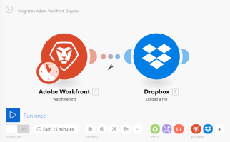

# Szenario-Ausführungsfluss in [!DNL Adobe Workfront Fusion]

In diesem Artikel wird erläutert, wie ein Szenario ausgeführt wird und wie Daten durch es fließen. Außerdem erfahren Sie, wo Sie Informationen über Ihre verarbeiteten Daten finden und wie Sie sie lesen können.

## Zugriffsanforderungen

Sie müssen über folgenden Zugriff verfügen, um die Funktion in diesem Artikel verwenden zu können:

<table style="table-layout:auto"> 
 <col> 
 <col> 
 <tbody> 
  <tr> 
    <td role="rowheader">[!DNL Adobe Workfront] Plan*</td> 
   <td> 
[!DNL Pro] oder höher
 </td> 
  </tr> 
  <tr data-mc-conditions=""> 
   <td role="rowheader">[!DNL Adobe Workfront] Lizenz*</td> 
   <td> 
[!UICONTROL-Plan], [!UICONTROL-Arbeit]
 </td> 
  </tr> 
  <tr> 
   <td role="rowheader">[!UICONTROL Adobe Workfront Fusion] Lizenz**</td> 
   <td>
   
Aktuelle Lizenzanforderung: Keine [!DNL Workfront Fusion].

   
Oder

   
Legacy-Lizenzanforderung: [!UICONTROL [!DNL Workfront Fusion] for Work Automation and Integration], [!UICONTROL [!DNL Workfront Fusion] for Work Automation]

   </td> 
  </tr> 
  <tr> 
   <td role="rowheader">Produkt</td> 
   <td>
   
Aktuelle Produktanforderung: Wenn Sie über den [!DNL Adobe Workfront] [!UICONTROL Select] oder [!UICONTROL Prime] verfügen, muss Ihr Unternehmen [!DNL Adobe Workfront Fusion] erwerben und [!DNL Adobe Workfront], die in diesem Artikel beschriebenen Funktionen zu nutzen. [!DNL Workfront Fusion] ist im [!DNL Workfront] [!UICONTROL Ultimate] enthalten.

   
Oder

   
Legacy-Produktanforderung: Ihr Unternehmen muss [!DNL Adobe Workfront Fusion] erwerben und [!DNL Adobe Workfront], die in diesem Artikel beschriebenen Funktionen zu verwenden.

   </td> 
  </tr> 
 </tbody> 
</table>

Wenden Sie sich an Ihren [!DNL Workfront], um herauszufinden, über welchen Plan, welchen Lizenztyp oder welchen Zugriff Sie verfügen.

Informationen zu [!DNL Adobe Workfront Fusion] finden Sie unter [[!DNL Adobe Workfront Fusion] Lizenzen](../../workfront-fusion/get-started/license-automation-vs-integration.md).

## Ausführungsfluss des Szenarios

Nachdem ein Szenario korrekt eingerichtet und aktiviert wurde, wird es gemäß seinem definierten Zeitplan ausgeführt.

Zu Beginn des Szenarios reagiert das erste Modul auf ein Ereignis, für das die Überwachung festgelegt wurde. Wenn Bundles (Daten) zurückgegeben werden, werden sie an das nächste Modul weitergeleitet, und das Szenario wird fortgesetzt, wobei die Bundles nacheinander durch jedes nachfolgende Modul weitergeleitet werden.

Wenn die Bundles in allen Modulen korrekt verarbeitet werden, wird das Szenario im Bereich mit den Szenario-Details als Erfolg markiert, wie in [Szenario-Details in [!DNL Adobe Workfront Fusion]](../../workfront-fusion/scenarios/scenario-detail.md) beschrieben.

* Weitere Informationen zum Einrichten eines Szenarios finden Sie unter [Der Szenario-Editor in [!DNL Adobe Workfront Fusion]](../../workfront-fusion/scenarios/scenario-editor.md).
* Weitere Informationen zum Aktivieren eines Szenarios finden Sie unter [Aktivieren oder Deaktivieren eines Szenarios in [!DNL Adobe Workfront Fusion]](../../workfront-fusion/scenarios/activate-or-inactivate-scenario.md).
* Weitere Informationen zur Planung eines Szenarios finden Sie unter [Szenario in planen [!DNL Adobe Workfront Fusion]](../../workfront-fusion/scenarios/schedule-a-scenario.md).
* Weitere Informationen zu Modulen finden Sie unter [Modultypen](../../workfront-fusion/modules/module-types.md).

### Beispiel: [!UICONTROL [!DNL Workfront Fusion] für die Arbeitsautomatisierung]

>[!INFO]
>
>**Beispiel** In einem Szenario, das eingehende Anfragen in [!DNL Workfront] überwacht und sie dann in [!DNL Workfront] Projekte konvertiert, würden die Daten wie folgt fließen.
>
>Der erste Schritt des Szenarios, der vom ersten Modul ausgeführt wird, besteht darin, nach -Anfragen zu suchen. Jede eingehende Anfrage wird als ein Bundle betrachtet. Wenn das Modul ausgeführt wird, ohne dass Pakete gefunden werden, endet das Szenario nach dem ersten Modul.
>
>Wenn das erste Modul ein Bundle zurückgibt, durchläuft das Bundle den Rest des Szenarios. In diesem Beispiel besteht der Rest des Szenarios aus dem zweiten und letzten Modul , das die Anfrage in ein Projekt konvertiert.
>
>?

### Beispiel: [!UICONTROL [!DNL Workfront Fusion] für Arbeitsautomatisierung und -integration]

>[!INFO]
>
>**Beispiel** In einem Szenario, in dem Dokumente aus [!DNL Adobe Workfront] heruntergeladen und an einen Ordner in [!DNL Dropbox] gesendet werden, fließen die Daten wie folgt.
>
>Der erste Schritt des Szenarios, der vom ersten Modul ausgeführt wird, besteht darin, nach Paketen (Dokumenten) zu suchen. In diesem Beispiel überwacht das Modul in [!DNL Workfront] auf Bundles. Wenn kein Bundle zurückgegeben wird, endet das Szenario nach dem ersten Modul.
>
>Wenn ein Bundle zurückgegeben wird, durchläuft das Bundle den Rest des Szenarios. In diesem Beispiel besteht der Rest des Szenarios aus dem zweiten und letzten Modul, das das Bundle in den [!DNL Dropbox] Ordner hochlädt.
>
>
>
>Wenn das erste Modul mehrere Bundles zurückgibt, wird das erste Bundle in [!DNL Dropbox] hochgeladen, bevor das zweite Bundle hochgeladen wird. Dann wird das zweite Bundle hochgeladen, dann das dritte und so weiter.

## Informationen zu verarbeiteten Bundles

Für jedes Modul durchläuft das Bundle einen 4-stufigen Prozess, bevor es zum nächsten Modul wechselt oder sein endgültiges Ziel erreicht. Der vierstufige Prozess ist Initialisierung, Vorgang, Commit/Rollback und Finalisierung. Dies wird als Transaktionsverarbeitung bezeichnet und es hilft zu erklären, wie Daten in einem Modul verarbeitet wurden.

Sobald ein Szenario ausgeführt wurde, zeigt jedes Modul ein Symbol an, das die Anzahl der ausgeführten Vorgänge anzeigt. Sie können auf dieses Symbol klicken, um die detaillierten Informationen über die verarbeiteten Bundles in dem oben beschriebenen Format anzuzeigen. Sie können sehen, welche Moduleinstellungen verwendet wurden und welche Bundles von welchem Modul zurückgegeben wurden.

Ein Modul hat Eingabeinformationen erhalten, z. B.:

* Konvertiertes Bild
* Ordner auswählen, in den das Bild hochgeladen werden soll
* Originalname des [!DNL Facebook] Bildes

Nach der Verarbeitung gab das Modul diese Ausgabeinformationen zurück:

* Von [!DNL Dropbox] zugewiesene Bild-ID
* Vollständiger Pfad, in den [!DNL Dropbox] die Datei hochgeladen [!DNL Workfront Fusion]

Die obigen Informationen werden für jedes Bundle separat erfasst, wie durch die Dropdown-Felder [!UICONTROL Operation 1] und [!UICONTROL Operation 2] im Bild markiert.

Weitere Informationen zur Transaktionsverarbeitung finden Sie unter [Szenarioausführung, Zyklen und Phasen in [!DNL Adobe Workfront Fusion]](../../workfront-fusion/scenarios/scenario-execution-cycles-phases.md).

## Fehler beim Ausführen eines Szenarios

Während der Ausführung des Szenarios kann ein Fehler auftreten. Wenn Sie beispielsweise den [!DNL Dropbox] Ordner löschen, den Sie in der Moduleinstellung als Zielordner festgelegt haben, wird das Szenario mit einer Fehlermeldung beendet. Weitere Informationen zum Umgang mit Fehlern finden Sie unter [Fehlerverarbeitung in [!DNL Adobe Workfront Fusion]](../../workfront-fusion/errors/error-processing.md).
