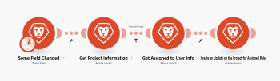

# Überblick über das [!DNL Adobe Workfront Fusion] Szenario

>[!NOTE]
>
>[!DNL Adobe Workfront Fusion] erfordert zusätzlich zu einem [!DNL Adobe Workfront license] eine [!DNL Adobe Workfront Fusion] -Lizenz.

>[!IMPORTANT]
>
>[!DNL Workfront Fusion]-Szenarien sollten nicht mit [!DNL Workfront Scenario Planner]-Szenarien verwechselt werden. Weitere Informationen zu [!DNL Workfront Scenario Planner]-Szenarien finden Sie unter [Überblick [!DNL Scenario Planner] 3}.](../../scenario-planner/scenario-planner-overview.md)

Die Aufgabe von [!DNL Adobe Workfront Fusion] besteht darin, Ihre Prozesse zu automatisieren, sodass Sie sich auf neue Aufgaben konzentrieren können, anstatt dieselben Aufgaben immer wieder zu wiederholen. Es funktioniert durch die Verknüpfung von Aktionen innerhalb und zwischen Apps und Diensten, um ein Szenario zu erstellen, in dem Ihre Daten automatisch übertragen und transformiert werden. Das Szenario, in dem Sie Watches für Daten in einer App oder einem Dienst erstellen und diese Daten verarbeiten, um das gewünschte Ergebnis zu liefern.

Ein Szenario besteht aus einer Reihe von Modulen, die angeben, wie Daten in einer App umgewandelt oder zwischen Apps und Webdiensten übertragen werden sollen.

## Beispiel: Automatisieren von Prozessen innerhalb von [!DNL Adobe Workfront]

>[!NOTE]
>
>Diese Funktion ist für die folgenden Lizenzen verfügbar:
>
>* [!UICONTROL [!DNL Workfront Fusion] für die Arbeitsautomatisierung]
>* [!UICONTROL [!DNL Workfront Fusion] für Arbeitsautomatisierung und Integration]

Mit [!DNL Workfront Fusion] können Sie einfache oder komplexe Workflows innerhalb von [!DNL Workfront] automatisieren, um Zeit zu sparen und sicherzustellen, dass der Prozess konsistent ausgeführt wird.

In diesem Beispiel wird das Szenario Trigger, wenn sich ein bestimmtes Feld in einer Aufgabe oder einem Problem in [!DNL Workfront] ändert. Wenn das Szenario ausgelöst wird, ruft es Informationen im zugehörigen Projekt ab und erstellt ein maßgeschneidertes Update für eine Person, die einer bestimmten Rolle im Projekt zugewiesen ist.

## Beispiel: Verbinden von [!DNL Workfront] mit einer anderen App oder einem Webdienst

>[!NOTE]
>
>Diese Funktion ist für die folgende Lizenz verfügbar:
>
>* [!UICONTROL [!DNL Workfront Fusion] für Arbeitsautomatisierung und Integration]
>

[!DNL Workfront Fusion] kann auch eine Verbindung zu anderen Apps und Webdiensten herstellen. Sie können auf Daten aus anderen Anwendungen zugreifen, diese importieren, bearbeiten oder exportieren und sie in Workfront oder miteinander integrieren. Viele Anwendungen verfügen über dedizierte [!DNL Workfront Fusion] -Connectoren. Wenn es keinen dedizierten Connector für die Anwendung gibt, auf die Sie zugreifen möchten, können Sie die [!UICONTROL HTTP] - oder [!UICONTROL SOAP] -Module von [!DNL Workfront Fusion] verwenden, um über die zugehörige API eine Verbindung zur Anwendung herzustellen.

In diesem Beispiel wird das Szenario Trigger, wenn ein Benutzer einer [!DNL Excel] -Tabelle hinzugefügt wird. Das Szenario überprüft, ob der Benutzer in [!DNL Workfront] ist. Andernfalls wird der Benutzer in [!DNL Workfront] erstellt und seine Workfront-Benutzer-ID wird wieder in die Tabelle eingefügt.

Eine Liste der dedizierten Connectoren finden Sie unter [Apps und ihre Module](../../workfront-fusion/apps-and-their-modules/apps-and-their-modules.md).

>[!IMPORTANT]
>
>[!DNL Adobe Workfront Fusion] kann eine Verbindung zu fast jedem Webdienst herstellen. Wenn die App, mit der Sie arbeiten möchten, keinen dedizierten [!DNL Workfront Fusion]-Connector aufweist, können Sie die folgenden Module verwenden, um eine direkte Verbindung zum Webdienst herzustellen:
>
>* [[!UICONTROL HTTP] modules](../../workfront-fusion/apps-and-their-modules/http-modules/http-modules-1.md)
>* [[!UICONTROL SOAP] module](../../workfront-fusion/apps-and-their-modules/soap-module.md)
>* [[!UICONTROL JSON] modules](../../workfront-fusion/apps-and-their-modules/json-modules.md)
>
