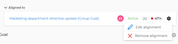
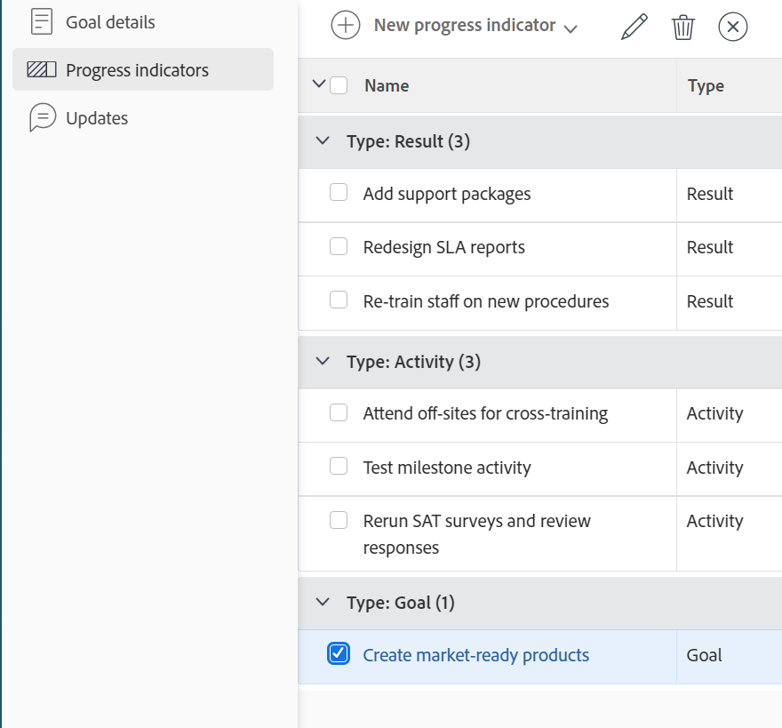

# Entfernen der Zielausrichtung in Adobe Workfront Goals

<!--Audited P&P only: 4/2025-->

Sie können die Ausrichtung zwischen zwei Zielen entfernen, wenn es nicht mehr sinnvoll ist, sie miteinander zu verbinden.

Informationen zum Ausrichten von Zielen finden Sie in den folgenden Artikeln:

* [Ziele ausrichten, indem Sie sie in Adobe Workfront Goals miteinander verbinden](../../workfront-goals/goal-alignment/align-goals-by-connecting-them.md)
* [Ausrichten von Zielen durch Konvertieren von Ergebnissen und Aktivitäten in Ziele](../../workfront-goals/goal-alignment/align-goals-by-converting-results-activities.md)

## Zugriffsanforderungen

>[!NOTE]
>
>Ihr Unternehmen kann sich dafür entscheiden, Adobe Workfront Goals weiterhin zu verwenden, wenn es dieses Paket in der Vergangenheit erworben hat. Weitere Informationen erhalten Sie bei Ihrer Kundenbetreuung.
>
>Adobe Workfront Goals ist nicht mehr erhältlich.

+++ Erweitern, um die Zugriffsanforderungen für die in diesem Artikel beschriebene Funktionalität anzuzeigen. 

<table style="table-layout:auto">
<col>
</col>
<col>
</col>
<tbody>
 <tr>
  <td> 
Adobe Workfront-Paket
 </td> 
   <td> 
   
Adobe Workfront Ultimate

<b>NOTIZ</b>

Wenden Sie sich an Ihren Workfront-Support-Mitarbeiter, wenn Sie ein anderes Workfront-Paket haben.

   </td> 
  </tr> 
 <tr>
 <td role="rowheader">Adobe Workfront-Lizenz</td>
 <td>
 
Mitwirkende oder höher

 
Anfragende oder höher
 </td>
 </tr>
  <tr>
 <td role="rowheader">Zugriffsebene</td>
 <td> 
Zugriff auf Ziele bearbeiten
 </td>
 </tr>
 <tr>
 <td role="rowheader">Objektberechtigungen</td>
 <td>
  
Anzeigen von oder höheren Berechtigungen für das Ziel, um es anzuzeigen

  
Verwalten von Berechtigungen für das Ziel, um es zu bearbeiten

</td>
 </tr>
   <td role="rowheader">
Layout-Vorlage
</td>
   <td> 
Allen Benutzern, einschließlich Systemadministratoren, muss eine Layout-Vorlage zugewiesen werden, die den Bereich Ziele im Hauptmenü enthält. 
  
</td>
  </tr>
</tbody>
</table>

Weitere Informationen finden Sie unter [Zugriffsanforderungen in der Dokumentation zu Workfront](/help/quicksilver/administration-and-setup/add-users/access-levels-and-object-permissions/access-level-requirements-in-documentation.md).

+++
<!--
Old:
<table style="table-layout:auto">
<col>
</col>
<col>
</col>
<tbody>
 <tr>
 <td role="rowheader">Adobe Workfront plan*</td>
 <td> 
   
For the new plan and license structure:
  <ul><li>An Ultimate plan </li></ul>
   

For the current plan and license structure: 
<ul><li> A Pro or higher </li>
  <li>An Adobe Workfront Goals license in addition to a Workfront license.</li></ul>

   </td> 
 </tr>
 <tr>
 <td role="rowheader">Adobe Workfront license*</td>
 <td>
 
New license: Contributor or higher

 Or
 
Current license: Request or higher
 </td>
 </tr>
 <tr>
 <td role="rowheader">Product*</td>
 <td>
   
 New product requirement: Workfront

   Or
   
Current product requirement: In addition to a Workfront license, you must purchase a license for Adobe Workfront Goals. 
 
For information, see <a href="../../workfront-goals/goal-management/access-needed-for-wf-goals.md" class="MCXref xref">Requirements to use Workfront Goals</a>. 
 </td>
 </tr>
 <tr>
 <td role="rowheader">Access level</td>
 <td> 
Edit access to Goals
 </td>
 </tr>
 <tr data-mc-conditions="">
 <td role="rowheader">Object permissions</td>
 <td>
  
View or higher permissions to the goal to view it

  
Manage permissions to the goal to edit it

  
For information about sharing goals, see <a href="../../workfront-goals/workfront-goals-settings/share-a-goal.md" class="MCXref xref">Share a goal in Workfront Goals</a>. 

  </td>
 </tr>
   <td role="rowheader">
Layout template
</td>
   <td> 
All users, including Workfront administrators,  must be assigned a layout template that includes the Goals area in the Main Menu. 
  
</td>
  </tr>
</tbody>
</table>
-->

## Voraussetzungen

Sie müssen über Folgendes verfügen, bevor Sie beginnen können:

* Ein übergeordnetes Ziel, dem mindestens ein untergeordnetes Ziel zugeordnet ist. Untergeordnete Ziele sind die Fortschrittsindikatoren des Ziels.

## Überlegungen zum Entfernen der Zielausrichtung

Beachten Sie Folgendes, wenn Sie die Ausrichtung zwischen zwei Zielen entfernen:

* Dem übergeordneten Ziel muss ein anderes Ziel, eine andere Aktivität oder ein anderes Ergebnis zugeordnet sein, damit es aktiv bleiben kann.
* Sie können ein angepasstes untergeordnetes Ziel nicht aus einem übergeordneten Ziel entfernen, wenn dies der einzige Fortschrittsindikator des übergeordneten Ziels ist.
* Das untergeordnete Ziel wird zu einem eigenständigen Ziel, wenn Sie dessen Ausrichtung am übergeordneten Ziel entfernen.

## Entfernen der Zielausrichtung

<!--
Removing goal alignment differs depending on which environment you use.

### Remove goal alignment in the Production environment

1. Go to a child goal aligned to a parent goal. 
1. Click the goal name to open the **Goal Details** panel. 
1. Click the **gear icon**  next to the parent goal, then click **Remove alignment**.

   

   The goal becomes a standalone goal and its progress no longer influences the progress of the original parent goal. 

1. (Optional) Click **Undo** in the lower-left corner of the screen if you want to revert this change and keep the goals aligned. 
1. (Optional) Add activities and results to either goals to indicate their progress. For information about adding activities and results, see the following articles:

   * [Add activities to goals in Adobe Workfront Goals](../../workfront-goals/results-and-activities/add-activities-to-goals.md) 
   * [Add results to goals in Adobe Workfront Goals](../../workfront-goals/results-and-activities/add-results-to-goals.md)
-->

1. Rufen Sie den **Ziele** in Workfront auf und klicken Sie auf den Namen eines Ziels, um die Zielseite zu öffnen.
1. Klicken Sie auf der Zielseite eines übergeordneten Ziels im linken Bereich **Fortschrittsanzeigen**.

   

1. Wählen **in der Gruppierung Typ: Ziel** ein Ziel aus und klicken Sie dann oben in der Liste auf das **Trennen**-Symbol .

   Das Dialogfeld Trennen wird angezeigt.

1. Klicken Sie **Trennen**, um das ausgewählte Ziel vom übergeordneten Ziel zu trennen.

   Das Ziel wird zu einem eigenständigen Ziel und wird nicht mehr als Fortschrittsindikator für das ursprüngliche Ziel aufgeführt. Der Fortschritt des getrennten Ziels beeinflusst den Fortschritt des ursprünglichen Ziels nicht mehr.

   Eine Erfolgsmeldung wird oben rechts auf der Seite angezeigt, die bestätigt, dass die Verbindung zum Ziel getrennt wurde.
