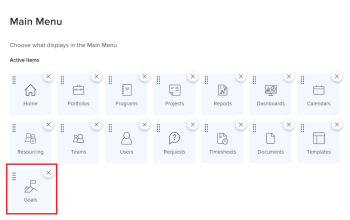

# Voraussetzungen für die Verwendung von Workfront Goals

<!--Audited P&P only: 04/2025-->

Ihr Adobe Workfront-Administrator muss sicherstellen, dass alle folgenden Bedingungen erfüllt sind, bevor Sie auf Adobe Workfront Goals zugreifen können:

* Ihr Unternehmen muss über ein Workfront Ultimate-Paket verfügen.

  Workfront Goals ist nicht für Workfront Workflow-Pakete verfügbar.

  Wenden Sie sich an Ihren Workfront-Kundenbetreuer, wenn Sie derzeit Workfront erneuern und Workfront-Ziele beibehalten möchten.

  Wenn Sie Neukunde sind, können Sie Workfront Goals nicht mehr erwerben.

  Weitere Informationen finden Sie im Abschnitt [Abrufen des Organisationszugriffs für Workfront](#obtain-workfront-goals-organization-access) in diesem Artikel.

* Weisen Sie den richtigen Lizenztyp für Workfront zu. Informationen zur Zuweisung von Lizenztypen und Zugriffsebenen finden Sie im Abschnitt [Aktualisieren von Lizenztypen und Zugriffsebenen](#update-license-types-and-access-level-settings) in diesem Artikel.

  >[!NOTE]
  >
  >Benutzende mit einem externen Lizenztyp können nicht auf Workfront-Ziele zugreifen.

* Ermöglicht den Zugriff auf Ziele in der Zugriffsebene. Weitere Informationen finden Sie unter [Zugriff auf Adobe Workfront-Ziele gewähren](../../administration-and-setup/add-users/configure-and-grant-access/grant-access-goals.md)

  >[!NOTE]
  >
  >Standardmäßig erhalten Benutzerinnen und Benutzer keinen Zugriff auf Ziele in ihrer Zugriffsebene.

* Weisen Sie eine Layout-Vorlage zu, die den Bereich Ziele im Hauptmenü enthält.

  >[!NOTE]
  >
  >Allen Benutzern, einschließlich Systemadministratoren, muss eine Layout-Vorlage zugewiesen werden, die den Bereich Ziele im Hauptmenü enthält.

  Weitere Informationen finden Sie im Abschnitt [Hinzufügen von Workfront-Zielen zu einer Layout](#add-workfront-goals-to-a-layout-template)Vorlage in diesem Artikel.

* Wenn Sie Ziele ändern müssen, die Sie nicht selbst erstellt haben, muss der Ersteller des Ziels diese mit Ihnen teilen und Ihnen Verwaltungsberechtigungen dafür erteilen.

  Weitere Informationen finden Sie im Abschnitt [Freigeben individueller Ziele für andere Benutzende](#share-individual-goals-with-other-users) in diesem Artikel.

## Erhalten von Zugriff auf die Workfront Goals-Organisation {#obtain-workfront-goals-organization-access}

Das letzte Adobe Workfront-Paket, das Workfront-Ziele enthielt, war Adobe Workfront Ultimate.

Workfront-Produktziele sind für neuere Pakete nicht mehr erhältlich.

Wenden Sie sich an Ihren Kundenbetreuer, um sich über Workfront Goals zu informieren.

<!--
Old: >
Depending on which Workfront plan your company is currently on, the following scenarios exist: 

* **A new Workfront plan**: You must have an Ultimate Workfront plan. Workfront Goals are included only in this plan. 

* **A current Workfront plan**: Your organization must purchase an additional license, in addition to the Workfront license.

  After your organization purchases the additional license, Workfront enables Workfront Goals for your account. For information about purchasing a license for Workfront Goals contact your Workfront account manager.

For information about Workfront access requirements, see [Access requirements in Workfront documentation](/help/quicksilver/administration-and-setup/add-users/access-levels-and-object-permissions/access-level-requirements-in-documentation.md).
-->

## Aktualisieren von Lizenztypen und Zugriffsebenen-Einstellungen  {#update-license-types-and-access-level-settings}

Wenn Ihr Unternehmen durch einen vorherigen Kauf Zugriff auf Workfront-Ziele hat, muss Ihr Workfront-Administrator Ihnen Folgendes gewähren, um auf Workfront-Ziele zugreifen zu können:

1. Eine der folgenden Lizenzen:

   * Mitwirkende oder höher
   * Anfragende oder höher

<!--
Old: 
* **The new access level model**: Your Workfront administrator must grant you one of the following Workfront license types to access Workfront Goals: 

  * Contributor
  * Light
  * Standard

* **The current access level model**: Your Workfront administrator must grant you one of the following Workfront license types to access Workfront Goals:

  * Plan
  * Work 
  * Review
  * Request
-->

1. Die folgende Zugriffsebene:

   * Zeigen Sie den oder den höheren Zugriff auf Ziele in Ihrer Zugriffsebene an.

   Informationen zum Zugriff auf Ziele finden Sie unter [Zugriff auf Adobe Workfront-Ziele gewähren](../../administration-and-setup/add-users/configure-and-grant-access/grant-access-goals.md).

Als Workfront-Administrator können Sie die Anzahl der Workfront-Ziellizenzen in Ihrem System überprüfen und nachvollziehen, wie viele derzeit aktiviert sind. Weitere Informationen finden Sie unter [Verfügbare Lizenzen in Ihrem System verwalten](../../administration-and-setup/get-started-wf-administration/manage-available-licenses-in-your-system.md).

>[!NOTE]
>
>Mit Workfront können Sie weitere von Ihnen erworbene Workfront Goals-Lizenzen zuweisen. Wenn Sie jedoch mehr Lizenzen zuweisen, als Ihr Workfront Goals-Vertrag zulässt, setzt sich ein Workfront-Kundenbetreuer mit Ihnen in Verbindung, um Ihnen mitzuteilen, dass Sie Ihre Vertragsnummer überschritten haben.

## Hinzufügen von Workfront-Zielen zu einer Layout-Vorlage {#add-workfront-goals-to-a-layout-template}

Ihr Workfront- oder Gruppenadministrator muss Ihnen eine Layout-Vorlage zuweisen, die den Bereich Ziele im Hauptmenü enthält, damit Sie auf die Workfront-Ziele zugreifen können.

Ihr Workfront-Administrator oder Gruppenadministrator kann Ihrer Layoutvorlage auch Folgendes hinzufügen, damit Sie einfach auf Workfront-Ziele zugreifen können:

* Eine fixierte Registerkarte
* Zielbereich zur Landingpage machen

Informationen zum Aktualisieren der Layout-Vorlage finden Sie in den folgenden Artikeln:

* [Erstellen und Verwalten von Layout-Vorlagen](../../administration-and-setup/customize-workfront/use-layout-templates/create-and-manage-layout-templates.md)
* [Anpassen des Hauptmenüs mithilfe einer Layout-Vorlage](../../administration-and-setup/customize-workfront/use-layout-templates/customize-main-menu.md)
* [Passen Sie angeheftete Seiten mithilfe einer Layout-Vorlage an](../../administration-and-setup/customize-workfront/use-layout-templates/customize-pinned-pages.md)
* [Landingpage mithilfe einer Layout-Vorlage anpassen](../../administration-and-setup/customize-workfront/use-layout-templates/customize-landing-page.md)
* [Zuweisen von Benutzern zu einer Layout-Vorlage](../../administration-and-setup/customize-workfront/use-layout-templates/assign-users-to-layout-template.md)

## Freigeben individueller Ziele für andere Benutzer {#share-individual-goals-with-other-users}

Standardmäßig können alle Benutzerinnen und Benutzer, die mindestens Ansichtszugriff auf Ziele in ihrer Zugriffsebene haben, alle Ziele in Workfront anzeigen.

Jeder Benutzer mit Bearbeitungszugriff auf Ziele kann Ziele erstellen und erhält automatisch Verwaltungszugriff auf die von ihm erstellten Ziele. Wenn sie die Ziele anderer Benutzer bearbeiten müssen, muss eine Person mit der Berechtigung Verwalten für diese Ziele die Ziele, die sie nicht erstellt haben, für sie freigeben.

Informationen zum Freigeben von Zielen für Benutzende und zum Erteilen von Verwaltungsberechtigungen für diese, finden Sie [Freigeben eines Ziels in Workfront Goals](../../workfront-goals/workfront-goals-settings/share-a-goal.md).
