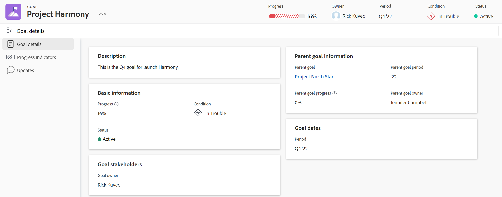

# Bearbeiten von Zielen in Adobe Workfront Goals

Sie können vorhandene Ziele aus jedem Zeitraum und in jedem Status bearbeiten.

## Zugriffsanforderungen

Sie müssen über Folgendes verfügen:

<table style="table-layout:auto">
<col>
</col>
<col>
</col>
<tbody>
 <tr> 
   <td role="rowheader">Adobe Workfront-Plan*</td> 
   <td> 
   
Für die neue Plan- und Lizenzstruktur:
  <ul><li>Ein Ultimate-Plan </li></ul>
   

Für die aktuelle Plan- und Lizenzstruktur: 
<ul><li> Ein Profi oder höher </li>
  <li>Eine Adobe Workfront-Ziellizenz zusätzlich zu einer Workfront-Lizenz.</li></ul>

   </td> 
  </tr>
 <tr>
 <td role="rowheader">Adobe Workfront-Lizenz*</td>
 <td>
 
Neue Lizenz: Mitwirkende oder höher

 Oder
 
Aktuelle Lizenz: Anfrage oder höher
 
Weitere Informationen finden Sie unter <a href="../../administration-and-setup/add-users/access-levels-and-object-permissions/wf-licenses.md" class="MCXref xref">Übersicht über Adobe Workfront-Lizenzen</a>.
 </td>
 </tr>
 <tr>
 <td role="rowheader">Produkt*</td>
 <td>
 
 Neue Produktanforderung, eine der folgenden: 

<ul>
<li>Einen ausgewählten oder Prime Adobe Workfront-Plan und eine zusätzliche Adobe Workfront Goals-Lizenz.</li>
<li>Ein Ultimate Workfront-Plan, der standardmäßig Workfront-Ziele enthält. </li></ul>
 
Oder

 
Aktuelle Produktanforderung: Ein Workfront-Plan und eine zusätzliche Lizenz für Adobe Workfront Goals. 
 
Weitere Informationen finden Sie unter <a href="../../workfront-goals/goal-management/access-needed-for-wf-goals.md" class="MCXref xref">Voraussetzungen für die Verwendung von Workfront-Zielen</a>. 
 </td>
 </tr>
 <tr>
 <td role="rowheader">Zugriffsebene</td>
 <td> 
Zugriff auf Ziele bearbeiten
 </td>
 </tr>
 <tr data-mc-conditions="">
 <td role="rowheader">Objektberechtigungen</td>
 <td>
  

  
Anzeigen von oder höheren Berechtigungen für das Ziel, um es anzuzeigen

  
Verwalten von Berechtigungen für das Ziel, um es zu bearbeiten

  
Informationen zum Freigeben von Zielen finden Sie <a href="../../workfront-goals/workfront-goals-settings/share-a-goal.md" class="MCXref xref">Freigeben eines Ziels in Workfront Goals</a>. 

  
 </td>
 </tr>
 <tr>
   <td role="rowheader">
Layoutvorlage
</td>
   <td> 
Allen Benutzenden, einschließlich Workfront-Administratoren, muss eine Layout-Vorlage zugewiesen werden, die den Bereich Ziele im Hauptmenü enthält. 
  
</td>
  </tr>
</tbody>
</table>

*Weitere Informationen finden Sie unter [Zugriffsanforderungen in der Dokumentation zu Workfront](/help/quicksilver/administration-and-setup/add-users/access-levels-and-object-permissions/access-level-requirements-in-documentation.md).

## Überlegungen zum Bearbeiten von Zielen

* Ziele mit dem Status Geschlossen können nicht bearbeitet werden.
* Sie können Ziele aus jedem beliebigen Zeitraum bearbeiten.

  Sie können die folgenden Informationen für ein früheres Ziel bearbeiten:

   * Name
   * Zeitraum
   * Status

     >[!TIP]
     >
     >Wenn das Ziel geschlossen ist, wird beim erneuten Öffnen der Fortschritt in Prozent abgeschlossen neu berechnet. Ein geschlossenes Ziel kann nicht bearbeitet werden.

   * Beschreibung
   * Ergebnisse und Aktivitäten

## Ziele bearbeiten

<!--
Editing goals differs depending on what environment you use.

### Edit goals in the Production environment

1. Go to a goal that you want to edit and click the goal name to open the **Goal Details** panel. 
1. Click the **More icon** , then click **Edit**.

   

1. Update the name of the goal in the **Goal** field. 
1. Select a time period when the goal should be completed.

   Select from the following predefined options:

   * The current year
   * The quarters of the current year
   * The next two years
   * The quarters of the next two years

   Or

   Click **Define custom dates** to select a custom time frame. 

1. (Conditional) Select a start and an end date for your goal, if you clicked **Define custom dates**.

   
   
(NOTE: these fields don't yet have a name) 

   

   >[!CAUTION]
   >
   >You cannot create a goal with custom dates in the past.

1. (Optional) Click **Reset custom dates** to return to the predefined options.

   >[!TIP]
   >
   >We recommend that everyone in your organization selects the same time frames for similar goals or goals that are aligned. This provides better alignment between goals and ensures that everyone's work supports your larger organization-wide strategy.

1. Click the **Owner** field and select a new owner for the goal, if you want to indicate someone else as the owner of the goal. 
1. (Conditional) Start typing the name of a user, team, group, or the name of your organization in the **Owner** field, then select it when it displays in the list. You can have only one owner for a goal. 
1. Update the **Description** of the goal, then click **Save**.

-->

1. Klicken Sie auf das **Hauptmenü**-Symbol  und dann auf **Ziele**.\
   Eine Liste der Ziele wird angezeigt.
1. Klicken Sie auf ein Ziel.\
   Die Zielseite wird angezeigt.

   

1. Führen Sie einen der folgenden Schritte aus, um Informationen für das Ziel zu bearbeiten:
   * Klicken Sie auf Felder, die in der Zielkopfzeile angezeigt werden, um sie zu aktualisieren. Nicht alle Felder in der Kopfzeile können bearbeitet werden.
   * Klicken Sie auf **Mehr** rechts neben dem Zielnamen und dann auf **Bearbeiten**.
   * Klicken Sie **linken** auf „Zieldetails“ und klicken Sie oben rechts auf **Bearbeiten**  und dann auf **Alle bearbeiten**. Beginnen Sie mit der Aktualisierung der Felder im Abschnitt Zieldetails .

     >[!IMPORTANT]
     >
     >Nicht alle Felder, die in den oben genannten Bereichen angezeigt werden, können bearbeitet werden. Workfront berechnet einige der Felder und ist schreibgeschützt.

1. (Bedingt) Aktualisieren Sie je nach Auswahl im vorherigen Schritt die folgenden Informationen zum Ziel:

   * Aktualisieren Sie die folgenden Informationen in der Kopfzeile des Ziels und drücken Sie dann die Eingabetaste , um Ihre Änderungen zu speichern:
      * **Zielname**: Klicken Sie auf den Namen des Ziels und geben Sie einen neuen Namen ein.
      * **Verantwortlicher**: Klicken Sie auf den Namen des Verantwortlichen, und geben Sie den Namen eines Benutzers, Teams, einer Gruppe oder Ihrer Firma ein. Wählen Sie den Namen aus, wenn er in der Liste angezeigt wird. Für ein Ziel kann nur ein Besitzer vorhanden sein.
   * Aktualisieren Sie die folgenden Informationen im Feld Ziel bearbeiten und klicken Sie dann auf **Speichern**:
      * **Name des Ziels**
      * **Zeitraum**: Klicken Sie darauf, um den Zeitraum für das Ziel zu aktualisieren\
        Oder\
        Wählen Sie **Benutzerdefinierte Datumswerte aktivieren** **aus, um ein Datum für die Start-** Enddaten **Ziels**.

        >[!TIP]
        >
        >Deaktivieren Sie **Benutzerdefinierte Datumswerte aktivieren**, um zum ursprünglichen Zeitraum für das Ziel zurückzukehren.

      * **Zielbesitzer**
      * **Beschreibung**: Informationen zum Ziel hinzufügen oder aktualisieren.
   * Aktualisieren oder überprüfen Sie die Informationen im Abschnitt mit den Zieldetails. Weitere Informationen finden Sie unter [Aktualisieren von Zielen im Abschnitt „Zieldetails“ in Adobe Workfront-](../goal-management/update-goals-in-goal-details-panel.md).

   <!-- (should you update the title here after changing it at production??? - change it to Update goals in the goal Details section)-->

1. (Optional) Klicken Sie **linken Bereich auf**Fortschrittsanzeigen“, um Ergebnisse, Aktivitäten oder Projekte zum Ziel hinzuzufügen. Durch Hinzufügen von Fortschrittsanzeigen können Sie sicherstellen, dass Sie den Fortschritt des Ziels verfolgen können.
Weitere Informationen finden Sie in den folgenden Artikeln:
   * [Hinzufügen von Aktivitäten zu Zielen in Adobe Workfront Goals](../results-and-activities/add-activities-to-goals.md)
   * [Fügen Sie Ergebnisse zu Zielen in Adobe Workfront-Zielen hinzu](../results-and-activities/add-results-to-goals.md).
   * [Projekte zu Zielen in Adobe Workfront-Zielen hinzufügen](../results-and-activities/connect-projects-to-goals-overview.md).

