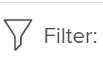

# Filtern von Informationen in Adobe Workfront Goals

Sie können Ziele anzeigen, die Sie oder eine andere Person in Adobe Workfront Goals hinzugefügt haben. Informationen zum Erstellen von Zielen finden Sie unter [Erstellen von Zielen in Adobe Workfront](../../workfront-goals/goal-management/create-goals.md). Wenn Sie Ziele anzeigen, können Sie Informationen unter Workfront-Ziele filtern, um nur Ziele anzuzeigen, die für Sie wichtig sind.

## Zugriffsanforderungen

Sie müssen über folgenden Zugriff verfügen, um die in diesem Artikel beschriebenen Aktionen durchzuführen:

<table style="table-layout:auto">
<col>
</col>
<col>
</col>
<tbody>
 <tr> 
   <td role="rowheader">Adobe Workfront-Plan*</td> 
   <td> 
   
Für die neue Plan- und Lizenzstruktur:
  <ul><li>Ein Ultimate-Plan </li> </ul>

Für die aktuelle Plan- und Lizenzstruktur: 
<ul><li> Ein Profi oder höher </li>
  <li>Eine Adobe Workfront-Ziellizenz zusätzlich zu einer Workfront-Lizenz.</li></ul>

   </td> 
  </tr>
 <tr>
 <td role="rowheader">Adobe Workfront-Lizenz*</td>
 <td>
 
Neue Lizenz: Mitwirkende oder höher

 Oder
 
Aktuelle Lizenz: Anfrage oder höher
 
Weitere Informationen finden Sie unter <a href="../../administration-and-setup/add-users/access-levels-and-object-permissions/wf-licenses.md" class="MCXref xref">Übersicht über Adobe Workfront-Lizenzen</a>.
 </td>
 </tr>
 <tr>
 <td role="rowheader">Produkt*</td>
 <td>
 
 Neue Produktanforderung, eine der folgenden: 

<ul>
<li>Einen ausgewählten oder Prime Adobe Workfront-Plan und eine zusätzliche Adobe Workfront Goals-Lizenz.</li>
<li>Ein Ultimate Workfront-Plan, der standardmäßig Workfront-Ziele enthält. </li></ul>
 
Oder

 
Aktuelle Produktanforderung: Ein Workfront-Plan und eine zusätzliche Lizenz für Adobe Workfront Goals. 
 
Weitere Informationen finden Sie unter <a href="../../workfront-goals/goal-management/access-needed-for-wf-goals.md" class="MCXref xref">Voraussetzungen für die Verwendung von Workfront-Zielen</a>. 
 </td>
 </tr>
 <tr>
 <td role="rowheader">Zugriffsebene</td>
 <td> 
Zugriff auf Ziele bearbeiten
 </td>
 </tr>
 <tr data-mc-conditions="">
 <td role="rowheader">Objektberechtigungen</td>
 <td>
  

  
Anzeigen von oder höheren Berechtigungen für das Ziel, um es anzuzeigen

  
Verwalten von Berechtigungen für das Ziel, um es zu bearbeiten

  
Informationen zum Freigeben von Zielen finden Sie <a href="../../workfront-goals/workfront-goals-settings/share-a-goal.md" class="MCXref xref">Freigeben eines Ziels in Workfront Goals</a>. 

  
 </td>
 </tr>
 <tr>
   <td role="rowheader">
Layoutvorlage
</td>
   <td> 
Allen Benutzenden, einschließlich Workfront-Administratoren, muss eine Layout-Vorlage zugewiesen werden, die den Bereich Ziele im Hauptmenü enthält. 
  
</td>
  </tr>
</tbody>
</table>

*Weitere Informationen finden Sie unter [Zugriffsanforderungen in der Dokumentation zu Workfront](/help/quicksilver/administration-and-setup/add-users/access-levels-and-object-permissions/access-level-requirements-in-documentation.md).

## Übersicht über Filter in Workfront Goals

>[!NOTE]
>
>Um die richtigen Ziele effizient zu finden und sich auf sie zu konzentrieren, empfehlen wir die Verwendung von Filtern unter Workfront Goals . Auf diese Weise können Sie die richtigen Informationen anzeigen, bevor Sie mit der Verwaltung von Zielen beginnen, die für Sie wichtig sind. Standardmäßig werden bei Workfront-Ziele alle Ziele im System angezeigt.

In den folgenden Abschnitten des Bereichs Ziele in Workfront können Sie nach Zielen suchen und filtern:

* Liste der Ziele
* Diagramme
* Ziel-Ausrichtung

Informationen zu den Abschnitten des Zielbereichs finden Sie unter [Übersicht über die Adobe Workfront-Ziele](../../workfront-goals/goal-review-and-workfront-goals-sections/overview-of-wf-goals-sections.md).

>[!IMPORTANT]
>
>Sie können Filter für einen Abschnitt konfigurieren und sie bleiben persistent, wenn sie zu einem anderen Abschnitt der Workfront-Ziele verschoben werden.

Beachten Sie beim Arbeiten mit Filtern in Workfront Goals Folgendes:

* Sie können einen Filter erstellen und anwenden, ohne ihn zu speichern, oder Sie können einen Filter speichern, um ihn zu einem späteren Zeitpunkt wiederzuverwenden.

  Die folgenden Szenarien sind vorhanden:

   * Wenn Sie einen Filter speichern, wird er jedes Mal, wenn Sie sich bei Workfront Goals anmelden, zum Standardfilter.
   * Wenn Sie einen Filter anwenden, ohne ihn zu speichern, können Sie die ursprünglichen Listen wiederherstellen, indem Sie Ihre Seite aktualisieren.

* Sie können nur von Ihnen erstellte Filter anzeigen und anwenden. Von anderen Benutzern erstellte Filter werden nur für diese Benutzer angezeigt.
* Filter, die Sie erstellt haben, können nicht für andere Benutzer freigegeben werden.

## Anwenden eines Schnellfilters in Workfront Goals

Sie können einen Schnellfilter in einer Liste von Zielen verwenden, um nur Elemente zu finden, die für Sie wichtig sind. Schnellfilter können nicht gespeichert werden und sind nicht persistent. Workfront löscht die Ergebnisse eines Schnellfilters, wenn die Seite aktualisiert wird.

Weitere Informationen finden Sie unter [Anwenden des Schnellfilters auf eine Liste](../../workfront-basics/navigate-workfront/use-lists/apply-quick-filter-list.md).

## Erstellen und Anwenden von Filtern in Workfront Goals

Der Prozess zum Erstellen von Filtern ist für jeden Abschnitt der Workfront-Ziele identisch.

Sie können einen Filter von Grund auf neu erstellen oder einen der integrierten Filter bearbeiten.

1. Zu den Workfront-Zielen.

   Informationen zum Zugriff auf Workfront-Ziele finden Sie unter [Zugriff auf und Öffnen von Zielen in Adobe Workfront-Zielen](../../workfront-goals/goal-management/access-goals-in-wf-goals.md)

   Standardmäßig wird der Abschnitt Zielliste angezeigt.

1. Klicken **oben** der Liste auf „Filter“.

   

   Standardmäßig wendet Workfront den Filter **Alle** an, der alle Ziele in Ihrem System anzeigt.

   >[!TIP]
   >
   >Sie können den Filter Alle nicht bearbeiten oder löschen.

1. Führen Sie einen der folgenden Schritte aus:

   * Klicken Sie auf einen der folgenden vordefinierten Filter, um die Ziele nur für die folgenden Inhaber anzuzeigen:

     <table style="table-layout:auto"> 
      <col> 
      <col> 
      <tbody> 
       <tr> 
        <td>Alle</td> 
        <td> 
Alle Ziele in Ihrem System, unabhängig davon, wer sie erstellt hat, welcher Zeitraum für sie ist oder wer der Eigentümer ist. Dies ist der Standardfilter und kann nicht bearbeitet werden. 
 <!--
          
(NOTE: what the ALL filter displays might change; right now, it displays all, regardless of status, period, owner, etc)

         --> </td> 
       </tr> 
       <tr> 
        <td>Persönlich</td> 
        <td>Die Ziele, für die Sie der Eigentümer sind.</td> 
       </tr> 
       <tr> 
        <td>Meine Teams</td> 
        <td> 
Die Ziele, für die eines Ihrer Teams als Besitzer ausgewählt wird. 
 
<b>TIPP</b>

     Wenn Sie keinem Team zugewiesen sind, werden keine Ziele angezeigt. 
 </td>
     </tr> 
       <tr> 
        <td>Meine Gruppen</td> 
        <td>Die Ziele, für die eine Ihrer Gruppen als Besitzer ausgewählt ist. </td> 
       </tr> 
       <tr> 
        <td>Firma</td> 
        <td> 
Die Ziele, die mit Ihrer Organisation verbunden sind. 
 
<b>TIPP</b>
        
Unter Adobe Workfront-Ziele zeigt der Unternehmensfilter die Ziele an, für die Ihr Unternehmen als Eigentümer ausgewählt wurde. 
 
Mit diesem Feld können Sie nicht nach Firmen suchen. Standardmäßig ist nur Ihr Unternehmen ausgewählt, das Eigentümer Ihrer Workfront-Instanz ist. 
 
 </td> 
       </tr> 
      </tbody> 
     </table>

   * Bewegen Sie den Mauszeiger über den Namen eines Filters und klicken Sie dann auf das Symbol **Bearbeiten**  neben dem Namen, um ihn anzupassen und spezifische Namen von Benutzern, Teams, Gruppen oder den Namen Ihrer Organisation hinzuzufügen. Wählen Sie dann den Namen aus, wenn er in der Liste angezeigt wird.

   * Klicken Sie **Neuer Filter**, um einen neuen Filter zu erstellen, und wählen Sie dann eine der folgenden Optionen aus, um den neuen Filter anzupassen:

     <table style="table-layout:auto"> 
      <col> 
      <col> 
      <tbody> 
       <tr> 
        <td role="rowheader">Zeitraum</td> 
        <td>Wählen Sie im Dropdown-Menü einen Zeitraum aus. Sie können mehrere Zeiträume auswählen. </td> 
       </tr> 
       <tr> 
        <td role="rowheader">Status</td> 
        <td> 
Wählen Sie aus den folgenden Optionen im Dropdown-Menü einen Status aus:
 
         <ul> 
          <li> 
Aktiv
 </li> 
          <li> 
Entwurf
 </li> 
          <li> 
Inaktiv
 </li> 
          <li> 
Geschlossen
 </li> 
         </ul> </td> 
       </tr> 
       <tr> 
        <td role="rowheader">Fortschritt</td> 
        <td> 
Wählen Sie im Dropdown-Menü unter den folgenden Optionen einen Fortschritt aus: 
 
         <ul> 
          <li> 
In Schwierigkeiten
 </li> 
          <li> 
Gefährdet
 </li> 
          <li> 
Im Zielbereich
 </li> 
         </ul> </td> 
       </tr> 
       <tr> 
        <td role="rowheader">Besitzerin bzw. Besitzer</td> 
        <td> 
Beginnen Sie, den Namen eines Verantwortlichen einzugeben, und wählen Sie ihn aus, wenn er in der Liste angezeigt wird. 
 
Sie können die Namen von Benutzern, Teams oder Gruppen oder den Namen Ihrer Organisation eingeben oder aus vordefinierten Optionen auswählen. 
 
Die folgenden vordefinierten Filteroptionen beziehen sich immer auf den aktuell angemeldeten Benutzer: 
 
         <ul> 
          <li> 
<strong>Ich</strong>: Zeigt Ziele an, bei denen Sie der Eigentümer sind.
 </li> 
          <li> 
<strong>Mein Home-Team</strong> und <strong>Alle meine Teams</strong>: Zeigt Ziele an, bei denen entweder Ihr Home-Team oder eines Ihrer Teams als Besitzer festgelegt ist. 
 
Tipp: Wenn Sie keinem Team zugewiesen sind, werden keine Ziele angezeigt. 
 </li> 
          <li> 
<strong>Meine Hauptgruppe</strong> und <strong>Alle meine Gruppen</strong>: Zeigt Ziele an, für die entweder Ihre Hauptgruppe oder eine Ihrer Gruppen als Besitzer festgelegt ist.
 </li> 
         </ul> </td> 
       </tr> 
      </tbody> 
     </table>

1. (Optional) Klicken Sie **Zurücksetzen** in der rechten unteren Ecke des Filterfelds, um alle ausgewählten Felder zu löschen und den Filter von Grund auf neu zu erstellen.
1. (Optional) Klicken Sie auf **Anwenden**, um den Filter ohne Speichern anzuwenden.

   Der Filter wird im Bereich **Nicht gespeichert** des Filter-Builders als **Neuer Filter** angezeigt.

   Nicht gespeicherte Filter können nicht umbenannt werden.

   Nicht gespeicherte Filter werden aus dem Zielbereich entfernt, wenn Sie sich das nächste Mal von Workfront abmelden und wieder anmelden.

   >[!TIP]
   >
   >Sie können jeweils nur einen ungespeicherten neuen Filter haben.

1. Klicken Sie auf **Speichern**, um den Filter zu speichern und später zu verwenden, fügen Sie dann im Feld **Filternamen hinzufügen** einen Namen für den Filter hinzu und klicken Sie auf **Fertig**.

   Dadurch wird der Filter im Abschnitt **Gespeichert** des Filter Builders gespeichert. Sie können diesen Filter in Zukunft verwenden.

   Der zuletzt gespeicherte und angewendete Filter wird standardmäßig angezeigt, wenn Sie sich das nächste Mal bei Workfront anmelden

1. (Optional) Klicken Sie auf den **nach links zeigenden Pfeil** neben **Neuer Filter**, um den Filtergenerator zu beenden und zur Liste der Filter zurückzukehren.
1. (Optional) Bewegen Sie den Mauszeiger über den Namen eines benutzerdefinierten Filters, klicken Sie auf das Menü **Mehr** und dann auf **Löschen** und dann auf **Löschen**. Dadurch wird der Filter gelöscht und kann nicht wiederhergestellt werden.

   >[!TIP]
   >
   >Sie können keinen der vordefinierten Filter löschen.

1. Klicken Sie auf **X** in der oberen rechten Ecke des Filter-Builders, um den Filter-Builder zu schließen.

   Der Name des aktuell angewendeten Filters wird rechts neben dem Filtersymbol oben rechts in der Liste Ziele angezeigt.

   Die Liste der Ziele wird nach Ihren Filterkriterien gefiltert.

1. (Optional und bedingt) Klicken Sie beim Anzeigen von Zielen im Abschnitt Zielausrichtung auf **Anzeigen**, wenn Sie die herausgefilterten Ziele anzeigen möchten.

   

   Der Filtername ist gelb umrandet, um anzugeben, dass er ignoriert wird.

   

1. (Optional und bedingt) Klicken Sie auf **Filter erneut anwenden** um den Filter anzuwenden und die im vorherigen Schritt angezeigten Elemente wegzulassen.

